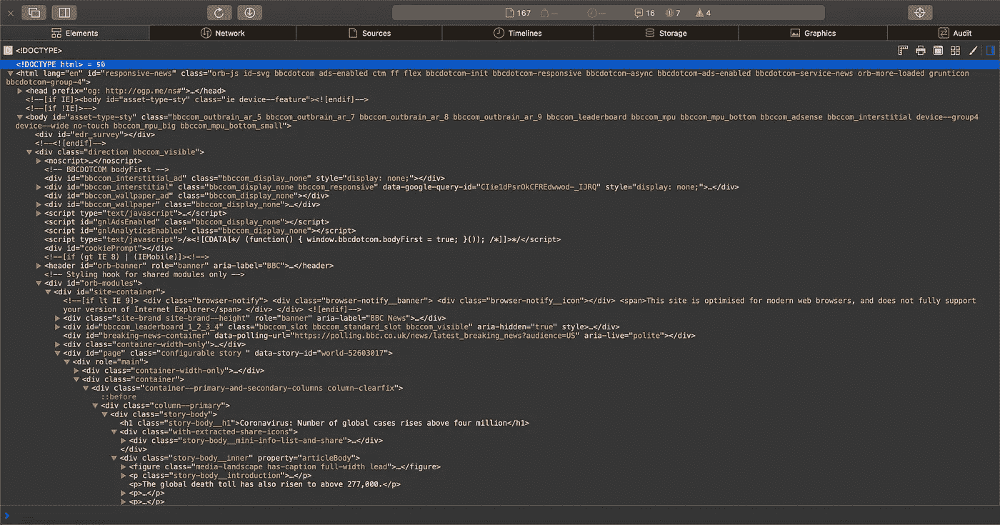

# 数据抓取:Python 中的快速基础教程

> 原文：<https://medium.com/analytics-vidhya/data-scraping-a-quick-basic-tutorial-in-python-2699abc0a6d?source=collection_archive---------11----------------------->


资料来源:SSA 数据

# 什么是数据抓取？

如果你像我一样，你可能听说过这个术语在计算机科学或商业环境中被简单地使用过。那么……到底什么是数据搜集？为什么每个人都在谈论它？

正如生活在 2020 年的每个好奇的人可能会做的那样，我谷歌了一下它的意思。Dictionary.com 将其定义为:


资料来源:Dictionary.com

简而言之，数据抓取用于轻松生成大量数据:

*   **可达**
*   **可用**
*   **可聚合的**

# 为什么这对数据科学家很重要？

数据科学家的角色是通过数据讲故事。就像文字如何增强作家的表达能力一样，数据更好地让数据科学家有能力讲述有关过去和现在的相关、有意义而又全面的故事，以利用更美好的未来。

作为数据科学的构建模块和基石，从网络搜集中提取的数据可用于以下几个方面:

*   自然语言处理
*   机器学习
*   数据可视化和分析

## ***行业突出&用途***

从更广泛的角度来看，数据搜集并不是一种新的做法。然而，最近的自动化使公司能够真正利用它的力量。数据搜集可以提供关于*客户体验*的宝贵见解，更好地告知*业务决策&绩效*，以及*以以前无法实现的速度推动创新*。它已经在数据分析&可视化、研究&开发和市场分析等领域得到应用。


来源:虚拟

# 基础知识

要执行数据抓取，你必须对 HTML 结构有一个基本的理解。对于那些对计算机科学不是很有经验的人，不要担心！你只需要足够识别一些简单的 HTML 结构。以下是最常见的几种:

*   **标题:**定义从 h1 到 h6 的标签，分别从最重要到最不重要。
    示例:< h1 >这是显示的标题！< h1 >
*   **段落:**用< p >标签定义。
    例:< p >这是显示的段落！< /p >
*   **分区:**由< div >标签定义。
    例:< div >这就是图示的容器！< /div >

# **流程**

**网页抓取可分为 4 个一般步骤:**

1.找到想要抓取的 URL

2.检查页面

3.识别要提取的元素

4.提取和存储数据

# 入门！

首先，确保你的电脑上安装了 [Python](https://www.python.org/downloads/) 和 [BeautifulSoup](https://pypi.org/project/beautifulsoup4/) ！这些都可以直接在网上下载。

我们将导入 BeautifulSoup 来导航数据，并导入 urlopen 来提取 HTML。

```
from urllib.request import urlopenfrom bs4 import BeautifulSoup
```

**1。找到想要抓取的 URL**

首先，确定你要抓取的页面的网址。在这里，我们将搜集最近发表的一篇 BBC 文章的数据。

[](https://www.bbc.com/news/world-52603017) [## 全球冠状病毒病例超过 400 万

### 根据整理的数据，世界各地已报告超过 400 万例冠状病毒确诊病例…

www.bbc.com](https://www.bbc.com/news/world-52603017) 

**2。检查页面**

现在，我们将从获取所需的数据和检查开始。右键单击任意位置并选择“检查元素”即可。


您应该会看到在 elements 标签下有一堆 HTML 代码充斥着您的屏幕。



不知所措？**不要慌！**

**3。识别用于提取的元素**

现在，我们想要识别并导航到最小的分区，如

所示，它包含了所有需要丢弃的数据。回想一下上面提到的基本 HTML 结构！因为我们想删除文章的正文，所以我们在寻找代表段落的标签

。


我们已经找到文章正文了，

s！

找到所有想要的数据后，我们寻找包含它们的最具体的部分，或

。因为元素是基于层次结构缩进的，所以我们可以看到所有需要的数据都属于:

如上所示，这个部门包含了所有我们想要的商品！

**4。提取&存储数据！**

首先，我们要连接到网站并检索 HTML 数据。

```
link = "https://www.bbc.com/news/world-52603017"try:page = urlopen(link)except:print("Error connecting to the URL")
```

这里使用了一个 [try/except](https://www.w3schools.com/python/python_try_except.asp) 来捕捉 URL 无效时抛出的错误。

现在，为了提取所需的数据，我们将创建一个 BeautifulSoup 对象来解析我们刚刚检索到的 HTML 数据。

```
soup = BeautifulSoup(page, 'html.parser')
```

我们标识了由

标记显示的部门，它包含了我们之前的数据:

现在，我们将使用 BeautifulSoup 对象的 find()函数解析并识别特定的部门:

```
content = soup.find('div', {"class": "story-body__inner"})
```

现在，我们将使用 BeautifulSoup 的 find_all()函数，遍历上面隔离的特定分隔线，识别所有段落文本，这由该分隔线中的

指示:

```
news = ''for x in content.find_all('p'):news += ' ' +  x.text
```

上面的代码将文章的整个正文存储在 news 变量中，稍后可以将它与其他提取的数据放在一个数据框中！

抓取的数据可以存储在 CSV 中。在本例中，我们将把 news 变量中存储的数据存储在一个名为“article.csv”的 csv 文件中。

```
with open('article.csv','w') as file:file.write(news)
```

就这样，您已经执行了一些基本的数据收集！

# 数据搜集的伦理

正如所有有潜力做大事的事情一样，数据搜集也可能被不道德地、恶意地和非法地利用。数据抓取已被用于剽窃、发送垃圾邮件，甚至实施身份盗窃和欺诈。

我们正在和一些强大的东西一起工作！

虽然数据收集是一个道德概念，但新手和专家数据科学家都需要意识到我们的行为的影响— *,尤其是在涉及个人数据的安全和隐私时。*

*   如果可以的话，使用公共 API，而不是抓取
*   不要请求大量数据，这可能会使服务器过载或被视为 DDoS 攻击
*   尊重他人的工作&不要窃取内容

记住这一点，祝你好运和快乐刮！