# Ruby 中的数据抓取

> 原文：<https://medium.com/analytics-vidhya/data-scraping-in-ruby-80775c5eda77?source=collection_archive---------19----------------------->

伊利亚·巴甫洛夫在 [Unsplash](https://unsplash.com?utm_source=medium&utm_medium=referral) 上的照片

数据科学已经迅速发展成为科技领域发展最快的子领域之一。随着我们越来越多地通过社交媒体和智能手机联系在一起，由此产生的数据量令人震惊。不足为奇的是，这些数据可以教会我们很多关于我们如何思考，如何交流，以及我们未来可能感兴趣的东西。结合机器学习的数据分析是极其强大的。

大数据公司使用先进的算法来得出结论，但这一切都要追溯到筛选数据的最基本的部分之一:**网络搜集**。Web 抓取本质上是收集无组织的数据，将其分割成相关的片段，并使其对人类更具可读性。网络抓取允许我们快速解析和收集网站上的特定信息。基本思想是能够浏览一个页面，并编辑一个有组织的数据列表。手动收集这些信息既乏味又效率低下——这就是为什么网络抓取器非常有用。

为了更好地理解这一切是如何工作的，我决定通过制作一个简单的刮擦应用程序来练习我的技能。作为一名更注重实践的学习者，在进行了一些简短的背景研究后，我决定开始用 Atom 编写一些代码，并在进行过程中解决这些问题。

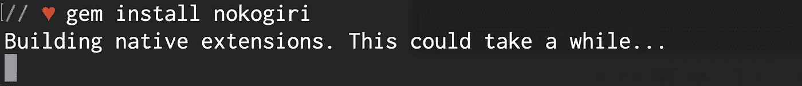

所有这一切的第一步是安装 Nokogiri 宝石。

**Nokogiri**

Nokogiri 是一个开源的 web 抓取库，用于解析 Ruby 中的 HTML 和 XML 文档。这是我在我的 Flatiron 实验室之外自己使用的第一批宝石之一，谢天谢地，尽管有几个指南警告潜在的安装问题，这个过程是快速和无痛的。安装只需要在终端中写出 *gem install nokogiri* 并在 ruby 文件中要求它之后等待 gem 安装。

**OpenURI**

OpenURI 是 web 抓取中使用的另一个流行工具。它将 HTTP 请求方法封装到一个 *open* 命令中，基本上让您少了一件担心的事情。

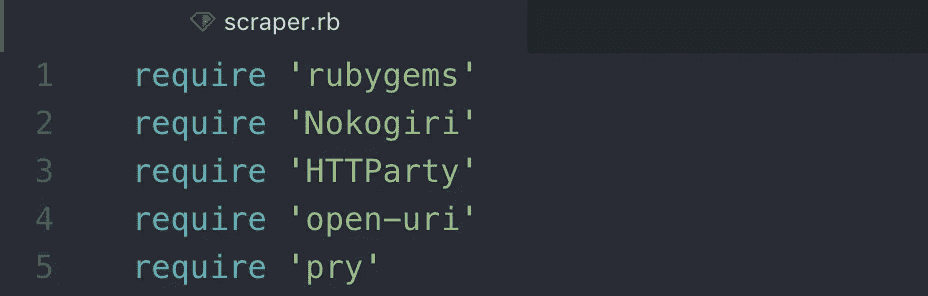

别忘了要求你要用的宝石！

第一个测试是看我是否能从维基百科的网页抓取条目中获取信息。虽然在第一个测试中没有涉及过滤，但目标是通过 OpenURI 进行 HTTP 请求并在我的终端中返回信息。

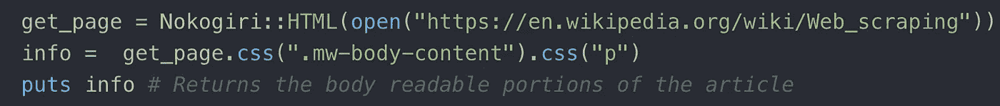

我定义了一个名为 *get_page* 的变量来发出初始请求，将我们连接到服务器。要做到这一点，你必须调用 *Nokogiri::HTML* ，然后从 OpenURI 调用 *open* 命令，最后调用你想从中提取的页面的 url。定义完这个之后，您就可以调用特定的*。要过滤的变量的 css* 方法。在这种情况下，我使用 Chrome 的 inspect 工具来查找主页面内容的标签*。mw-body-content* ，以及 *< p >* 标签内的所有内容(主要可读内容)。

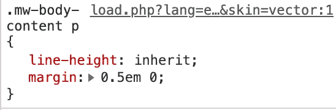

主要内容的 CSS 选择器。

当您在“终端”中运行该应用程序时，您会得到以下内容:

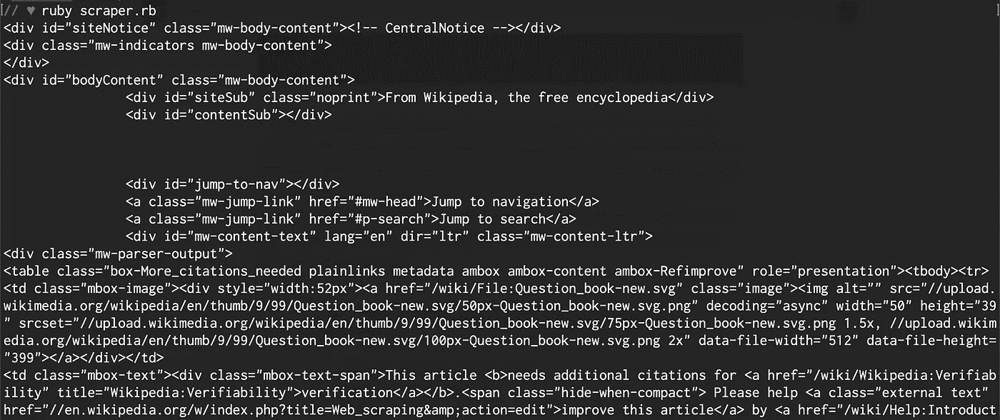

这向下滚动了一会儿，但你明白了。

但是加上*之后。text* 到我们的 *info* 变量的末尾，结果是一个更加整洁有序的页面内容版本。

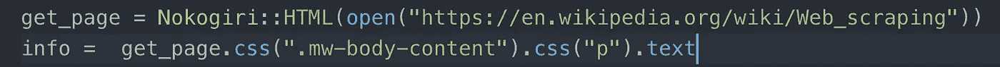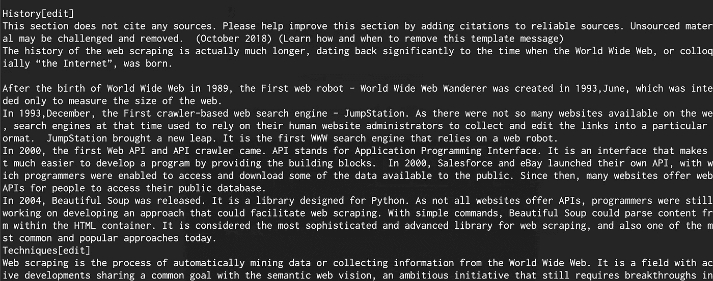

最后，如果我们只想获取部分的标题，我们可以通过 H3 标题进行过滤。

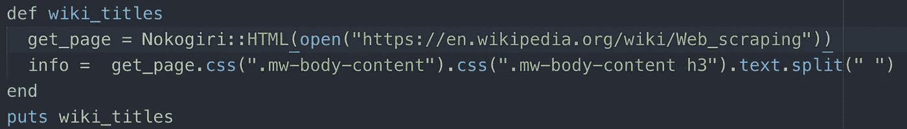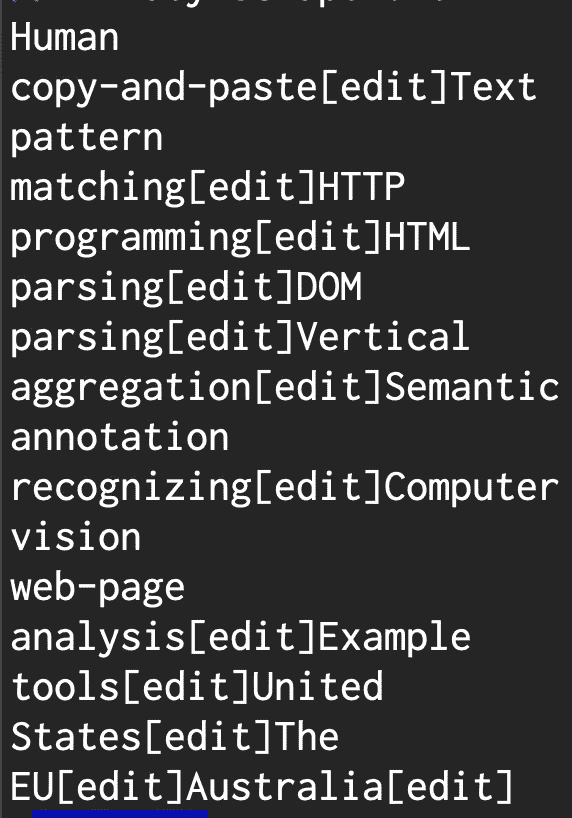

这太乱了，无法阅读，而且各个标题是分开的

我第一次尝试使用*。split(" "*)将单词分开，使其更具可读性，但结果根本不是我想要的。当我运行这个应用程序时，我得到了一个所有标题名称的列表，以及维基在所有条目上包含的每个标题旁边的*编辑*选项。标题都是分开的，没有恰当地组合在一起。因为 Wiki 在每一个标题后都包含了这一点，所以我解决这个问题的方法是利用这个模式。你所要做的就是用一个换行符来代替它。回想老实验室，我想起了 gsub 方法。Gsub 接受两个参数——左边是您想要选择的字符串，右边是您想要替换的字符串。下面的代码行用一个换行符替换了每个*编辑*，因此每个标题都有自己的一行。更容易阅读。

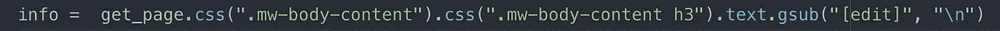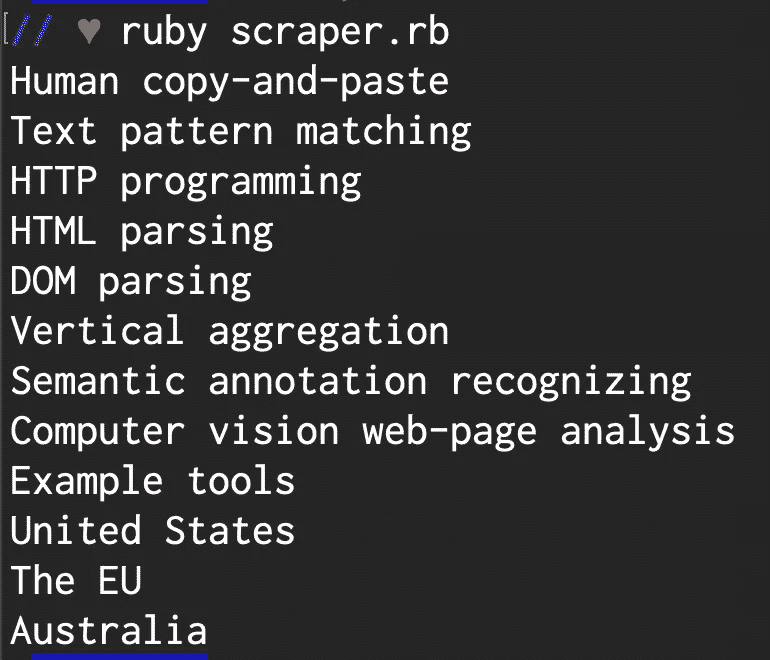

为了进一步清理，我们应该将所有东西放入它们自己的方法中，以便我们可以更容易地调用它们。

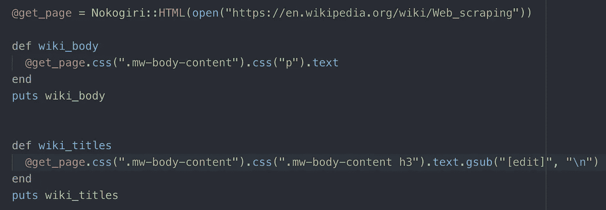

现在，我们可以调用这两个方法中的任何一个，我们将能够获得一个有序的标题列表，或者整个正文文本，以便在终端中通读。现在我们已经缩小了这些数据的范围，我们可以在将来使用它们来获得其他属性，比如字符数(*)。长度*)，使用*一个特定的单词出现了多少次。选择*类型的方法，并且总体上能够解析任何其他站点。

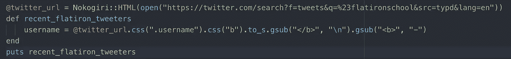

我做的最后一个测试是获取最近使用#flatironschool 标签的 twitter 用户的用户名。与我使用的第一个示例非常相似，目标是解析信息并获取我们想要的数据。当我们运行*recent _ flat iron _ tweeters*方法时，我们得到下面的终端输出:

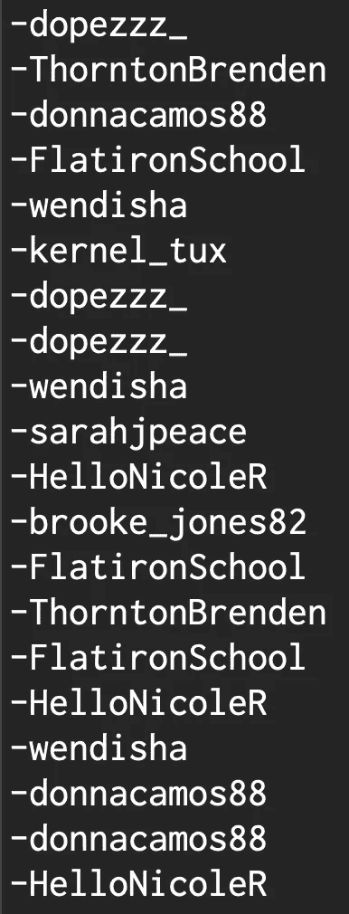

除了他们的用户名，我还想返回他们的全名。不幸的是，这是我遇到很多问题的地方。有些名字只是名，有些是名和姓，还有一些包括表情符号。表情符号是我遇到的最大的问题，至今还没有解决。

为了获得用户的全名，我必须调用一个不同的 css 标识符。这相当简单，只需要改变我第一个 twitter 方法的一些名字。尝试格式化列表中的名称时出现问题。

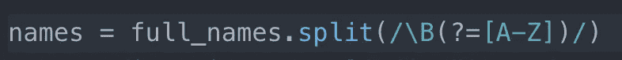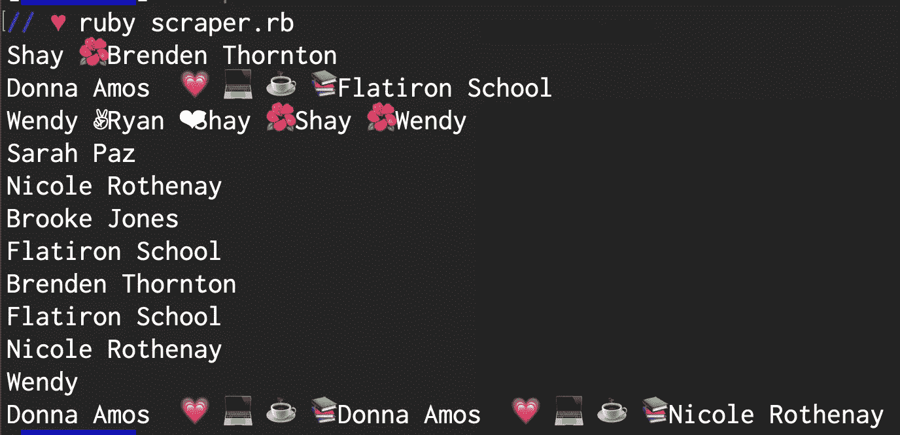

表情符号让区分名字变得更加困难，因为没有一个所有档案都遵循的一致模式。下一步是找到表情符号的 unicode，这样它们就可以被替换成 *gsub* 。我用所有的标识符创建了一个变量 *regex* 。 *regex* 变量是一个名为“Regexp”的类的实例，代表一个正则表达式对象的例子。Regexp 用于标识特定的字符。

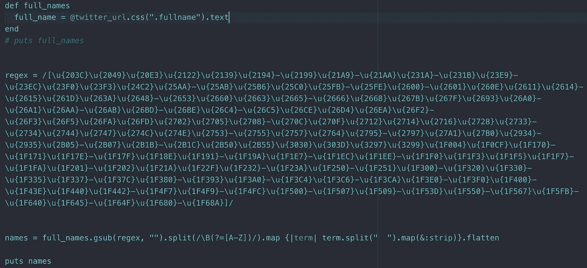

这是我目前为止最接近的尝试。

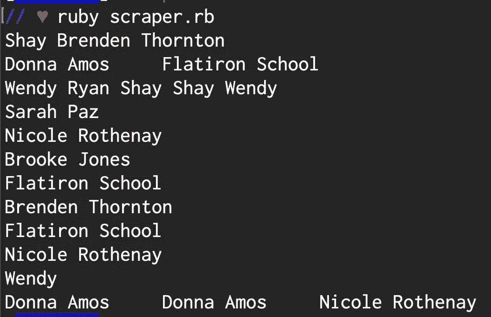

更有条理的列表——谢谢 Eric👍

简而言之，从网络上收集数据的方法有很多。像谷歌这样的网站一直在抓取整个网络，但在较小的范围内，我们可以看到这些积木是如何组合在一起的。我很高兴学会了如何从页面返回特定的数据，并且我确实从我的问题中学到了很多。不同的网站当然会有很大的不同，所以对一个网站有用的很可能对另一个网站无效。我想坐下来，花更多的时间来调整我所学到的东西，并将其应用到其他网站上。虽然我没有为我想做的所有事情编写完整的方法，但我认为这是一个总体上成功的实验，因为我更好地理解了 web 抓取原则，并了解了其他 CS 概念，如正则表达式。