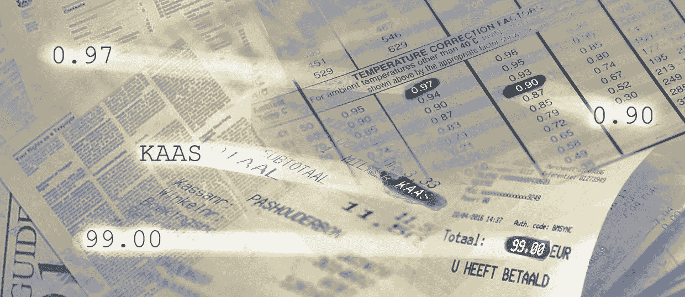

# Web 外部的数据抓取

> 原文：<https://medium.com/analytics-vidhya/data-scraping-outside-the-web-d4ac6273ae68?source=collection_archive---------20----------------------->

## 从各种来源收集数据的方法和工具:印刷数据、盘子、票、收据和其他非数字化数据。

一开始，只有手动数据输入。好吧，如果我们只需要输入几行数字就没问题了，但是如果我们要收集数百本书的数据呢？或者我们需要收集…