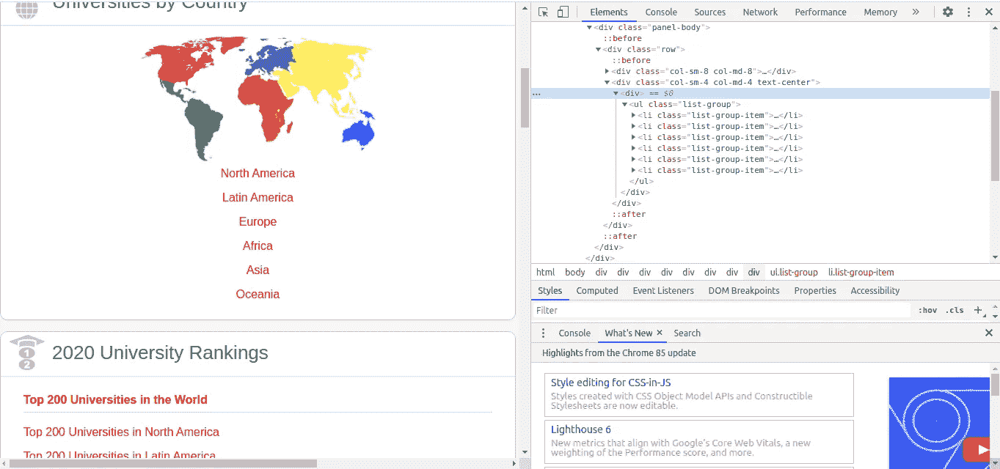

# 数据抓取教程:初学者的简单项目。

> 原文：<https://medium.com/analytics-vidhya/data-scraping-tutorial-an-easy-project-for-beginners-5c26527d6f31?source=collection_archive---------14----------------------->


照片由[维塔利·弗拉索夫](https://www.pexels.com/@ihasdslr?utm_content=attributionCopyText&utm_medium=referral&utm_source=pexels)从[派克斯](https://www.pexels.com/photo/person-pointing-numeric-print-1342460/?utm_content=attributionCopyText&utm_medium=referral&utm_source=pexels)拍摄

## 在本教程中，当您从头开始编写代码时，我将带您了解使用 Python 中的 BeautifulSoup 进行数据爬行的基础知识。

如果您是一名数据科学家、工程师、分析师，或者只是一个将收集数据作为业余爱好的普通人，尽管互联网上有大量的数据集，但您通常需要通过在杂乱、宽敞、无序的网络中搜寻来创建自己的数据集。要做到这一点，你需要让自己熟悉我们所说的网络抓取，爬行，或收获。

> 目标:使用 Python 中的 ***BeautifulSoup*** 库创建一个机器人，旨在抓取用户指定国家的私立大学名称及其主页网站的 URL，并将其下载为 xlsx 文件。

我们将使用以下库:

```
# Required libraries
import pandas as pd
from bs4 import BeautifulSoup
import requests
from progressbar import ProgressBar
```

# **网页抓取是如何工作的？**

当你打开浏览器并点击一个页面的链接时，浏览器向网络服务器发送一个包含网页文件的请求，我们称之为`**GET**`请求，因为我们正在从服务器获取网页文件。然后，服务器通过 HTTP 和其他几种协议处理传入的请求，并发回显示页面所需的信息(文件)。然后，浏览器以优雅、清晰的形式显示页面的 HTML 源代码。

在 Web 抓取中，我们创建一个`**GET**`请求，模拟浏览器发送的请求，这样我们就可以获得页面的原始 HTML 源，然后我们开始争论通过过滤 HTML 标签来提取所需的数据。

# 获取请求

现在我们对从 web 中提取数据有了一个大致的概念，第一步是从服务器下载页面。我们可以通过使用 Python 中的 [*请求库*](https://2.python-requests.org/en/latest/) 来实现。

让我们下载主页，我们将使用它导航到其他页面提取数据。在本教程中，我们将使用 [*uniRank*](https://www.4icu.org/) 目录来搜索给定国家的大学。

这将创建一个响应对象，该对象有一个状态代码来指示我们下载页面的请求是否成功执行，通常，以 2 开头的代码表示请求成功，4 或 5 通常表示错误。我们可以通过调用*来查看页面的 HTML 源代码。文本*属性。

# 美丽的声音

现在我们已经成功下载了页面 HTML 源代码，我们可以开始使用`BeautifulSoup`库解析它，这使得从 HTML 中提取数据的过程变得非常容易。以下是我们在特定国家查找私立大学及其网址的步骤:

## **1。提取洲名和网址**

第一步是从 uniRank 主页创建一个字典，将洲名作为关键字，将它们的 uniRank Urls 作为值。为此，我们需要创建一个`Beautifulsoup`对象来解析内容并提取我们想要的数据。

正如你从上面的代码中看到的，我们已经使用`BeautifulSoup()`函数创建了一个 bs4 对象，它使用了我们下载的页面的文本。您现在可以通过调用`BeautifulSoup object`上的`prettify`方法以更结构化的方式查看页面的 HTML

使用`Chrome DevTools`我们可以很容易地导航到我们需要提取的 HTML 标签，这里我们可以看到大陆名称和 URL 被保存为一个列表，所以我们需要使用`class = col-sm-4`导航到`div`标签



我们可以使用`.select()`方法，该方法使用 [SoupSieve](https://facelessuser.github.io/soupsieve/) 包对解析后的文档运行 CSS 选择器，并返回所有匹配的元素。

我们可以通过选择以`<li>`属性开始的项目来进一步过滤结果，它定义了 HTML 中的列表项目，我们也可以选择定义超链接的`<a>`属性，您可以在这里查看 HTML 标签列表[。](https://www.w3schools.com/TAGS/default.ASP)

## 2.提取国家名称及其网址

在这一步中，我们还将像上一步一样创建一个字典，但这一次关键字将是国家名称，值将是它们的 URL。

```
**Note:** For the sake of keeping this tutorial simple we will find universities only for one country. The complete code of the bot is at the end of this article.
```

从 HTML 源中过滤出我们想要的项目后，我们需要为每个项目创建一个 BeautifulSoup 对象，以便能够使用`bs4`方法和函数。

由于我们只对*私立大学感兴趣，*我们应该添加 URL 的扩展名，将我们重定向到每个国家的私立大学页面。

## 3.提取大学名称及其网址

让我们用查找阿尔巴尼亚所有的私立大学。正如我们在前面的步骤中所做的，首先我们需要使用`GET` 请求获取页面的 HTML 源，然后我们将创建一个`BeautifulSoup`对象。大学名称和 URL 存储在一个表中，所以我们将使用`find_all()`方法来查找所有的`tbody`标签(表中的主体内容)。

然后，我们创建一个大学 uniRank URLs 列表。我们遍历这个列表，找到每所大学的 URL，提取它的网站和名字，并添加到新的字典中。

下面提供了机器人的完整代码，有一些代码我没有解释，因为它超出了本文的范围，如熊猫，进度条等。

如有任何问题，请通过 Linkedin 联系我。