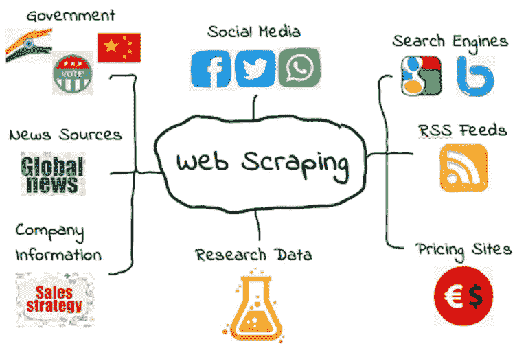
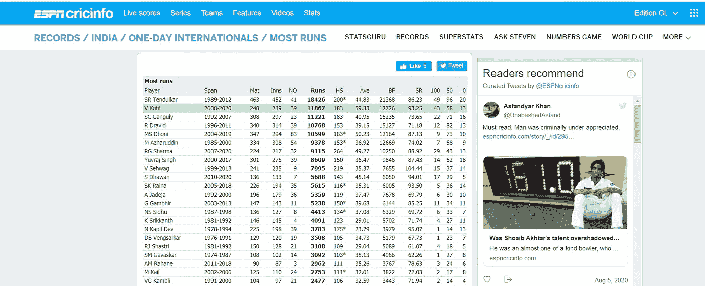
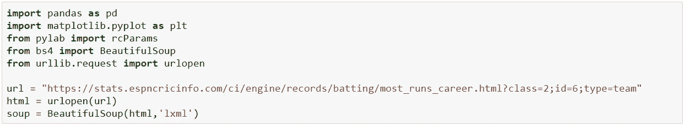
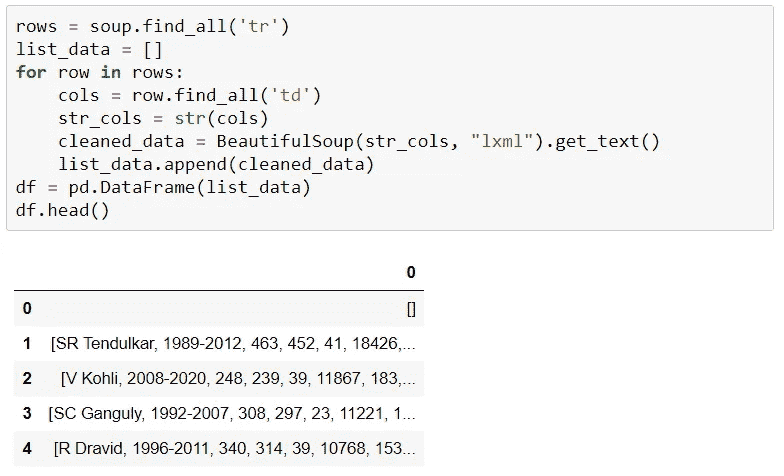
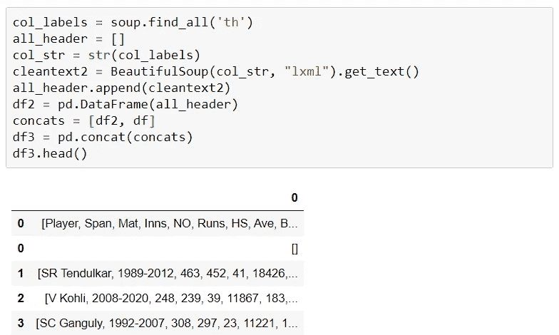
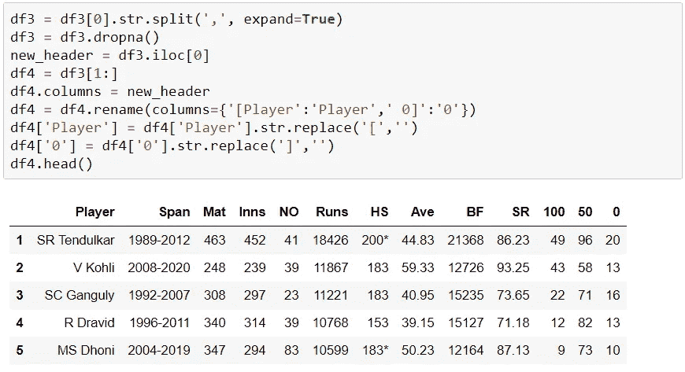
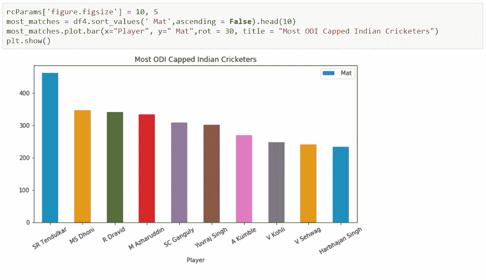

# 使用 Python 进行数据采集

> 原文：<https://medium.com/analytics-vidhya/data-scraping-using-python-e190a3248360?source=collection_archive---------11----------------------->

数据抓取，也称为网页抓取，是从各种网站提取数据的过程。一般来说，公司不会通过 API 或任何其他来源公开他们的所有数据，以防止数据滥用。因此，如果我们想要访问的数据没有 API，那么我们将不得不从这些网站上抓取数据。

## 网页抓取的优势

*   比较不同网站的产品价格。
*   跟踪竞争对手的定价策略。
*   获取各种产品的产品描述和评论。
*   收集金融数据进行市场研究和洞察。
*   从黄页中抓取数据以产生线索。

## 怎么刮？

ESPN 信息网站

在本文中，我们将从[ESPN·克瑞信息](https://stats.espncricinfo.com/ci/engine/records/batting/most_runs_career.html?class=2;id=6;type=team)网站收集数据。为了收集这些数据，我们将使用 Python 库，如 Pandas、BeautifulSoup 和 urlopen。这里我提到了我想要抓取的 url，并使用 urlopen 库打开了它，为 BeautifulSoup 库创建了一个汤来发挥它的魔力。

我们可以使用 soup 的 find_all()方法来提取网页中有用的 html 标签。有用的标签包括超链接的< a >、表格的< table >、表格行的< tr >、表格标题的< th >和表格单元格的< td >。

众所周知，Pandas 中的数据是以行和列的形式表示的。因此，首先我们需要获取所有的行，并通过 for 循环传递这些行，以获取所有相应的列。这些数据存储在一个列表中。后来，它被转换成一个熊猫数据帧。执行这项任务的代码如下所述。

正如我们所看到的，这些数据不干净，标题行也丢失了。为了得到标题，我们必须使用标签。我们需要遵循与上面相同的过程来获取标题，并将其分配给另一个数据帧，最后需要连接两个数据帧。

## 数据清理

正如我们看到的，我们在原始数据帧中添加了标题行，但数据仍然不干净。首先，我们需要将数据分成不同的列，并将数据的第一行指定为标题，并从数据帧中删除不必要的字符。

## 数据可视化

现在数据可以使用了。我们可以将这些数据导出为 csv 或任何其他格式以供进一步分析，或者我们可以使用 matplotlib、seaborn 等 Python 库来可视化这些数据。作为一个例子，让我们找出比赛次数最多的前 10 名印度板球运动员，并绘制出来。

## 结论

网络抓取允许我们访问互联网上的任何网站。将网络抓取应用到你的业务实践中，可以让你的业务比你的竞争对手更有优势。虽然它让我们可以无限制地访问任何网站，但必须小心避免滥用数据。一个适当规划和执行的网络搜集项目可以帮助公司向最终用户提供有意义的丰富数据。