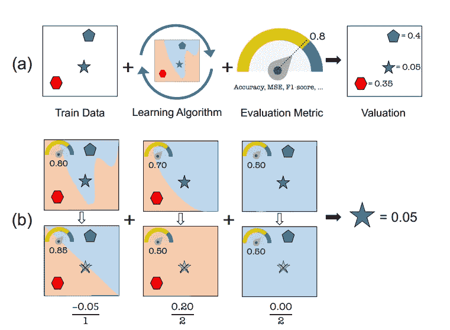
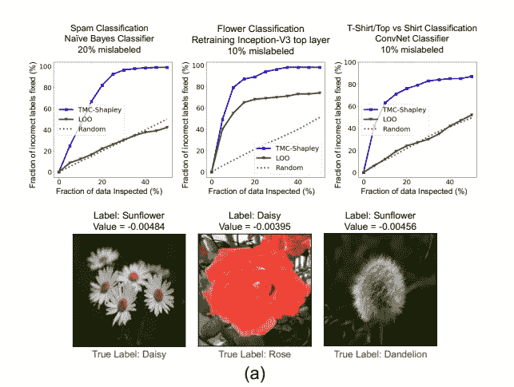

# 数据匀称:机器学习的数据评估

> 原文：<https://medium.com/analytics-vidhya/data-shapely-data-valuation-for-machine-learning-e4bd65508d2e?source=collection_archive---------8----------------------->

弗兰基·查马基在 [Unsplash](https://unsplash.com?utm_source=medium&utm_medium=referral) 上拍摄的照片

*你好世界，*

正如你经常读到数学家克莱夫·亨比的名言一样

> *“数据是新的石油”*

*当今时代的数据已经成为推动全球大多数人工智能技术的终极燃料。对来自医疗保健和广告等不同资源的数据进行评估已经成为这些行业的重要基准。然而，挑战在于如何评估数据在机器学习预测中的价值。*

*当医疗保健和广告行业使用客户数据时，数据评估应运而生，并最终成为客户应因其产生的数据而获得回报。这就是 Data Shapley 发挥作用的地方。数据沙普利算法是作为一个框架开发的评估数据与监督学习算法的背景。在这个算法中，我们有 n 个数据点，这些数据点是根据某种预测算法训练的。数据 Shapley 用作评估每个训练数据点关于预测算法性能的度量。*

> **简介**

数据 Shapley 算法主要侧重于评估个体产生的数据点。有一定的法律程序正在进行，以给予信用的客户所产生的数据，数据沙普利输出给予公平的补偿客户的数据。

*基本上，数据 Shapley 嵌入了预测分类器，预测分类器被认为是机器学习的核心，因为数据在本质上是历史的，并且具有独立和依赖的特征，例如客户的电子商务历史和对象的图像等。*

*利用监督机器学习，生成算法预测模型，该模型采用给定的输入，以便输出预测。对已训练模型的性能检查执行模型评估。*

模型评估指标，如准确性得分、ROC 曲线，可以确定您的模型在性能方面有多好。对于数据 Shapley，在给定用于训练机器学习模型、训练模型的算法和学习模型的性能度量的固定数据集的情况下，采取相同的方法。

> 深入研究数据沙普利

来源:[https://arxiv.org/pdf/1904.02868.pd](https://arxiv.org/pdf/1904.02868.pd)

以下是 Data Shapley 具体回答的两个重要问题。

*   *每个训练数据点对于学习算法及其性能指标的价值是什么。？*
*   *我们如何用监督学习算法计算数据的价值？*

让我们借助一个例子来理解这一点

假设我们要对诊断为慢性肾病的患者进行分类，假设训练数据来自 N = 1000 名患者，其中每个患者都提供了他们的病史。如果我们用该数据训练 ANN 模型，并对测试数据进行模型评估，则可能会遗漏一些患者的训练数据点。

然而，Data Shapley 指出，如果我们训练的是逻辑回归模型而不是神经网络模型，一些数据点可能会更重要。此外，如果性能指标发生变化，则特定患者数据的值也应随之变化。

*   **T5【截断蒙特卡罗】Shapley**

来源:[https://arxiv.org/pdf/1904.02868.pdf](https://arxiv.org/pdf/1904.02868.pdf)

如前所述，监督学习算法有三条主要路线—

*   **训练集**——从不同来源获取的数据集基本上都有自变量和因变量。在分类的情况下，因变量可以是分类的，而在回归预测模型中，因变量可以是数字的。
*   **学习算法**-以训练数据为输入并输出预测值的黑盒算法
*   **性能指标** -任何学习算法的模型评估，输出训练模型算法的分数。

我不会去太多的数学背后的数据沙普利，但主要算法采取流行的沙普利值，这是在博弈论中使用。Shapley 值用于使用特征重要性定义模型的可解释性，并广泛用于经济学领域。与不同，Shapley 值数据 Shapley 算法评估数据点的重要性，而不是数据中存在的特征。

为 Shapley 值开发的蒙特卡罗近似方法在数据 Shapley 中用于处理关于训练数据点数量的大量计算。按照蒙特卡罗近似方案，可以通过一次又一次地迭代相同的过程来改进近似，同时取所有对数据的边际贡献的平均值。

一旦边际贡献变小，计算被截断，这导致边际贡献接近于零。这种方法相对于数据 Shapley 被称为“截断蒙特卡罗 Shapley”(TMC-Shapley)。

> **数据沙普利应用**

数据 Shapley 可以应用于大量数据源，以便找到具有正 Shapley 值的重要数据点。此外，Data Shapley 让我们可以根据全新的测试数据来调整训练数据的性能。以下是 Data Shapley 作者提到的几个应用程序

***1)识别数据质量***

数据 Shapley 算法以这样的方式工作，即它识别对提高训练模型性能有主要贡献的数据点。此外，它计算具有零/低贡献的数据点，甚至可能降低机器学习模型的性能指标。此外，Data Shapley 对几个真实世界的数据集进行了实验，以捕捉真实世界应用程序的数据质量

*   ***低数据点的解读****-*Data Shapley 作者对未标注的数据点进行了多次实验，寻找正确的标注。数据 Shapley 在这项任务中的表现与 LOO(省去一项交叉验证技术)进行了比较。数据 Shapley Alpgortum 以比 LOO 更好的数据质量赢得了比赛。

来源:[https://arxiv.org/pdf/1904.02868.pdf](https://arxiv.org/pdf/1904.02868.pdf)

***2)数据沙普利对新数据的适应***

有时很难根据训练数据训练机器学习模型，并使用完全不同的数据来测试和部署模型。Data Shapley 基本上解决了这个问题，它计算训练数据点的 Shapley 值，并递归地删除具有负值的数据点。

这些值还有助于突出对适应任务贡献最大的数据点。作者在不同的真实世界数据集上进行了实验，其中模型训练是用每个数据点的加权损失产出值来执行的。

数据 Shapley 已经在以下训练的模型中执行，以便比较实际的和适应的性能分数。-

*   *皮肤色素性病变检测*
*   *性别检测的公平性*
*   *临床笔记的差异*
*   *MNIST 数据集*

来源:[https://arxiv.org/pdf/1904.02868.pdf](https://arxiv.org/pdf/1904.02868.pdf)

> **结束注释**

*数据 Shapley 算法无疑满足了数据估值的主要特征。凭借直接来自经济学理论数据的概念，Shapley 在数据评估方面取得了重大突破，并为医疗保健和生命科学行业提供了关于数据点的更好的定量见解。*

*基于 Shapley 值高或低的域数据应优先考虑。可能一些数据点或数据在一种情况下有用，而在另一种情况下完全没有价值。*

*我简要介绍了数据的一些基本概念。我希望你喜欢这篇文章，并学到一些新的有用的东西。在本博客的下一个系列中，将有一个关于如何在真实世界数据集上应用数据 Shapley 的代码演练。*

*在此之前，我强烈推荐查看 GitHub 的数据 Shapley 代码和实现* [*这里*](https://github.com/amiratag/DataShapley) *。*

> **参考文献**

*   [数据沙普利会议论文](https://arxiv.org/pdf/1904.02868.pdf)
*   [数据 Shapley GitHub 储存库](https://github.com/amiratag/DataShapley)
*   [经济学中的博弈论](https://plato.stanford.edu/entries/game-theory/)
*   [YouTube 视频参考](https://www.youtube.com/watch?v=79pRqMq_-LE)

如果你喜欢这个帖子，请关注我。如果你注意到思维方式、公式、动画或代码有任何错误，请告诉我。

*干杯！*