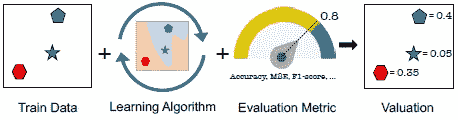
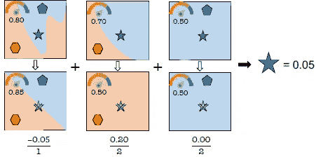

# 数据 Shapley:ML/AI 的定性分析工具

> 原文：<https://medium.com/analytics-vidhya/data-shapley-qualitative-analytical-tool-for-ml-ai-e48c934cedd6?source=collection_archive---------12----------------------->

# 里程碑

*   **数据简介沙普利**
*   **深入数据沙普利**
    ——数据沙普利到底是什么？
    -为什么需要？
    -符合数据类型
    -数据的作用沙普利
    -优点&缺点
    -数据的应用沙普利
*   **结论**

*嘿，好奇的学习者！准备好享受学习骑行的乐趣了吗？*

P 愤恨一个秘密宝藏即兴发挥你的 ML/AI 模型。好的模型背后的成功总是一个数据。更好的数据导致更好的模型。于是，**古尔巴尼&邹**，斯坦福的那帮家伙写了一篇[论文](http://proceedings.mlr.press/v97/ghorbani19c/ghorbani19c.pdf)关于数据的 Shapley 算法引用了现有的博弈论。我们发明了一种算法，可以实际判断每个数据点的重要性，而不是去考虑数据集中特征的重要性。你的数据充当你的模型的燃料，间接地暗示了你的数据的一些价值。这个算法就是为每个数据点的值而烦恼的东西，它告诉你数据点是否为你的模型保存了一个值。
*所以，不假思索地承认，是时候* **把握住你的数据了。**

比起枯燥的文字，我更喜欢视觉化地传达信息。看，是不是更能点燃你的兴趣。:)

# 1.沙普利数据简介

在开始解释之前，我们先来看看反映所有 Ws 和 H 问题答案的示意图。花一分钟时间浏览下面的图表，稍后将深入解释。

# **2。深入研究数据沙普利**

## **2.1 数据沙普利到底是什么？**

如前所述，数据是我们模型的燃料，因此 Data Shapley 提供了一个公平的**数据评估框架**，在**监督机器学习**的情况下非常有用。事实上，有些数据点对于构建任何 ML 模型都很重要，而有些数据点已经损坏或不值得构建模型。每个数据点都有一些正/负值，分别表示高/低值。这些值是加权平均值，即每个值对其余数据的贡献大小。它基于现有的博弈理论和合作博弈理论，计算每个参与者的边际贡献。

***给定学习算法的数据 Shapley*(*称为逻辑回归)在 n 个数据点上训练，以产生良好的性能预测值，从而产生指示每个数据点价值的某些 Shapley 值(正/负)。***

算法有助于理解我们的 ML 模型所需的数据点类型。我们可以确定哪种数据点最有价值，并添加更多的数据点来改进模型。

> 在博弈论中，分数被称为 Shapley 值，而在这里作者称之为数据 Shapley 值。

## **2.2 为什么需要？**

事实表明，有些**点对我们的模型很重要**，而其他点对模型来说可能很嘈杂。让我开门见山地谈谈我们为什么需要数据沙普利。

*   捕捉模型的异常值、噪音或损坏的数据点
*   为了获得模型中传递的每个数据点的值

*为什么要获得一份身家？*

了解将哪个数据点添加到模型中会提高预测器的性能。

## **2.3 符合条件的数据类型**

数据沙普利是无限的。不是开玩笑！算法依赖于暗示它的概念，给出以下种类数据的值。

*   **文本和图像等非结构化**数据
*   **结构化**数据，如表格数据(csv、xls 等)

## **2.4 数据沙普利的动作**

现在，我们至少对什么是 shapley 有了一个概念，它的必要性和适用范围。我们也知道应用 shapley 算法的最终结果，它只不过是每个数据点的数据 Shapley 值。这些值表明了它们对你学习 ML 算法的价值。但是沙普利是如何以这样的价值观结束的呢？算法从头到尾的内部工作是怎样的？让我们找出答案。

**配料数据沙普利**

论文举例说明了算法的三个组成部分:训练数据**、学习算法**、评价指标**。数据点作为输入传递给监督的 ML 算法，结果在学习的预测器中。该预测器根据测试数据评估模型的性能，并根据数据点的价值以 shapley 值(+/-)结束。**

来源:[http://proceedings . MLR . press/v 97/ghorbani 19 c/ghorbani 19 c . pdf](http://proceedings.mlr.press/v97/ghorbani19c/ghorbani19c.pdf)

如下所示，通过获得每个数据点对剩余数据点子集的贡献的加权平均值，在评估阶段使用预测器评估子集。换句话说，**当每个训练数据点被移除时，性能将如何影响**。

来源:[http://proceedings . MLR . press/v 97/ghorbani 19 c/ghorbani 19 c . pdf](http://proceedings.mlr.press/v97/ghorbani19c/ghorbani19c.pdf)

**深层数据沙普利动作过程**

下面的流程图详细介绍了 Shapley 如何影响 ML 框架，并以神奇的分数来表示每个数据点的价值。

让我们深入了解一下。

你的数据被分成训练和测试。列车数据点的随机排列的子集(即..n)是在移除了第 I 个数据点的情况下创建的。这被传递给具有任一变量(TMC/G)的学习算法。我们稍后将讨论这些。这产生了一个学习的预测器，该预测器根据各种度量标准进行评估，如准确度分数、f 值等，并以性能分数结束，即，移除第 I 个数据点的数据 Shapley 值。然后再用不同子集去除 i+1 个数据点来重新训练模型。这个过程继续下去，最终计算出所有数据的 Shapley 值。

数据方程 Shapley 评分(fi)如下所述。

来源:[http://proceedings . MLR . press/v 97/ghorbani 19 c/ghorbani 19 c . pdf](http://proceedings.mlr.press/v97/ghorbani19c/ghorbani19c.pdf)

其中
fi:数据点 I 的 Shapley 值
C:任意常数
sigma:没有第 I 个数据点的 D 的子集之和

***算法的主要关键是通过计算第 I 个元素的所有边际贡献的平均值，得到没有它的预测器的性能，从而得到第 I 个元素的值。概念有点类似于留一法(LOO)交叉验证法，除了数据 Shapley 满足公平有价值的条件。***

## **挑战和解决方案**

数据 Shapley 面临的挑战是从大量训练数据中训练所有指数级创建的子集，并计算它们的分数。当数据越来越多时，这项任务就变得越来越困难。因此，作者提出了如下数据 Shapley 算法的变体。

1.  **截断蒙特卡罗(TMC)沙普利:**

随着训练数据的增加，边际贡献越来越小。因此，一旦边际贡献变小，计算就被截断，而不是去寻找所有的数据点。

来源:[http://proceedings . MLR . press/v 97/ghorbani 19 c/ghorbani 19 c . pdf](http://proceedings.mlr.press/v97/ghorbani19c/ghorbani19c.pdf)

2.**渐变(G)沙普利**

这个变量基本上来源于随机变量下降，其中模型训练的成本可以减少一个时期。欲了解更多信息，请参考优秀论文。

## **2.5 优点&缺点**

**优点**

*   了解哪种数据对模型有好处，可以包含哪些数据来提高性能
*   检测到低值数据，如损坏或有噪声。
    *例如*，错误标记的图像得到负值或非常低的 Shapley 值，这有助于我们识别此类错误标记数据点的存在。

**缺点**

*   算法运行需要大量的计算时间

## **2.6 数据应用沙普利**

1.  **数据质量标识符**

*   收集高数据 Shapley 值(高质量)的相似数据点将提高模型性能
*   识别数据点被错误标记或有噪声的分类问题，并将其从模型训练中排除。

2.**数据 Shapley 值适应新数据**

数据 Shapley 值也可以用于修改新数据。这项工作更令人钦佩，因为它是一项关于适应新数据的任务。这次不是在测试上评估，而是在目标数据上评估学习模型的性能分数

# 3.结论

都说好数据出好模型。用于训练你的监督模型的数据应该是如此干净和正确，没有任何损坏或噪音，以使你的模型表现得更好。但数据沙普利在这里是作为复仇者来处理数据质量的考核。它最擅长根据数据 Shapley 评分来确定每个数据点的价值。提出了数据 Shapley 算法的变体，例如 TMC-Shapley 或 G-Shapley，以克服该挑战。该算法对结构化和非结构化数据都有用，例如文本、图像或 CSV 格式的数据，唯一的缺点是计算时间。
迈向更健壮的 ML/AI 模型时代的伟大举措。

# 参考

*   [更多资料尽在纸上数据沙普利](https://blog.acolyer.org/2019/07/15/data-shapley/)
*   [博弈论和沙普利价值观](https://www.analyticsvidhya.com/blog/2019/11/shapley-value-machine-learning-interpretability-game-theory/)
*   [关于数据沙普利的研究论文](http://proceedings.mlr.press/v97/ghorbani19c/ghorbani19c.pdf)

如果你喜欢这个博客，你可以自由关注这个作者，因为这个作者保证会回来分享更多有趣的人工智能技术。此外，如果有任何理解或概念上的错误，请随时告诉我。

谢谢，

快乐阅读！:)

***可以通过***[***LinkedIn***](https://www.linkedin.com/in/kaul-shachi)***取得联系。***