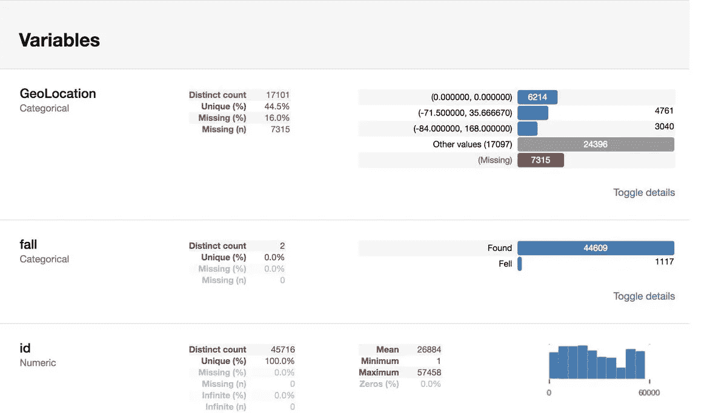

# 数据来源、购物篮分析和 SweetViz

> 原文：<https://medium.com/analytics-vidhya/data-sourcing-market-basket-analysis-and-sweetviz-7421a10e97e3?source=collection_archive---------24----------------------->

**探索性数据分析**

> **有时候，注意到我们认为不必要的东西实际上可能是必要的。**

有两种数据，公共数据和私有数据。

# **私人数据**🔐

这是组织数据，由于此类数据与安全和隐私问题相关，因此需要公司批准才能访问。它有助于组织制定内部政策和建立业务战略。

私有数据包括电信数据、银行数据、能源部门、媒体数据、零售数据等。

这些策略是什么？它们与数据有什么关系？

> **媒体行业📰**

我们将从媒体数据及其涉及选举结果的数据新闻开始，即哪个政党以多少席位赢得了选举，检查 BJP 从国会和其他小党派那里获得了多少席位，这是一种加强报道和新闻写作的方式，可以发现他们使用了什么策略。

***通过刮削、清洗和结构化对数据进行深度*挖掘，*通过挖掘对数据进行过滤*，*可视化*和*编故事***

# **购物篮分析**

> **零售业🛍️**

有了零售数据，我们可以进行市场购物篮分析，例如，当你购买电视时，你肯定需要购买流媒体盒子(例如:Hathway)，如果你购买笔记本电脑，那么你应该购买其配件。

众所周知，亚马逊使用一种算法，根据你的浏览历史或其他人购买的东西，推荐你可能感兴趣的商品。苹果的主要利润来自市场篮子分析，因为我们都知道，一旦你购买苹果产品，你需要为配件支付两倍的费用😢、包月、保险等。

了解哪些产品一起销售对任何企业都非常有用。最明显的效果是零售商店通过重组其产品可以实现销售额的增加，这样可以一起销售的东西就可以一起找到。

**被购买产品的关联强度**

> **电信行业**📱

你可能已经观察到，当你购买一些计划(特别是预付费)时，它不会是一个整数，比如说你购买了一个₹19 计划，但你不满意，然后供应商为你提供了另一个₹99 计划(包括 Hotstar subs/Amazon 优惠券/额外数据等)，这将产生一个额外的₹80 数字，现在作为一个基本的直觉，你可能会选择该计划，在那里你会获得更多的好处并支付金额。因此，他们故意让你看两个计划，让你买他们想要的。

**我们可以理解购物篮分析的场景**

> **你甚至可以通过其他运营商查看他们的报价(显然除了你正在使用的那家)**

# 公共数据🌏

出于研究和学习目的公开提供的数据，可以通过开放网站和网络抓取来访问。

你可以访问【data.gov.In】， [Kaggle](https://www.kaggle.com/) ，Git 看看这些数据是如何在各行各业得到的，探索找出答案。

# Sweetviz

一个开源库，一个增强您的探索性数据分析的强大包。

你甚至可以使用熊猫轮廓，但我觉得 sweetviz 会给你更好的见解。

**可能不太有见地的熊猫简介**

> 这里我使用了包含 100 行和 62 列的 IMDb 数据集。

我们可以使用 sweetviz 来比较、分析和理解基于目标列的整个数据集，而不是使用 DataFrame.describe()和 pandas profiling。

Sweetviz 是在熊猫档案的基础上制作的，最棒的是我们可以非常清楚地查看它的人口统计数据。

让我们看看我们的数据集是什么样子的。

> 使用 sweetviz 可视化整个数据

它只有两行代码，您可以用它来可视化整个数据集，并为您的探索性数据分析提供动力。

**HTML 视图**

**基于所有列的大规模关联热图**

Sweetviz 只是在帮助您识别所有细节方面增加了额外的优势，这只是探索性数据分析的第一步。

如果你喜欢我的作品，请鼓掌并与你的朋友分享。

保持安全

支持我的工作❤️

继续编码！

马尼什·库马尔

数据科学爱好者