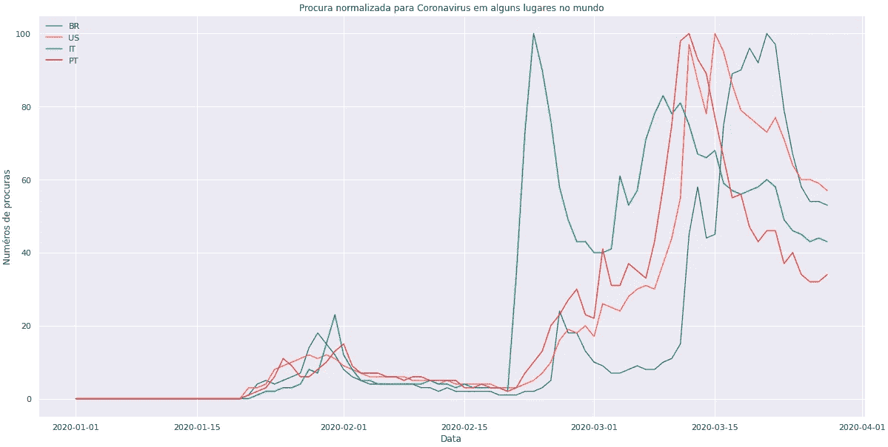

# 数据故事讲述— COVID19

> 原文：<https://medium.com/analytics-vidhya/data-story-telling-covid19-73b1c149e0a?source=collection_archive---------27----------------------->

> 一位数据科学家讲述了一种四处传播的病毒的内容。

***最后更新:2020 年 3 月 31 日***

# 冰山一角

世界已经显示出巨大的不确定性，这可以从指数的大幅波动中看出。

除了可能被感知，它们在 2020 年的价值损失。选择这些指数是为了以一种深思熟虑的方式观察全球大公司对中国疫情开始的反应。

# 重要的是“口碑”

一个非常有用的工具来看看，世界上有哪些伟大的向往是互联网。因为没有人想知道一些不相关的或“热门趋势”的东西，很快谷歌上的搜索就成为分析人们主要关注什么的主要工具，或者更确切地说，是在那里被评论的东西。

一个引人关注的有趣事实是，巴西人并没有把谷歌作为获取疫情信息的主要工具。至于其他受影响的国家，使用谷歌搜索冠状病毒的比率很高。

在巴西，与主题相关的词现在变得越来越重要。

> 反过来，一个有趣的事实是电晕啤酒品牌产生的嗡嗡声。

**然而，负面评价**与该品牌没有直接关系，仅仅是巧合。从短期来看，我同意它可能是坏的，因为它指的是消极时刻的记忆。但是，如果我们停下来考虑一下长期目标，它很有可能会成为人们长期关注的焦点。

 [## Corona 啤酒品牌受冠状病毒影响新闻| YouGov

### 冠状病毒恐惧已经笼罩了美国。不幸的是，对于美国最受欢迎的啤酒之一，这种恐惧已经…

today.yougov.com](https://today.yougov.com/topics/food/articles-reports/2020/02/26/first-it-was-joke-corona-beer-really-suffering-cor)  [## 调查:在冠状病毒爆发期间，38%喝啤酒的美国人不会购买科罗纳啤酒

### 墨西哥啤酒品牌 Corona 在冠状病毒爆发期间销量下降。原因？嗯，根据…

www.click2houston.com](https://www.click2houston.com/news/local/2020/02/28/survey-38-of-beer-drinking-americans-wont-buy-corona-beer-amid-coronavirus-outbreak/)  [## 冠状病毒爆发期间，电晕啤酒的嗡嗡声减少

### 在中国境外持续传播的冠状病毒与科罗纳啤酒无关。尽管如此，几乎…

www.foxbusiness.com](https://www.foxbusiness.com/lifestyle/americans-avoiding-corona-beer-cornovirus-outbreak)  [## 星座品牌冠状病毒困惑真的在增长吗？杂色傻瓜

### (星座品牌纽约证券交易所:STZ)似乎仍然有一个问题，与内疚的联系。尽管没有联系…

www.fool.com](https://www.fool.com/investing/2020/03/04/is-constellation-brands-coronavirus-confusion-real.aspx) 

即使在最相关的关键字中，这些关键字与主题的关联度更高，但仍然与那些越来越重要的关键字非常相似。

回顾过去，需求在 3 月上半月达到顶峰，根据谷歌指数，今天的数值低于 80。这让我们认为巴西人可以认为自己已经见多识广了，否则，他对这个话题的担心就减少了。

但在世界各地，这是一个相同的趋势，这可能表明，除了数字渠道，如社交媒体，电视媒体可能会有效地报道这个话题。因此，峰值可能反映了对该主题知识的缺乏，从而产生了在谷歌上搜索信息的需求。

# 照我说的做，不要照我做的做

整体而言，这句话并不适用于中国。因为武汉市市长试图淡化和隐藏有关问题严重性的信息，导致他辞职。

但如果考虑到中国的人口密度与病例数和死亡数相比，中国政府已经成功地进行了病毒的隔离。

只有通过上面的图表，我们才可能注意到，中国唯一登记了大量确诊病例的省份是湖北。武汉市的所在地。

如果我们仅将湖北省与中国其他省份进行比较，我们会看到病例在中国蔓延的威胁，他在中国很快被转化。因此，只留下湖北，把几乎 4 . 5-1 的病例集中到其他地方。

# 省面板

为了对具有相似社会概况的省份进行分组，我考虑了以下变量:

*   保健号码
*   医院数量
*   疾病预防中心
*   人均收入
*   人均收入增长百分比

在此基础上，我们采纳了分成两组的建议，我们注意到两个指向人均收入的变量相关性较低，因为两组的平均值非常接近。

考虑到人口因素，我们注意到，除江苏外，中国人口较多的省份都集中在同一组。

而这些人口密集的区域，就像那些到达冠状病毒的区域一样，很快被控制或跟随。

# 著名的先生

对用于预测流行病行为的模型进行了快速搜索，大多数情况下选择了 SIR。这不是一个复杂的模型，使它复杂的是使用正确的前提，考虑正确的因素。一个例子是，在一些研究中，我注意到一个城市流动性系数，这个系数考虑了政府和人口干预。由于我的意图不是创建一个完美的模型，我选择了一些文章中已经定义的参数。它节省了我宝贵的时间。如果有人想参考我考虑的文章，所有的都在脚本的参考块中。

该模型模拟三种输入的行为:

> 易感；被感染；恢复

上图的读数最终指的是流行病的严重程度，当看水平轴时，可以在恒定的绿线中观察到，保持接近易感线的起点。除了对传染速度有一个概念之外，由于不到 40%的易感者，他们可能在 30 天内感染了病毒。导致 R0 为 3.6。

外部行动，如政府行动，它们是在那个时间间隔内进行的，使得重新计算一些参数成为可能。
也提供预期获得的数量。该模型显示的价值约为 3700-4k，今天根据官方消息，该数字接近 3300。

# 邻居的草地

放眼其他国家，确诊感染病毒的人数集中在少数几个。

调查导致这些国家获得大量病例的可能原因。我分离了一些变量，前提是它们可能有某种关联:

*   冠状病毒:确诊的病毒病例
*   50 岁:50 岁以上人口的比例
*   2020 年人口:国家人口
*   Score_tech:衡量一个国家科技发达程度的指数
*   冠状病毒 _ 死亡:国家中的致命病毒病例
*   最高温度:上一年的最高平均温度
*   Temp Max PopWgt vs. Hist:最高平均温度的变化，用具有历史记录的群体进行加权
*   Temp Max PopWgt:最高平均温度，用去年的人口数加权
*   密度 _ 面积:考虑城市建设面积除以人口的指数-选择城市建设面积而不是总领土面积，因为像巴西和俄罗斯这样的国家会非常扭曲，因此更“公平”。

矩阵相关

仅分析 COVID 病例数最高的国家的行为 19。

我们能够从相关矩阵中推断出的是，人口高度集中的国家往往病例较少，因为隔离和卫生措施更容易操作。另一点是，从绝对数字来看，50 岁以上的人越多，这种相关性就越强。

在矩阵中分析死亡人数是不公平的，因为病例数更集中在两个国家。就比较而言，这最终扭曲了这个变量。

在下图中，这变得更加清晰。

横轴:确诊病例/人口纵轴:确诊病例/死亡病例

这是一个同时考虑 5 个变量的图表。

*   确诊冠状病毒病例
*   冠状病毒致死病例
*   50 岁以上人口的百分比(颜色类别)
*   技术进步:有了这个变量，我们可以推断与国家相关的其他变量，不仅仅是技术是否先进(大小泡沫类别)
*   国家人口

这个图表同时告诉我们更多关于变量之间的关系。为位于意大利象限的西班牙竖起红旗。

# 秘密就是不被人注意

下面你可以看到一些国家成功控制了 COVID 病例的增长 19，但另一方面，像美国、意大利、西班牙和德国这样的国家还在继续增长。

时间序列变化—确认的 covid19 数量

就美国而言，这可以解释为该国卫生系统的准入，由于费用高昂，最终受到限制。

我们在 COVID19 死亡病例的演变中发现了相同的行为。从图中的斜率可以看出，意大利在其余国家中表现突出，其次是西班牙，是死亡人数最多、增长速度最快的国家。

时间序列变化 covid19 死亡人数

# 让每个人都在同一页上

上面的图表考虑了疫情的时间演变，但是如果我们从 COVID19 天的角度来看，采用第一份报告作为该国疫情的第一天，一些事实就更加明显了。

每日变化—确认的 covid19 数量

伊朗病例的演变在最初几天显示出比其他国家更大的演变，这并不是它今天在 COVID19 病例中处于世界首位的原因。值得注意的另一个有趣的点是，COVID19 确诊病例的快速增长发生在第 40 天。这一点有助于加强在早期阻止疫情的重要性。

每日变化 covid19 死亡人数

# 下注吧

在最后一部分，我试图只使用非线性模型的增长曲线。

> 如果我要做任何类型的预测工作，我会使用死亡人数而不是确诊人数。
> 确认的 covid19 数量是一个具有较大差异的随机事件，取决于患者是否有症状以及您所在地区是否有检测。此外，我会选择贝叶斯推理与我们已经获得的所有知识。

我们知道，每一种流行病都有它的开始、结束和高峰期。它的特征是高斯分布，所以我会考虑这个行为。

巴西共 19 例

除了高斯函数，它还带来了 3 个广泛用于非线性问题的函数。最后，优化高斯函数，她告诉我们，我们将达到 5k 确诊病例的顶点，疫情将持续 55 天左右。

一个好消息是，有可能看到一个缓慢下降的曲线。

确诊病例和最佳拟合线

像 COVID19 这样具有高污染能力的病毒加上像埃博拉这样具有高死亡率的病毒，以及具有不可战胜性的 HIV 病毒将会更加普遍。因此，卫生保健科学界需要做好准备，做出快速有效的反应。数据科学家必须支持这些专业人员，从而在团队中发挥重要作用，以应对未来类似的危机。
我强烈推荐这部电影，我在发帖前一周看了这部电影，以提高我对这个主题的理解。

这个帖子旨在传播大家现在正在经历的疫情事实。所有的代码都是在一个周末内创建的，为了快速交付价值，我指望参与该主题的其他人的参与，以便提供一个更强大的单一脚本，并为每个人服务。

首先，我想强调的是，可用于主题工作的时间是由我确定的，因为我认为制定计划和执行问题对于按时交付极其重要。因此，我已经制定了需要改进的地方，但请随时发送您的反馈/建议。

> 执行是在 2 天内，但是计划是在 5 天内

在开始创建脚本之前，构建任务并将其分解成块的整个过程。这个计划，让我对我要去的地方有了一个了解和清晰的认识，尽管我知道这不是一个伟大的全球，而是一个伟大的地方。

以下是开始前计划要做的几点:

*   促进工作:跟踪数据源/创建存储库/参数化/分成块
*   带来见解:案例研究/基准
*   人口的不确定性:全球金融市场/谷歌提及
*   了解起源:中国/ EDA /模型
*   了解世界:世界/人口和社会变量
*   估计巴西:非线性/代理模型

保留参数化的部分，我更愿意在这上面多花一点时间，因为我打算几乎每天都更新脚本。

> (花大约 15 分钟更新)

我创建的这个图形(我不记得在哪里见过它)，有助于理解 DS 项目的思路。它不是一次交付，而是随着时间的推移，让无数次交付破裂，为客户创造价值。

横轴:工作/洞察力纵轴:时间

这是一个由病毒感染引起的疾病，集中在一个地方。