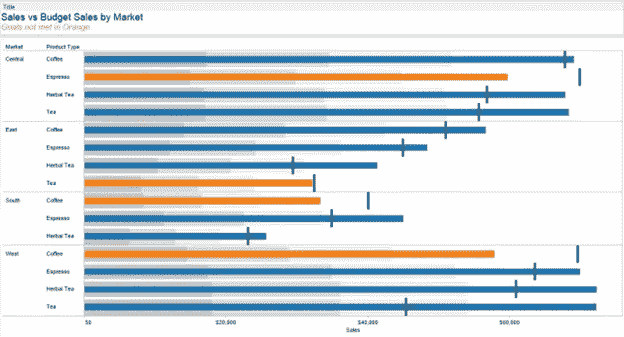

# 数据叙事

> 原文：<https://medium.com/analytics-vidhya/data-storytelling-71c9b2bbcd8b?source=collection_archive---------14----------------------->

> **如何为您的数据选择正确的图表或图形**

> “一张照片的最大价值在于它能迫使我们注意到我们从未想过会看到的东西。”— [约翰·图基](http://www-history.mcs.st-and.ac.uk/Biographies/Tukey.html)

当业务分析师和数据科学家不忙于对大量知识进行切片、切块和建模时，他们会忙于将他们的发现有效地传达给决策者。——[*阿贝尔奥拉赫*](https://www.linkedin.com/in/abeeraulakh/)

最后一部分是最难的！

为了有效地传达从数据中提取的相关信息，必须有合适的图表和正确的故事的理想组合。这是大多数分析师弄错的地方。要么是演示文稿中有过多的数据无法得出任何结论，要么是研究结果与业务不符。
这个由两部分组成的系列将探索分析师可以使用的不同图表，以及他们如何将讲故事发展为一种技能。

在这一部分，我们将专门讨论用于分析和呈现数据的图表。让我们来看看你将使用哪些图表来有效地展示你的发现

# 圆柱

柱形图是最常见的类型之一，用于显示一段时间内项目的比较，甚至是不同项目之间的比较。

> 创建柱形图时:
> 给柱状图添加颜色，增加冲击力。叠加的颜色提供了即时的洞察力，并允许查看者快速比较信息
> 仅当您有可以分成不同类别的数据时才使用这些图表

# 酒吧

条形图是一种简单的水平柱形图，当数据标签很长或者有很多项目需要比较时，可以使用它。

> 创建条形图时，遵循与柱形图相同的提示。

# 线条

折线图和条形图是最常用的图表之一。它们有助于将各个数据点联系起来，并揭示一段时间内的趋势。

> 创建折线图时:
> 仅使用实线

# 双轴

双轴图表包含一个共享的 X 轴和两个 Y 轴。当您想要可视化三个数据集之间的关联时，这些图表非常有用。

来源: [Tableau 专家](http://www.tableauexpert.co.in/)

> 创建双轴图表时:
> 。主要变量应在左侧，因为我们自然倾向于向左看
> 。数据集使用对比色

# 馅饼

饼图用于显示信息的数字比例，以百分比表示。饼图中所有区段的总和等于 100%。

> 创建饼图时:
> 仅用于显示比例
> 确保切片值相加为 100%
> 将切片数量限制为个位数。如果你有更多的比例，考虑使用条形图代替

# 地图

当您有位置数据时，地图是绘制这些数据的一种很好的方式。地图可用于显示地理编码数据，如按邮政编码显示事故数量、按国家显示销售额和进出口额等。

来源:[阿潘德](https://apandre.wordpress.com/home/)

> 创建地图时:
> 将地图与其他相关数据相结合，用作过滤器，然后使用它进一步深入您的数据
> 用气泡图将地图分层，以显示数据的集中程度。这有助于衡量和解释不同数据点的地理影响

# 散点图

散点图是揭示不同信息之间相互关系的好方法。它们还可以用来显示分布趋势，在寻找异常值时非常有效。

来源:[剧情](https://plot.ly/)

> 创建散点图时:
> 添加一条趋势线，使数据中的相关性更强，但将数量限制为两条，以便数据易于理解
> 添加过滤器，以便可以深入数据

# 面积

简单来说，面积图就是一个折线图，x 轴和线之间的空间用一种颜色填充。它们有助于分析整体和个体趋势。

来源:[互通](https://www.interworks.com/)

> 创建面积图时:
> 不要显示超过四个类别，使图表易于阅读
> 使用透明色，使信息不混乱

# 泡泡

气泡图类似于散点图，但包含第三个数据系列，由气泡的大小表示。如果数据集包含三个数据系列，请考虑使用气泡图而不是散点图。

来源:[三个故事](http://blog.threestory.com/wordpress/topics/graphs-and-charts)

> 创建气泡图时:
> 使用圆形
> 根据面积确定气泡大小

# 堆积条形图

当您想要比较许多不同的项目时，堆积条形图非常有用。

来源: [VizWiz](http://www.vizwiz.com/)

> 创建堆积条形图时:
> 为了清晰起见，使用对比色

# 热图

当您想要比较两个类别的数据时，热图是一个很好的选择。它允许您使用颜色比较数据，并让您看到数据中最强和最弱的类别。

来源: [Stackoverflow](http://stackoverflow.com/)

> 创建热图时:
> 改变正方形的大小以显示第三个元素，就像气泡图中气泡的大小一样
> 使用单一颜色和饱和/去饱和来显示变化

# 子弹

当你需要跟踪目标的进展，并比较一个主要指标和另一个指标时，项目符号图非常有用。

来源:[互通](https://www.interworks.com/)

> 创建项目符号图表时:
> 使用对比色突出显示数据的进度
> 将项目符号与仪表板中的其他图表结合起来显示进度

# 柱状图

当您必须查看数据在组之间的分布情况时，可以使用直方图。通过将数据分组并绘制在垂直堆积条形图上，可以看到不同类别的分布情况。

来源:[断笔](http://breaking-bi.blogspot.com/)

> 创建直方图时:
> 为了理解不同的分组，创建各种直方图以确定最有用的分组
> 让用户深入不同的类别，并使用过滤器浏览数据

# 对图表进行分类，以便更好地选择图表

图表的选择取决于您试图回答的问题、数据类型、涉及的变量数量、变量类型、可用空间以及其他几个原因。然而，如果你打算显示关系、分布、比较或组合，这里有一个映射到各种条件的图表类型的简化表示。

# 显示关系的图表

来源 [kdnuggets](https://www.kdnuggets.com/)

# 显示分布的图表

来源 [kdnuggets](https://www.kdnuggets.com/)

# 用于数据比较的图表

来源 [kdnuggets](https://www.kdnuggets.com/)

# 代表作品的图表

来源 [kdnuggets](https://www.kdnuggets.com/)