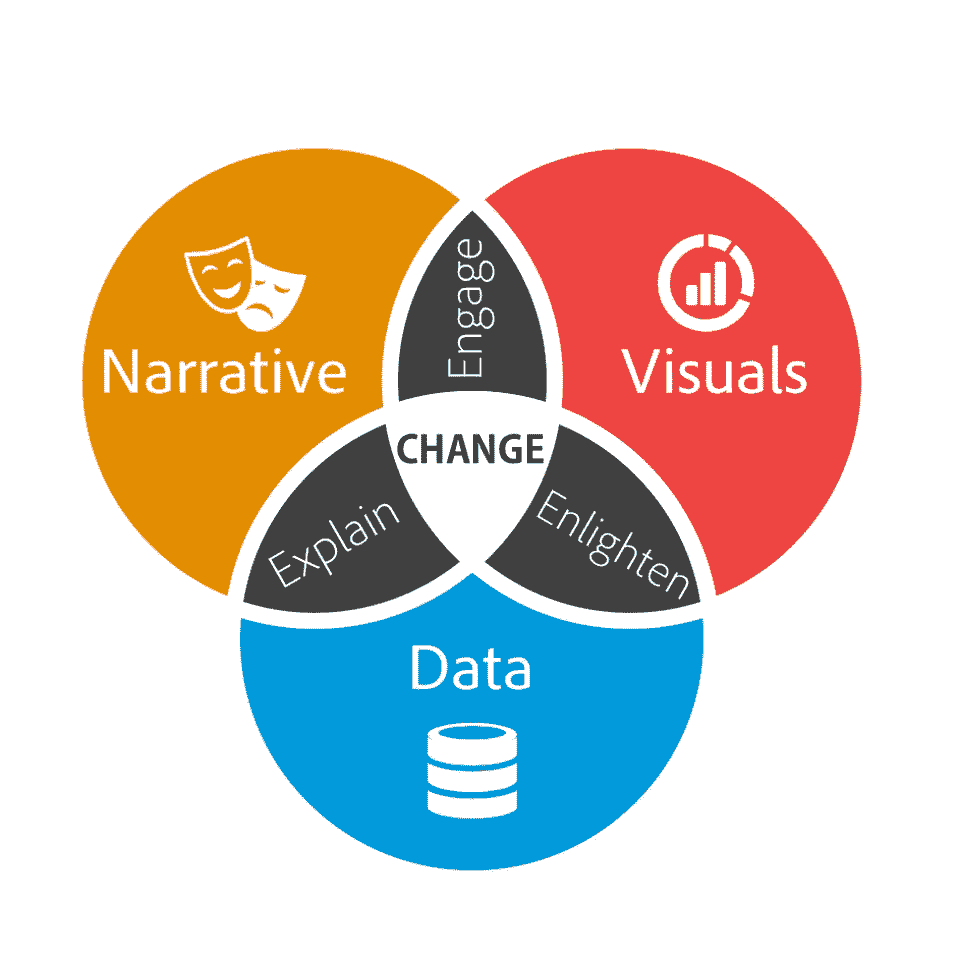

# 数据讲述 Excel 中的基本数据可视化

> 原文：<https://medium.com/analytics-vidhya/data-storytelling-basic-data-visualization-in-excel-d8a3c4ce3a59?source=collection_archive---------6----------------------->

# **数据讲故事**

数据讲故事是一种将可用数据转化为故事的技术。它将数据可视化格式(如图形、图表、动画地图等)与叙事元素相结合。目标是使用多少有些复杂的数据，以简单、简洁的方式讲述一个故事。

数据讲故事是一种用数据讲故事的技术。这是一种展示洞察力的有用方式，这意味着它可以用于内部和外部受众。然而，区分数据讲述和数据可视化是很重要的。数据可视化是用图形表示数据，不一定是讲述一个故事。

**为什么要用数据讲故事？**

数据叙事是一种用于交流数据见解的结构化方法，它涉及三个关键元素的组合:*数据*、*视觉*和*叙事*。

了解这些不同的元素如何在数据故事中结合和协同工作非常重要。当叙述与数据相结合时，它有助于 ***向你的观众解释*** 数据中发生了什么，以及为什么某个特定的见解很重要。充分理解一个观点通常需要大量的上下文和注释。当视觉应用于数据时，它们可以 ***启发*** 观众的洞察力，如果没有图表或图形他们是看不到的。如果没有数据可视化的帮助，数据中许多有趣的模式和异常值将隐藏在数据表的行和列中。

最后，当叙事和视觉融合在一起时，它们可以 ***吸引*** 甚至娱乐观众。毫无疑问，我们每年在电影上花费数十亿美元，让自己沉浸在不同的生活、世界和冒险中。当您将正确的视觉效果和叙述与正确的数据相结合时，您就拥有了一个可以影响和推动 ***变化*** 的数据故事。

# **数据可视化**

数据可视化是信息和数据的图形化表示。通过使用图表和地图等可视化元素，数据可视化工具提供了一种可访问的方式来查看和理解数据中的趋势、异常值和模式。

在大数据世界中，数据可视化工具和技术对于分析海量信息和做出数据驱动的决策至关重要。

数据可视化使大数据和小数据更容易被人脑理解，可视化也使检测数据组中的模式、趋势和异常值变得更容易

我们的眼睛被颜色和图案所吸引。我们可以很快分辨出红色和蓝色，正方形和圆形。我们的文化是视觉的，包括从艺术和广告到电视和电影的一切。

数据可视化是另一种形式的视觉艺术，它抓住了我们的兴趣，让我们的目光停留在信息上。当我们看到图表时，我们很快就会看到趋势和异常值。如果我们能看到一些东西，我们会很快消化它。这是有目的的讲故事。如果你曾经盯着一个巨大的数据电子表格，却看不到趋势，你就会知道可视化有多有效。

**常见的通用数据可视化类型:**

*   图表
*   桌子
*   图表
*   地图
*   信息图表
*   仪表板

# **基础数据可视化技术**

**第一步。在问题上要明确。**

当创建可视化时，第一步是明确要回答的问题，或者回答这个问题:“可视化将如何帮助读者？”

**第二步。了解您的数据，从基本的可视化开始**

确定可视化目标后的下一步是构建一个基本图表——可以是条形图、折线图、流程图、散点图、曲面图、地图、网络等——具体取决于可用的数据。在确定图表应该传达的关键信息的过程中，我们必须清楚几件事:

*   我们试图绘制哪些变量？
*   x 轴和 y 轴分别指什么？
*   数据点的大小有什么意义吗？
*   图表中的颜色有什么含义吗？
*   我们是在试图确定一段时间内的趋势还是变量之间的相关性？

**第三步。选择正确的图表类型**

**第四步。使用颜色、大小、比例、形状和标签来吸引人们对关键信息的注意。**

罗金·瓦尔盖塞