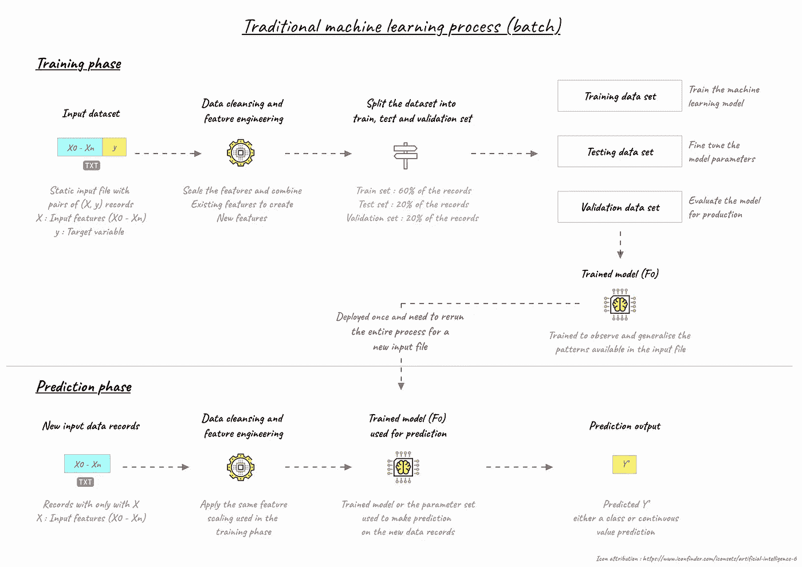
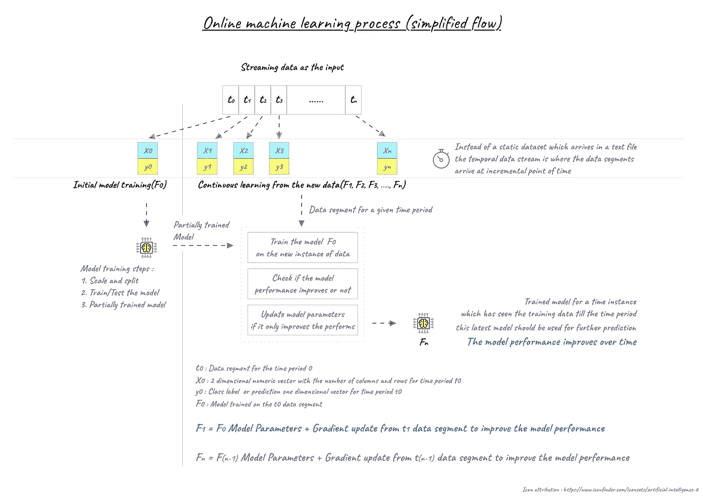
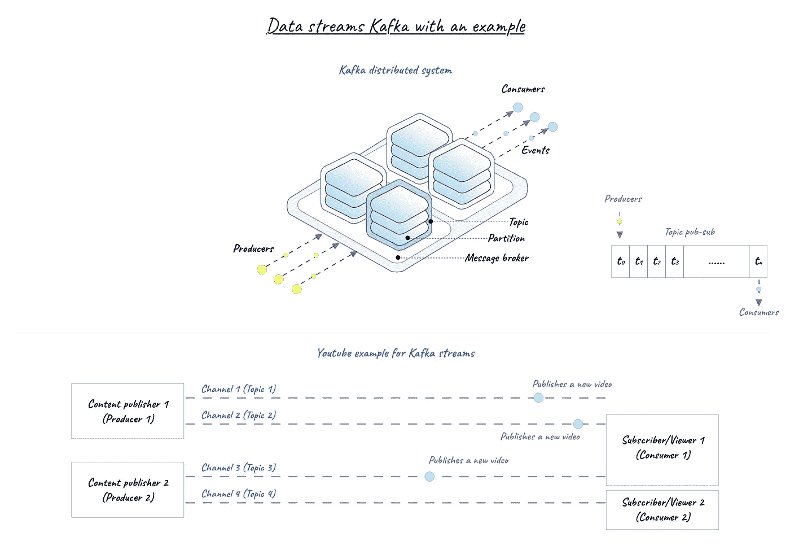
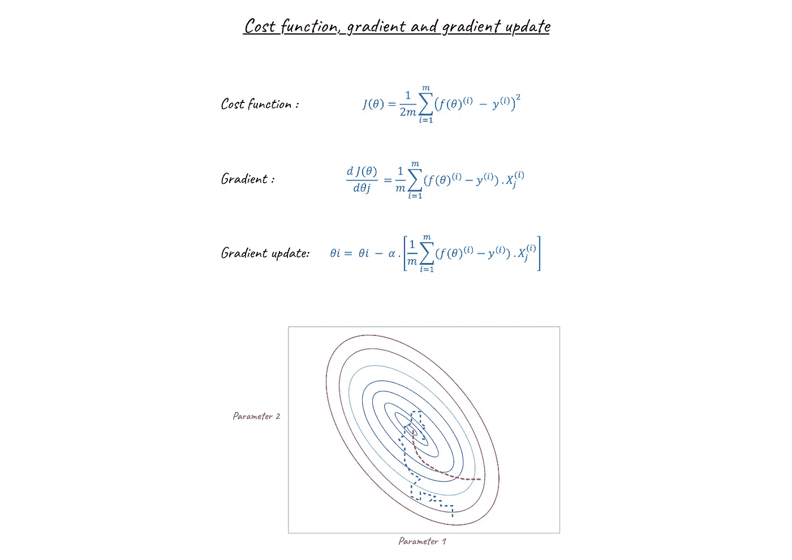
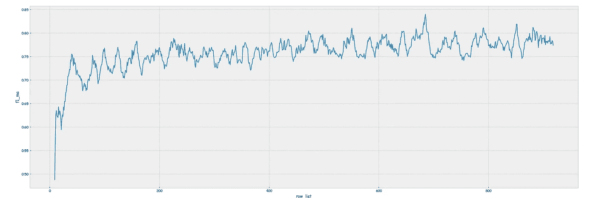

# Data Streams and Online Machine Learning in Python

> 原文：<https://medium.com/analytics-vidhya/data-streams-and-online-machine-learning-in-python-a382e9e8d06a?source=collection_archive---------0----------------------->


Photo by [Franki Chamaki](https://unsplash.com/photos/1K6IQsQbizI?utm_source=unsplash&utm_medium=referral&utm_content=creditCopyText) on [Unsplash](https://unsplash.com/?utm_source=unsplash&utm_medium=referral&utm_content=creditCopyText)

Data has become more than a set of binary digits in everyone’s day-to-day decision-making processes.

The power of data and the insights derived from it was once limited to large business corporations. **Now, the power of data is available to anyone who is willing to trade their data for a piece of information** (example: one has to turn on the location sensor in the mobile phone to share his/her location data to find the minimal traffic route to a destination).

Data generation has seen exponential growth in the last decade along with the growth in infrastructure to handle it. Every application in our smartphone generates tons of data.

IoT (Internet of things) generates data every second about a state of a mechanical device, Server and application logs along with actual user interaction events like clicks and transaction data only grows over time as the user base grows for the application.

> **In 2018 for a single minute in a day** — YouTube users watched 4.3 million videos, Amazon shipped 1,111 packages, Twitter had close to half a million tweets, Instagram inducted 50 thousand photos, Google performed 3.8 million searches, and Reddit received 1,944 user comments. An estimate quotes that by 2020 for every person on earth, 1.7 MB of data will be generated for every second.

**It was in 2005, Roger Mougalas from O’Reilly Media coined Big Data as a term.** It was used to denote the large amount of data which cannot be managed by the traditional business intelligence tools or data processing applications (mainstream relational). It was in the same year Yahoo! built Hadoop on top of Google’s MapReduce with an objective of indexing the entire world wide web. The core concept of distributed computing and the key-value pair data representation (instead of the tabular data representation) has been adopted by most of the new age data integration and business intelligence tools over time.

Any organization which has to deal with massive amount of data (structured, semi-structured, and unstructured) for their business development must have crossed path with one of the tools which had its roots in Hadoop core concepts.

Big Data is an evolving term. It currently describes the large volume of structured or unstructured data that has the potential to be analyzed by various machine learning algorithms for patterns/insights.
Big Data is characterized by

*   **卷**(数据的大小)
*   **速度**(数据通过数据管道生成或共享的速度。即气候或交通相关数据必须是实时的，没有延迟)
*   **品种**(数据不符合 a 表示布局。即，关系数据库期望所述布局中的数据输入，但是不能与具有变化的布局结构的输入数据文件一起工作)

无限量的云存储可用于应对海量数据，自然语言处理和自然语言理解的结合使得与 NoSQL 数据库一起应对数据变化并存储数据成为可能。**在本文中，我们将重点关注大数据的速度属性——如何在 python 中处理数据流，以及如何使用 python 中的在线学习技术来训练机器学习模型，以适应传入的数据流。**

传统的机器学习过程将从静态输入数据文件开始。



我们来看一个有监督的学习过程。**该流程从接收一个带有标签的静态数据文件作为输入文件**开始，执行探索性数据分析，缩放并执行特征工程，将数据记录分成训练、测试和验证集。使用训练数据记录来训练模型，使用测试数据记录来微调模型参数，并且基于验证数据记录上的性能度量来执行模型选择。然后将训练有素的模型部署到生产中，对未知数据记录进行预测/分类。**模型局限于在静态输入文件中观察到的模式，不能适应实时的行为变化。**每次有新的训练数据可用时，训练模型的整个过程都要从头开始。训练一个完整的模型可能是一个耗费资源和时间的过程，这是业务应用程序所不能承受的。

在线学习可以在更大程度上解决这个问题。训练数据越多，新记录集的模型性能越好

> **“不是谁的算法最好谁就赢；而是谁拥有的数据最多。”**作者吴恩达。



增量/在线学习算法是基于给定的训练数据流 *t0，T1，t2，…生成模型的算法。，tn* 一系列模型 *f0，f1，…，fn* 增量训练。ti 被标记为训练数据 *ti = (xi，易)*和 ***fi* 是依赖于来自 *f(i-1)* 的参数和来自数据段 ti 的最近参数更新的模型。**

换句话说，在线训练算法可以获取新的输入数据记录，并从中无缝学习，而无需从头开始经历整个训练过程。在线培训在以下情况下很有帮助。

1.其中模型训练和适应必须在设备上发生，并且训练数据太敏感(由于数据隐私)以至于不能移动到离线环境。即像智能手表和应用程序这样的健康设备。没有一个单一的通用模型可以处理所有可能的用户行为

2.其中由于网络流量/障碍，新的训练数据不能转移到离线过程环境，或者设备必须完全在离线模式下工作。也就是说，引导海上运输船只的导航系统可能没有稳定的网络连接来将数据从其物联网设备加载到家庭办公室

3.庞大的训练数据集，在给定的时间点无法放入单台机器的内存中

4.在所有设备上重新培训和分发新型号可能是一项昂贵的工作

让我们稍微转移一下话题来理解什么是数据流，看看卡夫卡的简要概述。

数据流是指当事件发生时，数据立即可用的地方。可以是实时，也可以是近实时。不是收集和存储来自事件的数据，然后将文件发送给应用程序，而是当事件发生时，数据可供应用程序使用。也就是说，信用卡交易必须是即时的——可用信用必须在交易后立即更新。它不能等待隔夜批次重新运行，因为向消费者显示的可用信用可能不准确，并由于交易重复而导致许多混乱。



**Kafka 是一个分布式发布-订阅消息系统**(在 Linkedin 孵化)。它用于处理高吞吐量的消息传递应用程序，如网页点击、日志聚合和流处理。卡夫卡中的三个重要关键词将是生产者(出版商)、消费者(订户)和主题。**这个系统相当于一个无限长的磁带卷轴。一个应用程序可以在事件发生时实时写入 Kafka(将消息发布到流)，另一个应用程序可以从给定的偏移量读取磁带(使用流中的消息)。**

多个数据流可以共存于 Kafka 消息传递环境中，它们通过各自的主题名称相互区分。即 Youtube 将是最好的例子。观众可以订阅一个频道(主题)。频道所有者(制作者)可以向频道推送新内容(事件)。订户(消费者)接收新内容的通知。频道所有者可以运行多个频道。一个频道可以有很多订户。订户可以订阅各种频道。

RabbitMQ、谷歌 PubSub、亚马逊 Kinesis Stream、Wallaroo 和 Redis Streams 是卡夫卡的几个替代品。在任何分布式系统中，都必须有一个进程负责任务协调、状态管理和配置管理，Kafka 依靠 zookeeper 来执行这些必要的任务。从 https://kafka.apache.org/downloads[下载 Kafka tgz 文件并解压到一个文件夹中。](https://kafka.apache.org/downloads)

移动到提取的 Kafka 文件夹后，运行以下两个命令(在两个单独的命令窗口或终端中运行)

```
bin/zookeeper-server-start.sh config/zookeeper.properties
bin/kafka-server-start.sh config/server.properties
```

现在 zookeeper 和 Kafka 服务器都已启动并运行，我们需要一种通过 python 连接 Kafka 服务器的方法。我们将使用 Kafka-python 包。运行以下命令来安装该软件包

```
pip install kafka-python
```

软件包安装完成后，从 Github 下载代码

```
01.Blog_04_KafkaProducer_Code_V1.0.py
01.Blog_04_KafkaConsumer_Code_V2.0.py
```

生产者代码是生成点击流分类数据(十个因变量和一个目标变量)并将数据段发布到消息代理中的特定主题的代码。

在代码中，确保更新 Kafka 文件夹路径变量并安装像 sklearn 这样的依赖项。

```
def create_topic(logger=None, kafka_path=None, topic=None): ‘’’ Routine will create a new topic; assuming delete_all_topics
         will run before this routine ‘’’;

     cmd_string = f’{kafka_path}bin/kafka-topics.sh — create —  
                    zookeeper localhost:2181 — replication-factor 1 
                    — partitions 1 — topic {topic.lower()}’; cmd_status = subprocess.check_output(cmd_string, 
                   stderr=subprocess.STDOUT, shell=True); cmd_output = cmd_status.decode(‘utf-8’).split(‘\n’)[0];

     logger.info(f’’);
     logger.info(f’{cmd_output}’);
     logger.info(f’’);return None;
```

上面的函数将 kafka_path 和 topic_name 作为输入，并在 kafka 系统中创建一个主题。子流程模块用于在命令行中提交命令并返回响应。代码还会在创建主题之前检查活动的 zookeeper 进程是否可用。

```
def run_producer(logger=None, topic=None): ''' Run a producer to put messages into a topic '''; # The function simulates the clickstream data with pass through
    # X0 - X9   : (Dependent) Numerical features which detail the
                   attributes of an advertisement
    # y         : (Target) Whether the advertisement resulted in a
                   user click or not
    # for every instance a random choice is made to generate the
                   number of records producer = KafkaProducer(bootstrap_servers=['localhost:9092'], 
               value_serializer=lambda x: dumps(x).encode('utf-8')); logger.info(f'Publishing messages to the topic : {topic}'); random_choice_seq = [ i for i in range(100,110) ]; record_count = 0; for i in range(10000):
        number_of_records = random.choice(random_choice_seq);
        record_count += number_of_records;
        X, y = generate_sample(logger=logger, 
                number_of_records=number_of_records); if i == 0 :
            X_scalar = MinMaxScaler();
            X_scalar.fit(X);
            X = X_scalar.transform(X);
        else:
            X = X_scalar.transform(X); data = {'X' : X.tolist(), 'y' : y.tolist()};

        producer.send(f'{topic}', value=data);

        sleep(0.05);

    logger.info(f'Closing producer process; 
                  Total records generated is 
                  {format(record_count, "09,")}'); return None;
```

KafkaProducer 函数用于连接运行在端口号 9092 上的 Kafka 服务器，并向特定主题发布消息。在上面的函数中，我们使用 scikit-learn toy 数据生成模块为分类问题生成数据样本。我们将发布近 1 万条消息，每条消息中有 100 到 110 条数据记录。在过程代码的末尾，流将有大约 1M 的数据记录和 10，000 条消息。

查看下面的博文，了解更多关于 scikit-learn 模块和用于构建基本机器学习流程管道的一系列函数的信息

[](/analytics-vidhya/scikit-learn-a-silver-bullet-for-basic-machine-learning-13c7d8b248ee) [## Scikit-Learn:基础机器学习的银弹

### Scikit-Learn 是 python 的核心机器学习包，拥有大多数必要的模块来支持基本的…

medium.com](/analytics-vidhya/scikit-learn-a-silver-bullet-for-basic-machine-learning-13c7d8b248ee) 

等待生产者代码完成，因为消费者代码使用消息偏移量来关闭训练循环。

**消费者代码包含从主题开始直到最后一条发布的消息消费消息的模块。**(在提交消费者代码之前，必须执行并完成生产者代码，否则消费者将无法阅读整个主题。它可能仅读取部分消息集)以及在线模型训练

回到在线学习，我们需要一种学习算法，它可以获取一组新的数据记录，并更新已训练的模型参数，以提高模型性能指标。

1.Scikit-learn 包含几个具有 parital_fit 方法的分类器模型。parital_fit 允许将训练模型拟合到新数据的较小子集，而不是整个训练数据集

2.热启动一个神经网络。对于新的训练迭代，权重可以来自先前训练的模型。TensorFlow 有检查点来处理这种情况

3.贝叶斯方法将非常适合在线学习，因为关于参数分布的信念随着新的训练数据记录的出现而更新

**我们将使用 Scikit-learn SGD class ifier 进行部分拟合。**



**红色条带线为批量学习，蓝色条带线为随机梯度下降；SGD 可能会左右摇摆，但最终会达到全局最小值**

由于 SGD 的成本函数是凸的，因此可以使用梯度来达到全局最小值。与较小的输入数据记录集相比，完整的批量训练可能平滑地达到全局最小值，而较小的输入数据记录集将错开并最终收敛到全局最小值。

基于来自新的训练数据集的梯度以及控制学习速率的α(来自新的训练集的多少信息应该用于影响训练的模型参数)来更新模型参数

```
def initial_model(logger=None):

        ''' Simulation of the initial model setup in a traditional 
            ML training '''; clf = SGDClassifier(

              loss='log', 
              # log as a loss gives the logistic regression
              penalty='none', 
              # l2 as a default for the linear SVM;
              fit_intercept=True, 
              shuffle=True, 
              # shuffle after each epoch
              eta0=0.001,
              learning_rate='constant',
              average=False, 
              # computes the averaged SGD weights 
              random_state=1623,
              verbose=0,
              max_iter=1000,
              warm_start=False
            ); return clf;
```

**消费者代码将使用 KafkaConsumer 连接到一个活动的 Kafka 服务器，并从主题管道的开头开始消费消息。**numpy 数据元素是不可序列化的，所以它在生产者代码中被转换成 python 列表，并被转储到 JSON 中。消费者将颠倒该过程来取回 numpy 数组。scikit-learn parital_fit 方法可以很好地处理 numpy 数组/pandas 数据对象。

```
consumer = KafkaConsumer(
               topic_name,
               bootstrap_servers=['localhost:9092'],
               auto_offset_reset='earliest',
               enable_auto_commit=True,
               value_deserializer=lambda x: loads(x.decode('utf-8'))
               );
```

对于第一次迭代，模型使用来自消息的全部数据记录进行训练和测试。从第二次迭代开始，只有当模型性能提高时，我们才会进行拟合。

```
if counter == 1: clf.partial_fit(X_train, y_train, classes=[0,1]);
            y_test_predict = clf.predict(X_test); clf_log_loss = log_loss(y_test, y_test_predict, 
                           labels=[0,1]);
            clf_acc_score = accuracy_score(y_test, y_test_predict);
            clf_f1_score = f1_score(y_test, y_test_predict); row_list.append(selected_models);
            ll_list.append(clf_log_loss);
            accuracy_list.append(clf_acc_score);
            f1_list.append(clf_f1_score);else: clf_temp = clf; clf_temp.partial_fit(X_train, y_train, classes=[0,1]);
            y_test_predict = clf_temp.predict(X_test); clf_log_loss = log_loss(y_test, y_test_predict, 
                           labels=[0,1]);
            clf_acc_score = accuracy_score(y_test, y_test_predict);
            clf_f1_score = f1_score(y_test, y_test_predict); if clf_f1_score > (np.mean(f1_list) * 0.95) : clf = clf_temp;
                selected_models += 1; row_list.append(selected_models);
                ll_list.append(clf_log_loss);
                accuracy_list.append(clf_acc_score);
                f1_list.append(clf_f1_score);counter += 1;if counter == topic_offset:
             break;
```

性能指标是一段时间内的平均值，所以曲线看起来很平滑。

**模型评估和结果**



**分类任务的 F1 分数；随着通过**的数据样本数量的增加，该指标也会提高

我们假设数据是稳定的，而不稳定的数据将需要改变学习速率、模型参数平均以及我们使模型适合学习任务的方式。

## 快乐编码，坚持学习

> 如果你喜欢这篇文章，请鼓掌，如果有任何疑问或建议，你可以通过 manikandan@datazymes.com 联系我

链接到*代码*回购

[](https://github.com/manikandanj2207/dataibreathe) [## manikandanj2207/dataibreathe

### 支持媒体博客的代码库。为 manikandanj 2207/dataibreat 的发展作出贡献

github.com](https://github.com/manikandanj2207/dataibreathe)