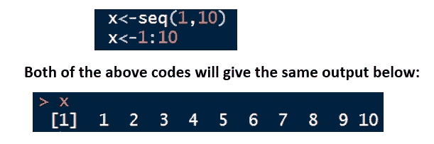
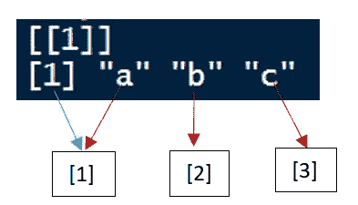

# R 程序设计中的数据结构

> 原文：<https://medium.com/analytics-vidhya/data-structure-in-r-programming-edf72711c199?source=collection_archive---------8----------------------->

> 糟糕的程序员担心代码。优秀的程序员担心数据结构和它们之间的关系。——莱纳斯·托瓦尔兹

开始一件事可能和不断培养坚持下去的意志和动力并坚持到底一样令人畏缩。学习一门新的编程语言是非常相似的。

当开始学习一门新的编程语言时，我们需要做的第一件事就是理解它的数据结构。为什么？因为当你了解数据结构时，你就知道存储、组织、管理、访问和修改数据的最佳方式，从而节省你的时间和内存空间。这一系列都是关于 R 编程语言中的数据结构。

在我们开始学习基本的 R 数据结构之前，我们需要了解数据结构中的两个概念:

1.  **同质性**:告诉我们数据结构是否是“同质”的，即它只包含相似类型的数据，例如全数字、全字符串等。，或多种数据类型的组合，即“异构”。
2.  **维度**:告诉我们订单数据将以何种方式存储，是线性还是一维，表格还是二维等等。

1.  **Vector** :同一[数据类型](https://medium.com/p/1bb613213708/edit)的数据的线性或一维集合。数据被索引，即向量中的每个元素都被编号，在 R 中，计数从“1”开始。即使是单个元素也会被存储为长度为 1 的向量。

*当你试图在同一个 vector 中存储不同数据类型的元素时会发生什么？*

它的结果是[隐式转换](https://medium.com/p/1bb613213708/edit)。这意味着 R 将把元素转换成可以代表向量中所有元素的数据类型。示例:在下面的 vector 中，索引 2 中的元素是数字数据类型，而其他元素都是字符数据类型。当 R 读取它时，它会隐式地将其转换为字符数据类型，并将其与 vector 中的其他元素对齐。

**在 R 中创建矢量的方法**:

a)使用组合和分配功能

assign()的语法— assign("变量名称"，c(元素 1，元素 2，…..)

c() —变量名称

请注意，我们也可以使用' = '符号，尽管我们不建议这样做

例如 x=c(1，2，3)

b)使用序列函数和冒号“:”运算符

如果我们需要生成一个包含数字序列的向量，我们可以用下面两种方法之一来实现:

seq()-seq(first _ number，last_number，by=number_of_steps)语法

“:”的语法-名字:姓氏

seq() above ':'的一个优点是，我们还可以指定我们想要在序列中移动多少步。下面是一个例子:

c)使用复制功能

当我们想要多次创建包含相同元素的向量或者想要多次复制现有向量时，可以使用 rep()函数。

语法— rep(x，times)其中 x 是一个向量，times 是我们想要复制 x 的次数。

以下示例:请注意右边示例中“each”的用法以及输出中的差异:

d)使用 vector()函数

函数的作用是:创建一个由程序员指定模式和长度的向量。它将矢量初始化为每种模式的默认值。

vector()的语法— vector(mode="x "，length=)

下面的代码显示了一些基本模式的输出:

e)使用 as.vector()函数

我们可以使用 as.vector()函数将其参数显式转换为指定模式的向量。这也称为“[类型转换](https://medium.com/p/1bb613213708/edit)”。

语法— as.vector(x，mode="mode_name ")

其中 x 是 R 对象。

在下一个例子中，我们将稍微超前一点，因为我们还没有讨论矩阵。但是为了理解 as.vector 是如何工作的，我们需要理解的是，我们已经有了一个名为 *my_matrix* 的 R 对象，它有一个矩阵数据结构，我们想把它转换成一个向量。可以按如下所示进行操作:

请注意，我们可以使用 is.vector()函数来确认类型转换实际上将矩阵转换为向量。

**访问向量中的元素——使用[]和维度名称**

我们使用方括号[]通过引用它们各自的索引号或维度名称来访问向量的元素。下面的例子:

请注意，除了索引，我们还可以通过使用尺寸名称作为参考来访问元素，即[dim_name]而不是[index_number]。这将在我们学习如何命名向量维度时讨论。

**命名向量索引-使用 names()函数**

如前所述，向量是一维的，它们的元素用从 1 开始的数字进行索引，但是我们也可以选择将向量命名为索引，而不是使用索引号来引用它们。

语法-names(vector _ name)

Example:

Deleting index names is quite simple.

Syntax — names(vector_name)

For example: names(student)

**2。Matrix** :它是相同类型(同质)数据的表格或二维集合。它有行和列。请注意，与向量的情况类似，如果我们试图构建一个包含不同数据类型元素的矩阵，R 会隐式地将元素转换为可以表示所有信息的最简单的数据类型。

**在 R 中创建矩阵**:

a)使用函数矩阵()

语法—矩阵(数据=，nrow=，ncol=，byrow=)

这里，数据是数据向量，nrow 是行数，ncol 是列数。byrow=TRUE 将按行填充数据，byrow=FALSE 将按列填充数据。

示例:下面是一个包含 3 行 4 列字符数据类型的矩阵。数据已经被填充了。

b)使用函数 rbind()

rbind()函数也接受一系列向量、数据帧和矩阵，并按行组合它们。

语法— rbind(x1，x2 …)其中 x1，x2…可以是向量、矩阵或数据帧。

例 1:考虑同一个矩阵 A，我们可以使用下面的代码按行重新排列元素。

示例 2:组合向量以形成矩阵

c)使用函数 cbind()

cbind()函数也接受一系列向量、数据帧和矩阵，并按列组合它们。

语法— rbind(x1，x2 …)其中 x1，x2…可以是向量、矩阵或数据帧。

示例:下面我们使用 cbind 将 3 个向量 x，y，z 组合成一个矩阵 A

**命名矩阵维度**

下面是我们命名矩阵维数的各种方法

a)我们可以在创建矩阵时命名维度。示例:注意用黄色突出显示的部分，它们是尺寸名称。

但是请注意，在这种情况下，我们可以只添加一个维度名称(即，如果我们正在执行 cbind，则只添加列维度名称；如果我们正在执行 rbind，则只添加行维度名称)。

b)使用 colnames()和 rownames()函数

假设我们有一个名为“my_matrix”的矩阵，我们想命名它的两个维度，即行名和列名。

我的矩阵

以下是我们的做法:

c)使用 matrix()函数及其参数“dimnames”。请注意，dimnames 只接受“列表”作为值。(列表将在本节稍后讨论)

语法— matrix(data=，nrow=，ncol=，byrow=，dimnames=list(x，y))

其中 x 是包含行名的向量，y 是包含列名的向量。

**访问矩阵中的元素**

我们可以通过使用索引或维度名称作为引用，以多种方式访问矩阵。下图说明了我们访问矩阵“A”中以黄色突出显示的元素“000”的 4 种方式。

**3。数组**:类似矩阵的数组只包含相同数据类型的元素。但与矩阵不同，数组可以有 2 个以上的维度，即数组是同构的多维数据结构。矩阵实际上是一个二维数组。

在 R 中创建一个数组:

我们使用 array()函数来创建数组。

语法— array(data=，dim=c(no_row，no_column，numberOf_dimensions))

例如:w

例如:假设我们收集了一个城市 3 所大学过去 4 年的通过率和通过率。每个学院的记录可以存储在 2 行 3 列的独立矩阵中，然后我们可以将所有 4 个学院的数据合并到一个四维数组中。

数组结构可以想象成一张叠一张的卡片。

下面是相同的 R 代码:

**访问数组中的元素**

语法—数组名称[行名称，列名称，维度编号]

我们可以把维度号想象成卡号。假设我们想知道大学 4 年级 3 年级的不及格百分比，我们的代码如下所示:

**my_array[2，3，4]#输出将是 35**

**4。列表**:

列表是一维异构数据结构。它可以包含所有或任何数据类型——数字、逻辑、字符、复杂。它可以包含向量、矩阵、数据帧、数组甚至其他列表。数据将以线性方式存储，即 1 D。

**在 R 中创建列表**:

通过使用 list()函数

语法-list(data ),其中数据是 R 对象

示例:

**命名列表索引-使用 names()函数**

与向量类似，列表中的索引也可以使用函数名()来命名

示例:对于之前创建的同一个列表，我们可以将其命名如下:

names(my_list)

my_list

**访问列表元素——使用索引号和索引名**

像向量一样，我们也可以使用[]符号访问列表元素。我们只需要在选择指数时稍微小心一点。让我们看下面两个例子。

a)使用索引号来访问元素

让我们考虑我们之前创建的同一个列表“my_list”。它有两个元素，一个向量“x”和一个矩阵“y”。

看看输出中的索引，试着理解它。

**[[1]]** 这里表示它是列表中的第一个元素(是一个向量)。

**[[2]]** 这里表示它是列表中的第二个元素(是一个矩阵)。

现在请看下图中的红色箭头。我们可以看到，这里的[1]表示向量内部的第一个元素“a”。类似地，“b”和“c”分别具有索引[2]和[3]。它在 R 中出现的方式是，我们只看到每一个新行中的第一个索引，如蓝色箭头所示。

现在，如果我们想从列表中访问“b ”,我们必须遵循索引路径:

*my _ list***—***列表内的第一个元素即向量 x* **—** *向量 x 内的第二个元素即“b”*

可以写成:

类似地，假设我们想从矩阵中获取数字 8

*my _ list***—***列表内的第二个元素即矩阵 y —* *矩阵 y 内单元格[2，4]中的元素即‘8’*

可以写成:

b)访问命名元素——使用$符号

现在假设我们的列表索引被命名为。列表中的向量被命名为“ABC ”,矩阵被命名为“Numbers”。我们想访问向量中的元素“b”和列表中矩阵中的元素 8。我们在这里使用$符号，它用于访问 r 中的命名元素。

以下是我们的做法:

**5。数据帧**:

数据帧是二维异构数据结构。你可以把它想象成类似于我们在 MS-Excel 中看到的东西。它有行和列，每一列都有相同数据类型的元素。所以我们可以把列看成向量(一维齐次)。行可以包含不同数据类型的元素。参考下图。

**在 R 中创建一个数据帧——使用 data.frame()函数**

语法:data.frame(vector1，vector2…)

其中向量 1、向量 2..都是一样长的。

示例:

**命名数据帧尺寸—使用 names()函数**

a)我们可以在创建数据帧时命名尺寸，如下所示:

data.frame( **字母**=字母【1:4】，**数字** =c(1，2，3，4))

b)使用 colnames()和 rownames()函数

**访问列表元素——使用索引号和名称**

我们可以像访问矩阵元素一样访问数据帧，使用特定元素的行号和列号。假设我们想从 my_df 中访问班加罗尔的人口，即 8436675，我们可以通过如下所示的两种方式来实现:

**6。因素**:

当处理分类数据时，我们需要正确地定义它们，以便更好地进行数据建模。我们可以通过将它们存储为因子来做到这一点，换句话说，就是将它们存储为不同的“级别”。因子可以存储字符串和整数。分类数据的一些例子是:不同的人类血型类型，信用交易类型，如通过 ATM 卡、现金、支票、网上银行等。

考虑字符向量“tt”:

tt “支票”、“现金”、“支票”、“网银”、“现金”)

我们可以把它转换成一个因子，因为它的数据可以有意义地分类。

将字符向量转换为因子

请注意，我们现在可以在输出的底部看到**唯一级别**。如果我们想查看因子' **tt 因子'**中的不同级别，我们也可以使用函数**级别(tt 因子)**

***这些级别是如何在 R 内部存储的？***

这里需要理解的一件重要事情是，这些级别在内部存储为整数。为了证实这一点，我们可以使用 typeof()和 str()函数。每个级别被分配一个从 1 开始的整数。

如果级别是字符型的，就像我们的例子一样，它们将按字母顺序排列，并被赋予一个从 0 开始的数字。所以，ATM card——是一级，现金——二级，支票——三级，网银——四级。

如果级别是数字，那么它们将以升序排列，然后从 1 开始分配一个级别。

***我们可以改变等级编号而不接受默认的升序/字母顺序吗？***

答案是，可以！我们可以在 levels 参数中传递所需的级别顺序，如下所示。

我们终于到达了终点。呜呜呜！！！

当然，关于数据结构还有很多其他有趣的东西。我试着包含了一些基本的概念，我希望这能帮助那些刚开始喜欢 R 编程和任何与数据相关的东西的人。

保重，继续学习！