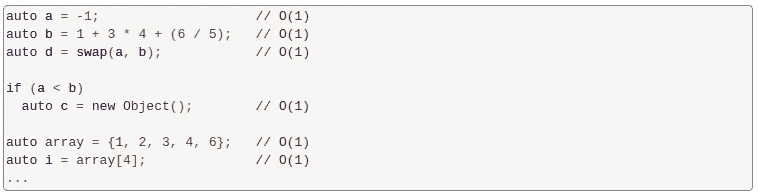
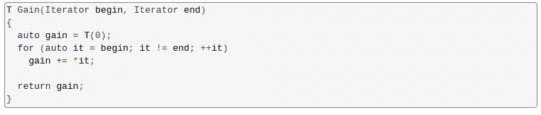

# 数据结构、算法和复杂性。

> 原文：<https://medium.com/analytics-vidhya/data-structures-algorithms-and-complexity-the-big-pic-5034f943f45c?source=collection_archive---------0----------------------->

# 数据结构

在每一个程序或软件的基础上有两个实体:数据和算法。数据结构是我们存储和检索数据的方式，它们代表了要在内存中组织的知识。无论我们在解决什么问题，我们都必须以这样或那样的方式处理它们:学习数据结构是必不可少的！

我们需要使用储存的信息，一种记忆，才能生活。编程语言中存在的数据结构与我们在数字领域之外使用的真实世界系统非常相似。

假设你要在一个杂乱的图书馆里找到一本特定的书；这项任务需要大量的时间。就像图书馆组织他们的书籍一样，我们需要组织我们的数据，以便可以有效地执行操作。**选择错误的数据结构会导致缓慢或无响应的代码，并搞乱我们的程序！**

# 目标

> 了解常见数据结构之间的差异
> 选择适合我们目的的数据结构
> 创建我们的数据结构

在下一篇文章中，我们将看看日常应用中使用的核心数据结构。我们将讨论选择每种数据结构的利弊，以及遍历、检索和更新算法。

# 下一步是什么？

数组和链表是编程世界中两种基本的数据结构。在理解了它们和它们的区别之后，我们可以开始使用算法，例如 [search](https://hurna.io/academy/algorithms/search/index.html) / [sort](https://hurna.io/academy/algorithms/sort/index.html) 算法，或者使用更高级的数据结构，例如:堆栈、队列、二叉树或哈希表。

# 算法

你用计算机做的一切都在某种程度上依赖于一种算法。任何软件(即使是最先进的人工智能)都只是一些结构化数据拼凑而成的算法。
就是这样:**算法+数据结构=软件。**

算法定义了如何操作，精确地做什么来解决问题。如果我们将它与数学或物理学联系起来，那么它可能意味着用一个配方一步一步地解一个方程(例如[机器人解一阶方程](https://hurna.io/mathematics/linear_equation.html#winning))。

**学习算法不需要你懂任何编程语言(算法不变，只是语法可能会变)**；它只要求你对所涉及的步骤有所了解。然而，如果您想实现您的算法并看到它们运行，建议您了解一个。

# 目标

在接下来的系列文章中，我们将学习如何实现非常有用和强大的算法。我们将涵盖编程技术，如:**复杂性、分治策略、递归、融合、优化、字符串重写系统、分区方法……**

# 下一步是什么？

一旦你掌握了一些算法概念，你就可以更进一步了解数据结构、复杂性、一种新的编程语言，并创建你自己的软件。

# 为什么算法如此重要？

理解算法让你对数字世界有一个宏伟的愿景。不了解它们，就很难从更高的角度看问题，预测什么可以有效地工作或产生不可接受的结果。

**我们对算法了解得越多，找到解决问题方法的机会就越大。**很多情况下，一个新问题不需要太多努力就可以归结为老问题。

许多问题，**虽然看起来不现实，但需要现实世界中每天出现的相同的算法知识。**

# 它们比你想象的更容易理解

算法几乎总是与数学和它所激发的所有蒙昧主义联系在一起。数学是有用的，但大多数时候你并不需要它。

# 不要花时间去记忆算法

这不是重点:**相反，试着理解不同的算法如何处理不同的问题**。看看是什么让一种方法慢而另一种方法快，并了解其中的权衡。关键是深入了解我们如何让计算机做事情。

# 复杂性

计算机上的一切都在某种程度上依赖于某种算法。
每个算法的执行都需要时间和空间。
**代码的复杂度是对其执行的时间/空间的估计。复杂度越低，执行越好。**

复杂性，**或大 O 符号**，然后允许我们能够比较算法而不用实现或运行它们。它帮助我们设计一个有效的算法，这就是为什么世界上任何一个技术面试都要问程序运行的复杂性。

> 复杂度是对渐近行为的估计。这是衡量算法如何扩展的指标，而不是衡量具体性能的指标。

# 目标

> 理解算法性能是如何计算的。
> 估计一个算法的时间或空间需求。
> 识别一个函数的复杂度。
> 请记住，大 O 是一个渐近指标，对绩效的影响是模糊的。

# 下一步是什么？

然后，我们将更有信心进一步使用更复杂的数据结构(二叉树、散列图等)。)并探索一些算法实现如[排序](https://hurna.io/academy/algorithms/sort/index.html)或[迷宫生成器](https://hurna.io/academy/algorithms/maze_generator/index.html)。

# 常见运行时间

下面是分析算法时使用的标准运行时间的大致情况:**这是我们每次写代码时都要记住的一个很好的例子。**

上图显示了算法执行的操作数量与输入元素数量的关系。可以看出它的复杂性对算法的惩罚有多快。

能达到的复杂程度取决于问题。下面让我们看看普通的运行时间和一些相应的算法实现。

# 常数— O(1)

恒定时间意味着运行时间是恒定的:**无论输入大小，它都像光速一样快！例如，它涉及到你在任何编程语言中可能遇到的大多数基本操作(如赋值、算术、比较、访问数组元素、交换值……)。**

# 对数— O(对数 n)

这些是**最快的算法，其复杂度取决于数据输入的大小**。显示这种复杂性的最著名和最容易理解的算法是二分搜索法，其代码如下所示。

> 通常:分治算法可能导致对数复杂度。

# 线性— O(n)

运行时间最多随输入大小线性增加:如果输入大小为 n，它也将执行~n 次操作。**在算法必须顺序读取其全部输入的情况下，线性时间是可能的最佳时间复杂度。**

考虑我们必须计算收益和损失之和(总收益)的例子。当然，我们必须至少检查一次每个值:

> 如果您有一个包含简单数据的唯一 for 循环，它很可能导致 O(n)复杂度。

# 准线性— O(n log n)

> 运行时间为 O(n log n)的算法比 O(n)中的算法稍慢。
> 例如，这是处理排序算法的**最佳时间复杂度**。

在许多情况下， *n* log *n* 复杂度只是执行 n 次对数运算的结果，反之亦然。例如，经典的合并排序算法:

> 它们通常是 O(n)算法的优化结果。

# 二次——O(n)

这就是经常遇到的那种消耗性**复杂性**。当我们想要将每个元素与所有其他元素进行比较时，经常会出现这些算法。冒泡排序是课堂上首先学习的算法之一，它很好地说明了这个运行时间。这是它最天真的版本:

> 如果你有一个简单数据的双 for 循环，它很可能导致 O(n)复杂度。

# 指数— O(2^n)

这是非常消耗资源的**算法的开始。通常 n 的复杂度是可以接受的，而 2^n 几乎总是不可接受的。朴素的递归 Fibonacci 实现是其最著名的例子:**

看看运行时间可能攀升的有多快，如果你有:
- 5 元素→ 32 运算
- 10 元素→ 1024 运算
- 100 元素→ 1,2676506×1⁰ ⁰运算！

**然而，对于一些问题，我们无法实现更好的复杂性**。例如，由于动态编程优化，旅行推销员问题可以最好地达到这种复杂性。

# 阶乘— O(n！)

> 这是最慢的，被认为是不可行的。我们基本上不需要处理这样的算法。

例如，通过强力搜索的旅行推销员问题就是这种情况:它尝试所有排列，并使用强力搜索哪一个最便宜。

# 数学

> 为了避免太长，惹恼大多数读者，我们将只放一些有用的数学等式，作为对那些想进一步玩复杂计算的人的提醒。

关于更多的计算机科学、具体实现和科学，我们很快就会再见了。

H.urna