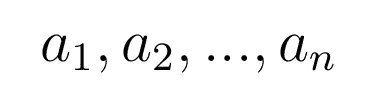
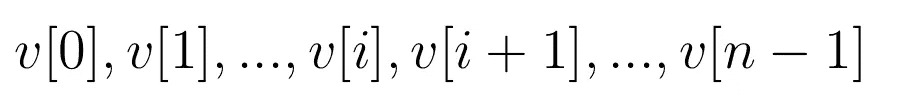
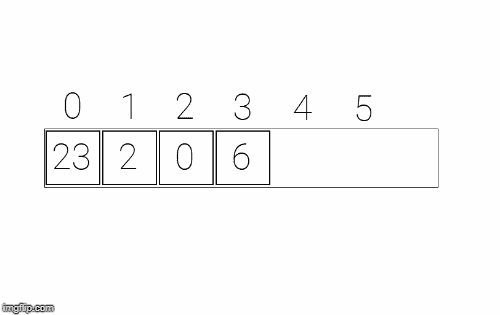
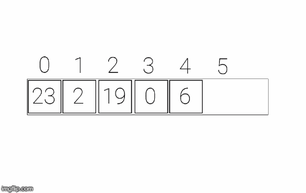
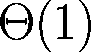
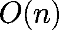
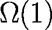
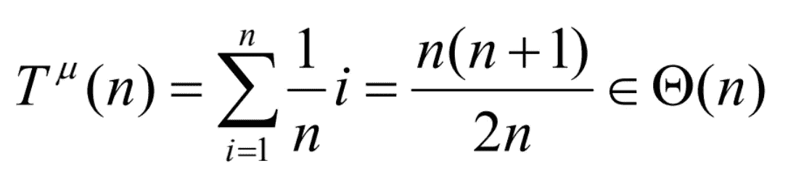
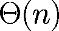

# 从头开始的数据结构—第 1 部分:列表 I

> 原文：<https://medium.com/analytics-vidhya/data-structures-and-algorithms-a-theoretical-approach-part-1-lists-i-eb676f698e34?source=collection_archive---------18----------------------->


格伦·卡斯滕斯-彼得斯在 [Unsplash](https://unsplash.com?utm_source=medium&utm_medium=referral) 上拍摄的照片

数据结构和算法(DS&A)是计算机科学领域最重要的课题之一。在这篇文章(以及后面的文章)中，我们将看到最常见的 DS&A 的理论方法和使用 NumPy 在 Python 中从头开始的实现。

在第 1 部分中，我们将研究线性抽象数据类型:列表、堆栈和队列。

# 目录

0.必需的知识。
1。快速提醒。
2。列表抽象数据类型。
3。用 Python 实现数组列表。
4。记录代码。
5。运行时间。
6。优点和缺点。
7。资源。

# 0.必需的知识

在我们开始这篇文章之前，你必须知道:

1.  我们不会从头开始讨论渐近符号，只讨论不同数据结构的计算复杂性。
2.  需要基本的 Python 和编程知识。
3.  需要非常基本的数字知识。

# 1.快速提醒

让我们从一些基本定义开始:

*   **原始数据类型:**数据类型是指特定信息的编码方式。它是一个变量可以代表的一组值。例如， *int* type 只能表示整数。
*   **抽象数据类型:**是一种类型，其作为类型的表示已经被抽象，其数据只能通过一组操作来访问。从形式上讲，它是一个数学模型，由一组称为*属性*的值和一组作用于这些值的操作定义。
*   **数据结构:**是一组信息的有组织的表示。表示的不同部分通常是原始数据类型(它也可以有抽象数据类型)。这些部分的组合用于获得满足抽象数据类型规范的表示。这意味着一个*列表*是一个抽象数据类型(ADT ),可以用数组(ArrayList)来表示。

# 2.列表抽象数据类型

列表是零个或多个元素的有限序列。元素可以是不同的类型，但是如果所有的元素都是相同的类型 *T* ，我们有一个类型 *T* 的列表。



图 1:元素序列

列表中元素的个数为 *n* ，通常称为*长度*。如果 *n* 为 0，则列表为空。如果 *n* 等于或大于 *1* ， *a* ₁称为*第一个元素*，*a*称为*最后一个元素*。

列表是一个灵活的 ADT，可以根据需要增长或缩短:我们可以在列表的任何给定位置插入或删除元素。

我们通常以两种不同的方式实现列表:

1.  **链表**:作为元素(节点)的链接序列。
2.  **ArrayLis** t:或*基于数组的* list 实现。

对于这篇文章，我们将采用第二种选择。

一个 ArrayList 用一个大小为 *n* 的数组 *v[ ]* 表示列表，数组的元素 *v[i]* 存储在连续的位置 *i* ，其中*0*≤*I*≤*n-1*。



图 2:基于数组的列表表示。

我们将在后面看到这种表示的缺点和优点。

# 3.用 Python 实现数组列表

你可能认为“理论方法”需要伪代码来描述算法，你可能是对的，但 Python 是一种非常高级的语言，使用它的结果是一个你可以实际使用的函数类，而不是把它留在伪代码中。所以，让我们编写一个数组列表！

首先，我们想导入 NumPy 库来使用它的数组。

```
import numpy as np
```

## 3.1.定义类别

现在，我们用将要实现的空方法定义抽象类*列表*:

代码 1:列出抽象类。

## 3.2.魔法属性

要启动 *ArrayList* 对象，我们需要使用 NumPy 预先分配数组的长度，称为*向量*。属性*大小*将是列表中元素的数量。最后， *__str__* 方法将以字符串形式返回列表，这样我们就可以打印它了。

代码二:魔法属性。

## 3.3.获取并搜索

*get* 方法将返回给定位置的元素。我们只需要在确认合法后进入那个位置。

*搜索*方法将查找给定元素的索引。我们需要遍历列表，直到找到元素或者到达列表的末尾。如果元素不在列表中，我们将返回一个值 *-1* ，而不是引发一个异常。这样做是因为我们将在后面的方法中使用该属性。

代码 3:获取并搜索。

## 3.4.插入和追加

如果我们想在给定的位置插入一个元素 *x* ，我们需要为 *x* 腾出空间。我们通过将位置 *i* 中的元素移动到位置 *i + 1* 来实现这一点。也就是说，我们将每个元素向右移动一个位置。

为了执行这个操作，我们通常使用一个反向循环来完成所需的移位。



图 3:插入元件 19 的过程。

对于 *append* 操作，我们只需要检查列表是否未满，如果是，则在最后一个位置插入元素。

代码 4:插入和追加。

## 3.4.移除方法

要从列表中删除一个元素，我们可以采用两种方法:

1.  移除给定位置的元素。
2.  通过在列表中搜索来移除给定元素。

对于第一个选项，我们应该检查索引的合法性，以及列表元素的数量。之后，我们将位置 *i + 1* 的元素移动到 *i* 。换句话说，我们将列表中的元素向左移动。



图 4:删除给定列表的元素 19 的过程。

代码 5:移除方法。

## 3.5.其他方法

我们可能要考虑一些其他方法，这些方法可以用于不同的目的。在我们的例子中，我们会多考虑 2 个:*清理*和*清空*。

*clean* 方法将设置所有元素为空，而 *empty* 方法将检查列表是否为空。

代码 6:其他方法。

# 4.记录代码

现在我们有了一个实现 ADT 列表的全功能类，我们应该添加一个适当的文档来解释这些方法在做什么，这些方法工作需要什么参数，异常等等。

下面，您将找到一种可能的方法来记录该类。

代码 7:文档类。

# 5.执行时间

是时候研究一下链表 ADT 不同操作的运行时间了。请记住，我们正在与一个香草列表 ADT，而不是一个排序，循环或任何其他变量。

**注意:**记住在渐近符号中我们定义了算法的上下限。算法的上界是其最坏情况的上界(大 O)，算法的下界是其最好情况的下界(大ω)。

因此，要知道*ω*并不是最佳情况，而是最佳情况的下界。因此，这是算法的下限。当我们谈论 *O* 时，情况也是如此。

## 5.1.得到

这是一个简单的。元素要么是位置，要么不是。这两种情况具有相同的复杂性:



## 5.2.搜索

## 5.2.1.最坏情况

假设元素存在于列表中，那么*搜索*方法的最坏情况是元素位于列表的最后一个位置。这意味着我们将遍历整个列表减去一个位置来找到元素。

或者，我们也可以认为最坏的情况是元素不在列表中，所以我们遍历了列表却什么也没有。

应用渐近符号规则，这两种复杂性将是相等的。



## 5.2.2.最好的情况

最好的情况是元素在第一个位置，我们只需要做一步。



## 5.2.3.一般情况

请记住，平均案例是问题所有可能实例的平均成本。有 *n* 个可能的实例，每一个都有 *1/n* 的概率。为了简单起见，我们将认为搜索总是成功的，即元素总是在列表中。如果每个实例的成本为 *i* (因为如果元素在索引 *i* 处，循环将执行 *i* 次)，其中 *i* 是其位置，那么



## 5.3.插入

## 5.3.1.最坏情况

如果我们在第一个位置插入一个元素，我们必须将列表中的所有元素向右移动一个位置。


## 5.3.2.最好的情况

我们在最后一个位置插入一个元素，所以我们不需要移动任何元素。


## 5.3.3.一般情况

如果我们应用我们在搜索平均情况下所做的相同分析，我们得到



## 5.4.附加

对于 append 方法，我们只需要检查列表是否已满，如果没有，就插入元素。这给了我们恒定的时间。所有情况都是一样的，因此:


## 5.5.去除

我们将处理 *remove_by_index* ，因为它确实是移除元素的主要方法，而 *remove_by_value* 是 *remove_by_index* 加上 *search* 的组合。

## 5.5.1.最坏情况

假设元素在列表中，最坏的情况是我们要移除的元素在数组的第一个位置。然后，我们必须将所有元素从右向左移动。


## 5.5.2.最好的情况

如果我们删除最后一个位置的元素，我们不需要移动任何元素。


## 5.5.3.一般情况

类似于搜索和插入


对于 *remove_by_value* ，我们称之为 *search* 和 *remove_by_index* ，所以复杂度来源于那两个。

# 6.优势和劣势

## 6.1 优势

1.  我们可以在恒定时间内执行随机访问。
2.  如果不浪费空间，这是非常有效的内存。我们不需要太多空间来存储内容。
3.  实现简单。

## 6.2.弱点

1.  当插入或删除元素时，我们必须移动它们。:D 的加工者不喜欢搬东西
2.  如果达到空间限制，我们必须创建另一个比旧数组更大的数组，并复制所有元素，复杂度为θ(n)。
3.  如果我们没有填满足够的位置，可能会浪费空间。

# 7.资源

[1].Pat Morin — [开放式数据结构](http://opendatastructures.org/ods-python.pdf)

[2].托马斯·h·科尔曼，查尔斯·e·莱瑟森，罗纳德·L·李维斯特，克利福德·斯坦— *算法简介*。

[3].阿尔弗雷德·v·阿霍，杰弗里·d·乌尔曼，约翰·E·霍普克罗夫特— *数据结构和算法*。

[4].Anany Levitin — *介绍算法的设计和分析*。

[5].乔恩·克莱因伯格，埃娃·塔尔多斯— *算法设计*。

# 注意

如果您有任何问题、疑问或您认为有些地方是错误的(或可以改进的)，请不要犹豫联系我或写下评论。