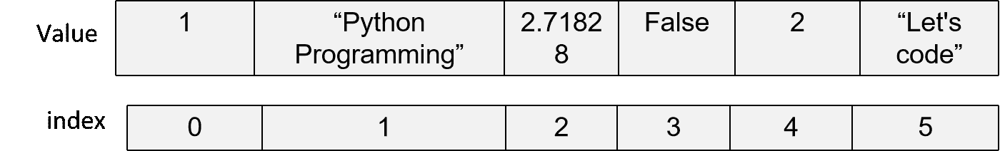
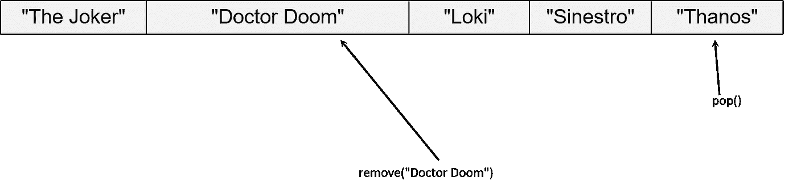
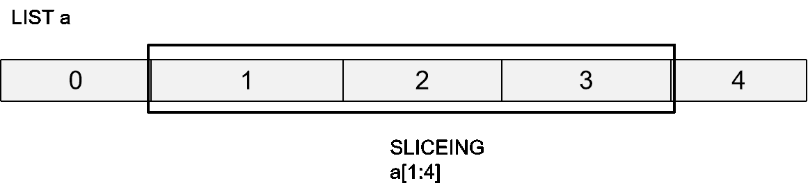
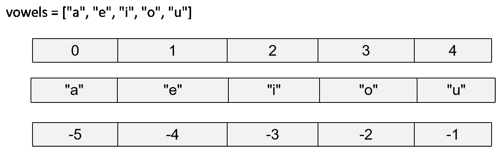

# Python 3 中的数据结构；第一部分

> 原文：<https://medium.com/analytics-vidhya/data-structures-in-python-3-part-1-ec125c3c3dc6?source=collection_archive---------27----------------------->


使用 [Canva](https://www.canva.com/) 创建

数据结构是组织和存储数据的一种方式。数据结构是编程中非常重要的一部分！栈、队列、链表等是一些众所周知的数据结构。然而，Python 编程语言有它自己的原始数据结构。它广泛使用的三种数据结构是:列表、元组和字典。还有其他数据结构，但我们将在后面讨论。

如果你有 Python 编程的基础知识，比如条件语句和循环语句，并且对一般的数据结构有很好的理解，那就更好了。但是如果你不知道，也不用担心，我相信这篇文章对你来说很容易理解！

我们先来学习一下数据结构**列表**。


使用 [Canva](https://www.canva.com/) 创建

Python 中的“List”是一个**线性数据**结构。这意味着数据是线性存储的(更像一个数组)。如果你把这个列表称为 C 编程语言中 Array 的升级版，你没有错。


使用 [Canva](https://www.canva.com/) 创建

如果您还记得数组的定义，“数组是数据的一种**同质**表示”。*同质*这个词在这里很重要。因为它告诉我们一个数组可以存储相同数据类型的数据。例如，整数数组只能存储整数值，而字符串字符只能存储字符值。然而，Python 中的列表是数据的异构表示。这意味着它可以存储不同数据类型的数据。

```
my_list = ["String", 1, 3.14, 'c', True]
```

正如你在上面的例子中注意到的，列表“my_list”有一个字符串(“string”)、一个整数(1)、一个浮点(3.14)、一个字符(“c”)和一个布尔值(True)。

**创建列表**:

```
# First method
my_list = list()# Second Method
some_list = []# Third method
programming_languages = [ "C", "C++", "Python", "Java"]
```

**打印列表元素**:

可以使用*打印*方法或使用 *for-loop* 直接打印列表的元素。如果您使用*打印*方法，列表的所有元素将与表示列表的“[”和“]”一起打印。如果您使用一个 *for 循环*，元素将一个接一个地打印。

```
a_list = [1, "Some string here", True, 3.1416]print("The contents of the list are:\n", a_list)
# Output: 
# The contents of the list are:
# [1, "Some string here", True, 3.1416]for element in a_list:
    print(element)
# Output:
# 1
# "Some string here"
# True
# 3.1416
```

现在让我们试着横向打印列表

```
for element in a_list:
    print(element, end=",")
# 1, "Some string here", True, 3.1416,
```

“end”是 *print* 元素的关键字参数，它指定了在执行 print 方法之后应该是什么处理字符。“end”参数仅适用于 Python 3，不适用于 Python 2。默认情况下，“end”的值为“\n”。这就是为什么在每次执行 print 方法后，如果没有为“end”参数指定其他文字，控件会转到新的一行。

**索引列表**:

```
random_list = [1, "Python Programming", 2.71828, False, 2, "Let's code"]
```



带有索引和值的列表示例

与数组类似，列表的索引也是从“0”开始，向上到“n-1”，其中“n”是列表的长度。

```
print(random_list[0]) # 1
print(random_list[3]) # False
print(random_list[5]) # Let's code
```

**列表长度**:

我们使用 *len* 方法得到一个列表的长度。

```
#Basic syntax:
# len(list_name)for index in range(0, len(random_list)):
     print(" item is {0} it's index is {1}".format(random_list[index], index))# Output:
# item is 1 it's index is 0
# item is Python Programming it's index is 1
# item is 2.71828 it's index is 2
# item is False it's index is 3
# item is 2 it's index is 4
# item is Let's code it's index is 5
```

我们可以使用 *index* 方法得到列表的索引

```
for item in random_list:
     print(" item is {0} it's index is {1}".format(item, random_list.index(item)))# Output:
# item is 1 it's index is 0
# item is Python Programming it's index is 1
# item is 2.71828 it's index is 2
# item is False it's index is 3
# item is 2 it's index is 4
# item is Let's code it's index is 5
```

**将元素插入列表**:

可以通过两种方式将元素添加到列表中:

1.  使用*追加*的方法。
2.  使用*插入*的方法。

```
super_villains = ["The Joker", "Doctor Doom", "Loki", "Sinestro"]super_villains.append("Thanos")
print(super_villains)
# ["The Joker", "Doctor Doom", "Loki", "Sinestro", "Thanos"]super_villains.insert(2, "Dr. Octopus")
print(super_villains)
# ['The Joker', 'Doctor Doom', 'Dr. Octopus', 'Loki', 'Sinestro', 'Thanos']
```

*追加*和*插入*方法的区别在于*追加*方法总是将元素添加到列表的末尾，而插入方法将 s 添加到列表中的指定位置。在上面的例子中，我们将索引指定为“2”。于是在索引“2”的位置加了‘章鱼博士’。

**从列表中删除元素**:

可以通过两种方式从列表中删除元素:

1.  使用*弹出*的方法。
2.  使用*拆卸*的方法。

```
super_villains = ['The Joker', 'Doctor Doom', 'Dr. Octopus', 'Loki', 'Sinestro', 'Thanos']print(super_villains.pop()) 
# 'Thanos'print(super_villains)
# ['The Joker', 'Doctor Doom', 'Dr. Octopus', 'Loki', 'Sinestro']print(super_villains.remove("Doctor Doom"))# ['The Joker', 'Dr. Octopus', 'Loki', 'Sinestro']
```

默认情况下， *pop* 方法从列表末尾删除数据，除非显式指定了索引。而 *remove* 方法则是移除方法内部指定的元素。在我们的示例中，我们已经将“Doctor Doom”作为示例发送给了 *remove* 方法。因此“末日博士”从名单中被删除。



从列表中删除元素

```
super_villains = ['The Joker', 'Doctor Doom', 'Dr. Octopus', 'Loki', 'Sinestro', 'Thanos']print(super_villains.pop(0) 
# 'The Joker'
```

如果索引被指定给 *pop* 方法，那么该索引中的元素被弹出。

**切片单(寿司操作员)**:


使用 [Canva](https://www.canva.com/) 创建

免责声明:用于分割列表的“:”操作符不是正式的“Sushi”操作符。但是我最喜欢的一个来自 Python 社区的博客作者 Dan Bader 在他的书《Python 技巧，这本书——令人敬畏的 Python 特性的自助餐》中这样称呼它。我非常喜欢这个术语，从那时起我就开始使用它了。(还有，我不是在为这本书做广告！)

列表的切片是使用“:”完成的，有些人也称之为“寿司操作符”。列表切片就是收集列表的一个**连续线性部分**。例如，如果列表中有 10 个元素，那么选择前 5 个元素可以称为对列表进行切片。



分割列表插图

列表切片就是从列表中选择“n”个元素。唯一的规则是元素应该是连续的。

在 python 中，列表还有一种叫做**负索引**的东西。负指数与正常指数相反，正常指数从 0 开始上升到 n-1。负索引从-n 开始，一直到-1。



列表的负索引的图示

```
vowels = ["a", "e", "i", "o", "u"]
print(vowels[0]) # a
print(vowels[-5]) # a
```

在对列表进行切片时，这些负索引非常重要。

```
vowels = ["a", "e", "i", "o", "u"]
print(vowels[-5]) # a
print(vowels[0:3]) # ['a', 'e', 'i']
print(vowels[-5:-2]) # ['a', 'e', 'i']
print(vowels[::2]) # ['a', 'i', 'u']
print(vowels[4 : 2])# []
```

当您指定“0:3”时，从第 0 个位置到第 2 个位置的元素将被选中(切片)。使用负索引“-5:-2”也可以达到同样的效果。当你“::2”时，我们得到每一个替代元素。因为第一个“:”选择列表中的所有元素，“:2”意味着“2”的**步数**，意味着选择每第 2 个元素。

“4:2”返回一个空列表，因为第一个数字大于第二个数字。

**注**:

1.  在正索引的情况下，索引中的第一个数字应该总是大于第二个数字。
2.  在指数为负的情况下，指数中的第一个数字应该总是小于第二个数字。
3.  切片中的第三个元素是**步数**，它告诉每第 n 个元素要选择。

**倒单**:

使用*反转*方法可以反转列表。

```
vowels = ["a", "e", "i", "o", "u"]
vowels.reverse()
print(vowels)
# ['u', 'o', 'i', 'e', 'a']
```

请注意，整个列表已经被永久反转**。但是，如果我们只希望列表中的元素以相反的顺序在其他操作中使用列表的内容，而不想永久地反转列表，该怎么办呢？**

**这就是切片进入画面的时候。你还记得切片中使用的**步数**吗？我们有负的指数，那为什么负的步数不算呢？让我们试试步数“-1”**

```
vowels = ["a", "e", "i", "o", "u"]print(vowels[::-1])
# ['u', 'o', 'i', 'e', 'a']print(vowels)
# ['a', 'e', 'i', 'o', 'u']
```

**在上面的例子中，我们可以看到实际的列表本身并没有反转，但是我们以相反的顺序得到了它的元素！**

**— — — — — — — — — — — — — — — — — — -**

****列表测验**:**

**问:以下程序的输出是什么？
a = ['foo '，' bar '，' baz '，' qux '，' quux '，' corge']
print(a[-5:-3])**

**(请在评论部分添加您的答案)**

**— — — — — — — — — — — — — — — — — — -**

**现在让我们来看看 Python 中的下一个重要数据结构，**元组**。**

**元组是一系列不可变的 Python 对象。它类似于列表，但有一个问题。问题是 python 中的元组是不可变的或不可改变的！这意味着，一旦创建了一个元组，就不能更改其中的任何元素。您不能从中添加或删除任何元素。只能对元组进行索引和切片。**

```
t = (1, 2, 3, 4)
t[1] = 10**# ----------------------------------------------------------------**
**# TypeError**                                 Traceback (most recent call last)
**# <ipython-input-2-ea14d3893f53>** in <module>
#       1 t **=** **(1,** **2,** **3,** **4)**
**# ----> 2** t**[1]** **=** **10**

**# TypeError**: 'tuple' object does not support item assignment
```

**在上面的例子中，我们得到了一个 TypeError，因为我们试图修改索引 1 处的元组的内容。**

**以下是创建元组的方法:**

```
# Method 1
tuple1 = (1, 2, 3)# Method 2
t = tuple()# Method 3
my_tuple = ()
```

****注**:**

1.  **该列表是使用“[]”括号创建的。**
2.  **元组是使用“()”括号创建的。**

****连接两个元组**:**

```
tuple1 = (1, "ABC", 543.21, ["a", "b", "c"])
tuple2 = (4, 5, 6)tuple3 = tuple1 + tuple2
```

**您可以连接两个现有的元组，并创建一个包含这两个元组的元素的新元组。但是你**不能将**元素添加到**已有的元组**中。**

**元组的索引和切片与列表的相同。**

****链表和元组之间的内存效率**:**

**内存效率是用来存储一个单位数据的内存量。简单来说，链表和元组在 RAM 中需要多少空间来存储相同数量的数据。**

**假设您在一个列表和一个元组中存储了从 0 到 1000 的数字。现在检查列表和元组的大小，看看哪个占用的空间更少。无论哪种数据结构占用的空间较少，都被认为是内存效率更高的。**

**使用 *__sizeof__()* 方法获得内存中一个链表或元组的大小。 *__sizeof__()* 方法以字节为单位给出内存的大小。**

```
mem_list = [i for i in range(2000)]
mem_tuple = tuple(i for i in range(2000))print("List: ", mem_list.__sizeof__())
# List:  16536print("Tuple: ", mem_tuple.__sizeof__())
# Tuple:  16024
```

**我的系统中，列表的输出是 16，536 字节，元组的输出是 16，024 字节。这些数字在不同的系统中可能会有所不同。但有一点是肯定的，那就是无论如何，链表的**大小总是大于元组的**！**

**为什么？**

**Python 编程语言将一切都视为一个**对象**。因此，列表 mem_list 是类列表的对象，而 mem_tuple 是类元组的对象。**

**现在，当有一个对象的时候，有很多东西比如成员变量和成员函数与之相关联。因为元组是不可变的，所以它没有成员函数，比如 append 和 pop。此外，由于列表是可变的，Python 解释器保留了一定的空间来向列表中添加新元素。这就是元组内存效率更高的原因。我将会写一个单独的博客，提供关于这个特定主题的更多细节。**

**使用像元组这样的不可变对象的另一个主要优点是线程安全。**

**这些都在第 1 部分中。请继续关注第 2 部分！**