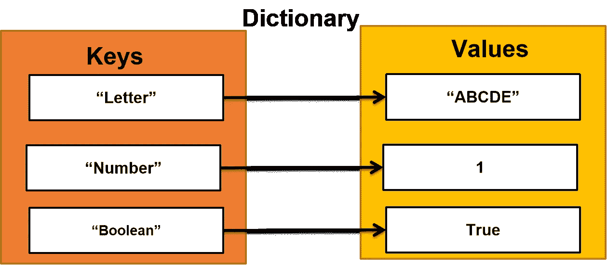
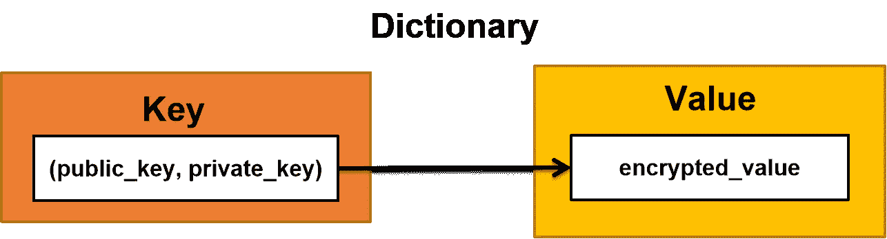
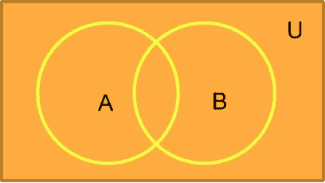
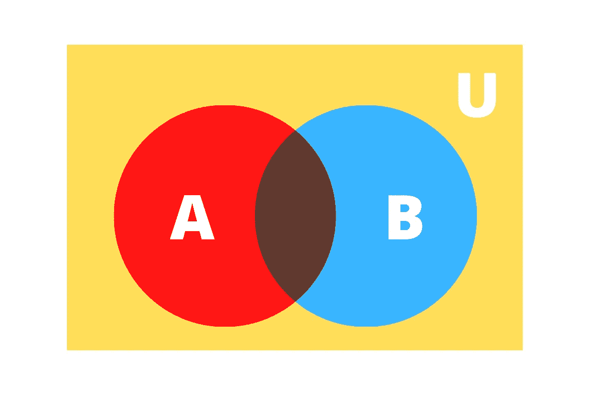

# Python 3 中的数据结构；第二部分

> 原文：<https://medium.com/analytics-vidhya/data-structures-in-python-3-part-2-f019a95a8f45?source=collection_archive---------38----------------------->

# 字典和集合


使用 [Canva](https://www.canva.com/) 创建

大家好！

在我的[上一篇文章](/@gaurav.prabhu7/data-structures-in-python-3-part-1-ec125c3c3dc6)中，我曾经写过关于列表和元组的内容。我希望你们都喜欢它，如果你还没有读过，请去看看吧！

在这篇文章中，我将讨论 Python 3 中的字典和集合数据结构。

# 词典:



Python 中字典的图形表示

与列表和元组不同，*字典*是一个无序的对象集合。字典中的每个元素都存储为“键-值”对。如果你熟悉散列表，那么这就是字典！

字典中的**键**可以是:

1.  性格；角色；字母
2.  线
3.  布尔代数学体系的
4.  元组
5.  整数
6.  浮点数

和**值**可以是任何数据类型。注意我们**不能为键使用列表或集合**。

**说明**:

List 和 set 都是**可变或可改变的**对象。但是字典的关键永远不应该改变！特定键的值可以更改，但是字典中的键一旦创建就不能更改。可以，需要的话可以删除。

如果你想对单个值使用多值键，或者如果你的键应该由多个元素组成，那么你应该**使用一个元组**。



字典中的多值键

**创建字典**:

```
# First Method
my_dict = dict()# Second Method
programming_languages = {1 : "C", 2: "C++", 3: "Python"}# Third Method
cities= dict([(1, "Mangalore"), (2, "Bangalore")])
```

可以使用 **dict** 关键字或者使用一对大括号“{}”或者甚至使用元组列表并将其传递给 **dict** 关键字来创建字典。

```
states = dict([("India", ["Karnataka", "Andhra Pradesh", "Tamil Nadu", "Maharashthra"])])
print(states)# Output:
# {'India': ['Karnataka', 'Andhra Pradesh', 'Tamil Nadu', 'Maharashthra']}
```

在上面的例子中，我传递了一个列表作为元组的第二个元素，这是因为我想要一个列表中的值的字典。

**访问字典的元素**:

```
programming_languages = {1 : "C", 2: "C++", 3: "Python"}# Method 1
programming_languages[1] # C
programming_languages[2] # C++
programming_languages[3] # Python# Method 2
for key in programming_languages.keys():
    print(programming_languages[key])# Output:
# C
# C++
# Python# Method 3
for values in programming_languages.values():
    print(values)# Output:
# C
# C++
# Python# Method 4
programming_languages.get(3) # Python
```

在第一种方法中，我们使用了字典的键来检索它的值。例如，我们知道“1”是“C”的键，因此当我们想要访问值“C”时，我们使用它的键“1”。

注意 **1** 是字典中的键**不是索引**。

```
dictionary = { "one": 1, "two": 2 }
dictionary["one"] # 1
```

如果你试图访问一个不存在的密钥，你会得到一个密钥错误。

```
>>> dictionary = { "one": 1, "two": 2 }
>>> dictionary[1]**------------**
**KeyError**                                  Traceback (most recent call last)
**<ipython-input-13-4f998a957d86>** in <module>
      1 dictionary **=** **{** **"one":** **1,** **"two":** **2** **}**
**----> 2** dictionary**[1]****KeyError**: 1
```

如果我们想访问字典中的所有键或值，或者两者都访问，该怎么办？

然后我们使用以下方法:

1.  keys()-->返回字典中所有键的列表。
2.  values() ->返回字典中所有值的列表。
3.  items() ->返回一个元组列表，其中每个元组都是一个键-值对，如创建字典的方法 3 所示。

```
dictionary = { "list 1": [ 1, 2, 3 ], "list 2": [10, 20, 30] }
for i in dictionary.items():
    print(i)# Output:
# ('list 1', [1, 2, 3])
# ('list 2', [10, 20, 30])dictionary = { "list 1": [ 1, 2, 3 ], "list 2": [10, 20, 30] }
for (key, value) in dictionary.items():
    print("Key is {0}\tValue is {1}".format(key, value))# Output:
# Key is list 1	Value is [1, 2, 3]
# Key is list 2	Value is [10, 20, 30]
```

**嵌套字典**:

嵌套字典只不过是另一个字典中的一个字典。对于另一个字典中的下一个字典，内部字典应该是父字典的特定键的值。

```
movies = { "Hollywood" : {"Marvel" : ["Thor", "Ant Man", "Iron Man"]}, "Bollywood" : ["Uri", "Badla", "Raazi"]}movies["Hollywood"]# Output:
# {'Marvel': ['Thor', 'Ant Man', 'Iron Man']}movies["Hollywood"]["Marvel"]
# Output:
# ['Thor', 'Ant Man', 'Iron Man']
```

在这个例子中，父字典 *movies* 有两个关键字“好莱坞”和“宝莱坞”，*漫威*是父字典的内部字典。

**从字典中删除元素**:

```
movies = { "Hollywood" : {"Marvel" : ["Thor", "Ant Man", "Iron Man"]}, "Bollywood" : ["Uri", "Badla", "Raazi"]}# Method 1
del movies["Bollywood"]       
del movies["Hollywood"]["Marvel"]# Method 2
programming_languages.pop(2) # C++
# Removes item based on index# Method 3
programming_languages.popitem() # (3, 'Python')
# Removes last element# Clears all elements
programming_languages.clear()
```

从字典中删除条目的第一种方法是使用 **del** 关键字。通过使用 *del* 关键字，可以从字典中删除整个键-值对。 *del* 关键字通常用于删除整个对象并显式释放内存位置。要使用 *del* 关键字从字典中删除键值对，基本语法如下:

```
del dictionary_name[key]
```

首先，我们应该访问字典的键，然后将它提供给关键字 *del* 。

**注意**:如果你没有给出括号“[]”内的“key”，那么你会得到一个错误。

```
>>> programming_languages = {1 : "C", 2: "C++", 3: "Python"}
>>> del programming_languages[]**File "<ipython-input-26-dc1af3caedca>", line 2**
 **del programming_languages[]**
 **^**
**SyntaxError:** invalid syntax
```

如果您没有提到“[]”中的键，那么整个字典都会被删除。

```
>>> programming_languages = {1 : "C", 2: "C++", 3: "Python"}
>>> del programming_languages
>>> print(programming_languages)**---------------**
**NameError**                                 Traceback (most recent call last)
**<ipython-input-27-06cfbe8ee886>** in <module>
      1 programming_languages **=** **{1** **:** **"C",** **2:** **"C++",** **3:** **"Python"}**
      2 **del** programming_languages
**----> 3** print**(**programming_languages**)****NameError**: name 'programming_languages' is not defined
```

# 设置:

在数学中，我们已经知道“集合是一个定义明确的对象集合”。Python 中的一组数据结构，类似于数学中的定义，是定义明确的对象的集合。最重要的是，集合是独特或不同对象的集合。这意味着，集合数据结构中的元素不能重复。

**创作集**:

```
# Method 1
my_set = set([1, 't', 3.14, "Python", True])
# {1, 3.14, 't', 'Python'}# Method 2
set1 = {5, 6, 7}# Method 3
new_set = set()
```

Python 中的 set 可以使用一个 **set** 关键字或一对大括号“{}”来创建。不要因为大括号“{}”而将集合与字典混淆。使用一对大括号创建集合和字典。但是*字典*更多的是一个键值对，而集合只是元素的集合。

> 即使他们外表看起来一样，但他们的内在却大不相同。


还要注意，在字典的情况下，我们在 *dict* 方法中发送了一个**元组列表**，但是在集合的情况下，我们只向*集合*方法发送了一个**列表**。

**设定分度**:

我们**不能**指标一套！如果您尝试对集合进行索引，将会出现错误。

```
s = {1, 2, 3}
print(s[0])**--------------**
**TypeError**                                 Traceback (most recent call last)
**<ipython-input-36-57de2ead9154>** in <module>
      1 s **=** **{1,** **2,** **3}**
**----> 2** print**(**s**[0])****TypeError**: 'set' object is not subscriptable
```

为什么？

*set* 数据类型主要是为了获取唯一的元素，而不是为了单独访问单个元素。集合中的元素是不可变的，而集合作为一个整体是可变的。此外，由于集合中的元素没有任何相关的索引，我们**不能在集合中进行项目分配**。

**向集合添加元素**:

可以使用*添加*方法将元素添加到集合中。

```
num_set = {1, 2, 3, 4}
num_set.add(5)
print(num_set)
# {1, 2, 3, 4, 5}
```

向集合中添加修复性元素:

```
num_set = {1, 2, 3, 4, 5}
print("Before adding elements:\t", num_set)
num_set.add(4)
num_set.add(5)
num_set.add(6)
num_set.add(7)
print("After adding elements:\t", num_set)# Output:
# Before adding elements:	 {1, 2, 3, 4, 5}
# After adding elements:	 {1, 2, 3, 4, 5, 6, 7}
```

如果你想一次将多个元素添加到一个集合中，那是不可能的。您不能直接将列表添加到集合中，而是必须**遍历列表并逐个添加元素**。

```
num_set = {1, 2, 3, 4, 5}
elements_to_add = [10, 20, 30, 40, 50]
num_set.add(elements_to_add)**-------------------**
**TypeError**                                 Traceback (most recent call last)
**<ipython-input-15-88645e7828d0>** in <module>
      1 num_set **=** **{1,** **2,** **3,** **4,** **5}**
      2 elements_to_add **=** **[10,** **20,** **30,** **40,** **50]**
**----> 3** num_set**.**add**(**elements_to_add**)****TypeError**: unhashable type: 'list'
```

现在让我们试着一次添加一个元素。

```
num_set = {1, 2, 3, 4, 5}
elements_to_add = [10, 20, 30, 40, 50]
for i in elements_to_add:
    num_set.add(i)
print(num_set)# Output:
# {1, 2, 3, 4, 5, 40, 10, 50, 20, 30}
```

不能向集合中添加列表，但可以向集合中添加包含多个元素的元组。这是因为元组是*不可变的*，集合中的元素也是如此。

```
num_set = {1, 2, 3, 4, 5}
elements_to_add = (10, 20, 30, 40, 50)
num_set.add(elements_to_add)
print(num_set)# Output:
# {1, 2, 3, 4, 5, (10, 20, 30, 40, 50)}
```

请注意，元组(10，20，30，40，50)是按原样添加的，而不是作为单个元素添加的。现在让我们尝试将元组的元素逐个添加到集合中。

```
num_set = {1, 2, 3, 4, 5}
elements_to_add = (10, 20, 30, 40, 50)
for i in elements_to_add:
    num_set.add(i)
num_set.add(elements_to_add)
print(num_set)# Output:
# {1, 2, 3, 4, 5, 40, (10, 20, 30, 40, 50), 10, 50, 20, 30}
```

您可以看到元组中的单个元素被重新添加到集合中，尽管它们存在于元组中。**这是因为集合将元组视为一个单独的元素**。这意味着如果你添加相同的元组两次，它将只被添加一次。

```
num_set = {1, 2, 3, 4, 5}
elements_to_add = (10, 20, 30, 40, 50)
num_set.add(elements_to_add)
num_set.add(elements_to_add)
print(num_set)# Output:
# {1, 2, 3, 4, 5, (10, 20, 30, 40, 50)}
```

**从集合中删除元素**:

可以使用*移除*方法移除列表中的元素。请记住，因为集合没有索引，所以您不能基于索引移除元素，而是基于**元素名称**。

```
my_set = { "Pascal", "C", "C++", "Java", "Python"}
my_set.remove("Pascal")
print(my_set)#  Output:
# {'Python', 'C++', 'Java', 'C'}
```

同样，您不能一次删除 n 个元素，但一次只能删除一个。

另一种移除集合元素的方法是使用 *pop* 方法。 *pop* 方法从集合的开始一个接一个地删除元素。

```
my_set = { 'a', 'b', 'c', 'd'}
my_set.pop()
# 'a'
# my_set: { 'b', 'c', 'd' }my_set.pop()
# 'b'
# # my_set: { 'c', 'd' }
```

我们可以通过循环集合来弹出元素吗？

嗯……不！

```
my_set = { 'a', 'b', 'c', 'd'}
for element in my_set:
    print(my_set.pop())**-----------------**
**RuntimeError**                              Traceback (most recent call last)
**<ipython-input-35-6f5684bf96b2>** in <module>
      1 my_set **=** **{** **'a',** **'b',** **'c',** **'d'}**
**----> 2 for** element **in** my_set**:**
      3     print**(**my_set**.**pop**())****RuntimeError**: Set changed size during iteration
```

为什么？

> 您可能还记得，我们不能使用索引来访问集合中的元素，因为没有与集合中的元素相关联的索引。因此，Python 解释器依赖于集合的大小，使用指向集合对象的指针逐个删除元素。

为了更好地理解我的解释，请参考用 Cython 编写的 Python 的[源代码。](https://github.com/python/cpython/blob/48b069a003ba6c684a9ba78493fbbec5e89f10b8/Objects/setobject.c#L878)

**冻结设置**:


使用 [Canva](https://www.canva.com/) 创建

如前所述，集合中的元素是不可变的，但是整个集合本身是可变的(可以添加或删除元素)。如果你想让整个集合不可变，那么你应该使用一种叫做“冻结集合”的东西。

```
# A frozen set 
frozen_set = frozenset(["e", "f", "g"]) 
frozen_set.add("h")**-----------------**
**AttributeError**                            Traceback (most recent call last)
**<ipython-input-21-b29a691a0e06>** in <module>
      1 frozen_set **=** frozenset**(["e",** **"f",** **"g"])**
**----> 2** frozen_set**.**add**("h")****AttributeError**: 'frozenset' object has no attribute 'add'
```

*冻结的*集合是不可更改的集合。只能用于执行**并集**和**交集**等集合操作。

**集合的联合**:



集合并的图解

正如数学所示，集合 A 对集合 B 的并集是集合 A 和集合 B 的所有事件的独特组合。Python 中集合的并集是使用 *union* 方法完成的。

```
# Basic Syntax:
set1.union(set2)# Example:
even = {0,2,4,6,8}
odd = {1,3,5,7}
numbers = even.union(odd)
print(numbers)# Output:
# {0, 1, 2, 3, 4, 5, 6, 7, 8}
```

**集合的交集**:



使用 [Canva](https://www.canva.com/) 创建

集合的交给出了两个集合共有的元素的集合。Python 中集合的交集是使用*交集*方法完成的。

```
# Basic Syntax:
set1.intersection(set2)# Example:
even = {0,2,4,6,8}
prime = {2,3,5,7,11,13,17,19,23}
intersecting_numbers = even.intersection(prime)
intersecting_numbers
print(intersecting_numbers)
# Output:
# {2}
```

在上面的例子中，只有 2 是两个*偶数*和*素数*的公共元素，这就是为什么这两个集合的交互只给出 2。

**一套的区别**:

两个集合的差异给了我们第一个集合中的元素，而这些元素在第二个集合中是没有的。Python 中一个集合的差可以通过使用*差*方法或者使用“-”运算符来实现。

```
set1 = { 1, 2, 3, 4, 5, 6}
set2 = { 2, 4, 6, 8, 10}
diff1 = set1.difference(set2)
print(diff1)
diff2 = set1 - set2
print(diff2)# Output:
# {1, 3, 5}
# {1, 3, 5}
```

**集合的子集和超集**:

如果集合 *A* 的所有元素都属于集合 *B，则集合 *A* 是集合 *B* 的子集。在这种情况下，集合 *B* 是集合 *A* 的超集。在 Python 中，我们可以使用 *issuperset* 和 *issubset* 布尔方法来确定一个给定的集合是另一个集合的子集还是超集。*

```
setA = { "C", "C++", "Python" }
setB = {"Python"}
print(setB.issubset(setA)) # Trueprint(setA.issuperset(setB)) # True
```

**不相交的集合**:


如果集合 *A* 和 *B* 中没有一个元素相互匹配，则称两个集合 *A* 和 *B* 为*不相交*。在 Python 中，我们可以使用 *isdisjoint* 布尔方法来确定两个集合是否分离。

```
setA = { "C", "C++", "Python" }
setB = {"Java", "Ruby", "C#"}
setA.isdisjoint(setB) # True
```

这些都在第 2 部分中。

请继续关注 Python 中数据结构的第 3 部分！