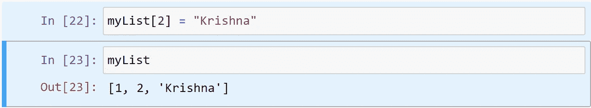

# Python 中的数据结构。

> 原文：<https://medium.com/analytics-vidhya/data-structures-in-python-d33e6d82d740?source=collection_archive---------18----------------------->

我记得我下定决心学习 python 的那一天，那时我学到的第一件事就是数据类型和数据结构。所以在这篇文章中，我想讨论一下 python 中不同的数据结构。

首先，什么是数据结构？简单地说，它是一个可以保存数据的结构，其中数据是指不同类型的数据和相关数据。总的来说，它是组织和存储数据的概念，以便可以轻松地访问和有效地工作。

下面列出了 Python 中可用的不同类型的数据结构。

1.  目录
2.  元组
3.  一组
4.  词典

我们将从 List 开始，看看我们可以用 List 做的不同操作。在 Python 中，列表是一个**可变的数据结构，这意味着在列表创建之后，我们可以对其执行数据操作，比如更新、删除、插入操作。**

我们可以简单地用下面的语法创建一个数字列表。

我们不仅可以在列表中存储字符串和小数。我们也可以修改列表。

所以，我们能够在一个列表中存储数据，现在问题来了，如何访问这些数据元素？。

我们可以通过这些元素的索引号来访问它们。要获取数据的第一个元素，我们需要使用下面的语法。

同样，我们可以根据需要得到第二个、第三个元素。现在我们想看看列表中的最后一个元素。我们可以用两种方法做到这一点。

第一种方法是使用 length 方法来确定列表的长度。

使用长度，我们可以通过从长度中减去 1 来找到最后一个索引号。

看到我们的 myList 中的最后一个元素被提取。现在我们将尝试第二种方法。我们需要在索引号前添加“-”(减号)符号，这样我们就可以从相反的方向读取列表，这样我们就可以通过将索引号设为-1 来访问最后一个元素。

类似地，我们可以通过分别用-2 和-3 改变索引号来相应地提取最后第二个或最后第三个数字。

如果我们需要更新列表，我们开始吧。我们将把第三个元素的值从“ramu”改为“Krishna”。

这很简单，我们可以相应地更改列表。现在我们向列表中添加新值。为了实现这一点，我们将使用**追加**方法。

看，我们在列表中添加了新元素“Vinod”。现在我们将看到如何从列表中删除元素。同样，我们可以通过两种方式来实现。第一种方法是用**去掉**的方法。我们需要给出要移除的元素的值。例如，我们需要删除刚刚添加的“Vinod”元素。

注意:确保您输入的数据值正确。它区分大小写，并关注小写和大写字母。

移除元素的第二种方法是使用 pop 方法。默认情况下，它将删除列表中的最后一个元素。

现在我们将在列表中看到扩展方法

我们可以看到一个名为 myList2 的新列表被添加到 myList 的末尾。所以用这个我们可以添加两个列表。

# 列表切片

我们可以对列表进行切片，并能够提取列表中所需的部分用于我们的操作。当我们为机器学习算法准备数据时，这将派上用场。

下面是使用切片运算符的语法。

**列表名【startindex:endindex:step】**

默认情况下，步长为 1，我们可以根据自己的要求更改它。我们将看到几个使用这个操作符的例子。

注意:上限被排除在外，所以在给结束索引赋值之前请记住。

我们可以以相反的顺序访问列表，使用下面的代码，我们可以在一行代码中反转列表。

如果我们跳过起始索引和结束索引中的值，则起始索引和结束索引中的列表长度的默认值为 0。我们在步骤中给了-1，所以列表从右向左开始读取。

**反转法**

我们可以使用 reverse 方法反转列表。我们将列出一个清单，并尝试使用相反的方法，再次打印清单。现在我们可以看到列表中的元素顺序相反。

# 列表复制

我们可以用两种不同的方式复制列表。从技术上讲，他们是浅拷贝和深拷贝。我们会看到它们之间的区别。

## 浅抄。

在这里，我们将创建另一个列表，但问题是两个列表都指向同一个内存位置。一个列表中的任何更改都会反映在两个列表中。因此，我们没有维护列表的副本，而是拥有一个具有两个不同名称的列表。请看下面的代码。

此后创建 otherList，我们尝试将第 2 个索引元素更改为“Cat”。我们通过打印其他列表看到了这一点，直到这里都是好的。现在我们正在打印实际的列表 myList，甚至在这里我们可以看到“猫”，我们丢失了“苹果”。所以这不是一个拷贝，而是一个链表的两个不同的名字，两个链表都指向同一个内存位置。为了克服这个问题，并且能够存储以前的列表，我们必须使用**深层拷贝。**

## 深度复制。

在这种情况下，我们有一个 list 的副本，它们没有相互链接，它们指向不同的内存位置。因此，一个列表中的任何变化都不会影响其他列表，这样做我们可以确保没有数据丢失。

现在我们试图改变 otherList 中的元素，但它不影响我的 List。这样做我们可以有一个列表的副本。

这样，我们就可以列出数据结构和我们可以使用的方法了。在我的**下一篇文章**中，我们将讨论 python 中的其他数据结构，如元组、集合、字典、字符串。

如果有任何错误/疑问，请分享或评论。我希望你们都喜欢阅读这篇文章。如果有什么地方出错了，请告诉我，我还在学习，建议会改进我的文章。

谢谢你。

注意安全。