# 数据:当今的石油

> 原文：<https://medium.com/analytics-vidhya/data-the-present-day-oil-836b1651b5?source=collection_archive---------32----------------------->

“你可以有没有信息的**数据，但是你不能有没有数据**的信息**。”**

丹尼尔·凯斯·莫兰，

资料来源:Grant Durr 的 Unsplash

W 什么是数据？

为什么它现在如此重要？

为什么它会成为今天的石油？

为什么它现在是世界上大多数公司的必需品？

全世界有数以百万计的数据科学家、研究人员、统计学家和计算机科学家，他们每天都在进行头脑风暴，以找出数据中的内容，以及如何让数据说话，如何使用数据并将其转化为有用的东西，这将价值数百万美元。

亚马逊、谷歌、沃尔玛、阿里巴巴和其他几家公司都是基于从消费者那里收集的数据开展业务的。他们通过分析消费者行为、生活方式或习惯的历史来赚钱。他们发现数据中的模式，不仅让消费者的生活更轻松，也让他们自己的企业更轻松。这些之所以成为可能，是因为他们收集、分析和应用了各种神奇的统计算法。

通过这种方式，许多谜团被解开，更多的谜团有待解开。许多公司花费数百万美元研究历史数据背后的事实，并使其发挥作用，赚取数百万美元。

几年前，没人知道数据会如此重要，会给整个行业和企业带来如此重大的影响。我们通过数据从历史中了解我们的过去，并克服我们祖先犯下的错误。类似地，数据是一种过去，我们从中学习并创造奇迹。

## "我们相信上帝，所有其他人都会带来数据."爱德华·戴明

根据牛津词典，数据是“收集在一起用于参考或分析的事实和统计数据”。

虽然，它非常古老的概念可能是在德国的某个地方，准确地说是在 1749 年，统计被发现，之后发生了几次变化，在早期，它主要用于人口统计，如人口，后来扩展到所有的信息收集，现在包括在各种数据分析和解释中。

统计学是从数据中学习的科学，数据是通过观察收集的特征或信息，通常是数字。从更专业的角度来说，数据是一组关于一个或多个人或物体的定性或定量变量的值。

基于这些数据及其分析，一门新的科学正在诞生，我们称之为数据科学，数百万工程师现在作为数据科学家或统计学家工作。现在，它被《哈佛商业评论》评为 21 世纪最性感的工作。数据科学是一个跨学科领域，专注于从数据集中提取知识，即利用数据理解和分析实际现象，或者我们可以说理解数据。这要归功于约翰·W·图基，他在 1962 年第一次在他的书“**数据分析的未来**”中提到了数据分析。

这些数据是如何产生的，这里有一些支持它的事实，数据被用于每个行业，如社交媒体、电子商务、银行、政府、娱乐等。一些令人敬畏的事实:

> 1.**谷歌**每年处理超过 1.2 万亿次搜索，**每天 35 亿次** **次搜索**，即**每秒执行 4 万次**搜索查询。
> 
> 2.在 YouTube/脸书上，用户每分钟发送 3125 万条信息，观看 277 万个视频。
> 
> 3.在 WhatsApp 上，每天发送超过 550 亿条信息和 45 亿张照片。
> 
> 4.像沃尔玛这样的零售巨头每小时处理超过 100 万的顾客交易
> 
> 5.根据预测，到 2025 年，数字数据量将增加到 **163 吉字节**

让我们探讨更多关于数据的细节，在统计学中，主要有**五种数据**衡量尺度:

名词，序数，间隔，比率和基数。

**名词性**:名词性来源于拉丁语 *nomalis* ，意为“与名称有关”。这是类别的另一个名称。例如*性别:男，女，发色:棕色，黑色，蓝色，绿色等。*

**序数**:指中的*。包括“第一”、“第二”和“第九十九”对于例如*阶级排名:第 1，第 2，第 90…，社会经济地位:穷人，中产阶级，富人，超级富人。**

**区间**:具有相等的区间值，有一定的意义。例如，*温度计可能有十度的间隔，如摄氏或华氏温度。*

**:与区间刻度相同，只是刻度上的零表示:*不存在*。例如*年龄、体重、身高、销售数字、受教育年限。***

**基数，有时被称为“计数数”，是用来计数的，就像我们数 1、2、3 时一样……我们用这些数字来回答像“多少”这样的问题**

**但是，在最高级别，存在两种数据:**

**Q ***量化*** 和 Q ***量化*** 。**

*****量化*** 数据处理的是我们可以测量的数字和事物，如高度、宽度和长度等维度。温度和湿度。价格。面积和体积。定量数据有两种: ***连续*** 和 ***离散*** *。*通常，计数是离散的，测量是连续的。**

> ****连续的**数据，可以被分割并减少到越来越细的层次。例如，我们可以用越来越精确的尺度测量孩子的身高——米、厘米甚至更高——所以身高是连续的数据。**
> 
> ****离散的**数据是一种不能再精确的计数。它涉及到整数。例如，一个家庭中孩子(或成人，或宠物)的数量是离散的数据，因为我们是在计算完整的、不可分割的实体:我们不能有 2.5 个孩子，或 1.3 个宠物。**

*****定性*** 数据处理的是不容易测量，但可以主观观察到的特征和描述符——*比如气味、味道、质地、吸引力、颜色。***

****“拷问数据，它什么都会坦白。”罗纳德·科斯****

**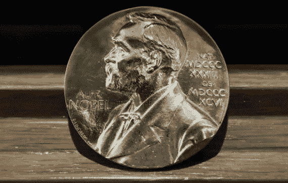**

**资料来源:gettyimages.co.uk**

**让我们探索一个简单的数据集，以更好地理解为什么数据如此重要，以及我们可以从中提取什么。我们将探索我从 Kaggle 获得的诺贝尔奖获得者数据集，数据是历史的，它具有自诺贝尔奖开始以来的数据(*即 1901 年至 2016 年*)。**

**诺贝尔数据集有 979 项记录，即自 1901 年成立以来有 979 位获奖者，最年轻的获奖者是来自巴基斯坦的*马拉拉·优素福·扎伊*17 岁获得和平奖，而*约翰·b·古德诺*以 97 岁的高龄成为诺贝尔化学奖最年长的获奖者。**

**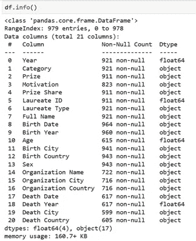**

**获得诺贝尔奖人数最多的 6 个国家中，美国独占鳌头，紧随其后的是英国和德国。**

**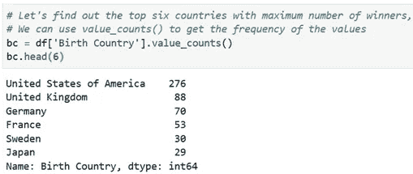**

**如果我们看看城市的细节，纽约贡献最大，其次是巴黎和伦敦:**

**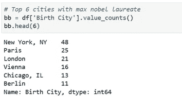****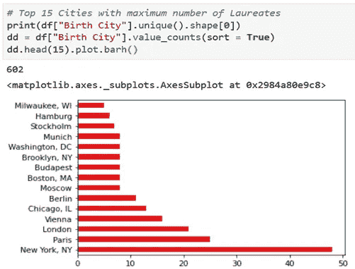**

**结果显示，29%的获奖者来自美国，其次是英国、德国和法国:**

**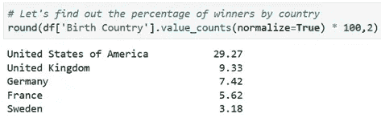****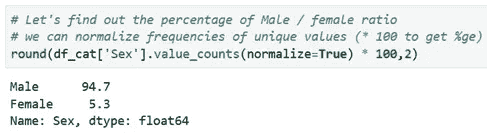****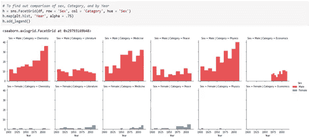**

**按年份比较性别和类别**

**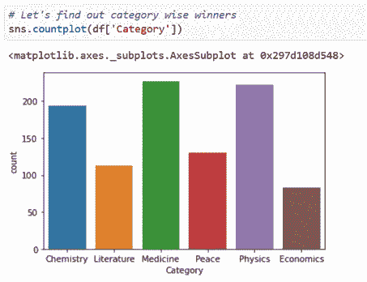**

**类别明智的赢家**

**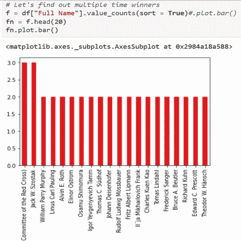**

**多次获奖**

******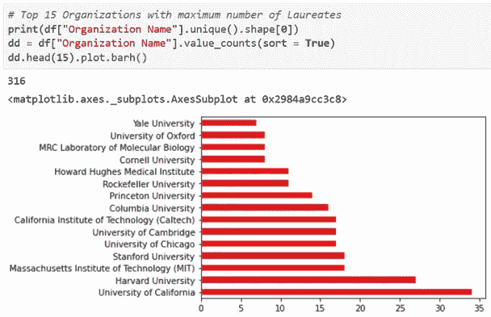**

**获奖人数最多的前 15 家组织**

**加州大学占主导地位，其次是哈佛和麻省理工学院。**

**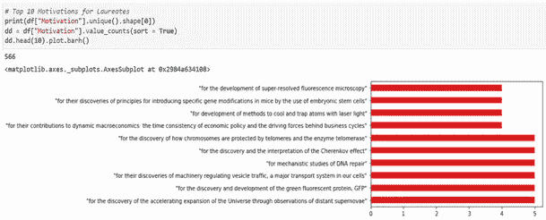**

**获奖者的动机**

**这是非常有趣的事实，因为六个以上的赢家通常都有五大动机。**

**如果我们看看诺贝尔奖获得者的寿命，三位获奖者达到了 103 岁，其中八位超过或达到了 100 岁。**

**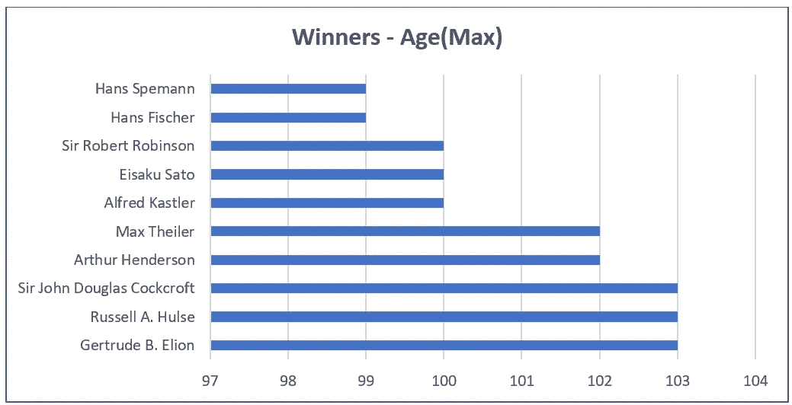**

**最大年龄—获奖者**

**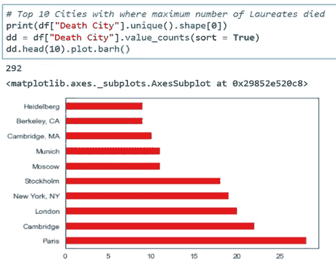**

**最多赢家死亡的城市**

**另一个有趣的事实表明，诺贝尔奖获得者在年老时更喜欢住在巴黎，其次是剑桥和伦敦。**

**这些都是很少的勘探成果，虽然我们可以找到更多，完整的分析报告[就保存在这里](https://www.kaggle.com/tyadav/nobel-laureate-eda/notebook)。【https://www.kaggle.com/tyadav/nobel-laureate-eda/notebook】**)****

*****数据有多种用途:*****

****帮助计算机智能行动****

****解开医学之谜****

****帮助做出更好的决策****

****帮助寻找复杂的商业解决方案****

***为明天的创新提供动力。***

# *****结论:*****

***如今，数据对于组织或政府来说是至关重要的资产，我们可以从数据中发现大量信息，并可以通过多种方式帮助人类。理解数据有着悠久的历史，科学家、统计学家、计算机科学家和其他人已经讨论了多年。我试图概括什么是数据，它的用途是什么，以及我们如何让它说话并从中受益。***

***(**注** : *根据 1901 年至 2016 年 Kaggle 记录的可用数据集，也不能评论数据的准确性，这只是为了探索和可视化数据，仅供学习之用。)****

***感谢您的阅读，请在 tej_on@outlook.com 分享您的反馈。***