# 数字要素的数据规范化

> 原文：<https://medium.com/analytics-vidhya/data-transformation-for-numeric-features-fb16757382c0?source=collection_archive---------1----------------------->

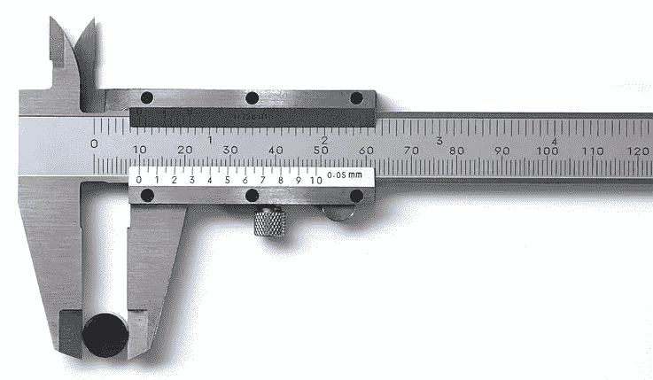

这是机器学习预处理部分的另一篇文章。在这里，我们将讨论如何标准化或缩放数据，以便模型可以很好地执行。在我们继续在训练集上拟合模型之前，我们应该看看数据转换技术。这是细化你的训练数据的另一个非常重要的步骤。

# 为什么要进行数据扩展？

严格来说，如果不对数字要素应用缩放技术，您的模型仍然可以运行。然而，使用这些技术可以使模型给出更好的结果、更好的准确性和更好的预测。

您可能需要对数字数据应用两种转换:

*   **规范化** —将数值数据转换为与其他数值数据相同的比例。
*   **分桶** —将数字(通常是连续的)数据转换成分类数据。

# 👉继续之前要小心

## 浏览和清理您的数据

在对数据执行任何转换之前，浏览并清理数据。在收集和构建数据集时，您可能已经完成了以下一些任务:

*   检查几行数据。
*   检查基本统计数据。
*   修复丢失的数字条目。

## 可视化您的数据

您的数据在基本统计中可能看起来是一种方式，在绘制图表时可能是另一种方式。在你深入分析之前，可以通过散点图或直方图来图形化地查看你的数据。不仅要在管道开始时查看图表，还要在整个转换过程中查看图表。可视化将帮助你不断检查你的假设，并看到任何重大变化的影响。

# 正常化

归一化的目标是将要素变换到相似的比例。这提高了模型的性能和训练稳定性。

## 为什么要正常化？

如果同一要素(例如，城市人口)中有非常不同的值，则有必要进行归一化。没有标准化，如果梯度更新太大，您的训练可能会因 NaNs 而失败。

您可能有两个范围差异很大的不同要素(例如，年龄和收入)，从而导致梯度下降“反弹”并减缓收敛速度。像 [Adagrad](http://www.jmlr.org/papers/volume12/duchi11a/duchi11a.pdf) 和 [Adam](https://arxiv.org/abs/1412.6980) 这样的优化器通过为每个特征创建单独的有效学习率来防止这个问题。但是优化器不能把你从单个特性内的大范围的值中拯救出来；在这些情况下，您必须正常化。

## 标准化技术一瞥

五种常见的标准化技术可能有用:

*   L1- L2 正常化
*   缩放到一个范围(最小-最大)
*   剪报
*   对数标度
*   标准化 **/** Z 值

**L1- L2 关系正常化**

有时候，我们并不关心向量的大小。我们只想知道它们在我们的特征空间中的方向。因此，在这种情况下，我们可以使用 L1 或 L2 归一化，将输入向量单独缩放至单位范数(向量长度)。

对于 L1 归一化，它们的绝对值之和是 1。

对于 L2 归一化，它计算为矢量值平方之和的平方根。

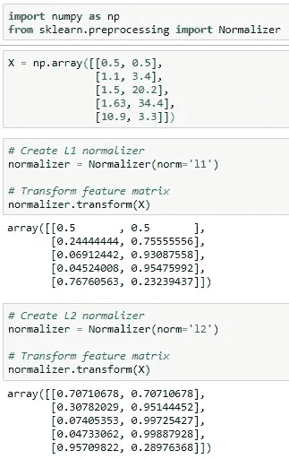

**缩放至一个范围(最小-最大)**

将最小值到最大值映射到特定范围(例如 0 到 1)的数据的线性变换

当同时满足以下两个条件时，缩放到一个范围是一个不错的选择:

*   您知道数据的大致上限和下限，很少或没有异常值。
*   您的数据在该范围内大致均匀分布。

相比之下，你会*而不是*在收入等特征上使用缩放，因为只有少数人有非常高的收入。收入的线性标尺的上限会非常高，大多数人会被挤到标尺的一小部分。

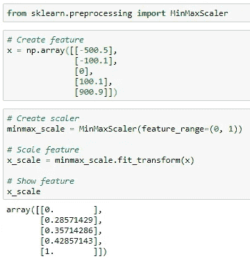

**剪辑**

如果数据集包含极端异常值，可以尝试要素裁剪，将高于(或低于)特定值的所有要素值限制为固定值。例如，您可以将所有高于 40 的温度值裁剪为 40。

公式:*如果 x > max，那么 x' = max 否则如果 x < min，那么 x' = min*

您可以在其他规范化之前或之后应用要素裁剪。

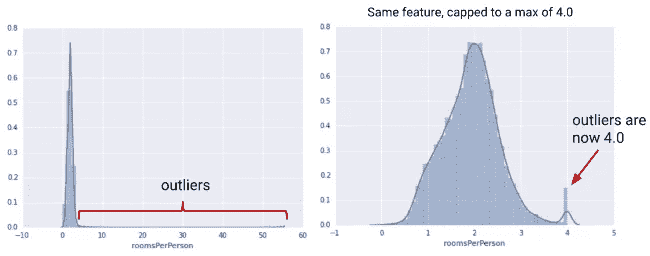

## 对数标度

对数比例计算值的对数，将大范围压缩到小范围。

x′=对数(x)

当少数值有很多点，而大多数其他值只有很少点时，对数比例很有帮助。这种数据分布被称为 ***幂律*** 分布。电影评分就是一个很好的例子。在下面的图表中，大多数电影的收视率很低(尾部的数据)，而少数电影的收视率很高(头部的数据)。对数标度改变了分布，有助于提高线性模型的性能。

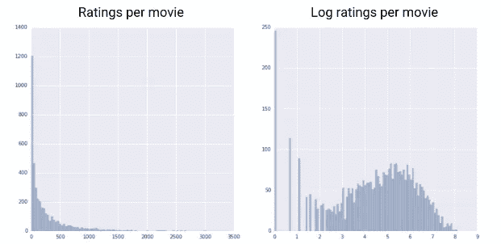

**标准化/Z 值**

它将每个要素转换为均值为 0、标准差为 1 的正态分布。也可称为 **Z 分数**变换。

公式: *x' = (x — μ) / σ，*其中 *μ* 为均值， *σ* 为标准差

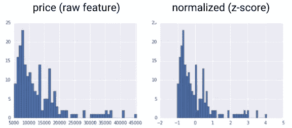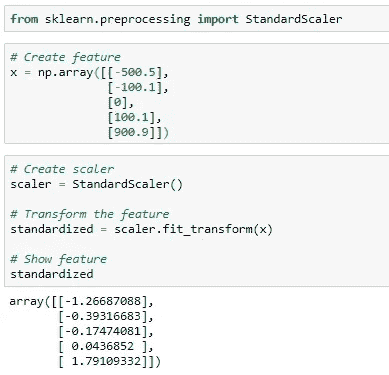

## 👉摘要

*   最小-最大缩放对异常值很敏感。因此，当特征在固定范围内或多或少均匀分布时，就使用它
*   削波是去除一些异常值的首选方法。它可以与其他标准化技术结合使用
*   当存在极值时，首选对数标度。简而言之，当数据分布不均匀时
*   当有一些异常值时，z 分数或标准化是有用的，但不至于极端到需要裁剪

因此，选择取决于数据和您打算选择的算法。

# 木桶理论(宁滨)

如果选择将数字要素分桶，请明确如何设置边界以及应用哪种分桶类型:

*   **具有等间距边界的桶**:边界是固定的，包含相同的范围(例如，0-4 度、5-9 度和 10-14 度，或者 5000-9999 美元、10000-14999 美元和 15000-19999 美元)。一些桶可能包含许多点，而另一些桶可能很少或没有点。

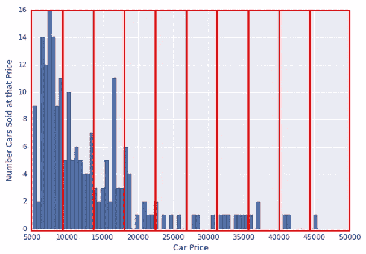

*   **具有分位数边界的桶**:每个桶具有相同的点数。界限不是固定的，可以包含或宽或窄的值。

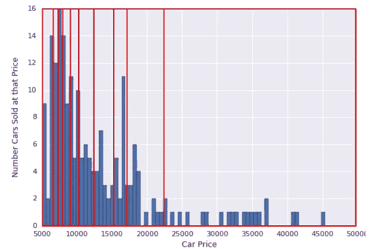

*   **分位数 v/s 相等边界:** `cut`库将根据值本身而不是这些值的*频率*来选择要均匀间隔的仓。每个箱将具有不同数量的记录。

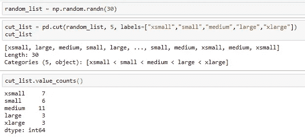

但是，当您使用`**qcut**`请求五分位数时，将选择箱，以便您在每个箱中有相同数量的记录。(您的输出应该是这样的，每个箱中有 6 条记录):

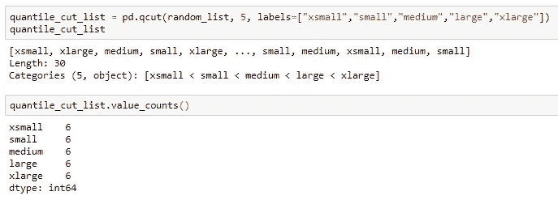

*   **基于阈值的宁滨:**之前，我们看到了根据箱数分割数据的示例。现在，我们将了解如何根据阈值对数据进行分类。以下示例检查三个不同阈值 20、30 和 64 的值，并相应地对数据进行分类。注意，我们指定了 3 个阈值，数据被分成 4 个区间。

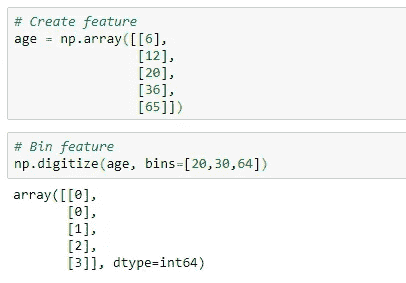

**👉总结**

等间距边界分桶是一种简单的方法，适用于大量数据分布。但是，对于倾斜的数据，请尝试使用分位数存储。

在下一篇文章中，我们将更多地讨论数据争论。原始数据需要经过许多提炼步骤才能用于训练目的。

# 参考资料:

[https://developers . Google . com/machine-learning/data-prep/transform/introduction](https://developers.google.com/machine-learning/data-prep/transform/introduction)