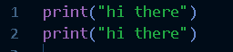
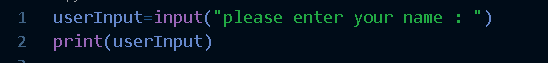
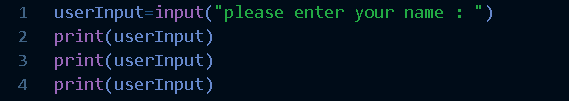
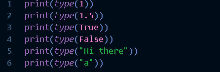
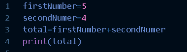
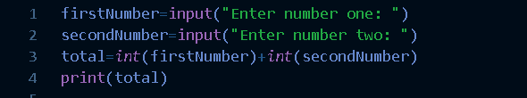

# Python 中的数据类型和变量

> 原文：<https://medium.com/analytics-vidhya/data-types-and-variables-in-python-7ad93d384278?source=collection_archive---------38----------------------->

**你好，**
在本文中我们来谈谈 python 中的数据类型和变量。

所以这将是第二篇关于 python 用于数据科学的文章。在第一篇文章中，我们看到了如何编写你的第一个程序。你可以从这个[链接](https://t.co/6Bk6L0apph?amp=1)看到那篇文章。

好了，在我们谈论变量和数据类型之前，让我们关注一下 python 语言的一个独特之处。

## 刻痕

在 python 语言中，当我们写代码时，我们必须小心缩进。这意味着代码行的开头要有空格。如果你用 python 写完了一条语句，你必须从新开始写下一条语句。一条语句基本上就是一个 python 命令。

**例如，**

```
print("Hello")
```

是一个输出括号内内容的命令。当你想写另一个打印语句时，你必须从新的一行开始。

**运行这些示例并观察缩进。**



前两个语句是一个接一个写的，在行开始前没有空格。然而，第三行在开始前有一个制表符，第四行有一个空格键。
只有前两条语句有效。
**注意:如果你试图在一个文件中运行所有四个代码，它不会运行。因为即使前两行代码工作正常(因为这两行有正确的缩进)，由于另外两行，整个程序将被停止(它们没有正确的缩进)。**
第一次运行，先单独运行两行代码。然后单独运行第三和第四个。
当我们谈到条件和函数等概念时，请不要忘记在编写代码时遵循缩进，因为我不会在这里关注缩进。练习会让你明白在这种语言中缩进是如何更好地工作的。

## 好吧，变量是吧？

这太简单了，变量允许你在运行时存储值(或数据)。这样我们就可以通过在程序中调用变量名来反复使用这些值，而不必在不同的地方反复输入这些值。一旦你给一个变量赋值，你可以在很多地方使用很多时间。

**运行时？调用变量？啊？**

别担心，我会解释的。

所以**运行时**意味着直到你的程序结束运行。当你在命令行中运行你的程序时，你写在那个文件中的所有代码将从上到下运行，如果那个文件没有更多代码要运行，它将停止。所以程序运行的时间叫做运行时间。

**调用一个变量**就是调用。

就像这样，你有名字，对吧？为什么用那个？这样别人就可以叫你那个名字了。所以如果你使用了一个变量，它有一个名字和一个值，如果你在程序中的任何地方使用了这个变量名，就意味着调用了这个变量。我们为什么打电话？我们调用那个变量**来获取已经分配给它的值**,**更新**该值或者**删除**该值。

好的，让我们来看一个例子。

我们知道如何接受用户的意见，对吗？使用**输入**命令？

这就是我们要做的，我们要将用户输入保存到一个变量中。我们在第一个程序中就做到了。如果你是直男，没关系。让我们再看一遍。

如果我们在程序中单独运行**输入**命令，它将只接受输入并完成程序。因为这就是我们在节目中说的(写的)全部内容。

**运行该命令，**

```
input("Please enter your name: ")
```

右边有什么用？我们希望获得这些信息，并利用这些信息做一些事情。input 命令为您提供用户键入的值。你只需要抓住它。

我们如何做到这一点？那么，让我们把它赋给一个变量，这样我们就可以调用这个变量来得到它的值？

**变量有名称和值。首先写名字，然后我们写一个等号给它赋值。也就是说，这个变量后来有了这个赋值。**

```
variableName=value
```

**例如，**
苹果=1
这意味着苹果变量的赋值为 1。给一个变量赋值叫做给这个变量赋值。

**好了，现在让我们运行这个命令，**


我们在这里写的是，我们告诉程序将任何用户类型赋值给变量 **userInput** 。这里的名称是 **userInput** ，值是用户从命令行输入的任何值。

你可以用任何东西作为名字。这里简单和资本的问题。如果你在 word input 中用简单的字母写了“I ”,你就必须用那个精确的格式来调用你要调用的变量。否则它会给你一个错误。

**比如**
a=4 和 A=5 是两个不同的变量。如果你叫 A，你得到 4，如果你叫 A，你得到 5。

注意我写的变量名的风格。叫做骆驼案。遵循编程最佳实践会让你成为一名优秀的程序员。
**其实缩进也是一个不错的做法。在其他语言中，缩进无关紧要。不管你是否遵循它，它都不会给你一个错误。你可以在一行中运行成千上万的代码，但是你能读懂它吗？请搜索更多关于编程最佳实践的信息，并熟悉它们。**

嗯，现在你有了一个变量 **userInput，**的值，现在我们能做什么呢？现在让我们只打印这个值

所以要打印一些东西，我们使用**打印**命令。如果我们在 print 命令的括号内使用了一个变量，它将打印该变量的值。



你看到那里发生了什么吗？它替换了括号内的**用户输入**值。很棒吧？
一遍又一遍地编写包含变量的 **print** 命令，这样你就会知道你可以一遍又一遍地使用变量，而不必在我们需要那个值的时候一遍又一遍地要求用户输入。



好了，现在你可能对变量有所了解了。现在让我们看看数据类型。

## 数据类型

在 python 中，我们有这些数据类型，

**文本类型:** str
**数值类型:** int、float、complex
**序列类型:**列表、元组、范围
**映射类型:** dict
**集合类型:** set
**布尔类型:** bool

基本上，在编程中，数据类型分为两类，

1.  **原始数据类型**——包括字节、短整型、整型、长型、浮点型、双精度型、布尔型和字符型。
2.  **非原始数据类型**——如字符串、数组和类等..

注意:这些类型是不属于 python 语言所必需的。但是知道你什么时候学习编程是非常有用的。

我们将在以后的文章中讨论非原始类型。现在让我们关注基本类型。

数据类型很重要，因为每种数据类型在内存(RAM)中消耗的空间互不相同。此外，我们对不同数据类型的操作也各不相同。

上面我提到过，变量用于在运行时存储值，对吗？它具体存放在哪里？它将数据存储在内存(RAM)中。所以当我再次调用变量的名字时，它实际上是从内存中取值。

**运行这些命令，**



上述命令将给出在 **type** 命令中输入的数据类型。

**原始类型，**

1.  整数(int)-是一个整数，正数或负数，没有小数，长度不限。
2.  Floats(float)-是一个正数或负数，包含一个或多个小数。
3.  字符串(str)-变量包含一组用双引号括起来的字符:
4.  布尔型(bool)-只有这两个值-真，假

**就像缩进对于 python 来说是唯一的一样，我们初始化变量的方式也是唯一的。更简化了。**

**什么意思？**

你还记得我说过，要初始化一个变量，我们用一个名字和一个等号。因此，在其他编程语言中，如 Java 或 C#，如果我们想初始化一个变量，我们也必须提到变量的数据类型。

例如，如果我们想保存一个数字，我们应该使用像 int 这样的数字数据类型，然后是变量名，然后是等号，最后是值。**像这样，**

```
int variableName=5;
```

如果是 float，我们也必须在变量名前使用 float 而不是 int。

但是在 python 中，这种语言会为我们处理数据类型。这意味着它知道我们在一个特定的变量中存储什么样的数据。所以它在内存中自由分配空间，意味着我们不必说它是 int 或者 float。很棒吧？我知道

**所以如果我们像这样初始化一个变量，**


python 知道变量 **firstNumber** 是一个整型变量，它的值为 5。所以我们可以在数学运算中使用这个变量。
**现在开始激动人心了。我们可以对变量进行数学运算。耶！**(注:我们将在后面详细讨论操作)

我们用两个整数做一个简单的加法运算。
**运行这段代码，**



你会在屏幕上打印出 9。

在第一行，我们告诉变量 **firstNumber** 的值为 5。在第二行中，我们告诉变量 **secondNumber** 的值为 4。在第三行中，我们要求程序将变量**第一个数字**和**第二个数字**中的两个值相加，并将其赋给变量**总计**。

然后在第四行，你知道发生了什么，它打印出了总变量中的值，即 9。

你了解**运行时**吗？程序在变量中保存值 4、5 和 9，直到程序结束。这就是我们如何在第三行中使用这些值的。并使用第四行中**总计**变量的值。

在我们讨论运算之前，我会让您玩一些数学运算，比如数字的加、减、乘、除，并进行更多的练习

如果你想让这真的很酷，你可以让用户输入两个数字并对它们进行操作。

**提示:当我们使用 input 命令时，它会返回一个字符串值，即使用户输入了一个数字。所以要从字符串值中得到数值，你必须对它进行造型。(这个我们会在下一篇文章里讲。)**

**运行这个程序，**



**int(firstNumber)** 和 **int(secondNumber)** 将您的输入字符串转换为整数值，以便我们可以对它们进行数学运算(对整数)。

**例如，**
如果你在命令行输入 5，它会被接收为字符串“5”。使用 int 命令，我们将该值转换为一个整数。

在中输入数字时，不要键入字符。
例如- hello5 不会给你 5，反而会打断你的程序。

使用 float 获得一个浮点数。

**好了，我想这篇文章就写到这里吧。感谢阅读。下一篇文章再见。**

**快乐编码！再见。**