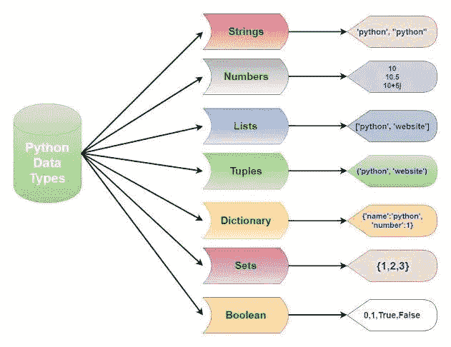

# Python 中的数据类型

> 原文：<https://medium.com/analytics-vidhya/data-types-in-python-506009234f89?source=collection_archive---------4----------------------->

# 确定变量类型

您可以使用 Python 内置的`type()`函数来检查什么类型的对象被分配给了一个变量。常见的数据类型包括:

*   **int** (整数)
*   **浮动**
*   **字符串**(字符串)
*   **列表**
*   **元组**
*   **字典**(用于字典)
*   **设定**
*   **布尔型**(用于布尔型真/假)

_ 被用作是因为我们不能在名称中使用空格，请改用 _ 来代替

# **Python** 是一种**案例** - **敏感语言**。

## 这意味着变量和变量是不一样的。始终命名有意义的标识符。

## 而 c = 10 是有效的。



Python 数据类型

1.  List[] :-元素集合可以更改(可变)。
2.  Tuple():-不能更改元素的集合(不可变)。
3.  集合{} :-唯一元素的集合。集合不允许重复

默认情况下，Python 在这些类别中内置了以下数据类型:

文本类型:`str`

数字类型:`int`、`float`、`complex`

序列类型:`list`、`tuple`、`range`

映射类型:`dict`

设置类型:`set`，`frozenset`

布尔类型:`bool`

二进制类型:`bytes`、`bytearray`、`memoryview`

这里有一个简单的代码，可以让你更好地理解

```
In[1]:
my_income = 100
tax_rate 0.1
my_taxes = my_income * tax rateIn[2]:
my_taxesOut: 10.0# This shows how variables make calculations more readable and easier to follow.
```

下面的代码示例将打印 x 的数据类型，那会是什么数据类型呢？

```
x = 5
print(type(x))Out : int
```

人们不应该在我的和收入之间使用空格，这肯定会显示语法

```
In[1] :7Out[1]:7In[2] :type(7)Out[2]:int
```

输出“int”(整数类型)

```
In[1] :77.7Out[1]:77.77In[2] :type(77.7)Out[2]:float
```

输出“浮动”

对于上面给出的代码，我们可以分别指定一个值，称为 a 和 b

```
In[1] : a = 7
        b = 77.77In[2] : type(a)Out[1]: intIn[3] : type(b)Out[3]: float
```

# 分配变量

变量赋值跟在`name = object`后面，其中一个等号`=`是一个*赋值操作符*

```
In[1] :a = 5
       b = 10.0
       c = 'A'In[2] :aOut[2] :5##  Here we assigned the integer object 5 to the variable name a.
Let's assign a to something else:In[3] : a = 10
In{4} : a
Out[4]: 10
#  You can now use a in place of the number 10:In[5] :a + a
Out[5]:20
```

# 重新分配变量

Python 允许您通过引用同一个对象来重新分配变量。

```
In[6] : a = a + 10
In[7}: aOut[7]:20
```

这其实有一个捷径。Python 允许你使用`+=`、`-=`、`*=`和`/=`进行加减乘除。

```
In[8] : a += 10
In[9] : aOut[9]: 30In[10] : a *= 2
In[11] : aOut[11]: 60
```

# 设置特定的数据类型

如果要指定数据类型，可以使用以下构造函数:

请尝试这些简单的代码行

1.)`x = “Hello World”`

潜艇用热中子反应堆（submarine thermal reactor 的缩写）

2.)`x = 20`

（同 Internationalorganizations）国际组织

3.)`x = 20.5`

漂浮物

4.)`x = 1j`

复杂的

5.)`x = [“grapes”, “mango”, “orange”]`

目录

6.)`x = (“grapes”, “mango”, “orange”)`

元组

7.)`x = range(7)`

范围

8.)`x = {“name” : “John”, “age” : 36}`

词典

9.)`x = {“apple”, “banana”, “cherry”}`

设置

10.)`x = frozenset({“apple”, “banana”, “cherry”})`

frozenset

11.)`x = True`

弯曲件

12.)`x = b”Hello”`

字节

13.)`x = bytearray(5)`

bytearray

14.)`x = memoryview(bytes(5))`

内存视图