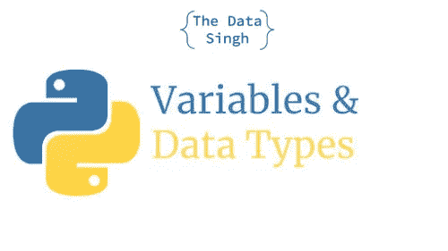

# Python 中的数据类型

> 原文：<https://medium.com/analytics-vidhya/data-types-in-python-c23b8178f96d?source=collection_archive---------17----------------------->

# Python 中的变量

变量是一个命名的存储位置，当您执行代码时，可以在这里保存一些值。它会占用你的内存空间，它的值会持续到你的代码执行的时候。

**例如**

> *#无变量
> #加两个数
> 打印(10+20)
> #有变量
> a=20
> b=20*
> 
> *打印(a+b)*

将值保存到变量的好处是，值和计算(在我们的例子中是加法)可以在代码的其他部分重用。

# 评论

注释是代码中的一行，你不想运行它，但是写它们只是为了在代码中作为参考，比如解释你的代码在做什么。

**例如**

> *#这行做加法*
> 
> *c=a+b*

在 python 中，可以在行首使用' **#** '符号进行注释。它会通知解释器不要执行那一行。

# Python 中的数据类型

python 中的数据类型是指我们可以在 python 中使用的不同格式的数据。我们并不总是处理相同类型的数据。例如，为了存储学生的详细信息，我需要不同的值，如

> *名称:“塔伦”*
> 
> *年龄:18 岁*
> 
> 百分比:89.5%
> 
> *科目:['数学'，'英语'，'印地语'，'科学'，' SST']*

在上面的例子中，我们可以清楚地看到，我们想要处理的数据有不同的格式，比如姓名是字符串类型，年龄是整型，百分比是浮点类型，主题是列表类型。

以下是 python 支持的不同数据类型:

*   整数
*   浮动
*   线
*   目录
*   词典
*   布尔代数学体系的
*   一组
*   元组

# int(整数)

int 数据类型用于保存整数。它不支持带小数位的数字。有两种方法可以创建 int 变量

**语法:**

<variable-name>=int( <value>)</value></variable-name>

<variable-name>=<value>#值是一个整数</value></variable-name>

# 浮点(十进制数)

浮点数据类型用于保存十进制数值，如 10.2、52.223。有两种方法可以创建浮点变量

**语法:**

<variable-name>=float( <value>)</value></variable-name>

<variable-name>=<value>#值是一个十进制数</value></variable-name>

# str(字符串)

字符串数据类型用于保存类型字符串的值，如姓名、地址等。在 python 中，任何用单引号(')括起来的(")都被认为是一个字符串。

**语法:**

<variable name="">=str(" <value>")</value></variable>

<variable name="">= str(<value>')</value></variable>

<variable name="">=<value></value></variable>

<variable name="">=<value></value></variable>

在 python 中，字符串在内部被视为一个列表(接下来将介绍列表数据类型)。字符串中的各种函数是预定义的，可以在 python 代码中使用。一些功能如下:

**大写()**

将字符串的第一个字母大写

**Count (str，beg= 0，end=len (string))**

如果给定了起始索引 beg 和结束索引 end，则统计 str 在字符串或字符串的子字符串中出现的次数。

**endswith(后缀，beg=0，end=len (string))**

确定字符串或字符串的子字符串(如果给定了起始索引 beg 和结束索引 end)是否以后缀结尾；如果是，则返回 true，否则返回 false。

**find (str，beg=0 end=len (string))**

如果给定起始索引 beg 和结束索引 end，则确定字符串是出现在字符串中还是字符串子字符串中，如果找到，则返回 index，否则返回-1

**index (str，beg=0，end=len (string))**

与 find()相同，但是如果没有找到 str，就会引发异常

**isalnum ()**

如果字符串至少有 1 个字符，并且所有字符都是字母数字，则返回 true，否则返回 false

**艾阿尔法()**

如果字符串至少有 1 个字符并且所有字符都是字母，则返回 true，否则返回 false

**isdigit()**

如果字符串只包含数字，则返回 true，否则返回 false

**islower()**

如果字符串至少有一个大小写字符，并且所有大小写字符都是小写，则返回 true，否则返回 false

**isnumeric()**

如果 Unicode 字符串只包含数字字符，则返回 true，否则返回 false

**isspace()**

如果字符串只包含空白字符，则返回 true，否则返回 false。

**ist title()**

如果字符串的标题大小写正确，则返回 true，否则返回 false

伊苏珀()

如果字符串至少有一个大小写字符，并且所有大小写字符都是大写，则返回 true，否则返回 false

**加入(序列)**

将序列 seq 中元素的字符串表示形式合并(串联)为一个字符串，并带有分隔符字符串

**len(字符串)**

返回字符串的长度

**降低()**

将字符串中的所有大写字母转换为小写字母

**lstrip()**

删除字符串中所有前导空格

**替换(旧，新[，最大])**

用新字符串替换字符串中所有出现的旧字符串，如果给定了最大值，则最多替换最大值

**split(str= " "，num=string.count(str))**

根据分隔符 str(如果未提供空格，则为空格)拆分字符串，并返回子字符串列表；如果给定，最多拆分成 num 个子字符串

**startswith(str，beg=0，end=len(string))**

确定字符串或字符串的子字符串(如果给定了起始索引 beg 和结束索引 end)是否以子字符串 str 开头；如果是，则返回 true，否则返回 false

**剥离([字符])**

对字符串执行 lstrip()和 rstrip()

**标题()**

返回字符串的“大写”版本，即所有单词都以大写字母开头，其余的都是小写字母

**上位()**

将字符串中的小写字母转换为大写字母

在下一篇博客中，我们将了解列表、集合、字典和元组数据类型。

感谢您与我一起学习，订阅了解更多信息并获取新博客和视频的通知:

博客链接: [TechScouter](https://techscouter.blogspot.com/)

频道链接:[数据辛格](https://www.youtube.com/channel/UCmi_UhOOIpp4gZJ3zrOGq7A)