# 数据理解 101-使用 Python 进行探索性数据分析

> 原文：<https://medium.com/analytics-vidhya/data-understanding-101-exploratory-data-analysis-using-python-2ad259d74a05?source=collection_archive---------1----------------------->

马库斯·斯皮斯克在 [Unsplash](https://unsplash.com?utm_source=medium&utm_medium=referral) 上的照片

从外表上看，似乎与数据相关的东西总是由复杂的工具、高级统计学和令人生畏的机器学习技术组成。嗯，那是*种* *的真*在某种程度上。然而，我们不能忘记的是，对于任何数据实验，对数据本身的理解，探索性数据分析(EDA)都是最简单、最重要的组成部分。

搜索…(照片由 [Edi Libedinsky](https://unsplash.com/@supernov?utm_source=medium&utm_medium=referral) 在 [Unsplash](https://unsplash.com?utm_source=medium&utm_medium=referral) 上拍摄)

简而言之，EDA 就是“先看一下数据”。它是指对数据进行初步调查的关键过程，以便在汇总统计和图形表示的帮助下发现模式、发现异常、检验假设和检查假设。

首先理解数据，并尝试从中收集尽可能多的见解，这是一个很好的做法。通过 EDA 的过程，我们可以要求在数据集上定义问题陈述或定义。毕竟，这一切都是为了理解手头的数据，甚至是在被数据弄脏之前。

# 嗯。好吧，那…？

坦率地说，在数据探索中没有唯一的终极方法。这完全取决于我们正在处理什么样的数据集。

一般来说，通过查看整个电子表格来探索数据，然后确定数据的重要特征可能是非常单调乏味的任务。因此，为了使它更容易，这次我们将尝试通过 Python 提供的某些库来完成。

吃豆人的死敌鬼魂。(照片由 [Kirill Sharkovski](https://unsplash.com/@sharkovski?utm_source=medium&utm_medium=referral) 在 [Unsplash](https://unsplash.com?utm_source=medium&utm_medium=referral) 上拍摄)

由于电子游戏一直是我生活中不可或缺的一部分，我们将使用[电子游戏销售](https://query.data.world/s/aqgklxdqxxnmm5kb3mn67d4blp2bmi)记录，该记录可从 [*data.world*](https://data.world/) 数据库中获得。

你不喜欢电子游戏？那里有大量的免费数据。关于*的参考资料，我推荐你阅读[这篇由](https://towardsdatascience.com/top-10-great-sites-with-free-data-sets-581ac8f6334) [Oleksii Kharkovyna](https://medium.com/u/a0e39375a333?source=post_page-----2ad259d74a05--------------------------------) 撰写的[文章，文章由《走向数据科学》出版。](https://towardsdatascience.com/top-10-great-sites-with-free-data-sets-581ac8f6334)*

# **现在，什么？**

## 1.导入所需的库

让我们从加载所需的模块开始我们的实验。我将使用 *numpy，pandas，seaborn* 和 *matplotlib* 。这些是最受欢迎的模块，但是您也可以随意使用其他您觉得合适的模块。

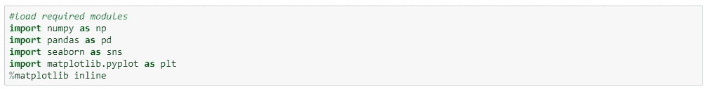

正在加载所需的模块。请确保您已经预先安装了它们！

## 2.加载数据并找出基本信息

现在，我们必须下载数据集并存储它，以便我们可以开始使用它。

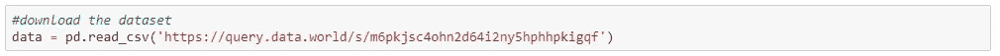

在我们进一步讨论之前，最好先看一下各个列以及数据中存在什么样的属性，这样我们就可以大致了解如何开始我们的 EDA。

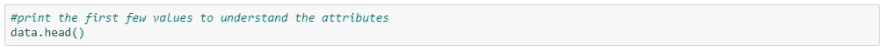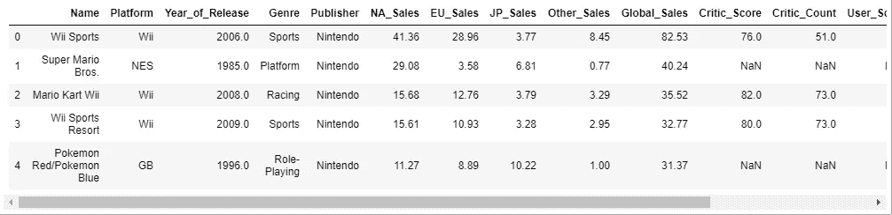

*data.head()输入和*输出，显示所有列和 5 行数据

了解列及其对应的数据类型，以及发现它们是否包含空值，也是一个很好的做法。

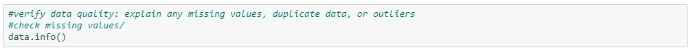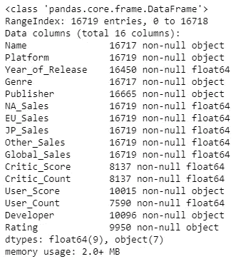

data.info()输入和输出，显示列的列表、非空值的数量及其类型。

从`info()`函数中，我们可以看到我们的数据由 *float64* 和 *object* type 组成。除此之外，我们的大多数数据都是不完整的，从每列 7.590 个条目到 16.719 个条目不等。

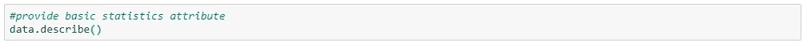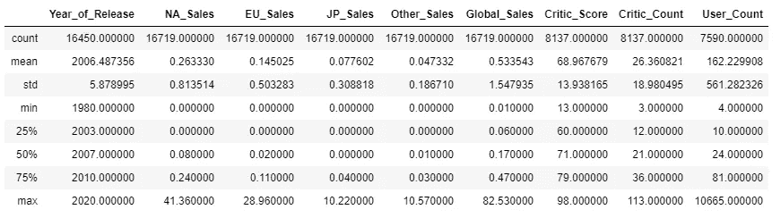

data.describe()输入和输出，显示定量数据的基本统计信息

*熊猫*中的`describe()` 函数在获取各种汇总统计数据时非常得心应手。该函数返回数据的计数、平均值、标准差、最小值和最大值以及分位数。

从这些我们可以看到*销售*和*用户计数*列与*平均值>中位数*严重偏斜，最大值与其分位数和平均值相比太高了。

通过查看`head()`、`info()`和`describe()`函数的结果，我们可以推断出*销售*列代表每个视频游戏标题的百万单位的销售。为了更好地理解，最好将每个 sales 列乘以 1.000.000，然后将其转换为整数，这样从长远来看更灵活。

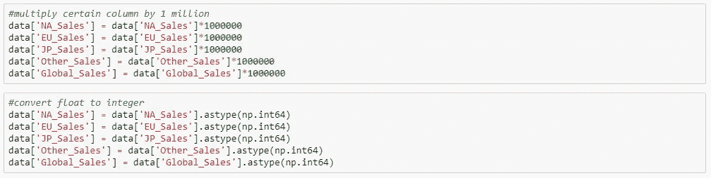

将销售列乘以一百万，并将其转换为整数类型的数据

## 3.删除不相关的列和条目

有时会有许多我们从未使用过的列，在这种情况下，删除是唯一的解决方案。但是，我们不会删除任何列，因为每个列都非常有趣，值得探索。

在任何情况下，如果你想删除一些列:

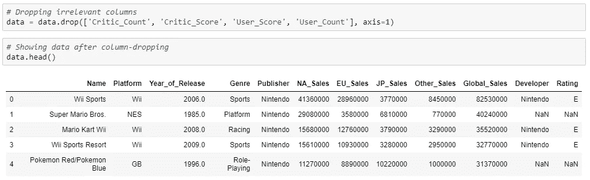

删除 4 列，导致从数据集中删除列出的那些列

除了删除不相关的列，我们还可以清除重复的数据，这可能会干扰我们分析的输出。

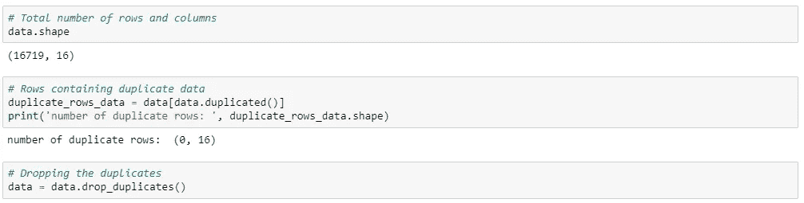

删除重复记录

`data.shape`输出，`(16719, 16)`表示我们的数据有 16.719 行 16 列，`(0, 16)`表示我们的数据集中所有 16 列都没有重复条目。

## 4.删除/更改缺失值

根据我们面对的数据，我们可能想要删除/改变一些缺失的值。从下面的图片中，`print(data.isnull().sum())`函数将返回每一列中 null 条目的数量。

从这些信息中，我们可以用它的平均值、中间值或我们想要的任何值来替换那些空数据。在这种情况下，我们将用每列的平均值替换它。

只是**被警告**这可能不是这种情况下的最佳方法，尤其是如果我们想要将数据输入到机器学习模型中。

在将其用作机器学习模型的情况下，我们必须首先将数据分离为*训练*和*测试*，然后在*训练*上用 mean 替换 NULL，然后将后处理模型应用于*测试*。

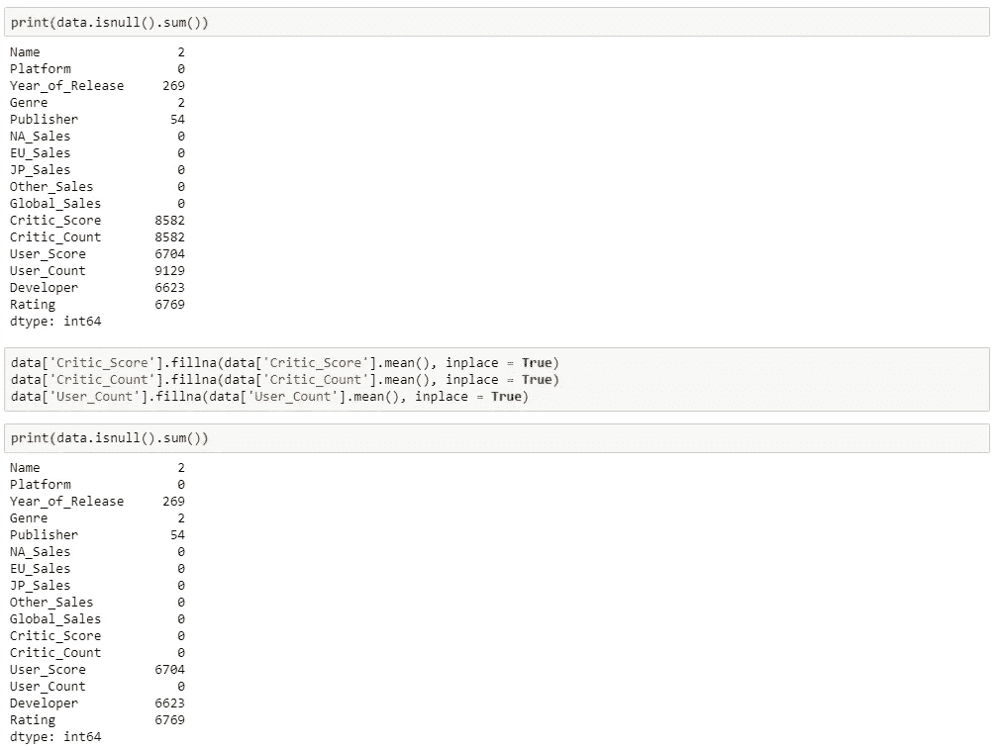

找出空条目的数量并用每列的平均值替换它

除了改变/删除空值，从我们的数据集中检测和删除异常值也是一个好主意。根据定义，离群值是远离其他观察值的观察点。关于检测和去除异常值的更多信息，我推荐由 Natasha Sharma 发表的这篇文章。

## 5.数据可视化—单变量

以表格和数字的形式呈现数据是很好的，但是很难掌握趋势和模式。以图形、图表或其他视觉形式传达这些信息会容易得多。

Python 有一个可视化库——[*Seaborn*](https://seaborn.pydata.org/)，它构建在 *matplotlib* 之上。它提供了一个有吸引力的统计图，以便执行单变量和多变量分析。我们将使用这两个库，以便从我们的数据中获得更深入的见解。

让我们从绘制所有数字列的直方图开始。

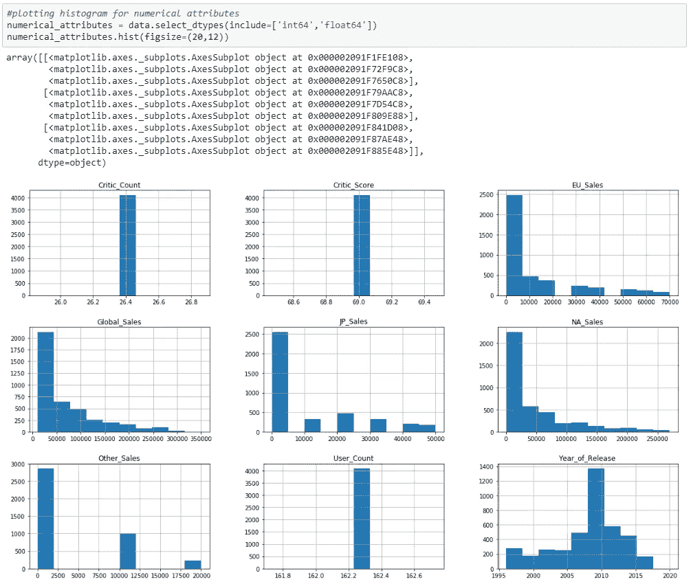

绘制所有数字列的直方图

数字列的可视化让我们对值的分布有了一些有趣的了解。

1.  每款游戏的销售分布严重倾斜，大多数游戏仅售出 0 到 50，000 份。
2.  大部分视频游戏都是 2005 年到 2015 年发布的。
3.  由于用各自的平均值替换空值，列 *Critic_Score* 、 *Critic_Count* 和 *User_Count* 的分布被打乱了。

现在，对于分类列，如果我们能够查看它们的频率分布会更好。我们将用 *Seaborn 的* `countplot()`来实现这一点。

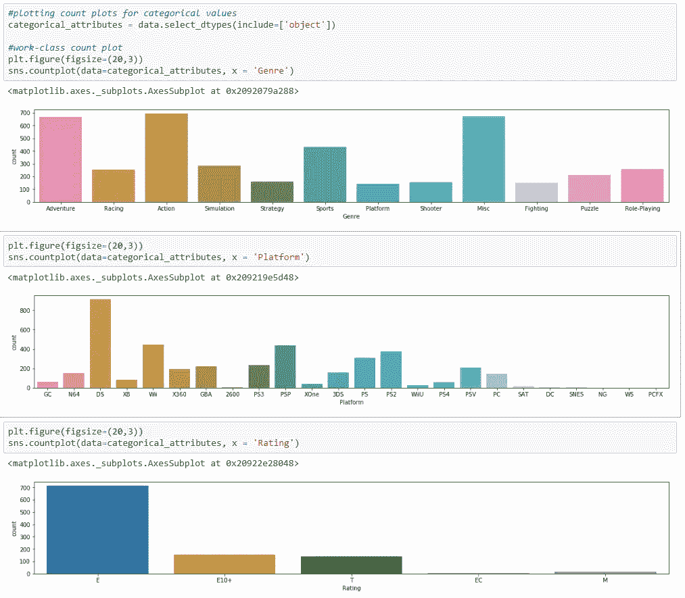

对象类型列的频率分布

从上面的结果，我们可以解释:

1.  大多数游戏的类型是冒险、动作和体育。其他类型的游戏平均分布在竞赛、模拟、角色扮演和其他游戏中。
2.  数据集中的大多数视频游戏都可以在任天堂 DS 上玩。Nintento Wii、PSP 和 PS2 正在跟进下一个地方。
3.  大部分电子游戏都被评为 E 级。意味着每个人都可以玩。这对视频游戏开发商来说非常有利可图，因为它将拥有更大的观众群。

## 6.数据可视化—多变量

现在我们已经对每个列进行了各种分析和质量检查，让我们来看看各个列之间的关系。

为了探索各种属性之间的关系，我们可以使用散点图和热图来观察不同的属性如何相互影响。热图是一种可以用来找出因变量的图，散点图可以用来找出两个变量之间的相关性。

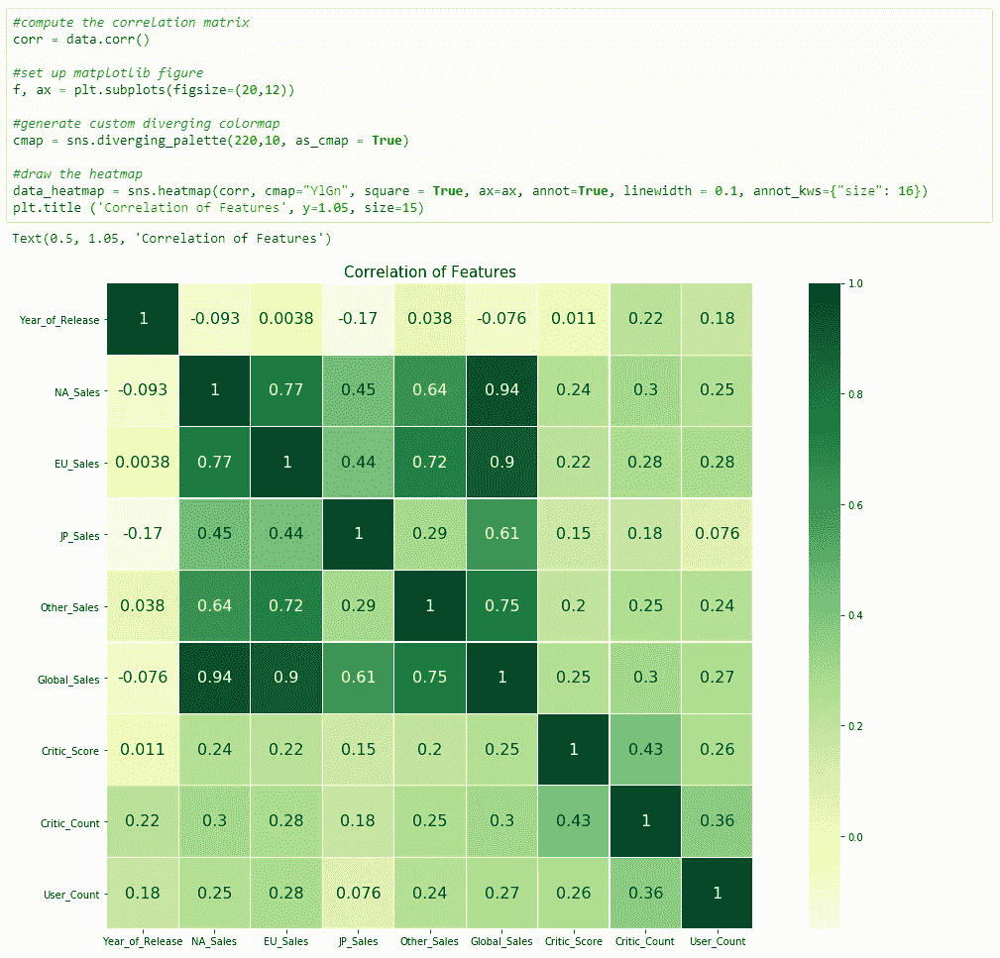

所有数字型列的热图

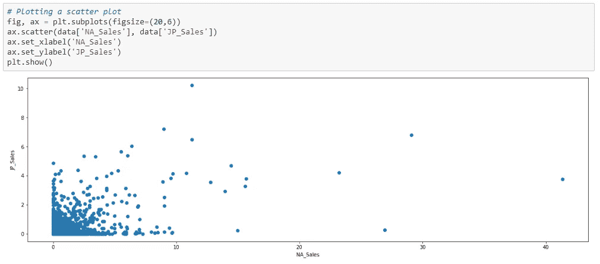

北美与日本地区的销售散点图，显示没有很强的相关性

从上面的结果来看:

1.  我们可以推断，游戏销售、评论家评分和发行年份之间没有很强的相关性。这意味着一个糟糕的评论家分数并不真的意味着一个人的销售会直线下降。总有低分高卖的可能。
2.  我们可以推断出销售额彼此之间有很强的相关性。这意味着，当一款视频游戏在一个地区取得了良好的开端，它很有可能也会在其他地区取得成功，但日本市场除外。

我们总能从获得的信息中挖掘得更深。我们可能能够回答的一些问题是:

*   有没有一个分数范围肯定会给我们的销售带来很大的提升？
*   为什么 JP 市场是个例外？有什么在日本市场很受欢迎并且也能渗透到其他市场的特殊属性吗？

对于分类属性，我们可以使用交叉列表法。

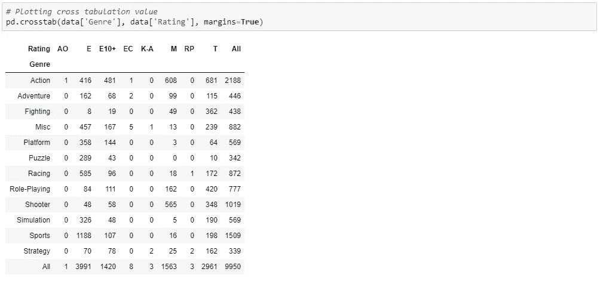

视频游戏分级和类型的交叉标签

从上面的结果来看，我们可以说 M 级游戏主要由射击游戏和动作游戏组成，其余的游戏类型平均分布在不同的等级中。

探索属性之间的关系也很重要。这将告诉我们模型中特定属性的重要性。让我们来看看*流派*和*全球销售之间的关系。*

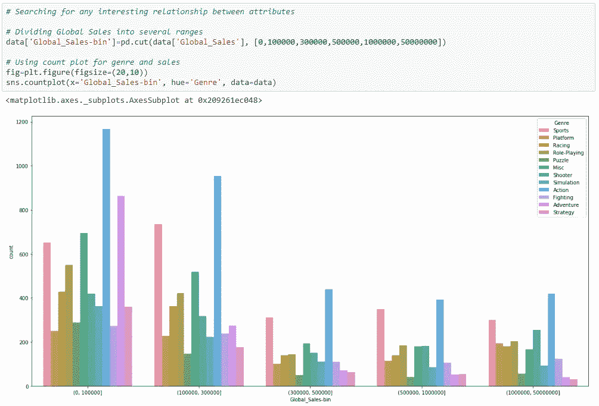

全球销售和流派之间的计数图

从上面的情节，我们可以推断:

1.  体育和动作类型有更大的可能性实现更大的销售(但这可能会有偏差，因为这两种类型在数据集中的人口更多)。
2.  令人惊讶的是，益智类游戏在最负盛名的范围内获得了第三名，100 万到 5000 万的销售额。游戏开发者可能想要更多地探索它，可能会同时融合两种或更多种顶级类型来实现更好的销售。

上面的一般分步解释只是我们在 EDA 中可以做的一小部分，但这可能足以让我们所有人了解如何在给定任何数据集的情况下执行 EDA。

毕竟，小事情如何能给你一个好的开始总是很有趣的，因为它们背后有更多的意义和教训。

现在，让我们弄脏所有那些数据！

让我们变脏吧！(照片由[阿毛里·萨拉斯](https://unsplash.com/@eseamau?utm_source=medium&utm_medium=referral)在 [Unsplash](https://unsplash.com?utm_source=medium&utm_medium=referral) 上拍摄)

来源:

[1] Prabhu，Tanu n .[*Python 中的探索性数据分析*](https://towardsdatascience.com/exploratory-data-analysis-in-python-c9a77dfa39ce) 。2019.访问时间:2020 年 1 月 30 日。

[2]马尼，考希克。 [*探索性数据分析简介*](/datadriveninvestor/introduction-to-exploratory-data-analysis-682eb64063ff) 。2019.访问时间:2020 年 1 月 30 日。

[3]帕蒂尔，普拉萨德。 [*什么是探索性数据分析？*](https://towardsdatascience.com/exploratory-data-analysis-8fc1cb20fd15) 。2018.访问时间:2020 年 1 月 30 日。

[4]娜塔莎·夏尔马。 [*检测和清除异常值的方法*](https://towardsdatascience.com/ways-to-detect-and-remove-the-outliers-404d16608dba) 。2018.访问时间:2020 年 1 月 30 日。

[5]哈尔科夫娜，奥莱克西。 [*拥有免费数据集的 10 大网站*](https://towardsdatascience.com/top-10-great-sites-with-free-data-sets-581ac8f6334) 。2019.访问时间:2020 年 1 月 30 日。