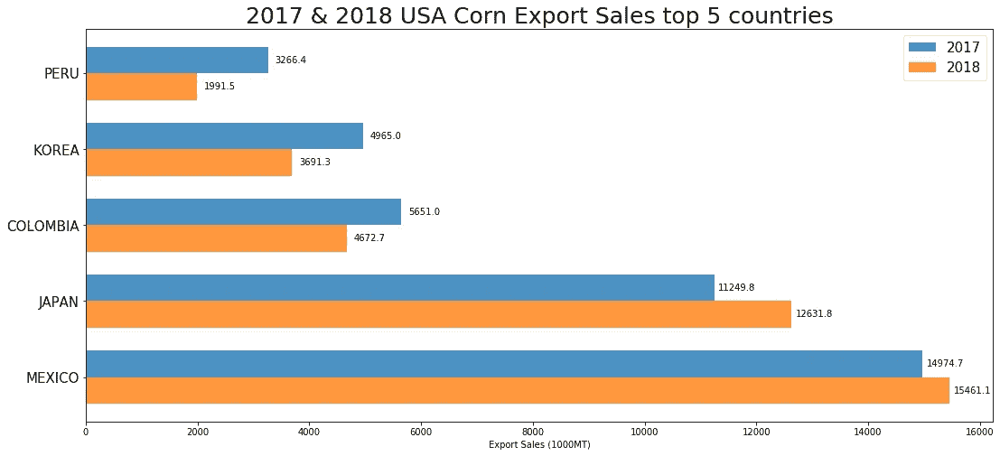
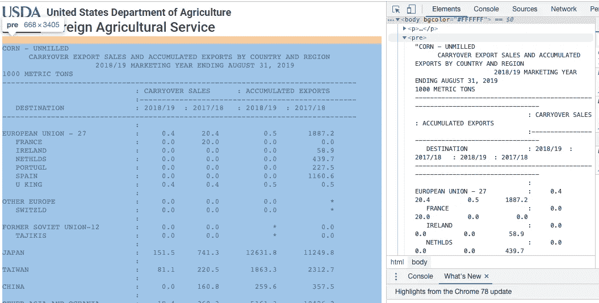
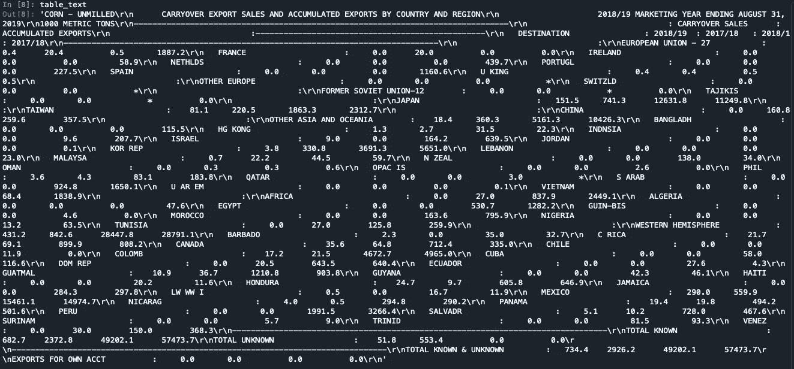
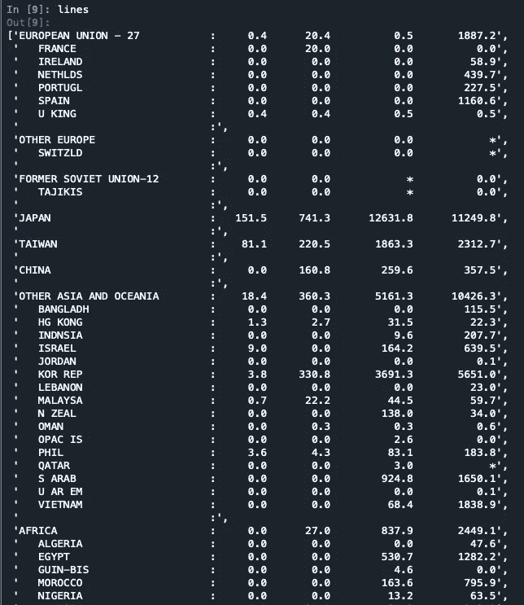
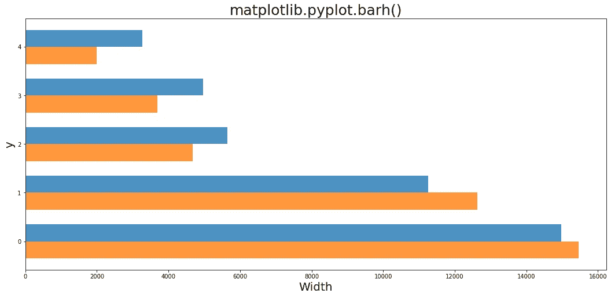

# 使用 Python 实现数据可视化和网络抓取|美国玉米出口销售

> 原文：<https://medium.com/analytics-vidhya/data-visualisation-and-web-scraping-using-python-usa-corn-export-sales-17979e851ec2?source=collection_archive---------13----------------------->



这篇文章将告诉你我如何从一个网站解析数据，保存为 dataframe，然后可视化为上面的条形图。作为一个数据分析的新手，我在网上查阅了大量的文章来完成这个项目。我希望你能在这里找到有用的东西。完整的脚本可以在我的 Github 页面上找到。

以下章节将提到 4 个主题:

1.  网页抓取
2.  数据操作
3.  Matplotlib 可视化
4.  释文

# 1.网页抓取

我试图解析由 FAS(外国农业服务)、USDA(美国农业部)发布的 2017 年和 2018 年玉米出口销售数据

数据来自:[https://apps.fas.usda.gov/export-sales/myfiaug.htm](https://apps.fas.usda.gov/export-sales/myfiaug.htm)

谷歌浏览器中的开发者工具可以用来检查网页的元素。我们可以找到我们想要的表(玉米—未碾磨的)存储在标签

```
下
```



让我们从这个项目中使用的库开始:

```
import requests
from bs4 import BeautifulSoup
import numpy as np
import pandas as pd
import matplotlib.pyplot as pltsource = requests.get("[https://apps.fas.usda.gov/export-sales/myfiaug.htm](https://apps.fas.usda.gov/export-sales/myfiaug.htm)").text
soup = BeautifulSoup(source, 'lxml')pre = soup.find('pre')
start_text = 'CORN - UNMILLED'
end_text = 'OPTIONAL ORIGIN'page_text = pre.text.strip()
start_position = page_text.find(start_text)
end_position = page_text.find(end_text)
table_text = page_text[start_position:end_position]
lines = table_text.splitlines()
lines = lines[10:-2] # select the countries part
```

首先，我使用 BeautifulSoup 解析来自 USDA 网站的文本。网页中有三个表格，因为我只需要使用第一个表格(Corn)，所以设置了“start_text”和“end_text”来选择范围。

[splitlines()](https://www.geeksforgeeks.org/python-string-splitlines/) 函数有助于拆分行，使我的“表格文本”变得更具可读性。(见下图)



table_text(在 splitlines()之前)



行(在 splitlines()之后)

# 2.数据操作

我的想法是将“国家”和“数字”保存到单独的列表中，然后浏览每一行数字，以获得“2017 年”和“2018 年”的出口数据。我想单独处理三个列表(国家，2017 年出口和 2018 年出口)，将它们保存到数据框中，最后将它们合并在一起。(这只是为了我自己的方便，我确信一定有更有效的方法来这样做)

因为我的图表将显示美国出口最多的前五个国家，所以我决定先对数据框中的值进行排序，然后再进行可视化。

```
country = [l.split(':')[0] for l in lines]
numbers = [l.split(':')[-1] for l in lines]ex_2017 = []
ex_2018 = []for n in numbers:
    if len(n) == 0: # to exclude the empty '' in numbers
        pass
    elif len(n) == 80: # to exclude the dash line '---------'
        pass
    else:
        x = n.split()
        ex_2018.append(x[-2])
        ex_2017.append(x[-1])country = [c.strip() for c in country] 
# use .strip() to remove the spaces in textnew_country = []
for c in country:
    if len(c) == 0:
        pass
    elif len(c) == 80:
        pass
    else:
        new_country.append(c)df1 = pd.DataFrame(new_country)
df1.rename(columns={0:'Country'}, inplace=True)df2 = pd.DataFrame(ex_2017)
df2.rename(columns={0:'2017'}, inplace=True)df3 = pd.DataFrame(ex_2018)
df3.rename(columns={0:'2018'}, inplace=True)df = pd.concat([df1['Country'], df2['2017'], df3['2018']], axis=1)
df.set_index('Country', inplace=True)df['2017'] = pd.to_numeric(df['2017'], errors='coerce') 
df['2018'] = pd.to_numeric(df['2018'], errors='coerce')
#By setting errors=’coerce’, you’ll transform the non-numeric values into NaN."""
Save the top five countries in another Series for further visualisation
"""top5_2017 = df.sort_values(['2017'], ascending=False).drop(index={
    'TOTAL KNOWN', 'WESTERN HEMISPHERE', 'OTHER ASIA AND OCEANIA'})['2017'].head()
top5_2018 = df.sort_values(['2018'], ascending=False).drop(index={
    'TOTAL KNOWN', 'WESTERN HEMISPHERE', 'OTHER ASIA AND OCEANIA'})['2018'].head()top5_2017.rename({'KOR REP':'KOREA', 'COLOMB':'COLOMBIA'}, inplace=True)
top5_2018.rename({'KOR REP':'KOREA', 'COLOMB':'COLOMBIA'}, inplace=True)
```

# 3.Matplotlib 可视化

我们先来看看 [pyplot.barh()](https://matplotlib.org/3.1.1/api/_as_gen/matplotlib.pyplot.barh.html) 的参数。

`barh` ( *y* ，*宽度*，*高度=0.8* ，*左侧=无*， *** ， *align='center'* ， ***kwargs* )

我们知道 y 轴上的“y”应该是一个数组，“width”是条形的宽度(沿 x 轴)。



```
labels2017 = top5_2017.index.to_list()
export2017 = top5_2017.to_list()
labels2018 = top5_2018.index.to_list()
export2018 = top5_2018.to_list()y = np.arange(len(labels2018))
width = 0.35 
# The width here means the width for the 'bar' (ie the 'height' in parameters)fig, ax = plt.subplots(figsize=(18,8))
rects3 = ax.barh(y+width/2, export2017, width, label='2017', alpha=0.8)
rects4 = ax.barh(y-width/2, export2018, width, label='2018', alpha=0.8)
ax.set_title('2017 & 2018 USA Corn Export Sales top 5 countries', fontsize=25)
ax.set_xlabel('Export Sales (1000MT)')
ax.set_yticks(y)
ax.set_yticklabels(labels2018, fontsize=15)
ax.legend(loc='upper right', prop={'size':15})
autolabel_2_MT(rects3)
autolabel_2_MT(rects4) # This is for annotations 
```

# 4.释文

我遵循了这篇[帖子](https://matplotlib.org/3.1.1/gallery/lines_bars_and_markers/barchart.html#sphx-glr-gallery-lines-bars-and-markers-barchart-py)中关于如何在条形图旁边制作文本标签的介绍。我对参数做了一些调整，因为我的条形图是水平的，但这篇文章是为垂直的而写的。

```
def autolabel_2_MT(rects): # for two-years graph, unit in 1000MT
 for rect in rects:
   width = rect.get_width()
   ax.annotate(‘{}’.format(width),
    xy=(width, rect.get_y() + rect.get_height()/2),
    xytext=(25,-5),
    textcoords=’offset points’,
    ha=’center’, va=’bottom’)
```

我的[脚本](https://github.com/mysterycatt/USA_Corn_Export_Sales)包含了一年和两年图形的代码，并且使用不同的单位(%或 1000MT)。有兴趣的话看看吧。如果能听到您的任何反馈或问题，我将不胜感激。下次见。