# 使用 seaborn 的绝对初学者的数据可视化

> 原文：<https://medium.com/analytics-vidhya/data-visualisation-for-absolute-beginners-using-seaborn-8cd93f705efe?source=collection_archive---------13----------------------->


在我的[之前的教程](/analytics-vidhya/data-visualization-from-absolute-beginners-using-python-part-1-3-3cb9253ac007)中，我们谈到了使用 matplotlib 的基本绘图，现在在本教程中，我们将构建更高级形式的数据绘图，为了使它更有趣，我们将在真实数据集上工作！Seaborn 是一个*很棒的*库，它有很好的文档，所以你可以随时查阅。

## 既然已经知道 matplotlib，为什么还要学习 seaborn？

> 如果 Matplotlib“试图让简单的事情变得简单，让困难的事情变得可能”，那么 seaborn 也试图让一组定义明确的困难事情变得简单”——Michael was kom(Seaborn 的创造者)。

这个 seaborn 库是建立在 matplotlib 之上的，完成本教程后，您将了解 seaborn 如何使绘制数据的工作变得更加容易！

## 我们开始吧！

## 安装 seaborn

要安装 Python Seaborn 库，可以根据您使用的平台使用以下命令:

```
pip install seabornorconda install seaborn
```

如果您不熟悉上述内容，您可以参考下面的链接，并在您的浏览器上运行这些命令。我已经添加了所有的命令，你可以修改它们来测试不同的情节。

[](https://colab.research.google.com/drive/17KGJsSv7qiErE6YQFiSYABGF9mih2eC7?usp=sharing) [## 谷歌联合实验室

### 海生的

colab.research.google.com](https://colab.research.google.com/drive/17KGJsSv7qiErE6YQFiSYABGF9mih2eC7?usp=sharing) 

我们将从学习如何可视化数据的**分布开始。统计数据集(或总体)的*分布*是显示数据的所有可能值(或区间)及其出现频率的列表或函数。以下 seaborn 方法将帮助我们绘制相同的图形。**

*   **距离图**
*   **接合图**
*   **配对图**
*   **rugplot**

让我们前往我们的木星笔记本，并开始！

**导入库**

```
import seaborn as sns
%matplotlib inline
```

在开始我们的绘图之前，我们需要一个可以通过 seaborn 可视化的数据集，**有趣的是 seaborn 自带了内置数据集！**

让我们加载包含在酒店用餐时给出的**小费的数据集。**

```
tips = sns.load_dataset('tips')
```

**读取数据集**

```
tips.head()
```

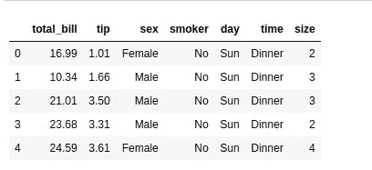

看起来很有趣！如你所见，数据集包含账单总额、给的小费、人的性别、他是否吸烟、就餐日期、就餐时间以及聚会规模。

让我们继续使用**距离图**绘制我们的第一个图

```
# distplot accepts one argument as one column of the data
sns.distplot(tips['total_bill'])
```

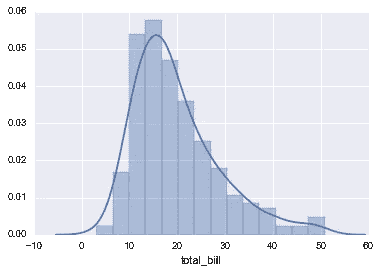

distplot 显示了一组单变量观察值的分布，单变量只是“一个变量”的不同说法。

直方图表示图中 total_bill 的分布，在 y 轴上我们有 count。

你在图上看到的这些条柱被称为**条柱**。

注意我们有一个直方图和一个 KDE 层，为了移除 KDE 层，我们将传递 **kde = False** 。

## **小练习:**

**你能在图表中指出 total_bill 计数最大的地方吗？**

太好了！如果您注意到它位于 10 美元和 20 美元之间，让我们尝试通过添加 30 个箱的数量来增加我们的图的精确度。

```
sns.distplot(tips['total_bill'],kde=False,bins=30)
```


如果你选择一个非常高的 bin 值，你会得到一个非常奇怪的图形，你将无法正确地估计事情。Bin 值总是依赖于数据集，您需要相应地更改它的值。

## 接合图

这有助于用双变量和单变量图形绘制两个变量的图。

它接受三个变量 x 变量、y 变量和数据集。这里 x 和 y 是数据的列名。

```
sns.jointplot(x= 'total_bill',y='tip',data=tips)
```

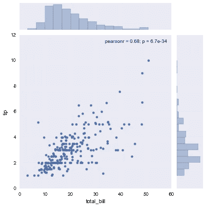

哇！如果我们注意的话，我们会发现 10 到 20 美元的钞票上给的小费比面值更高的钞票要多。

让我们试着在同一个图中得到变化，并绘制不同的**类型。**

默认情况下，我们有 kind = 'default ',但我们可以传递实物作为 **'hex'** 或 **'reg'**

```
sns.jointplot(x= 'total_bill',y='tip',data=tips,kind = 'hex')
```

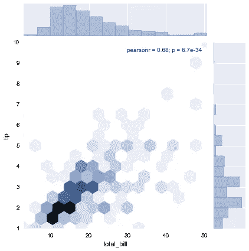

```
sns.jointplot(x= 'total_bill',y='tip',data=tips,kind = 'reg')
```


上面的图更适合回归和机器学习(后面会详细介绍)

为了简单起见，我们将坚持使用**散点图**,因为它最容易阅读，并且提供了关于数据的更多见解。

**成对绘图**

使用

```
sns.pairplot(tips)
```

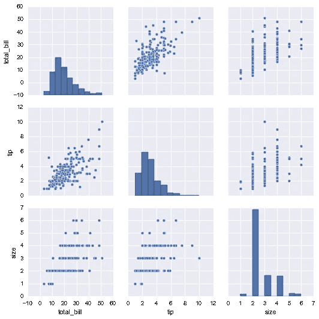

pairplot 为我们提供了一个矩阵，并将每一列与其他每一列相对照。这张图可以提供很多见解，并帮助我们在现有的数据中找到模式。

注意当 x = y 时我们得到一个直方图。

我们可以将色调作为类别传递，它将根据类别着色，调色板用于改变颜色类型。

**小运动确保自己还清醒！试着从下面一行中删除调色板，看看你得到的是什么默认颜色**

```
sns.pairplot(tips,hue='sex',palette='coolwarm')
```

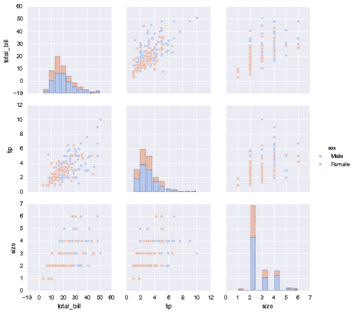

添加**色调** =“性别”告诉 **seaborn 你**想要给男性和女性的数据点涂上不同的颜色。

试着传递 hue = "smoker ",看看你能否发现给出的提示是否与吸烟有关😛。

**rugplot**

rugplots 实际上是非常简单的图，它们只是为一元分布上的每个点画一个破折号。它们是 KDE 阴谋的基石:

```
sns.rugplot(tips['total_bill'])
```


这也是一个分布图，但沿分布线有一个简单的虚线标记。我们通常不使用这个情节，所以我不在这里集中更多。

太棒了，我们成功地学习了分布图🎉🎉

我迫不及待地想向您展示 seaborn 提供的更高级的图表。

让我们直接开始吧！

# 分类数据图

现在让我们绘制分类数据！这有几种主要的绘图类型:

*   **因子图**
*   **箱线图**
*   **紫罗兰花**
*   **剥离槽**
*   **群集图**
*   **柱状图**
*   **计数图**

我们将一个接一个地看到它们，并学习为正确的用例选择正确的情节。

```
import seaborn as sns
%matplotlib inline
tips = sns.load_dataset('tips')
tips.head()
```

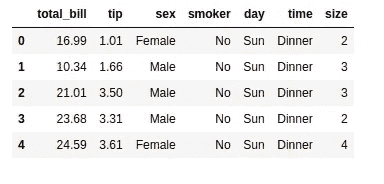

# 条形图和计数图

这些非常相似的图允许您从数据中的分类要素获取聚合数据。**条形图**是一个通用图，允许您根据某个函数聚合分类数据，默认为平均值:

```
import numpy as npsns.barplot(x='sex',y='total_bill',data=tips)
```

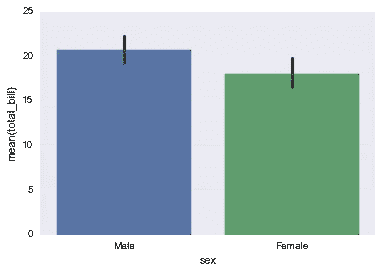

您可以将 estimator 对象更改为您自己的函数，该函数将向量转换为标量:

```
import numpy as npsns.barplot(x='sex',y='total_bill',data=tips,estimator=np.std)
```

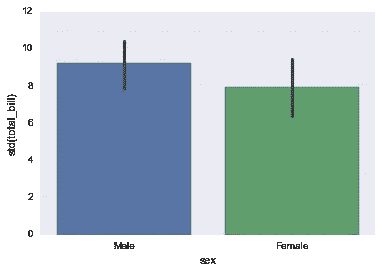

**计数图**

这基本上与柱状图相同，除了估计器是显式计数出现的次数。这就是为什么我们只传递 x 值:

```
sns.countplot(x='sex',data=tips)
```

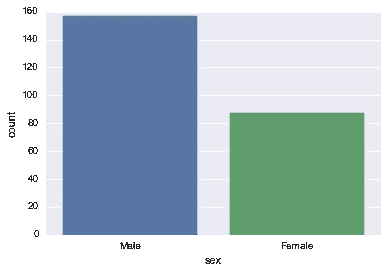

# 箱线图和紫线图

**箱线图**和**紫线图**用于显示分类数据的分布。箱线图(或盒须图)以一种便于变量之间或分类变量水平之间比较的方式显示定量数据的分布。该框显示数据集的四分位数，而触须延伸以显示分布的其余部分，除了使用作为四分位数范围函数的方法确定为“异常值”的点。当我们开始绘制它们时，这一点会更加清楚。

```
sns.boxplot(x="day", y="total_bill", data=tips,palette='rainbow')
```

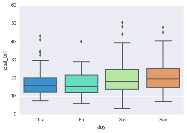

```
# Can do entire dataframe with orient='h'
sns.boxplot(data=tips,palette='rainbow',orient='h')
```

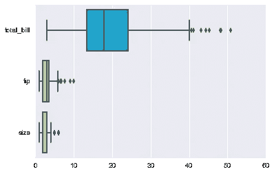

```
# adding hue to the data
sns.boxplot(x="day", y="total_bill", hue="smoker",data=tips, palette="coolwarm")
```

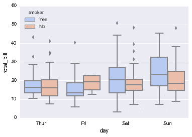

请注意，在我们的数据集中添加色调和可视化吸烟者变得多么容易。

# 紫罗兰花

小提琴图与盒须图的作用相似。它显示了数量数据在一个(或多个)分类变量的几个级别上的分布，以便对这些分布进行比较。与箱线图不同，在箱线图中，所有图的组成部分都对应于实际数据点，violin 图的特点是对基础分布的核密度估计。

```
sns.violinplot(x="day", y="total_bill", data=tips,palette='rainbow')
```

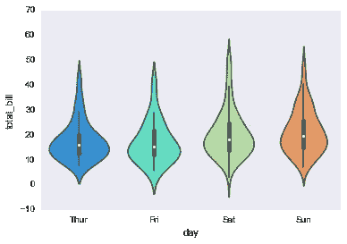

```
# adding hue by sex
sns.violinplot(x="day", y="total_bill", data=tips,hue='sex',split=True,palette='Set1')
```

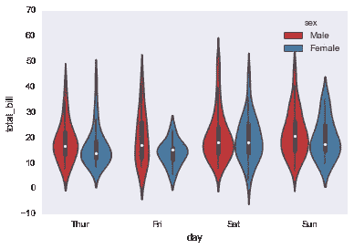

```
#make one half the one hue and another half the other hue using split
sns.violinplot(x="day", y="total_bill", data=tips,hue='sex',split=True,palette='Set1')
```

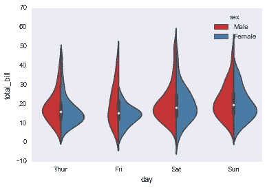

注意上面的 **split = True** 给出了很多信息，我们可以很容易地并排比较两种性别。

# 剥离地块和群集地块

条带图将绘制一个散点图，其中一个变量是分类变量。带状图可以单独绘制，但在您想要显示所有观察值以及一些基本分布的情况下，它也是对箱形图或小提琴图的很好补充。

```
sns.stripplot(x="day", y="total_bill", data=tips)
```

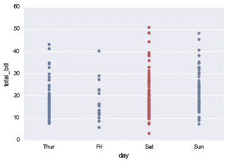

```
#adding will add random noise to make it clear
sns.stripplot(x="day", y="total_bill", data=tips,jitter=True)
```


```
# adding hue 
sns.stripplot(x="day", y="total_bill", data=tips,jitter=True,hue='sex',palette='Set1')
```


```
#adding split = True
sns.stripplot(x="day", y="total_bill", data=tips,jitter=True,hue='sex',palette='Set1',split=True)
```

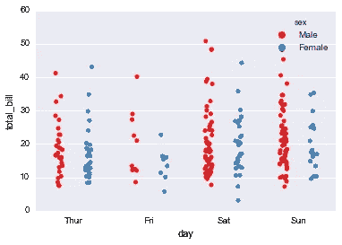

swarmplot 类似于 stripplot()，但是这些点被调整(仅沿分类轴)以使它们不重叠。这更好地表示了值的分布，尽管它不能缩放到大量的观察值(在显示所有点的能力和排列它们所需的计算方面)。sns.swarmplot(x="day "，y="total_bill "，data=tips)

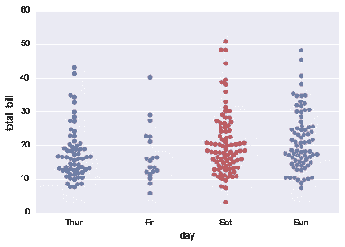

```
sns.swarmplot(x="day", y="total_bill",hue='sex',data=tips, palette="Set1", split=True)
```

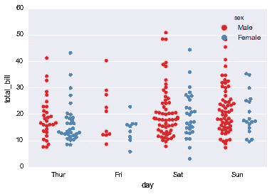

# 组合分类图

```
sns.violinplot(x="tip", y="day", data=tips,palette='rainbow')
sns.swarmplot(x="tip", y="day", data=tips,color='black',size=3)
```

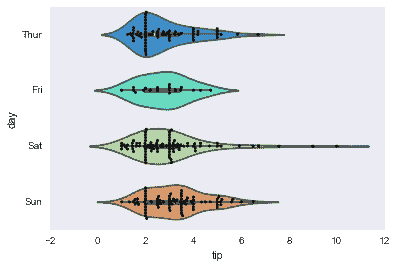

# 因子图

因子图是分类图最常见的形式。它可以接受一个**类**参数来调整绘图类型:

```
sns.factorplot(x='sex',y='total_bill',data=tips,kind='bar')
```

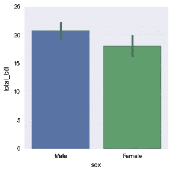

干得好！恭喜你走到这一步🎉🎉，如果我有一个拍你后背的表情符号，我会按一百万次🥳🥳.

然而，这些只是 seaborn 所提供的许多基础知识，我期待着为同样的内容创建更高级的教程。

在 medium 上关注我，让自己了解所有新的更新。

谢谢你

进一步阅读

*   [http://seaborn.pydata.org/tutorial.html](http://seaborn.pydata.org/tutorial.html)

来源

*   http://seaborn.pydata.org/tutorial.html
*   【http://seaborn.pydata.org/examples/index.html 
*   [https://www . udemy . com/course/python-for-data-science-and-machine-learning-boot camp/](https://www.udemy.com/course/python-for-data-science-and-machine-learning-bootcamp/)