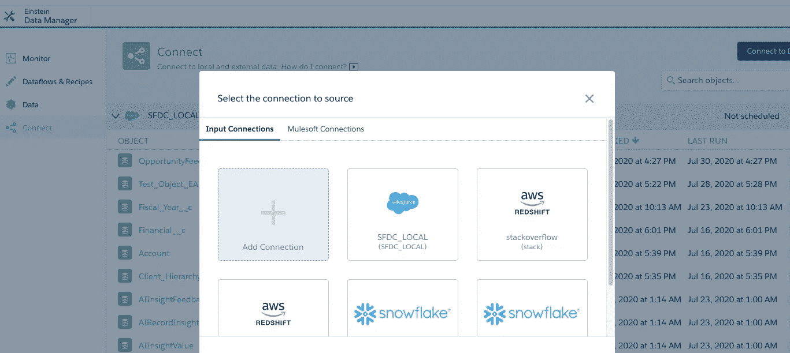
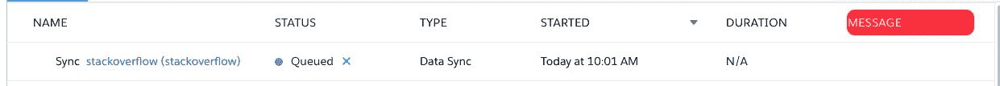

# 在爱因斯坦分析中使用来自红移的叠加流动数据的数据可视化。

> 原文：<https://medium.com/analytics-vidhya/data-visualisation-in-einstein-analytics-using-stack-over-flow-data-from-redshift-18b4a5aa135b?source=collection_archive---------21----------------------->

## 本文概述了通过连接到 Redshift 在 Einstein analytics 中创建高度交互式仪表板的关键步骤。

图片来自[https://www.searchenginejournal.com/](https://www.searchenginejournal.com/)

本文是上一篇文章中的[系列](/@snehamehrin22/building-an-end-to-end-analytics-pipeline-using-einstein-analytics-kinesis-spark-and-redshift-6d9fe1feb3c3)和[的延续，在上一篇文章中，我们在 Redshift 中构建了一个数据仓库来存储流式处理的数据](/@snehamehrin22/creating-a-datawarehouse-using-amazon-redshift-for-stackoverflow-data-6fd649f25854)。

让我们简单回顾一下我们的管道和我们开发的批处理作业的时间表。

带有时间表的数据管道

我们已经讨论了 aws 中的流和批处理作业，现在让我们继续讨论爱因斯坦分析。

## **什么是爱因斯坦分析学？**

*   Einstein Analytics 是由 **Salesforce** 提供的**基于云的分析解决方案**。
*   数据存储在自己的平台上，但因为是 Salesforce 产品，所以与 Salesforce 平台集成得很好。
*   Einstein Analytics 的主要优势是它自己的一套数据准备工具**数据流和配方**，这为分析开发人员提供了很大的灵活性。

## Einstein 中数据管道的快速概述

*   Einstein 使用数据同步**连接到外部数据源**及其自身的**本地 Salesforce 本地对象**。
*   我们可以安排**数据同步**在指定时间提取数据。
*   使用**数据流**可以进一步**清理、准备和转换**数据，并以数据集的形式登记，进一步在**仪表盘**中使用。

> 在我们的技术设计中，我们使用 EA 提供的红移连接器将 EA 连接到 a 红移集群，并使用数据流注册到数据集。

**该流程的关键步骤**

请注意，写这篇文章时要记住，读者已经对如何从爱因斯坦开始有了一些想法。

1.  **在 EA 中配置红移星团细节。**

*   在数据管理器中，转到**连接选项卡**并点击**连接到数据**。
*   添加一个连接并选择**红移连接器。**
*   配置细节如本文所述[https://help.salesforce.com/articleView?id = bi _ integrate _ connectors _ redshift _ settings . htm&type = 5](https://help.salesforce.com/articleView?id=bi_integrate_connectors_redshift_settings.htm&type=5)
*   **保存并测试**连接

**2。一旦连接成功，选择您在 Redshift 集群中创建的表和列。**

红移表

红移表的列

步骤 3:完成后，进入连接选项卡，您的连接将会显示出来。单击运行数据同步以同步数据。

**步骤 4:使用 SFDC 文摘作为亚马逊连接创建一个简单的数据流，并使用 SFDC 注册器注册数据集。**

因为，我已经删除了红移集群，以避免任何成本，节点显示警告。然而，过程是相同的。

## **仪表板预览**

仪表板有三个主要组件

1.  **关键 KPI 指标**:这由日期过滤器控制，用户可以在不同的日期过滤器之间切换。
2.  **一段时间内的指标**:这是一个静态可视化视图，显示当前月份内一段时间内的关键 KPI 指标。
3.  **一段时间内的指标比较**:这也是一个静态可视化，但是它给出了与去年相比的指标比较。

**仪表板的关键部件**

1.  **日期过滤器**

*   这是一个静态过滤器，具有以下值

**2。关键 KPI 指标**

这些是紧凑的数字小部件，在过滤器部分绑定了静态日期过滤器。

这背后的逻辑非常简单；这些可视化仅有的附加配置是绑定。

**新问题**:唯一(question_id)

**平均回答数** : avg(answer_count)

**平均观看次数:** avg(view_count)

**平均得分** : avg(view_score)

下面是在仪表板的底层 json 中编码的过滤器部分中的绑定片段。

**3。折线图**

这些可视化没有任何绑定，但它有一个额外的指标，如在工具提示中的增长%。

这里有一个关于我如何配置这些图表的快速视频。

> 由于可视化只能有测量，关键的技巧是使用比较表创建增长百分比，然后隐藏它，这样查询就可以投射它，但它不会在可视化中呈现。然后，您可以使用工具提示中的隐藏度量

**4。折线图对比**

因为这些图表本质上是一个新的查询，所以我使用 pages 来提供在两个视图之间无缝导航的体验。

我使用 SAQL 对这些图表进行底层查询。

这里有一个关于我如何配置这个可视化的快速视频。

这个系列就说到这里吧！！

建造这条管道是一次真正的学习经历。如果有任何问题，欢迎随时给我留言！！