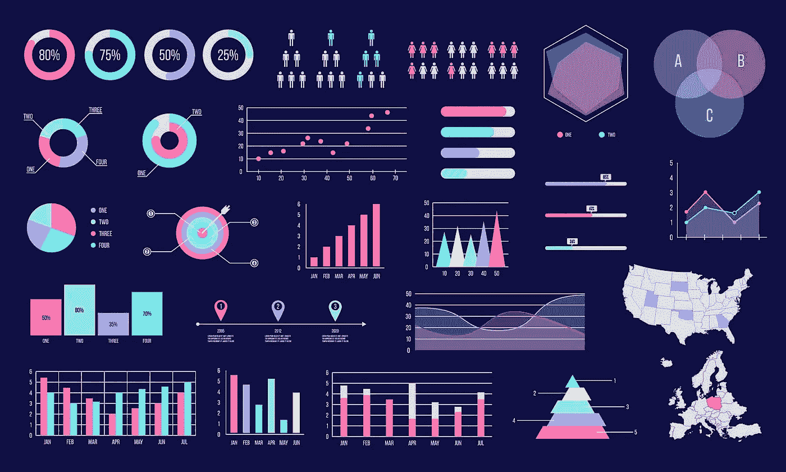

# 数据可视化—使数据可见

> 原文：<https://medium.com/analytics-vidhya/data-visualisation-making-data-visible-4dcd76fc33d?source=collection_archive---------24----------------------->

可视化数据

数据可视化是信息和数据的图形化表示。通过使用图表、图形和地图等可视化元素，数据可视化工具为查看和理解数据中的趋势、异常值和模式提供了一种便捷的方式。

> 在[大数据](https://en.wikipedia.org/wiki/Big_data)的世界中，数据可视化工具和技术对于分析海量信息和做出数据驱动的决策至关重要。

这是另一种形式的视觉艺术，抓住我们的兴趣，让我们的眼睛盯着信息。当我们看到图表时，我们很快就会看到趋势和异常值。如果我们能看到一些东西，我们会很快消化它。这是有目的的讲故事。

# 数据可视化的重要性

*   每个 STEM(科学、技术、工程、数学)领域都受益于理解数据，政府、金融、营销、历史、消费品、服务行业、教育、体育等领域也是如此。
*   既然可视化如此丰富，它也是最有用的职业技能之一。无论是在仪表盘还是幻灯片中，你越能直观地表达你的观点，你就能越好地利用这些信息。
*   技能组合正在发生变化，以适应数据驱动的世界。对于专业人员来说，能够使用数据来做出决策，并使用视觉来讲述数据何时告知谁、什么、何时、何地以及如何告知的故事越来越有价值。虽然传统教育通常在创造性的讲故事和技术分析之间划出明确的界限，但现代职业世界也重视那些能够跨越这两者的人:数据可视化位于分析和可视化讲故事的中间。

# 不同类型的可视化

*   图表
*   桌子
*   图表
*   地图
*   信息图形
*   仪表板

不同类型的数据可视化

# 履行

几个最常用的绘图库是:

*   [**Matplotlib:**](https://matplotlib.org/)**低级别，提供了很多自由**
*   **[**熊猫可视化:**](https://pandas.pydata.org/pandas-docs/stable/visualization.html) 易于使用的界面，基于 Matplotlib 构建**
*   **[**Seaborn:**](https://seaborn.pydata.org/)**高级界面，极大的默认样式****
*   ****[**ggplot:**](http://ggplot.yhathq.com/) 基于 R 的 ggplot2，使用图形的[语法](https://www.amazon.com/Grammar-Graphics-Statistics-Computing/dp/0387245448)****
*   ****[**plottly:**](https://plot.ly/python/)**可以创建交互式剧情******

## ******Matplotlib******

******链接:[https://github . com/bhartendudubey/Data-visualization/blob/master/visual _ matplotlib . ipynb](https://github.com/bhartendudubey/Data-Visualisation/blob/master/visual_matplotlib.ipynb)******

> ******数据集:[虹膜](https://github.com/bhartendudubey/Data-Visualisation/blob/master/iris.csv)******

## ******熊猫可视化******

******链接:[https://github . com/bhartendudubey/Data-visualization/blob/master/visual _ pandas _ visualization . ipynb](https://github.com/bhartendudubey/Data-Visualisation/blob/master/visual_pandas_visualisation.ipynb)******

> ******数据集:[虹膜](https://github.com/bhartendudubey/Data-Visualisation/blob/master/iris.csv)******

## ******海生的******

******链接:[https://github . com/bhartendudubey/Data-visualization/blob/master/visual _ seaborn . ipynb](https://github.com/bhartendudubey/Data-Visualisation/blob/master/visual_seaborn.ipynb)******

> ******数据集:[虹膜](https://github.com/bhartendudubey/Data-Visualisation/blob/master/iris.csv)******

> ******我建议您应该尝试这些实现，以获得更好的实际学习体验，并更好地理解数据可视化是如何有帮助的。******