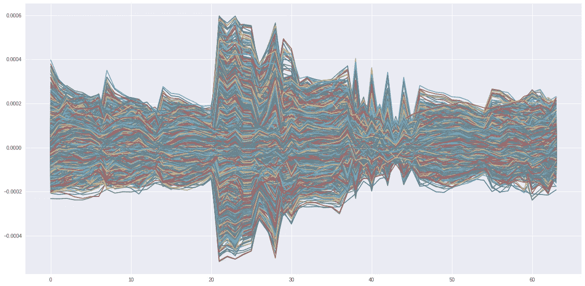

# 数据可视化:行动中的大脑

> 原文：<https://medium.com/analytics-vidhya/data-visualisation-the-brain-in-action-cd15195f4fdf?source=collection_archive---------29----------------------->

大脑(我真的希望不是)是一个确定性的机器(唯一的原因是我们不知道任何其他类型的机器)。大脑的组成单元，称为神经元，实际上是复杂的集成电路；至少当孤立地研究时，它们*的行为*是非常确定的，很有规律的。一旦受到非常温和的刺激(化学/电磁)，它们会以一致的方式作出反应:所有神经元中跨膜电位差的连续变化都是可重复的。


刺激后膜电位的变化；(确切的时间和电压顺序可能因神经元而异)

大脑的电活动是某一时刻所有神经元的总和。有很多移动的电子，它们会在头皮表面感应出一定的电磁场。这个场可以通过一种不太贵的叫做*脑电图仪*的设备来测量(这是放在大脑上的几根电线连接到一个电压表)。


脑电图过程中电线(“导线”)在大脑中的位置；图片由 Physiolonet(【https://www.physionet.org/content/eegmmidb/1.0.0/】T4)提供

放置在大脑中的一组 64 根导线将产生 64 种不同的信号，这些信号可以作为标准的数字阵列记录在一个文件中。生理网络数据集([https://www.physionet.org/content/eegmmidb/1.0.0/](https://www.physionet.org/content/eegmmidb/1.0.0/))是在两分钟内测量的这 64 个信号的数据集。这些文件是 EDF 格式的，这个小片段将在一个 numpy 数组中加载一个包含所有 64 个信号的文件。

```
import mne
import numpy as np
import matplotlib.pyplot as plt
plt.style.use('seaborn')file=’your_file_path/S001R01.edf’
data = mne.io.read_raw_edf(file)
x = data.get_data()
```

如果你画出这些导联中的任何一个，比如说额导联(23)，然后在受试者休息时画出一个简单的信号图

```
plt.plot(x[22])
```


受试者休息，眼睛睁开，额叶

当受试者闭上眼睛时，额叶的活动明显减少(当你看不见时，需要处理的信息更少，对吗？)

```
file=’your_file_path/S001R02.edf’
data = mne.io.read_raw_edf(file)
x = data.get_data()
plt.plot(x[22])
```


休息，闭眼，额叶

现在受试者张开他的左拳，可以看到一团活动的泥浆。“计划”行动的额叶记录着活动。

```
file=’your_file_path/S001R0.edf’
data = mne.io.read_raw_edf(file)
x = data.get_data()
plt.plot(x[22])
```


目标打开左拳，额叶

同样的活动反映在两个脑叶中(这有点奇怪，因为理论上是右脑移动左手)

```
plt.figure(figsize=(15,10))
plt.subplot(121)
plt.plot(xlfist[0])
plt.ylim(-0.0005,0.0005)
plt.title('Left pareital')
plt.subplot(122)
plt.plot(xlfist[6])
plt.ylim(-0.0005,0.0005)
plt.title('Right pareital')
```


目标移动左拳

一次只看一根“导线”有它的好处，但人们可能会错过完整的画面。我们可以一次绘制所有 64 条线索(不幸的是，matplotlib 将允许这样的事情)，并得出如下的异常结果:

```
plt.figure(figsize=(20,10))
plt.plot(x)
```



休息时，眼睛睁开，所有 64 个导联都有不同的颜色

我们也可以单独绘制每一个导联(这是标准的心电图记录)，产生稍微好一点的可视化效果。

```
plt.subplot(411)
plt.plot(x[0])
plt.subplot(412)
plt.plot(x[1])
plt.subplot(413)
plt.plot(x[2])
plt.subplot(414)
plt.plot(x[4])
```


前四个导联的图

然而，有一种更好且美观的方式来表示整个 64 导联:我们可以将信号强度的峰值指定为亮色，将信号强度的谷值指定为暗色。因此，一个单一的波可以转换成一条线上的亮点和暗点。

```
plt.jet()
plt.figure(figsize=(15,10))
plt.subplot(121)
plt.plot(x[0,800:850])
plt.subplot(122)
plt.imshow(x[0:1,800:850])
```


绘制单个引线；波形被转换成亮色和暗色，对应于波峰和波谷

现在立刻尝试所有 64 条线索，

```
plt.figure(figsize=(20,10))
plt.subplot(121)
plt.plot(x)
plt.subplot(122)
plt.jet()
plt.imshow(x[:,:])
```


所有 54 个导联的图(左)；光谱图(右)产生了 64 行 x 9760 列的非常薄的图像

然而，图像可以放大，出现复杂的图案；以下是信号的前 1000 个样本:

```
plt.jet()
plt.figure(figsize=(20,10))
plt.imshow(x[:,0:1000])
```


休息时睁开眼睛，活动所有导联

闭上眼睛几秒钟后，事情已经冷却了一些


休息，闭眼，第 8000–9000 个样本

当受试者闭上眼睛多一分钟并准备好下一项任务(挥动拳头)时，大部分活动已经平静下来


休息，闭上眼睛，没有任务

当受试者移动他的左拳时，活动再次出现


人们可以放大来测量单个信号(虽然这是不鼓励的；这种观想的整个想法是要有一个整体的画面)


左拳运动，注意 40–50 导联(颞旁区)的最高活动

将 EEG 的整个记录转换为单一图像提供了大脑活动的概览，以及机器学习的素材。至少可以说，接下来的日子会很有趣。

如果我们一帧一帧地绘制所有导联的电压，以及它们在头部的位置(见上面的电极放置图)，我们就可以获得大脑的实时视频:这是受试者闭眼休息时的记录:

导联脑电图活动；闭眼休息

随着眼睛睁开，活动广泛增加(更亮的颜色)

1.  Schalk，g .，McFarland，D.J .，Hinterberger，t .，Birbaumer，n .，Wolpaw，J.R. BCI2000:一个通用脑-机接口(BCI)系统。IEEE 生物医学工程汇刊 51(6):1034–1043，2004。
2.  戈德堡尔、阿马拉尔兰、格拉斯 L、豪斯多夫、伊万诺夫 PCh、马克 RG、米耶图斯、穆迪 GB、彭 C-K、何鸿燊。生理银行、生理工具包和生理网:复杂生理信号新研究资源的组成部分(2003)。流通。101(23):e215-e220。