# 数据可视化:运动中的心脏

> 原文：<https://medium.com/analytics-vidhya/data-visualisation-the-heart-in-motion-818e86be2e44?source=collection_archive---------24----------------------->

与大多数器官相比，心脏在功能上确实是最简单的。它(通常)在给定的范围内搏动，并将血液泵入和泵出。这种活动完全是电性的；“窦房结”是心脏右上方的一组精选细胞，产生这些脉冲，向下移动到心室并使其收缩。(“冲动”，在这种情况下，意味着“离子穿过细胞膜的运动”)。

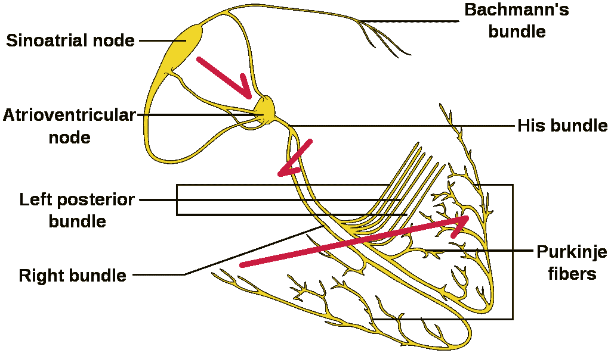

心脏中电脉冲(去极化波，即离子运动)的传导从顶部(窦房结)开始，向下移动到房室结(房室结)，穿过室间隔(最小的箭头)，然后移动到两个心室(最大的箭头)；(由 Madhero88(原始文件)修改而来)；Angelito7(这个 SVG 版本)；—ConductionsystemoftheheartwithouttheHeart.png & conductionsystemoftheheartwithoutheart . SVG，CC BY-SA 3.0，[https://commons.wikimedia.org/w/index.php?curid=29922595](https://commons.wikimedia.org/w/index.php?curid=29922595)

这种电活动表现为可以从体表获得的有节奏的电场变化。你可以粘贴一些小电线，把它们连接到电压表上，瞧！你可以看到心脏在活动。

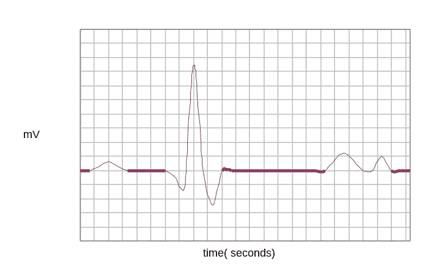

标准心电图波形

现在，*心电图*的记录方式，还有很多有待探索。标准心电图用 12 根导线(“导联”)记录；其中 6 个位于“冠状”(即垂直)平面，其余位于“横向”(水平)平面。所以我们马上就有了一组互相垂直的轴。

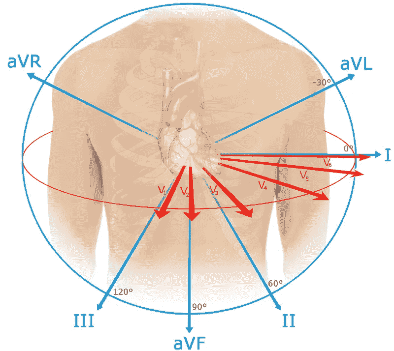

带轴的心电图导联系统；我们可以立即识别一组 3 个轴:导联 I、aVF 和和 V2，它们相互垂直(由 Npatchett —自己的工作，CC BY-SA 4.0，【https://commons.wikimedia.org/w/index.php?curid=39235260】T4)

一旦我们确定了一组轴，我们就可以假设这三个轴上的电压相互独立(因为它们是垂直的)。然后，我们可以对它们进行矢量求和，以产生给定时刻的心脏矢量。

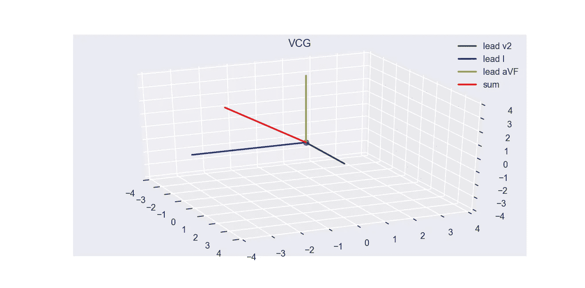

垂直引线的矢量求和按您预期的方式工作

PTB 诊断数据库包含正常和异常心电图([https://physionet.org/content/ptbdb/1.0.0/](https://physionet.org/content/ptbdb/1.0.0/))。通常这些录音以一套三个文件的形式出现

1.  答。包含实际电压的 dat 文件，按导联分组
2.  答。他有一份关于病人信息的档案
3.  答。包含关于记录的元信息的 xyz 文件

您可以下载所有三个文件并放在一个文件夹中，然后将电压读入 numpy

```
import matplotlib.pyplot as plt
import numpy as np
import wfdbsigs, fields = wfdb.rdsamp('your_file_path/s1101', channels=[0, 5, 7], sampfrom=0, sampto=6000)
# Note that you'll have to omit the filename extension; wfdb reads all three files at once
```

这里有几点需要注意

1.  **通道**参数指定了我们正在读取的所有线索；在这种情况下，我们感兴趣的是 0、5 和 7，分别对应于导联 I、aVF 和 v2
2.  **sampfrom** 和 **sampto** 论点你需要多少读数；记录以每秒 1000 个样本的速度进行；所以前 6000 个样本对应于录音的前 6 秒

该函数返回一个 numpy 数组 **sigs** ，以及作为**字段的元数据。**

```
sigs.shape
# 6000, 3
```

原始 numpy 数组包含来自 3 个导联的 6000 个样本，每个样本。您也可以查看**字段**以获取有关录制的一些信息。

```
fields
# {'fs': 1000, 'sig_len': 6000, 'n_sig': 3, 'base_date': None, 'base_time': ...
```

您可以将**信号**作为一个整体来绘制，并查看 3 个记录

```
plt.plot(sigs)
```

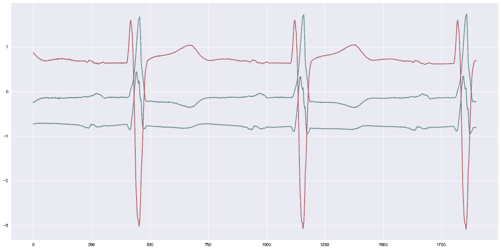

所有三个线索一起策划；注意波浪高度的差异；该差异反映了心脏向量在 3 个垂直方向上的分量

让我们更深入地了解一下 sigs

```
sigs
#array([[-0.2535, -0.7315,  0.8685],
       [-0.2395, -0.7335,  0.8635],
       [-0.232 , -0.7345,  0.8565],
       ...,
       [-0.2315, -0.811 ,  0.6905],
       [-0.2355, -0.8135,  0.6915],
       [-0.229 , -0.8145,  0.699 ]])
```

每一行代表一个时刻，准确地说，是 1/1000 秒。这三个值分别对应于导联 I、aVF 和 v2 的电压。我们可以捕捉一个瞬间

```
sigs[3]
# array([-0.231 , -0.7285,  0.849 ])
```

让我们试着分别沿着 x，y，z 轴画出这三个向量

```
fig = plt.figure(figsize=(20,6),dpi=144)
ax = fig.add_subplot(111, projection='3d')
ax.grid()
ax.set_xlim(-1.5,1.5)
ax.set_ylim(-1.5,1.5)
ax.set_zlim(-1.5,1.5)
ax.plot([0,-0.7285],[0,0],[0,0],color='g',label='lead v2')
ax.plot([0,0],[0,-0.231],[0,0],color='b',label='lead I')
ax.plot([0,0],[0,0],[0,0.849],color='y',label='lead aVF')
ax.plot([0,-0.7285],[0,-0.231],[0,0.849],color='r',label='sum')
plt.show()
```

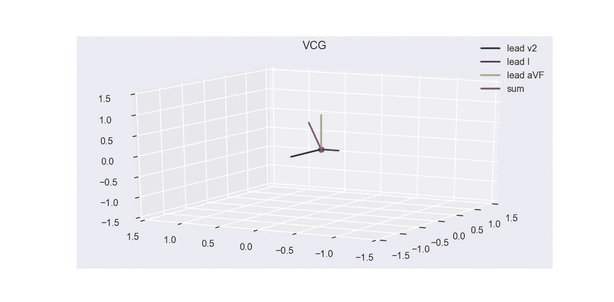

同样，正如你所料。但是注意，该图表示心脏向量(红色)的位置，从心脏的假想中心(0，0)开始

继续前进，为什么要停留在一个瞬间？我们可以从 **sigs** 中分割列，并绘制整个记录的总和向量

```
ax.scatter(sigs[:,0],sigs[:,1],sigs[:,2],color='r',marker='.',alpha=0.5)
plt.show()
```

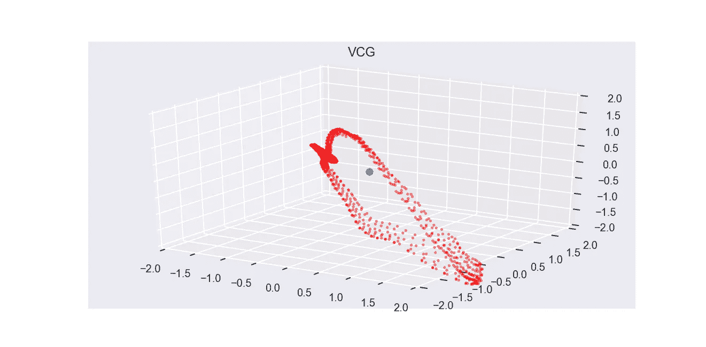

正常向量心电图

心脏电活动的快照是喉下病理的非常有用的指示器。心脏细胞活动的任何改变都会以自己独特的方式扭曲这个画面。在大多数心肌梗塞(“心脏病”)中，细胞从细胞的特定部分丢失，通过观察 VCG，你可以知道在哪里。

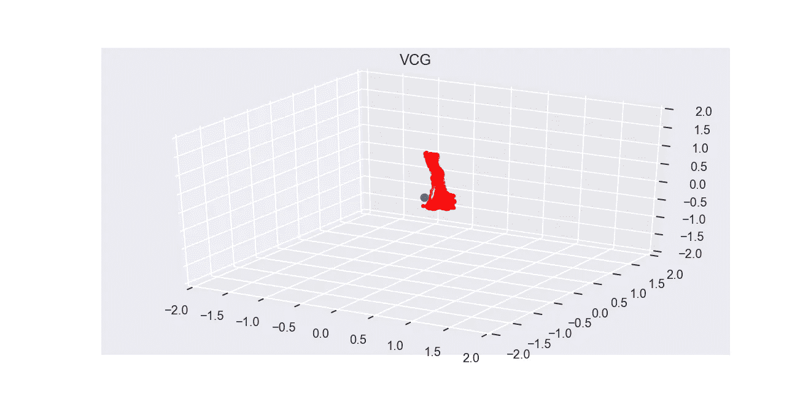

前外侧梗塞(心脏前壁死亡)；请注意 VCG 的合同

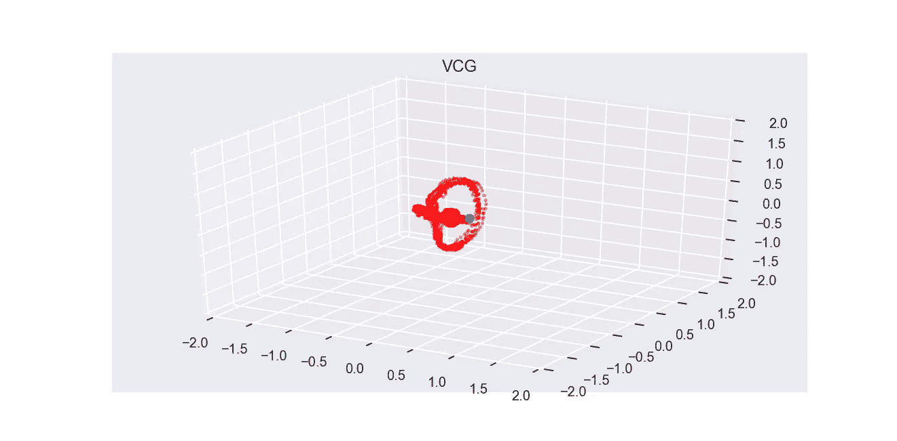

阴下动脉侧梗死(心底死亡)，缩小较少，但仍显著改变 VCG

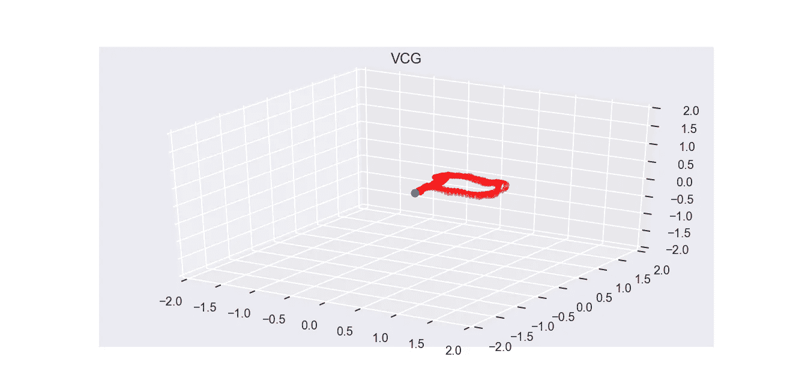

心房颤动(窦房结节律紊乱):VCG 不再以(0，0)为中心

通过一点动画，很容易产生随时间移动的心脏向量:一个跳动的心脏图，如果你愿意的话。人们只需定义一个绘制单个帧的函数。Matplotlib 使这变得过于复杂(该函数必须返回一个 *lines2d* 对象等等)，但是结果相当令人满意

```
accel_factor = 12 # Adjust this to speed up or slow down the drawingdef plot_vcg_frame(i): # i = a single moment
    global lead_endpoints, sum_of_leads, graph
    graph.set_data(sigs[i*accel_factor,0],sigs[i*accel_factor,1])
    graph.set_3d_properties(sigs[i*accel_factor,2])

    return graph,
ani = matplotlib.animation.FuncAnimation(fig, plot_vcg_frame, interval=1, blit=True)
plt.show()
```

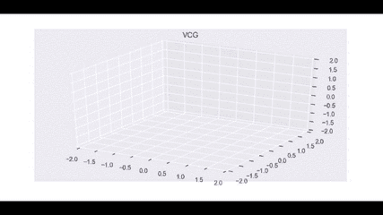

正常心向量图；实际心跳对应于该点的最大偏差

正确的视觉化不仅以一种富有表现力的方式呈现数据，而且还保留了数据的原始生物背景。另外，当你想到它时，整个过程将作为机器学习的特征提取(而不是将原始数据输入模型)。只不过，*右*款(叹气)。

*免责声明*:本文仅代表探索性数据分析*。所描述的程序都没有经过诊断试验研究或临床评估的验证。这些观点仅代表作者自己的观点，作者并不声称所描述的程序具有任何程度的敏感性/特异性/诊断准确性。文章中表达的观点不应作为临床决策的参考。*

1.  *心电向量图空间 QRS 环的平面性是急性心肌梗死的重要诊断和预后参数。医学假说。2019 年 9 月；130:109251.doi:10.1016/j . mehy . 2019.109251 . Epub 2019 年 5 月 31 日。考研 PMID: 31383333。*
2.  *Bousseljot R，Kreiseler D，Schnabel，a . EKG 的 nut nut-在互联网上的 PTB 的信号数据银行。生物医学技术，40 级，ergnzungsband 1(1995)S 317*