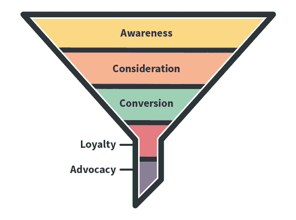
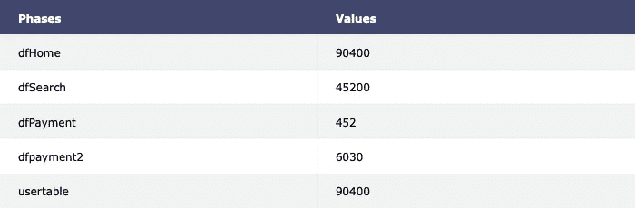
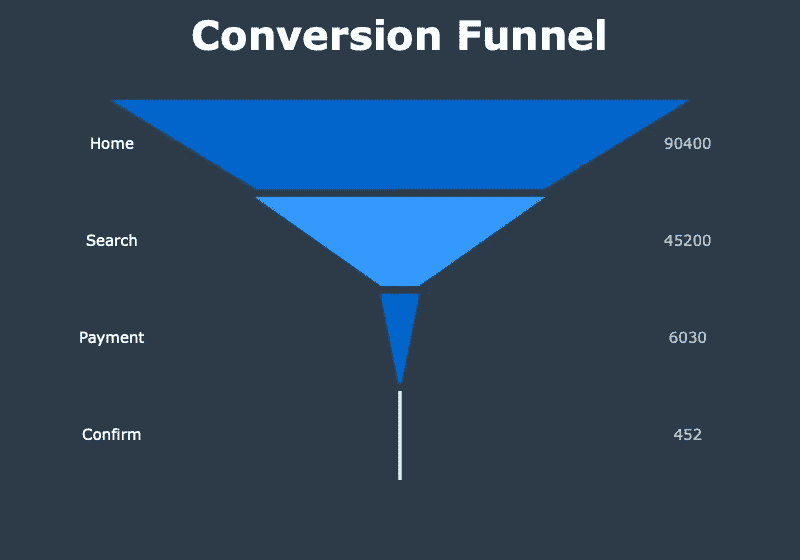
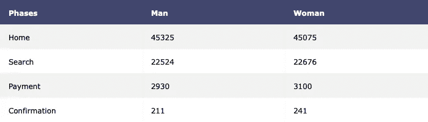
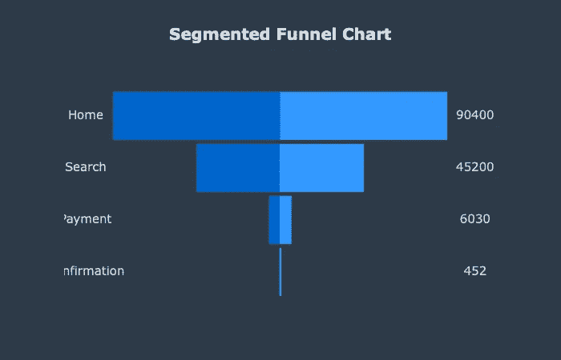
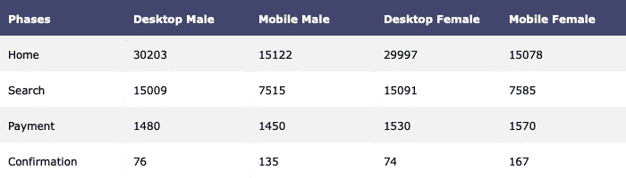
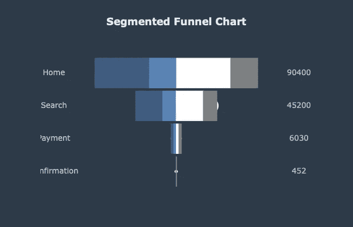

# 使用 Plotly 和 Python 实现数据可视化

> 原文：<https://medium.com/analytics-vidhya/data-visualisation-using-plotly-and-python-845f00f078a0?source=collection_archive---------6----------------------->

## 让您的数据可视化与 Plotly 互动

数据可视化是商业实践的一个重要部分，因为当今公司会产生大量的数据。世界各地的传感器收集气候数据、点击用户数据、方向盘预测汽车数据等。所有这些收集到的数据都为企业提供了关键的见解和可视化，使这些见解易于理解。

> “我们大多数人需要听音乐才能理解它有多美。但这通常是我们展示统计数据的方式:我们只展示音符，不演奏音乐。”汉斯·罗斯林克

Python 数据分析可以通过几个包实现。Matplotlib 和 Seaborn 是 python 中最常见的包。我们将讨论 Plotly 包。它可以用于 Python 脚本、Jupyter notebook 和 web 应用程序的数据库。

## 介绍

Matplotlib 很完美，Seaborn 很棒，但是 Plotly 呢？这是一个全新的水平。Plotly 通过提供完整的交互选项和众多编辑工具，提供了比普通图形更多的功能。与其他产品不同的是，它可以在离线或在线模式下显示图表，它还配备了一个强大的 API，如果设置为在网络浏览器中显示图表，它将无缝工作，并能够保存本地副本。你将面临的唯一困难之一是在众多选择中决定你要用于你的故事的资源。

## 安装

要安装`Plotly`包，打开终端并输入`pip install plotly`。Plotly 是一个运行在 JSON 上的平台，JSON 是一种以字典格式将参数传递给 Plotly API 的格式。查看可视化效果时，绘图和信息会保存到您的 Plotly 帐户中。您将有总共 25 个图可以保存在互联网上，而无需对云中的更多存储空间收费，但这些图像可以轻松地存储在本地并删除，同时为更多图像腾出空间。

有两种显示图的主要方式。如果使用 Jupyter Notebook 或其他交互式 python 环境(扩展名为`.ipynb` 的文件)，则`py.iplot()`函数会在单元格下方的输出中显示绘图。另一方面，`py.plot()`返回一个可以保存的 URL，并使用默认的 web 浏览器打开它。

## 入门指南

```
import plotly.plotly as py
import plotly.graph_objs as go
```

`import plotly.plotly as py`:具有与 Plotly 服务器通信的功能

`import plotly.graph_objs as go`:具有生成图形对象的功能。这是一个有用的模块，用于调用 help 来查看作为对象参数的所有属性。

我们将为一个电子商务网站绘制一个简单的转换漏斗。我们的目标是建立一个简单的转换漏斗，并开发洞察力。



## 加载数据集

我利用了 Kaggle 上的[电子商务网站数据](https://www.kaggle.com/aerodinamicc/ecommerce-website-funnel-analysis)。

在加载数据之前导入必要的依赖项。

数据科学管道中的第一个过程是探索性数据分析，首先理解数据并尝试从中收集尽可能多的见解是一种好的做法。EDA 就是在数据变脏之前弄清楚它们的意义。然后我们可以研究数据，看看每个数据集中有多少缺失值。每个数据集只有一个转换漏斗步骤，它们通过`user_id`连接

现在，我们可以创建一个表格，从中可以看到漏斗不同阶段的值。



显示漏斗不同步骤的表格

## 基本转换漏斗

[转化漏斗](https://en.wikipedia.org/wiki/Conversion_funnel)描述了购买者购买过程中的不同阶段，分为漏斗上、中、下三个阶段。

这个漏斗将是最基本的。让我们设想一个转化漏斗，显示每个事件/阶段的转化数量。



跨不同渠道的转换漏斗

## 为分段漏斗准备和合并数据

这个漏斗代表了我们从上面看到的`table1.py`中的一样东西，但更具视觉冲击力。此外，与支付页面的用户数量相比，搜索页面的用户数量明显减少。这可能是由许多因素造成的。电子商务网站可以想出不同的策略来留住客户并增加保留率。

如果我们更彻底地挖掘数据，我们可以产生更多的见解。在漏斗中的每一步，我们都可以找到性别和支付确认之间的相关性。为此，需要将所有数据框合并成一个数据框。在每个阶段或过程中，了解每个性别是很重要的。



各阶段基于性别的细分

让我们用分段漏斗图来表示上表。



从分段漏斗图来看，支付最终货款购买产品的女性多于男性。虽然性别差异很小。

要了解每个性别访问电子商务网站最常用的设备类型，我们可以根据设备类型和性别创建一个分段漏斗。听起来不错吧？让我们再回到数据上来



性别—每个阶段基于设备类型的细分

这是通过在 Pandas 中使用 groupby 函数来实现的。我们将性别和设备类型数据汇总在一起。



为了便于解释和分析，我绘制了一个堆积漏斗图。

## 推荐

根据你的转化路径有多长，你可能需要与你的客户进行一些不同的互动，以赢得他们的忠诚度，并让他们进入漏斗的下一步

正如我们从视觉效果中看到的，大多数用户从他们的桌面访问电子商务网站，与确认页面上的用户数量相比，主页上的用户数量急剧减少。电子商务网站可以想出一些策略来阻止客户使用他们的桌面应用程序。潜在客户放弃购物车的原因有很多。他们可能只是浏览、比较价格，或者忘记完成购买。[废弃的购物车](https://www.oberlo.com/ebooks/get-sales-dropshipping/abandoned-cart)并不意味着错过了销售，所以你仍然可以通过电子邮件营销、重新定位广告甚至推送通知等方式与他们沟通。

## 参考

1.  [https://www . tutorialspoint . com/advanced _ excel _ charts/advanced _ excel _ 漏斗 _chart.htm](https://www.tutorialspoint.com/advanced_excel_charts/advanced_excel_funnel_chart.htm)
2.  [https://www . ka ggle . com/danielrozputynski/funnel-vizualitation-with-plotly](https://www.kaggle.com/danielrozputynski/funnel-vizualitation-with-plotly)
3.  [https://en.wikipedia.org/wiki/Conversion_funnel](https://en.wikipedia.org/wiki/Conversion_funnel)