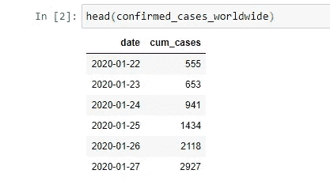
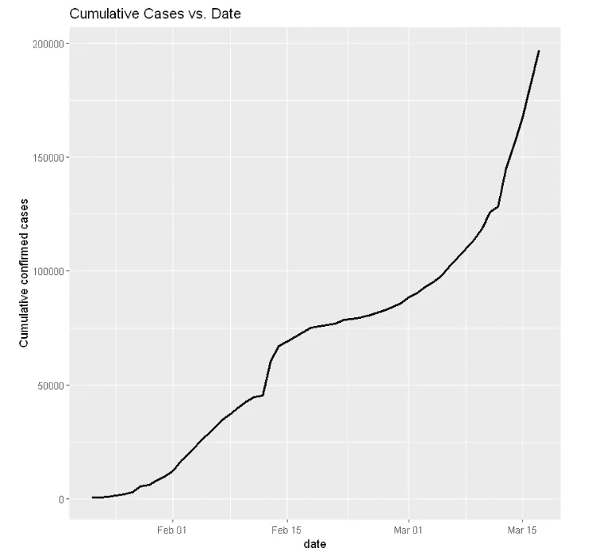
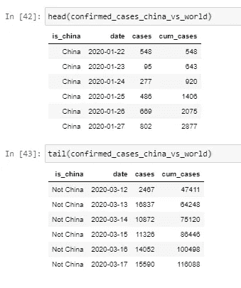
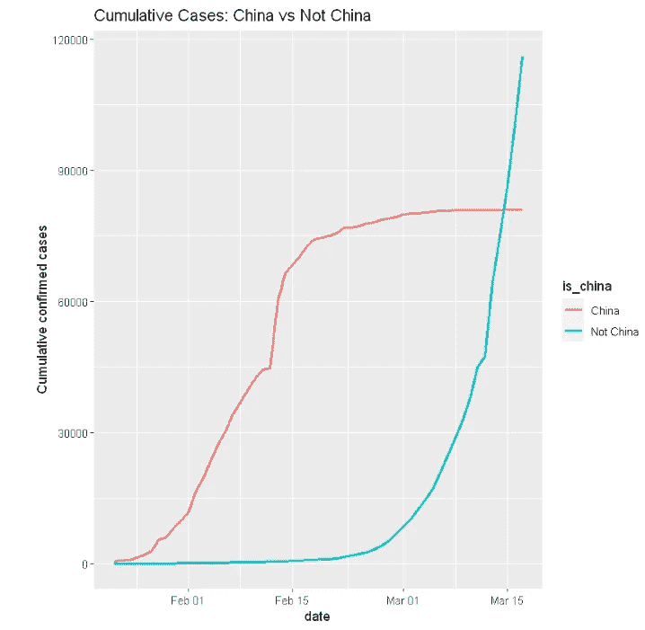
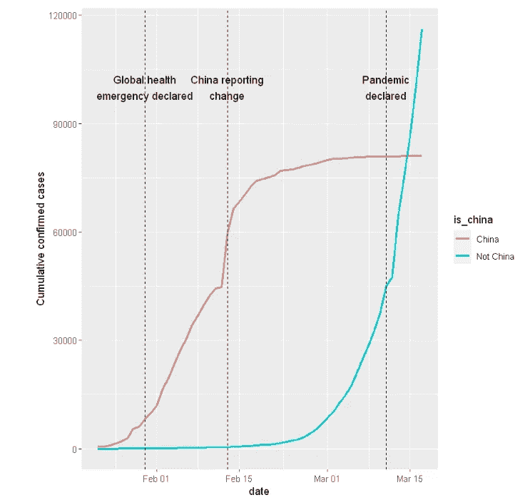
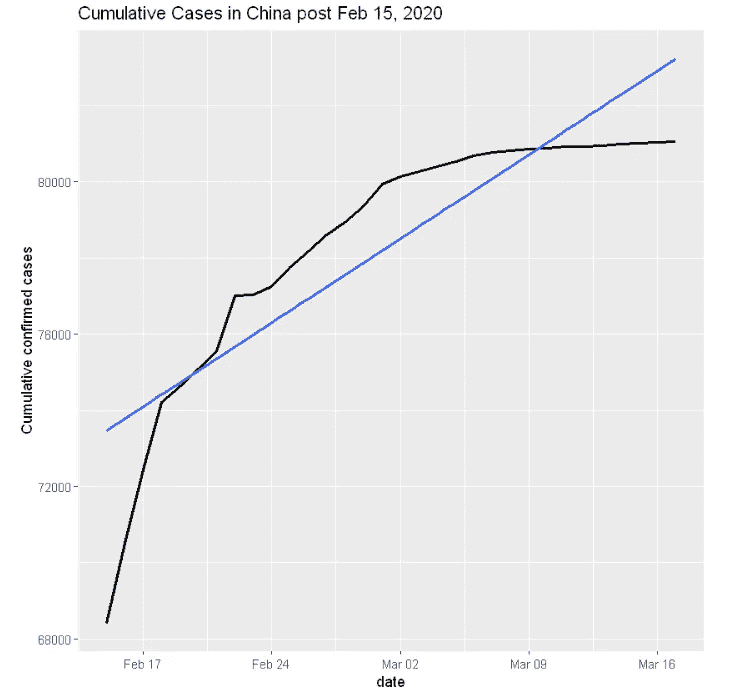
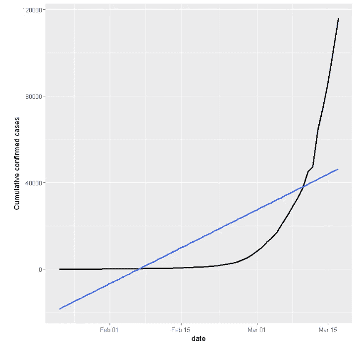
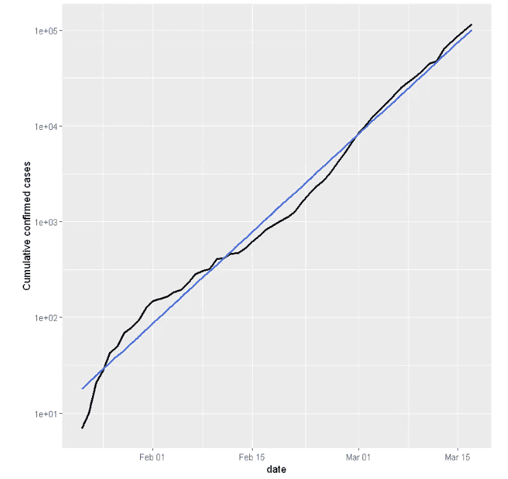
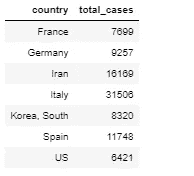
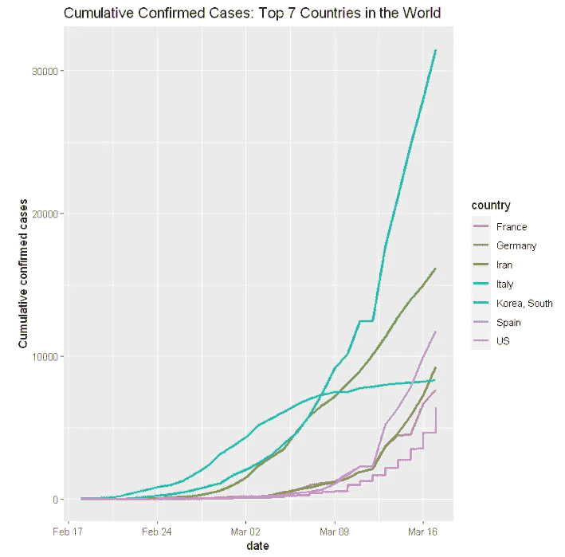

# 数据可视化:一场流行病变成了疫情！

> 原文：<https://medium.com/analytics-vidhya/data-visualization-an-epidemic-turned-into-a-pandemic-ad39d5f17fb6?source=collection_archive---------22----------------------->

**背景**

新冠肺炎于 2019 年 12 月在中国武汉首次爆发。2020 年 3 月 11 日，世卫组织宣布新冠肺炎疫情为疫情。尽管世界各地采取了关闭和隔离等预防措施，但病毒在全球传播的速度之快令人难以想象。

**数据来源**

约翰·霍普金斯大学系统科学与工程中心创建了公开可用的数据，这些数据来自多个国家的世卫组织、疾病控制和预防中心(CDC)和卫生部-【https://github.com/RamiKrispin/coronavirus

**目标**

可视化疫情爆发最初几周的新冠肺炎数据，以了解该病毒何时成为全球疫情，以及在此期间受影响国家的情况。

**分析**

下表显示了按日期分列的全球新冠肺炎累计确诊病例。

为了更好地理解数据，让我们将结果可视化，如下所示。

该图显示了全球确诊病例总数的上升，迅速接近 200，000 例。然而，在 2 月中旬有一个奇怪的跳跃，然后新病例的速度放缓了一段时间，并在 3 月再次加速。让我们深入了解一下到底发生了什么！

众所周知，在疫情爆发的早期，病例仅集中在中国。现在让我们分别绘制中国和世界其他地区的新冠肺炎确诊病例，以作比较。

用于可视化比较的数据如下表所示:

在绘制中国与非中国的结果时，显然，两条线显示了不同的趋势。大多数病例是 2 月份在中国观察到的。这种情况在 3 月份发生了变化，当时世界目睹了疫情的爆发，中国以外的病例总数超过了中国的病例数。

研究表明，在疫情爆发期间发生了几起具有里程碑意义的事件。关键的一个揭示了 2020 年 2 月 13 日中国线的巨大跳跃。就疫情而言，这不仅仅是糟糕的一天。人们发现，中国在那一天改变了报告数据的方式。

现在，让我们对这些事件进行注释，以便更好地解释如下图所示的变化。

其次，当试图评估未来问题的规模和严重程度时，能够衡量病例数量的快速增长是很重要的。一个好的起点是检查案例的增长速度是比线性方式快还是慢。

此外，随着中国报告的变化，在 2020 年 2 月 13 日左右观察到的病例明显激增。然而，几天后，中国的病例增长似乎已经放缓。

现在让我们描述一下 2020 年 2 月 15 日之后新冠肺炎在中国的增长。

上图表明，中国的增长率低于线性增长率。这意味着在二月底到三月初，病毒在一定程度上被控制在中国。

让我们找出世界其他地方与这种线性增长相比的状况！

从上图来看，一条直线并不是一个很好的拟合，它表明世界其他地区的病例增长速度远远超过线性增长。

为了实现更好的拟合，让我们对 y 轴进行对数变换，看看结果。

对数标度当然与数据吻合得很好。由此可以得出两个有趣的推论:

1.  有利的一面是，从数据科学的角度来看，良好的契合是一个好消息。
2.  不利的一面是，从公共健康的角度来看，这得出结论，世界其他地方的新冠肺炎病例正以指数速度增长；这是个可怕的消息！

新冠肺炎对所有国家的影响并不一样。因此，寻找受严重影响的国家会有所帮助。因此，现在让我们找出除中国以外确诊病例最多的国家。

除中国外，新冠肺炎排名前 7 的国家如下表所示:

结果显示，即使疫情首先出现在中国，但在亚洲的许多国家中，只有韩国是确诊病例最多的 7 个受影响国家之一；其他的有法国、意大利、西班牙和德国。

为了获得更多背景信息，我们可以绘制这些国家一段时间内的确诊病例图，如下所示:

