# 数据可视化:来自数据的洞察力

> 原文：<https://medium.com/analytics-vidhya/data-visualization-an-insight-from-data-be64682f2f07?source=collection_archive---------18----------------------->

数据可视化使我们能够快速解释数据，并帮助非常有效地传达信息。它帮助我们识别数据集中的任何模式。数据的视觉信息非常有影响力，并从数据中获得清晰的洞察力。

这是一个来自网络的例子

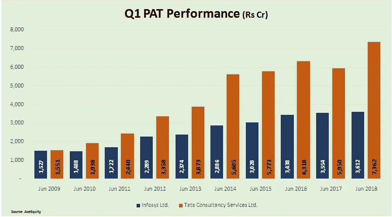

图片 Courtsey:moneycontrol.com

**为什么要可视化数据？**

观察模式

识别可能异常的极端值

简单的解释

**用于数据可视化的 Python 流行绘图库**

Python 提供了多个图形库，这些图形库提供了不同的特性，比如 matplotlib、
plotly、
seaborn、
ggplot。

我们将讨论两个最流行的库 matplotlib 和 seaborn。

> **MATPLOTLIB**

Matplotlib 是一个 2D 绘图库，可以生成高质量的图形。它是建立在 NumPy 数组上的多平台数据可视化库。Matplotlib 最重要的特性之一是它能够很好地适应许多操作系统和图形后端。让我们开始计划吧。

# **散点图**

**什么？**
散点图是一组点，代表水平轴和垂直轴上绘制的两个不同变量的值

**什么时候？**
散点图用于表达两个数值变量之间的关系
散点图用于显示两个变量之间的相关性，例如身高和体重。

**导入库**

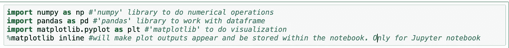

导入库

**导入数据**
我们将处理来自公司的电子商务客户 csv 文件。它有客户信息，如电子邮件，地址和他们的彩色头像。

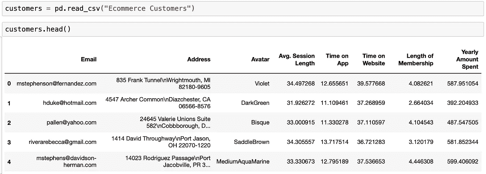

数据加载到数据帧中

“每年花费的金额”随着“会员时间”的增加而增加

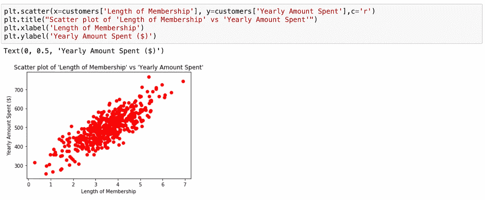

散点图

# 柱状图

**什么？**
它是用不同高度的条形来图形化表示数据。它将数字分成不同的范围，每个条形的高度描述了每个范围或仓位的频率。

**什么时候？**
表示数值变量的频率分布

“会员资格期限”的频率分布显示，大多数客户选择 3 至 4 个月/年的会员资格。

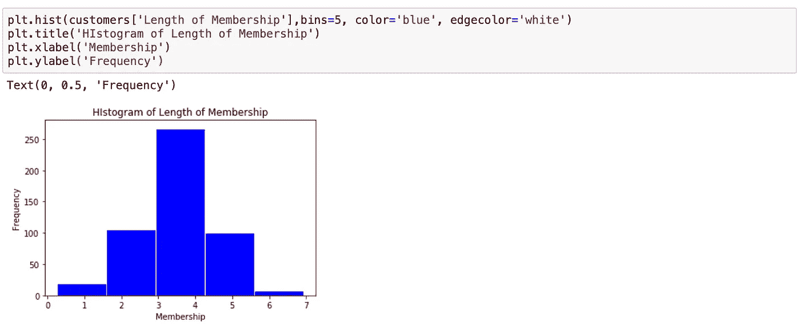

柱状图

# 条形图

**什么？**

**什么时候？**
表示分类变量的频率分布
条形图可以很容易地比较不同组之间的数据集

金额范围条形图显示大多数客户的消费金额在 *$ 449 到$ 549* 之间

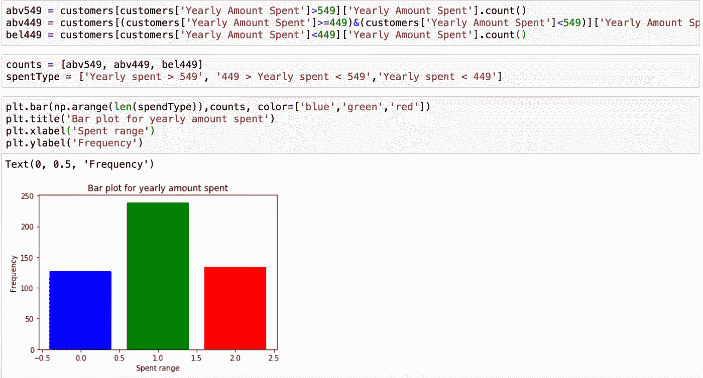

每年花费的金额

> **SEABORN**

Seaborn 是一个基于 matplotlib
的 Python 数据可视化库，它提供了一个高级接口，用于绘制有吸引力且信息丰富的统计图形。
我们将在 *Seaborn* 使用不同的数据集看到上述所有地块的实现。

导入库

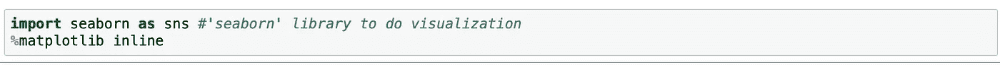

导入库

Seaborn 库有许多可用示例数据集

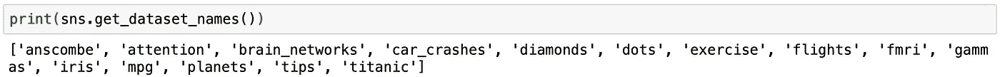

检查 seaborn 库中的可用数据集

我们将使用“汽车碰撞”数据集。

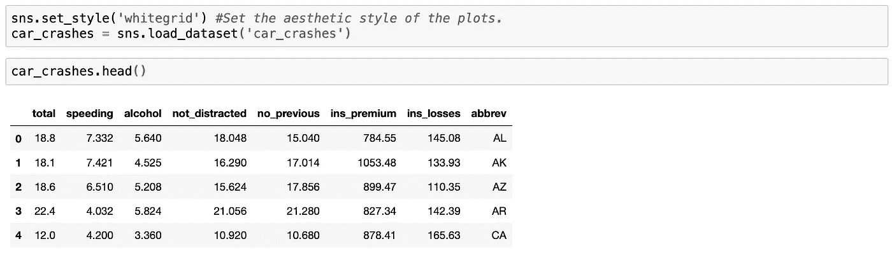

从 seaborn 库导入数据集

# **散点图**

让我们观察一下酒精是否与车速有关

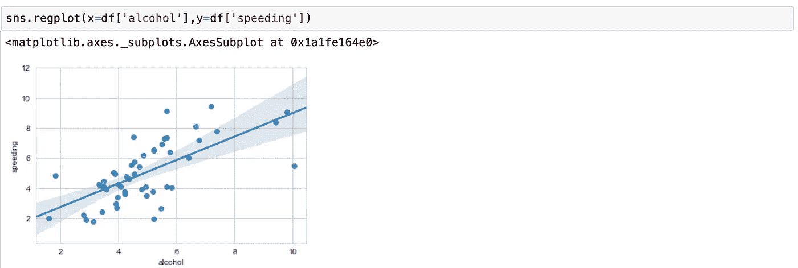

来自 Seaborn 库的 Regplot

我们可以在上面的图中看到的线被称为回归线，它估计并绘制了与 x 和 y 变量相关的回归模型。默认情况下，fit_reg 设置为“true”。
我们将把 fit_reg 显式设置为“false ”,并尝试使用“*”标记。

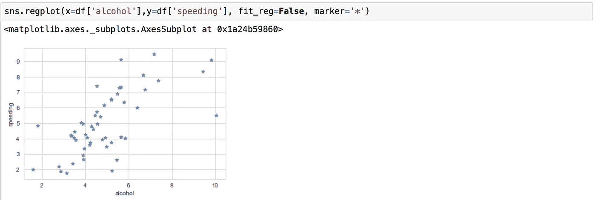

Regplot，fit_reg 设置为 false，标记为*

# **直方图**

默认内核密度估计的速度直方图

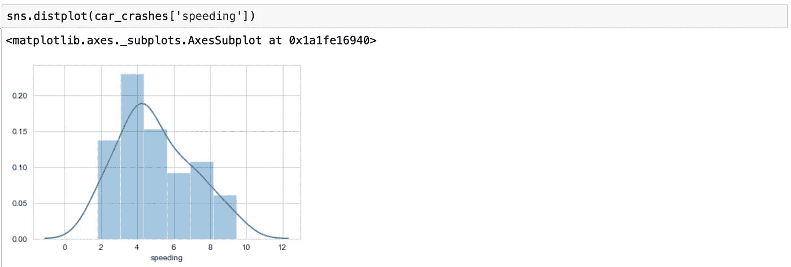

超速 kde 直方图=真

没有内核密度估计和设置为“5”的箱的速度直方图

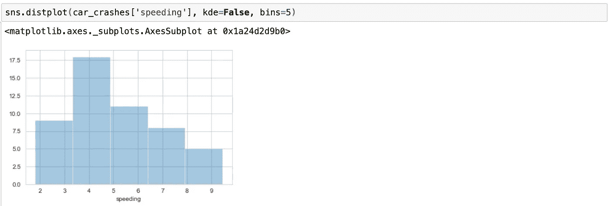

kde =假且 bins = 5 的超速直方图

# **柱状图**

让我们尝试使用“tips”数据集来理解条形图

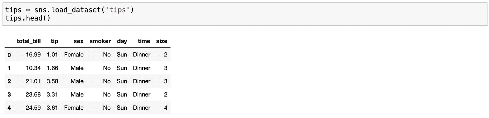

从 seaborn 库导入“提示”数据集

**条形图**是一个通用图，允许您根据某个函数(默认为平均值)聚合分类数据

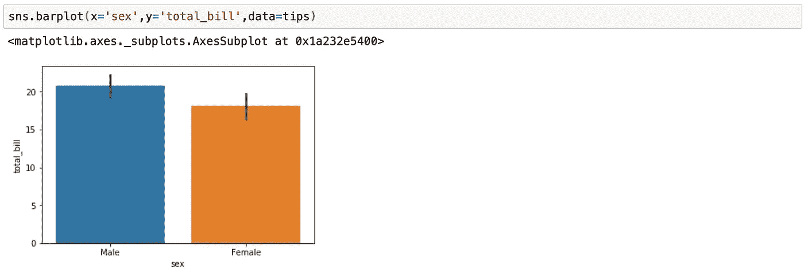

来自 seaborn 图书馆的柱状图

我们可以把估计器对象改成你自己的函数，把向量转换成标量，我们可以用 numpy 来做

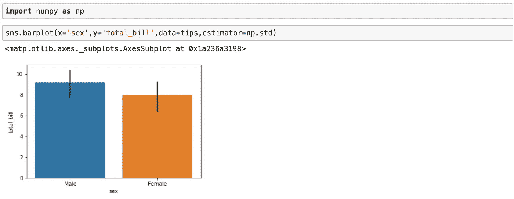

带估计量的条形图

**计数图**这基本上与柱状图相同，除了估计器明确地计数出现的次数。这就是为什么我们只传递 x 值

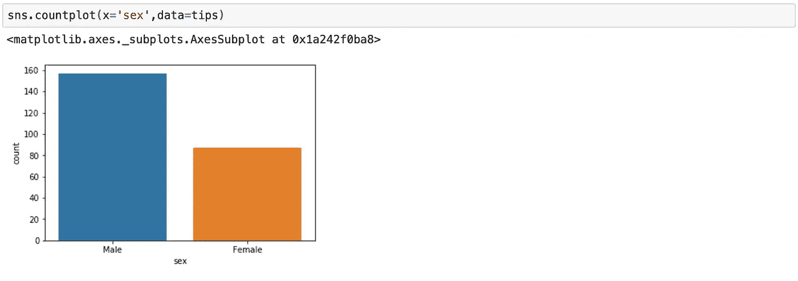

seaborn 图书馆的 countplot

**分组柱状图
和**分组柱状图的日期和时间

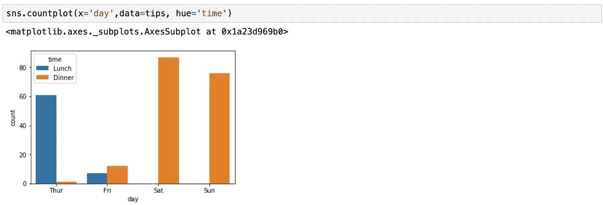

带色调的计数图

# **方框和胡须图**

箱线图(或盒须图)以一种便于变量之间或分类变量水平之间比较的方式显示定量数据的分布。
“total _ bill”的方框和须状图，直观地解释五位数汇总

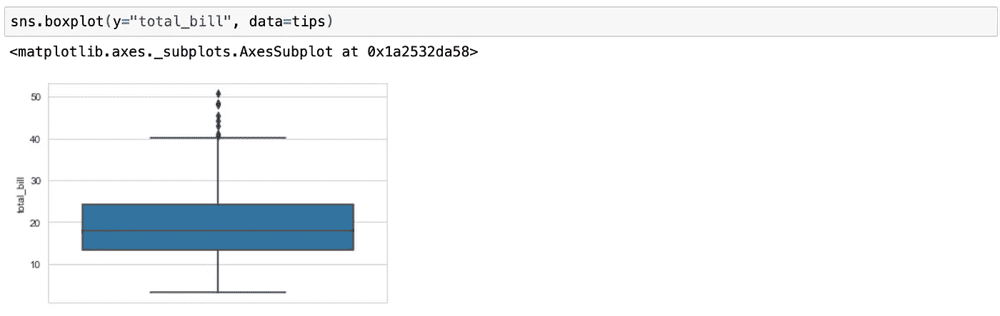

总账单箱线图

要理解五位数摘要，最快的方法是在数据集上使用 pandas dataframe describe 方法。最小值、25%、50%、75%和最大值

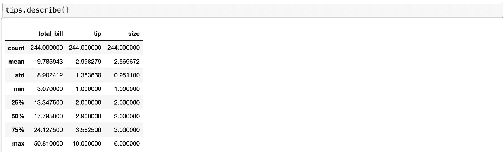

数据帧描述

数值变量与分类变量的方框图和须状图

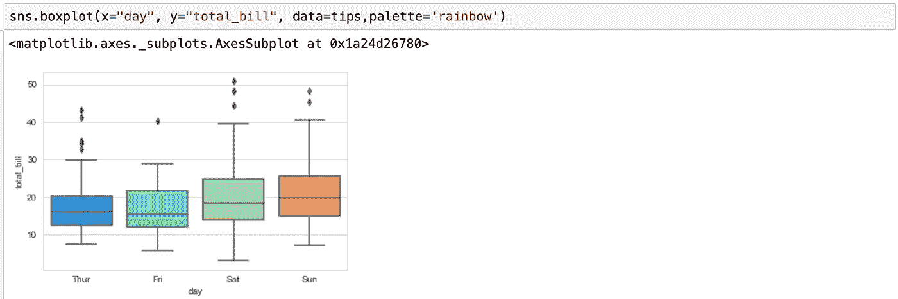

箱线图数值与分类

分组框和须状图

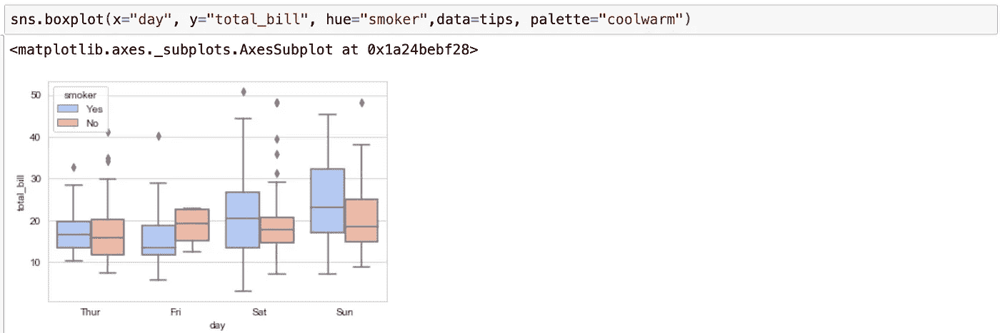

分组箱线图

# 成对图

它用于绘制数据集中的成对关系。它为联合关系创建散点图，为单变量分布创建直方图

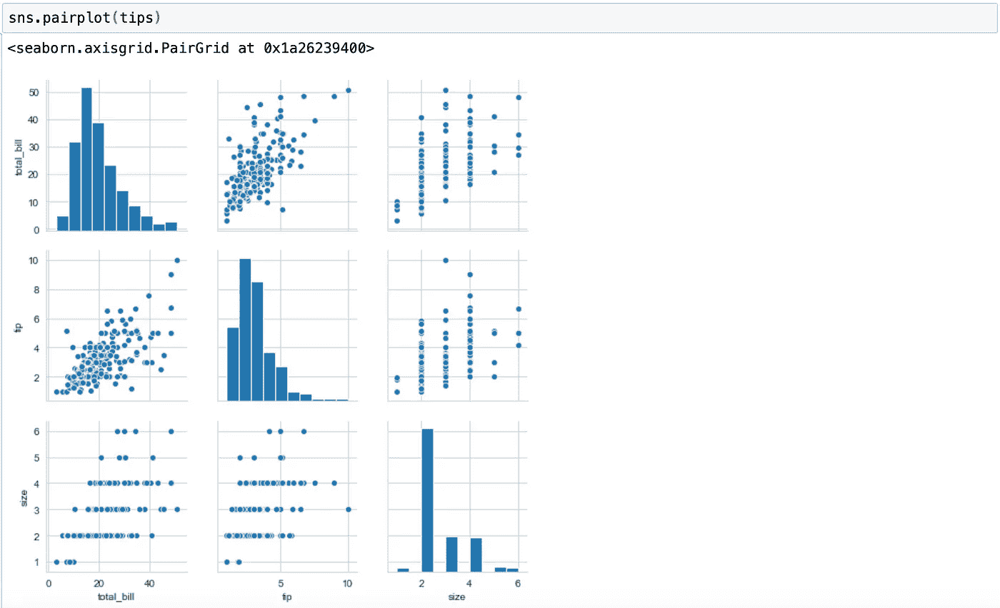

配对图

它支持色调参数(对于分类列)

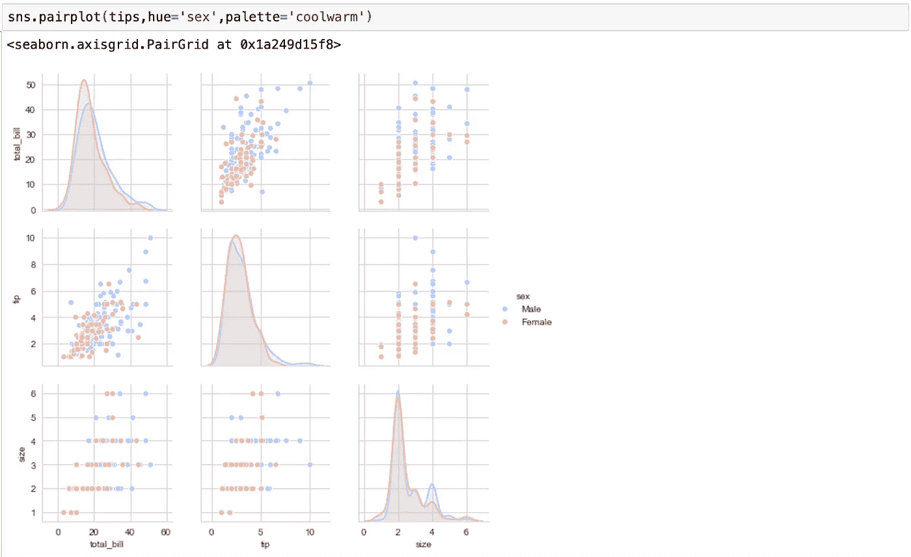

带色调的配对图

*这是对 Python 中数据可视化的概述，我将在下一篇文章中介绍更高级的内容。感谢阅读！*