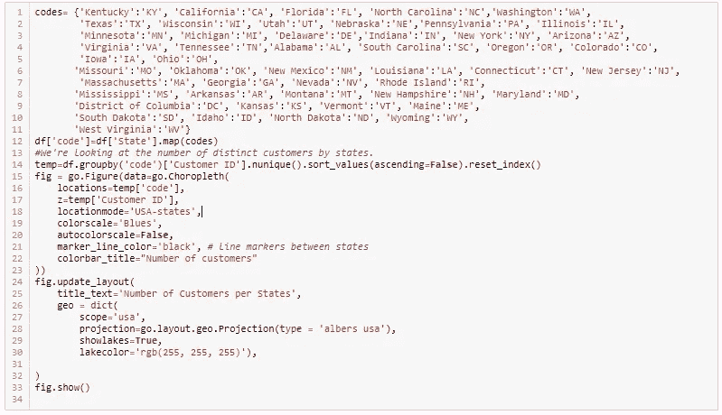
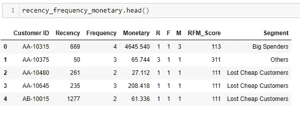

# 使用 Python-客户细分进行数据可视化和 RFM(近期、频率和货币)分析

> 原文：<https://medium.com/analytics-vidhya/data-visualization-and-rfm-recency-frequency-and-monetary-analysis-using-python-customer-d7e129437aac?source=collection_archive---------4----------------------->

客户细分(cible 核心，2019 年 2 月)

我们正处于数字化转型的中期，我们的大多数日常需求，如购买物品、旅行或在互联网上搜索(衣服、电话、食物等)。)产生大量数据。如今，公司依靠这些数据来分析和了解客户的行为，并对这些客户进行细分，以改进他们的营销活动。**客户细分**是零售商非常常用的方法。

**RFM 分析**是一种常用于客户细分的技术。RFM 将考虑**的最近**(即客户最后一次下订单的日期)，然后将考虑订单的**频率**和所购商品的**金额**(在给定的一段时间内或最后一次订单)，以建立不同的客户群。

作为 RFM 分析的一个例子，我们将在这项研究中使用零售客户数据，使用 Python 及其一些可视化库和工具。

我们的数据集包含美国不同州的客户信息。这些客户在 2016 年 1 月 2 日**至 2019 年 12 月 30 日**期间在线下了 5009 笔采购订单。这些特征(列)是:

> **订单 ID :** 在线订单的唯一标识符。
> **订货日期**:客户订货的日期。
> **客户 ID :** 唯一的客户标识符。
> **州**:每个客户居住的国家的名称。
> **产品 ID :** 唯一的产品标识符。
> **类别:**产品类别名称。
> **数量:**每笔交易每种产品的数量。
> **价格:**产品的单价。

我们要提醒的是，数据清理已经完成，(即，我们在使用之前删除了数据集中所有的错误术语和缺失数据)我们没有提到前一步，因为这不是项目的主要目标。

让我们做一点**数据可视化**以便更好地理解我们的数据。

首先，我们导入这些库。

我们导入数据集，看看它是什么样子。

> **df = PD . read _ CSV(' sales . CSV ')**
> 
> **df.head()**

零售数据集的第一行

这是我们按州列出的客户分布图

美国每个州的客户数量

如您所见，有些州的客户数量很少。我们决定只考虑前 12 个州，因为它们的用户数量至少是其他州的两倍。但是，这完全取决于你决定采取什么样的营销策略。

新数据集的头

这些选定状态的可视化将是:

结果是:

美国客户数量最多的 12 个州

**现在，让我们开始我们的******分析。****

*   **我们从计算客户的最近度(R)开始。**

**为了确定从他最后一次购买到现在过了多长时间，我们需要一个参考日期来开始计算。然后我们用两个日期的差值来计算经过的时间。**

**假设我们决定在数据集的最后一个交易记录日期之后 2 天(这个日期是我们的参考日期)进行分析。**

****

**近期主管**

**让我们看看基于最近的客户分布。**

****

**客户最近的直方图**

**这里，我们可以注意到直方图偏向左侧，因此这是一个右偏分布的分布符号，我们还可以看到地毯图在 0 到 400 之间很拥挤。基于这一点，我们可以看到，在过去的 400 天里，也就是过去的 4 个月里，我们拥有高度集中的客户。**

*   ****现在我们要确定顾客购买产品的频率(F)。****

****

**频率主管**

****

**客户频率直方图**

**在我们的数据库中，我们可以看到大多数顾客购买次数不超过 10 次，这还不够，因为我们的数据是 04 年的。**

*   ****现在在最后，我们要确定货币(M)。****

****

**货币主管**

**让我们看看基于最近的客户分布**

****

**客户货币直方图**

**标明没有多少顾客消费超过 3000 美元。**

**现在让我们检查一下 **RFM 表**。**

****

**RFM 的首脑**

**感谢我们的 **RFM 表**，我们现在要提出一个客户细分策略。**

> ****客户细分****

**根据公司的目标，可以用几种方式对客户进行细分，以便在经济上有可能开展营销活动。电商公司的理想客户一般是相对于学习日期(我们的参考日期)最近的，非常频繁的，消费足够的。
因此，如果你想知道他们是发送促销电子邮件或提供新服务的合适客户，RFM 因素就非常重要。**

**根据 RFM 表，我们将为每个客户的每个 RFM 值分配一个 1 到 3 分的分数。**

**3 是最好的分数。1 是最差的分数。通过组合在 R、F 和 m 处获得的三个分数来计算客户的 RFM 分数。例如，具有 ID-1 的客户的最近分数为 3，频率分数为 3，金额分数为 3(**货币分数**)。因此，他的 RFM 分数是 3-3-3。具体来说，**这是一个最近购买次数最多、花费最多的客户。****

**为了得到 R 值，我们决定取最低的月区间，因为我们的分布非常向右倾斜，所以我们只能选择 1 个月。**

**下面，我们正在开发一个功能，可以让我们找到每个客户的最近得分。**

****

**我们对顾客购买的频率也是如此。**

****

**另一个计算货币分数的简单方法是使用三分位数。熊猫的**【qcut】**功能将整个系列独特的“货币”分成 3 等份。(在上图中，间隔以黄色突出显示)。**

**有关“qcut”功能的更多信息，请参见关于**[**PD . qcute()**](https://pandas.pydata.org/pandas-docs/stable/reference/api/pandas.qcut.html)**的文档。******

********

****这些间隔将被标记为从 1 到 3，与新近度和频率的方式相同。****

********

****因此，我们得到了最后一张表，其中包含了最近、频率和货币的所有得分****

********

****R、F、M 主管****

****最终的 RFM 分数将通过连接所有不同的 R、F 和 M 分数来获得。这将允许我们定义客户群。由于客户细分实际上取决于公司的目标，我们将只满足于市场营销领域最常见的细分。我们受到了 Joao Correia 在他的文章中定义的细分市场的启发，您可以在这里找到。****

********

****RFM 负责人 _Score****

****下表显示了我们将在数据集中识别的常见关键段。****

********

****关键路段(**若昂·科雷亚，2016 年 7 月)******

****下面的代码允许我们创建一个新的列“segment ”,它代表我们的客户所在的细分市场。我们首先开始识别细分市场:**“失去的廉价客户”、“失去的客户”、“最佳客户”和“差一点的客户”。我们为他人分配“他人”******

********

****然后，确定**“忠诚客户”**细分市场中的客户，并将其分配到“细分市场”。****

********

****我们对**‘挥金如土’**的细分市场也是如此。****

********

****因此，我们在我们定义的细分市场中拥有客户。****

********

****段头****

****当然，根据公司自己设定的目标，这些细分市场可以有不同的定义。**“其他”**细分市场中的客户可以让我们定义更多。假设我们有从 1 到 3 标记的三个组(R，F，M ),我们有 **3X3X3=27 种分割可能性。******

****我们将对我们的细分市场做一个小的可视化。然后，我们将绘制关键的细分市场，然后给出一些营销建议，公司可以采取这些建议来留住这些客户****

********

****每个细分市场的客户****

****使用 matplotlib 的方形图显示线段分布的另一种更具表达力的可视化方法如下:****

****************

****客户细分****

****这两个图表显示“大客户”、“失去的廉价客户”部分最高，而“几乎失去”部分最低。****

> ******建议******

*   ****最佳客户:奖励他们的多次购买。他们可能是新产品的早期采用者。建议他们“推荐一个朋友”。此外，他们可能是最忠实的客户，有习惯订购。****
*   ******失去的廉价客户:**给他们发送个性化邮件，鼓励他们订购。****
*   ****花钱大手大脚的人:告诉他们折扣，让他们在你的产品上花更多的钱****
*   ******忠诚的顾客:**创建忠诚卡，顾客每次购物都可以获得积分，这些积分可以转换成折扣****

****在我们的下一篇文章中，我们将展示机器学习如何帮助客户细分，我们将重点关注**无监督学习**算法，如 **Kmeans。******