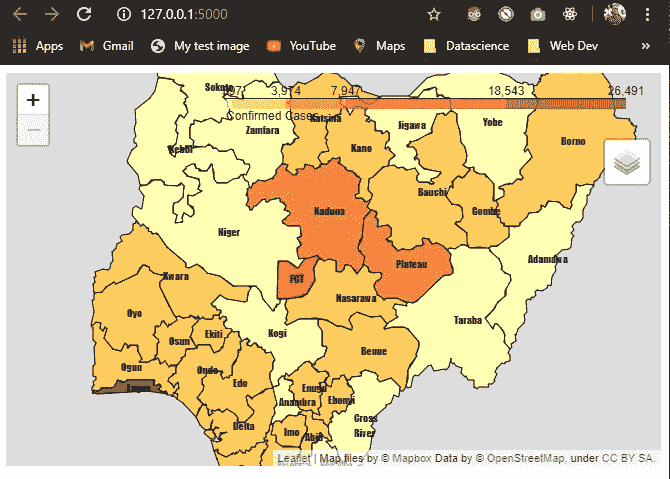

# 数据可视化:使用 Heroku 将交互式地图部署为 Web 应用程序

> 原文：<https://medium.com/analytics-vidhya/data-visualization-deploying-an-interactive-map-as-a-web-app-with-heroku-51a323029e4?source=collection_archive---------4----------------------->

本文将尝试分享如何使用 follow、Flask 和 Heroku 部署交互式地图可视化的见解。这是我上一篇关于叶子的文章的后续。

这篇文章的代码托管在 GitHub [这里](https://github.com/JUGG097/Folium-Choropleth-Map-Heroku)。

我将更多地关注 Flask 的使用和 Heroku 的地图部署，要了解更多关于使用 leav 进行交互式地图生成的信息，请查看这篇[文章](https://dev.to/jugg097/data-visualization-choropleth-interactive-map-with-python-using-folium-3684)。

我将把这个过程分为 3 个主要步骤。

# 第 1 步-基于 API 的交互式地图，带叶子

我将把从 API 获得的数据与包含尼日利亚地理坐标的 GeoJson 文件集成在一起，这个 GeoJson 文件是 follow 创建尼日利亚地理地图所需要的。使用的 API 的链接可以在[这里](https://ng-covid-19-api.herokuapp.com/)找到，它包含了尼日利亚每个州的新冠肺炎案例分布。

我已经得到了尼日利亚的 GeoJson 文件，请参考这篇[文章](https://dev.to/jugg097/data-visualization-choropleth-interactive-map-with-python-using-folium-3684)以了解如何在您选择的任何地理位置进行这项工作。

首先，我使用 ***请求*** python 模块用其 ***提取 API 数据。get()"*** 方法，用其 ***"将返回的数据解析为 JSON 格式。***【JSON()】法。

```
# Accessing API data using the python "requests" moduleresponse = requests.get("https://ng-covid-19-api.herokuapp.com/")data_json = response.json()
```

此外，我使用***geo pandas***python 包及其 ***”将上述 GeoJson 文件作为 pandas DataFrame 读取。***read _ file()"方法。

```
df = gpd.read_file("Nigeria_Geometry.geojson")
print(df)
```

API 数据和 Geojson 文件是不同的文件格式(J *SON vs DataFrame* )，我编写了一个自定义函数来帮助将它们集成到一个 DataFrame 对象中。使用“.apply()"方法我实现了这个函数，创建了新的列； ***确诊病例，出院和死亡。***

```
# Helper function implementationdf["Confirmed Cases"] = df["Name"].apply(get_stats, data = "confirmed")df["Discharged"] = df["Name"].apply(get_stats, data = "discharged")df["Death"] = df["Name"].apply(get_stats, data = "death")print(df)
```

最后，我使用了***【df】***data frame 对象来创建使用 leav 的交互式地图可视化。

有关使用 leave 进行地图可视化的更多详细说明，请参考此[文章](https://dev.to/jugg097/data-visualization-choropleth-interactive-map-with-python-using-folium-3684)。


生成的地图

# 步骤 2-创建烧瓶应用程序

Flask 是一个 python web 开发框架；其功能类似于 Django。

> 它被称为“微框架”,因为它的目标是保持核心简单但可扩展

Flask 通常用于将一个叶子地图转换成一个 Web 应用程序，并且很容易设置。

上面生成的叶子地图将会变成 Flask app，可以按照叶子文档[这里](https://python-visualization.github.io/folium/flask.html)给出的例子进行部署。

```
from flask import Flask
import folium
import pandas as pd
import geopandas as gpd
import requestsapp = Flask(__name__)@app.route("/")
def index():
    response = requests.get("https://ng-covid-19-   api.herokuapp.com/")data_json = response.json()...(truncated code snippet) return folium_map._repr_html_()if __name__ == "__main__":
    app.run()
```

我运行了 Flask 应用程序来测试我们的 follow map 是否正常工作，使用了:

```
python -m flask run
## Run at the terminal
```



Flask 应用程序运行时的输出…

# 步骤 3 —使用 Heroku 进行部署

> H eroku 是一个基于托管容器系统的平台即服务，具有集成的数据服务和强大的生态系统，用于部署和运行现代应用

上面创建的 Flask 应用程序将使用 Heroku 作为云主机进行部署。为此，我执行了以下操作:

首先，我将所需的 Heroku 配置文件添加到 Flask app 文件夹中，这些配置文件是 ***Procfile*** 和***requirements . txt .***

***Procfile*** 帮助在单行上声明流程类型，格式为“ ***<流程类型> : <命令>*** ”。对于我们的 Flask 应用程序，我们添加了进程类型“web”来帮助启动 web 服务器，并且“app: app”指定了模块和应用程序名称。在我们的应用程序中，我们有 app 模块，我们的 flask 应用程序也称为 app。

```
web: gunicorn app:app
```

***requirements . txt***文件包含了我们的应用程序所依赖的所有 python 模块和包及其相应的版本，以支持可复制的代码。文件中的格式是这个" ***<包/模块名> == <包/模块版本> "*** 。

```
folium==0.10.1geopandas==0.7.0Flask==1.1.2gunicorn==19.5.0
```

在添加了必要的 Heroku 配置文件后，我将项目文件夹推送到 [GitHub](https://github.com/JUGG097/Folium-Choropleth-Map-Heroku) 中，从那里我可以轻松地部署到 Heroku。另一种部署到 Heroku 的方法是通过 Heroku CLI(命令行界面)，我不会在本文中讨论。


GitHub 存储库设置

然后我进入 [Heroku 网页](https://www.heroku.com/platform) ( *注册/登录*)，从我的仪表板页面我点击“ ***新建*** ”按钮，选择“ ***新建 app*** ”，添加 app 名称，点击“ ***创建 app*** ”。创建 app 后，我被要求选择一种部署方法，因为我已经将代码推送到 GitHub repo，我选择了“ ***连接到 GitHub*** ”，我被要求将我的 GitHub 帐户连接到 Heroku。


Heroku 部署方法

最后，在将我的 GitHub 帐户连接到 Heroku 后，我只需指定包含要部署的代码的存储库并连接它。如果出现错误，我们可以在 Heroku 网页上查看构建日志。


Heroku 连接到 GitHub…选择要部署的存储库


[部署互动地图](https://folium-choropleth-map.herokuapp.com/)

这将是所有关于与 Heroku 部署一个交互式地图，希望这篇文章是一个很大的帮助，如果所以请留下一两个掌声，也 ***星*** 或 ***叉***GitHub 库[这里](https://github.com/JUGG097/Folium-Choropleth-Map-Heroku)和链接到部署的地图可以在[这里](https://folium-choropleth-map.herokuapp.com/)找到。

## **参考资料/其他资源**

*[**【https://devcenter.heroku.com/】**](https://devcenter.heroku.com/)*

**[***https://medium . com/the-andela-way/deploying-a-python-flask-app-to-heroku-41250 BDA 27d 0***](/the-andela-way/deploying-a-python-flask-app-to-heroku-41250bda27d0)**

***[***https://flask . pallets projects . com/en/1.1 . x/quick start/# a-minimal-application***](https://flask.palletsprojects.com/en/1.1.x/quickstart/#a-minimal-application)***

***[***https://python-visualization.github.io/folium/flask.html***](https://python-visualization.github.io/folium/flask.html)***

***[***https://dev . to/jugg 097/data-visualization-choropleth-interactive-map-with-python-using-foyl-3684***](https://dev.to/jugg097/data-visualization-choropleth-interactive-map-with-python-using-folium-3684)***

***[***https://code.visualstudio.com/docs/python/tutorial-flask***](https://code.visualstudio.com/docs/python/tutorial-flask)***