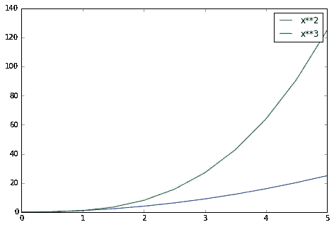
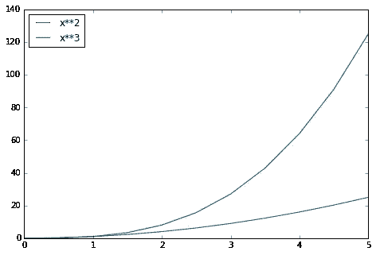
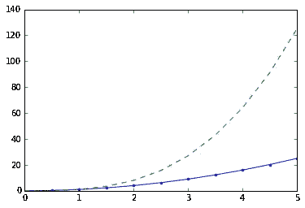
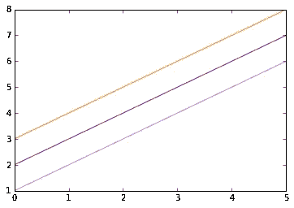
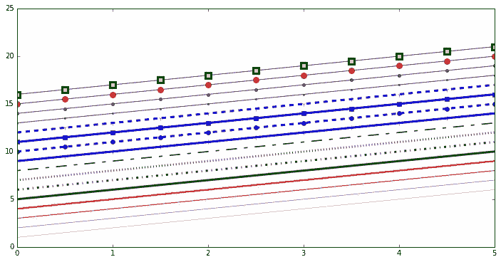
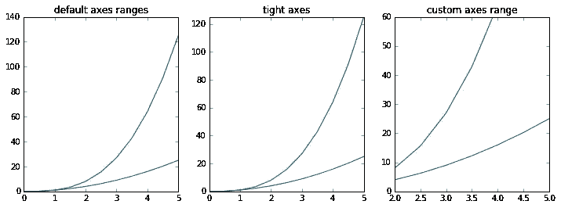
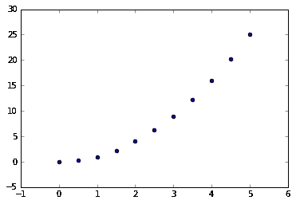
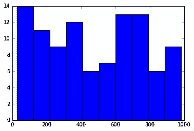
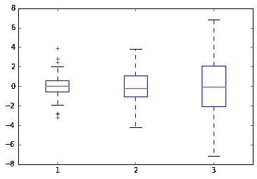

# 面向绝对初学者的数据可视化[第 3/3 部分]

> 原文：<https://medium.com/analytics-vidhya/data-visualization-for-absolute-beginner-part-3-3-96a00d04497f?source=collection_archive---------29----------------------->

## 图例、标签和标题

到目前为止，我们已经介绍了创建图形画布并向其添加轴实例的基础知识，现在让我们关注如何向我们的绘图添加标题、轴标签和图例。

## 图形标题

axes 包含方法`set_title`,该方法可以添加到图形中的每个 axis 实例。

```
ax.set_title("title");
```

**轴标签**

类似地，为了设置 xlabel 和 ylabel，我们分别使用`set_xlabel`和`set_ylabel`。

```
ax.set_xlabel("x")
ax.set_ylabel("y");
```

## 传说

当图被添加到图中时，我们将使用 **label = "label text"** 关键字，然后我们将调用 **legend()** 方法，不带参数地将其添加到图中。

```
fig = plt.figure()ax = fig.add_axes([0,0,1,1])ax.plot(x, x**2, label="x**2")
ax.plot(x, x**3, label="x**3")
ax.legend()
```



观察一下，看看图例是如何与一些实际情节重叠的！

我们应该注意到，legend 函数带有可选参数 **loc** ，用于指定图例的绘制位置。
详见[文档](http://matplotlib.org/users/legend_guide.html#legend-location)

```
# We have a lot of optionsax.legend(loc=1) # upper right corner
ax.legend(loc=2) # upper left corner
ax.legend(loc=3) # lower left corner
ax.legend(loc=4) # lower right corner# .. many more options are available# Most common to choose
ax.legend(loc=0) # let matplotlib decide the optimal location
fig
```



## 设置颜色，线宽，线型

Matplotlib 为我们*提供了一堆*自定义颜色、线宽和线型的选项。这些是用来改变我们的阴谋看起来。

## 颜色与 MatLab 相似的语法

使用 matplotlib，我们现在将以多种方式定义线条的颜色。例如‘g—’表示绿色虚线。

```
# MATLAB style line color and style 
fig, ax = plt.subplots()
ax.plot(x, x**2, 'b.-') # blue line with dots
ax.plot(x, x**3, 'g--') # green dashed line
```



## 带有 color=参数的颜色

另一种定义颜色的方法是通过它们的 RGB 或十六进制代码，我们也可以提供 alpha 值来表示不透明度。

```
fig, ax = plt.subplots()ax.plot(x, x+1, color="blue", alpha=0.5) # half-transparant
ax.plot(x, x+2, color="#8B008B")        # RGB hex code
ax.plot(x, x+3, color="#FF8C00")        # RGB hex code
```



## 线条和标记样式

使用`linewidth`或`lw`关键字可以改变线宽。可以使用`ls`或`linestyle`关键字选择线条样式。线条样式定义线条类型，如虚线或点线。

```
fig, ax = plt.subplots(figsize=(12,6))ax.plot(x, x+1, color="red", linewidth=0.25)
ax.plot(x, x+2, color="red", linewidth=0.50)
ax.plot(x, x+3, color="red", linewidth=1.00)
ax.plot(x, x+4, color="red", linewidth=2.00)# possible linestype options ‘-‘, ‘–’, ‘-.’, ‘:’, ‘steps’
ax.plot(x, x+5, color="green", lw=3, linestyle='-')
ax.plot(x, x+6, color="green", lw=3, ls='-.')
ax.plot(x, x+7, color="green", lw=3, ls=':')# custom dash
line, = ax.plot(x, x+8, color="black", lw=1.50)
line.set_dashes([5, 10, 15, 10]) # format: line length, space length, ...# possible marker symbols: marker = '+', 'o', '*', 's', ',', '.', '1', '2', '3', '4', ...
ax.plot(x, x+ 9, color="blue", lw=3, ls='-', marker='+')
ax.plot(x, x+10, color="blue", lw=3, ls='--', marker='o')
ax.plot(x, x+11, color="blue", lw=3, ls='-', marker='s')
ax.plot(x, x+12, color="blue", lw=3, ls='--', marker='1')# marker size and color
ax.plot(x, x+13, color="purple", lw=1, ls='-', marker='o', markersize=2)
ax.plot(x, x+14, color="purple", lw=1, ls='-', marker='o', markersize=4)
ax.plot(x, x+15, color="purple", lw=1, ls='-', marker='o', markersize=8, markerfacecolor="red")
ax.plot(x, x+16, color="purple", lw=1, ls='-', marker='s', markersize=8,markerfacecolor="yellow", markeredgewidth=3, markeredgecolor="green");
```



## 控制轴外观

现在，我们将学习如何控制图形中的轴大小属性。

**绘图范围**

要添加轴的范围，我们可以使用轴对象的`set_ylim`和`set_xlim`属性，或者使用`axis('tight')`来自动获得“紧密配合”的轴范围。

```
fig, axes = plt.subplots(1, 3, figsize=(12, 4))axes[0].plot(x, x**2, x, x**3)
axes[0].set_title("default axes ranges")axes[1].plot(x, x**2, x, x**3)
axes[1].axis('tight')
axes[1].set_title("tight axes")axes[2].plot(x, x**2, x, x**3)
axes[2].set_ylim([0, 60])
axes[2].set_xlim([2, 5])
axes[2].set_title("custom axes range");
```



## 特殊地块类型

matplotlib 不仅限于这些简单的线图，它还提供了许多我们可以创建的专业图，如条形图、饼图、散点图等等。

但在我看来，对于这些特殊类型的图表，最好使用 seaborn。我们将在不同的教程中讨论它们。

在结束之前，让我们再讨论几个这种特殊类型情节的例子。

## **散点图**

```
plt.scatter(x,y)
```



## 柱状图

```
from random import sample
data = sample(range(1, 1000), 100)
plt.hist(data)
```



## 矩形框图

```
data = [np.random.normal(0, std, 100) for std in range(1, 4)]# rectangular box plot
plt.boxplot(data,vert=True,patch_artist=True);
```



这就结束了这个漂亮的 python 库的基础，我希望你和我在制作本教程时一样喜欢学习它。

恭喜你！完成本系列的第 3/3 部分后🎉🎉🎉

我将很快添加更多的可视化教程，使用稍微先进的库，如 seaborn 和 plotly，我们将能够可视化更复杂的数据。
感谢阅读🙂

## 进一步阅读

*   [http://www.matplotlib.org](http://www.matplotlib.org/)—matplotlib 的项目网页。
*   [https://github.com/matplotlib/matplotlib](https://github.com/matplotlib/matplotlib)——matplotlib 的源代码。
*   [http://matplotlib.org/gallery.html](http://matplotlib.org/gallery.html)—一个大型画廊，展示 matplotlib 可以创建的各种类型的地块。强烈推荐！
*   [http://www.loria.fr/~rougier/teaching/matplotlib](http://www.loria.fr/~rougier/teaching/matplotlib)—一个很好的 matplotlib 教程。
*   http://scipy-lectures.github.io/matplotlib/matplotlib.html—另一个很好的 matplotlib 参考

## 来源

*   [https://www . udemy . com/course/python-for-data-science-and-machine-learning-boot camp/](https://www.udemy.com/course/python-for-data-science-and-machine-learning-bootcamp/)
*   [https://sites . Google . com/site/own scratchpad/data science/matplotlib](https://sites.google.com/site/ownscratchpad/datascience/matplotlib)
*   [https://www . Southampton . AC . uk/~ Fang ohr/training/python/notebooks/matplotlib . html](https://www.southampton.ac.uk/~fangohr/training/python/notebooks/Matplotlib.html)