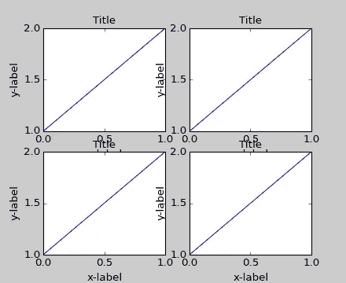

# 面向绝对初学者的数据可视化[第 2/3 部分]

> 原文：<https://medium.com/analytics-vidhya/data-visualization-for-absolute-beginner-using-python-part-2-3-a19b3751ede?source=collection_archive---------25----------------------->

## Matplotlib 面向对象方法

既然我们已经介绍了基础知识，让我们把注意力转移到 Matplotlib 的面向对象 API 的介绍上来。这将允许我们实例化图形对象，然后我们可以从该对象调用方法。

## 面向对象方法简介

这里的想法是使用更正式的面向对象方法来创建图形对象，然后调用该对象的相应方法或属性。这被证明是处理多个情节时的*精彩*练习。

我们现在将从创建一个人物实例开始。然后，我们将向该图形添加轴。

```
# Object oriented method
# Create Figure (empty canvas)
fig = plt.figure()# Add set of axes to figure
axes = fig.add_axes([0.1, 0.1, 0.8, 0.8]) # left, bottom, width, height (range 0 to 1)# Plot on that set of axes
axes.plot(x, y, 'b')
```


**注意:**在本教程的第 1 部分中，我们使用 plt.plot(x，y)做了同样的事情。但是现在使用这种面向对象的方法，我们将对我们的 fig 对象有更多的控制，我们可以很容易地添加一个以上的轴到我们的图形中，如下所示。

```
# Creates blank canvas
fig = plt.figure()axes1 = fig.add_axes([0.1, 0.1, 0.8, 0.8]) # main axes
axes2 = fig.add_axes([0.2, 0.5, 0.4, 0.3]) # inset axes# Larger Figure Axes 1
axes1.plot(x, y, 'b')# Insert Figure Axes 2
axes2.plot(y, x, 'r')
```


## 支线剧情()

现在我们将学习如何使用相同的面向对象方法创建支线剧情。Subplot 是不同的，因为我们可以指定行数和列数。

plt.subplots()对象充当更自动化的轴管理器。

基本使用案例:

```
# Use tuple unpacking to grab fig and axes
fig, axes = plt.subplots()# Use axes object to add stuff to the plot
axes.plot(x, y, 'r')
```


现在，我们将在实例化 subplots()对象时指定行数和列数:

```
# Make an empty canvas of 1 by 2 subplots
fig, axes = plt.subplots(nrows=1, ncols=2)
```


```
# Axes is an array of axes to plot on
axes
```

Out[]

```
array([<matplotlib.axes._subplots.AxesSubplot object at 0x111f0f8d0>,<matplotlib.axes._subplots.AxesSubplot object at 0x1121f5588>], dtype=object)
```

回想一下，在第 1 部分中，我们通过手动给定行和列做了同样的事情，但是由于它是一个数组，我们实际上可以迭代它并直接绘制数据。

```
for ax in axes:
    ax.plot(x, y, 'b')# Display the figure object    
fig
```


在 matplotlib 中，轴(包括子图)的位置是在标准化图形坐标中指定的。您的轴标签或标题(有时甚至是标记标签)可能会超出图形区域，从而被裁剪掉。



使用重叠标签绘图

为了解决这个问题，我们可以使用 **fig.tight_layout()** 或 **plt.tight_layout()** 方法，它自己调整图形画布上的轴的位置，以避免内容重叠:

**tight_layout()** 可以带 *pad* 、 *w_pad、*和 *h_pad* 的关键字参数。这些控件控制人物边界周围和支线剧情之间的额外填充。填充以字体大小的分数指定。

```
plt.tight_layout(pad=0.4, w_pad=0.5, h_pad=1.0)
```


## 图形大小、纵横比和 DPI

Matplotlib 允许在创建图形对象时指定纵横比、DPI(每英寸点数)和图形大小。我们可以使用`figsize`和`dpi`关键字参数。

*   `figsize`是以英寸为单位的图形的宽度和高度的元组
*   `dpi`是每英寸点数(每英寸像素)。

```
fig = plt.figure(figsize=(8,4), dpi=100)
```

Out []:

```
<matplotlib.figure.Figure at 0x11228ea58>
```

这些相同的参数也可以传递给`subplots`函数:

```
fig, axes = plt.subplots(figsize=(12,3)) # 12 by 4 inchesaxes.plot(x, y, 'r')
```


## 节省数字

Matplotlib 以下列格式生成高质量的输出:JPG、PNG、EPS、SVG、PDF 和 PGF。

为了保存一个文件，我们将使用 Figure 类中的`savefig`方法:

```
fig.savefig("filename.jpg")
```

我们还可以选择指定每英寸点数(DPI)并选择不同的输出格式

```
fig.savefig("filename.png", dpi=200)
```

恭喜你！完成本系列的第 2 部分后，点击[此处](/@ishankdev/data-visualization-from-absolute-beginner-to-complete-master-part-3-3-96a00d04497f)进入第 3 部分

## 来源

*   [https://www . udemy . com/course/python-for-data-science-and-machine-learning-boot camp/](https://www.udemy.com/course/python-for-data-science-and-machine-learning-bootcamp/)
*   [https://sites . Google . com/site/own scratchpad/data science/matplotlib](https://sites.google.com/site/ownscratchpad/datascience/matplotlib)
*   [https://matplotlib . org/3 . 1 . 1/API/_ as _ gen/matplotlib . axes . axes . set _ xlabel . html](https://matplotlib.org/3.1.1/api/_as_gen/matplotlib.axes.Axes.set_xlabel.html)
*   [https://www . Southampton . AC . uk/~ Fang ohr/training/python/notebooks/matplotlib . html](https://www.southampton.ac.uk/~fangohr/training/python/notebooks/Matplotlib.html)
*   [https://www.google.com/search?q = % 22 axes %20 = %20 fig . add _ axes(% 5b 0.1、%200.1、%200.8、%200.8% 5D)%20 # % 20 左、% 20 底、% 20 宽、% 20 高% 20(范围% 200% 20 到%201)%22](https://www.google.com/search?q=%22axes%20=%20fig.add_axes(%5B0.1,%200.1,%200.8,%200.8%5D)%20#%20left,%20bottom,%20width,%20height%20(range%200%20to%201)%22)