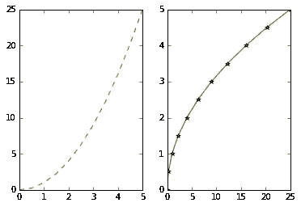

# 面向绝对初学者的数据可视化[第 1/3 部分]

> 原文：<https://medium.com/analytics-vidhya/data-visualization-from-absolute-beginners-using-python-part-1-3-3cb9253ac007?source=collection_archive---------23----------------------->

数据科学家的工作被 glassdoor 列为头号工作，这是一个极好的职业道路，不仅提供了巨大的工资潜力，还提供了解决一些世界上最有趣的问题的机会！

事实上，数据可视化是任何数据科学家最需要的技能之一。

简单地说，数据可视化是指以图形、图表等可视化格式表示数据。我们需要数据可视化，因为可视化输出总是易于理解，并且被证明是比基于文本的数据更好的选择。

## 动机

作为 matplotlib(一个很棒的用于绘制数据的库)的活跃用户，我经常发现很难跟上文档，我总是不得不努力并依赖 StackOverflow 来做甚至是基本的事情。
因此我决定写下这个基础教程来帮助新手开始使用这个库，并在这方面做得更好。

**那么让我们开始吧！**

在本文中，我们将尝试对名为 Matplotlib 的 python 库有一个基本的了解。我们将从一些基本的例子开始，学习 Matplotlib 的最基本的命令，然后我们将逐渐转向面向对象方法的概念，接着学习如何标记我们的图。

为了简单起见，我们将本教程分为三个部分。

*   [**用于基本可视化的 Matplotlib**](/@ishankdev/data-visualization-from-absolute-beginner-to-complete-master-part-1-3-3cb9253ac007)
*   [**Matplotlib 面向对象的 API**](/@ishankdev/data-visualization-from-absolute-beginner-to-complete-master-part-2-3-a19b3751ede)
*   [**图例标签和标题，使图可读**](/@ishankdev/data-visualization-from-absolute-beginner-to-complete-master-part-3-3-96a00d04497f)

# Matplotlib

**简介**

Matplotlib 被认为是 Python 数据可视化的“祖父”库。它是由约翰·亨特创造的。John Hunter 创建它是为了在 Python 中复制 MatLab 的绘图潜力。所以如果你已经熟悉 Matlab，Matplotlib 对你来说会感觉很自然。

这是一个非常棒的 2D 和三维图形库，用于构建科学图形。

Matplotlib 的主要优点是:

*   python 最流行的绘图库
*   简单情节容易上手
*   支持自定义标签和文本
*   多种格式的高质量输出
*   大体上非常可定制

## 安装 Matplotlib

*   我们需要在我们的命令行终端上安装 pip 或 conda:

```
pip install matplotlib
```

或者

```
conda install matplotlib
```

如果你发现自己是否能完成某种类型的绘图，你可以随时访问官方文档的[这一部分，并查看示例以了解更多关于 matplotlib 的功能。这个链接可能是你能在 matplotlib 文档中找到的**最有用的页面**。](https://matplotlib.org/gallery/index.html)

现在在接下来的部分，我们将看到如何创建我们自己的数字。

让我们从 Jupyter 笔记本开始吧。

**注意** **我将完成分享。本教程末尾的 ipynb 文件。因此，只需专注于理解概念，而不是将这些命令复制粘贴到您的笔记本上。**

## 步骤 1:导入 matplotlib pyplot 库

在[1]中:

```
import matplotlib.pyplot as plt
```

`[matplotlib.pyplot](https://matplotlib.org/tutorials/introductory/pyplot.html#sphx-glr-tutorials-introductory-pyplot-py)`是命令风格函数的集合，使 matplotlib 像 MATLAB 一样工作

您需要添加下面一行，以便查看笔记本中的绘图

在[2]中:

```
%matplotlib inline
```

如果你使用另一个编辑器，你需要在所有命令的末尾使用: **plt.show()** ，这将打开一个弹出窗口。

## 基本示例

在我们开始可视化之前，我们需要一些数据点来进行可视化。所以让我们用两个 numpy 数组创建一个简单的例子。

在[3]中:

```
import numpy as np
x = np.linspace(0, 5, 11)
y = x ** 2
```

在[4]中:

```
x
```

Out[4]:

```
array([ 0\. ,  0.5,  1\. ,  1.5,  2\. ,  2.5,  3\. ,  3.5,  4\. ,  4.5,  5\. ])
```

在[5]中:

```
y
```

Out[5]:

```
array([  0\.  ,   0.25,   1\.  ,   2.25,   4\.  ,   6.25,   9\.  ,  12.25,16\.  ,  20.25,  25\.  ])
```

## 基本 Matplotlib 命令

有两种方法可以创建图形，一种是函数方法，另一种是面向对象的方法。我们将首先讨论函数方法，然后我们将转向一个更好的方法，即面向对象的方法。

要创建一个非常基本的线图，请遵循以下命令。

在[6]中:

```
# FUNCTIONAL method
plt.plot(x, y, 'r') # 'r' is the color red
plt.show()
```

Out[6]:


这里的 plot()函数接受三个参数——x 坐标、y 坐标和线条的颜色。但是**我们应该注意到 plot()函数是一个通用的命令，接受任意数量的参数。**

**趣味活动**:试试下面的命令，看看你会得到什么样的绘图输出:)

```
plt.plot(x, y)        # plot x and y using default line style and color
plt.plot(x, y, 'bo')  # plot x and y using blue circle markers
plt.plot(y)           # plot y using x as index array 0..N-1
plt.plot(y, 'r+')     # ditto, but with red plusses
```

我们将在本教程的第三部分讨论更多的线型和颜色。

让我们继续在同一块画布上创建多个地块。

## 在同一画布上创建多个图

为了在同一个画布上创建一个多重绘图，我们将使用**子绘图**,它以行数、列数和我们引用的绘图号作为参数。

在[7]中:

```
# plt.subplot(nrows, ncols, plot_number)
plt.subplot(1,2,1)
plt.plot(x, y, 'r--') # More on color options later
plt.subplot(1,2,2)
plt.plot(y, x, 'g*-');
```



请注意上面我们是如何通过将画布视为行列矩阵来创建两个不同的图的，其中每个单元格代表一个图。

然而，上面的方法是一种不好的实践，我们希望使用一种更好的方法来做同样的事情，这就是我们将在本系列的第二部分中涉及的更正式的面向对象方法。

我强烈建议您在笔记本上或命令行上使用上述命令，并尝试在现实世界的数据集上绘图，看看您通过绘图找到了什么模式。

太好了！我们成功地完成了教程的 1/3🎉🎉
现在让我们点击 [**这里**](/@ishankdev/data-visualization-from-absolute-beginner-to-complete-master-part-2-3-a19b3751ede) **进入第二部分。**

## 来源

*   [https://sites . Google . com/site/own scratchpad/data science/matplotlib](https://sites.google.com/site/ownscratchpad/datascience/matplotlib)
*   [https://www . udemy . com/course/python-for-data-science-and-machine-learning-boot camp/](https://www.udemy.com/course/python-for-data-science-and-machine-learning-bootcamp/)
*   [https://www.npntraining.com/blog/matplotlib-tutorial/](https://www.npntraining.com/blog/matplotlib-tutorial/)
*   [https://matplotlib.org/gallery/index.html](https://matplotlib.org/gallery/index.html)