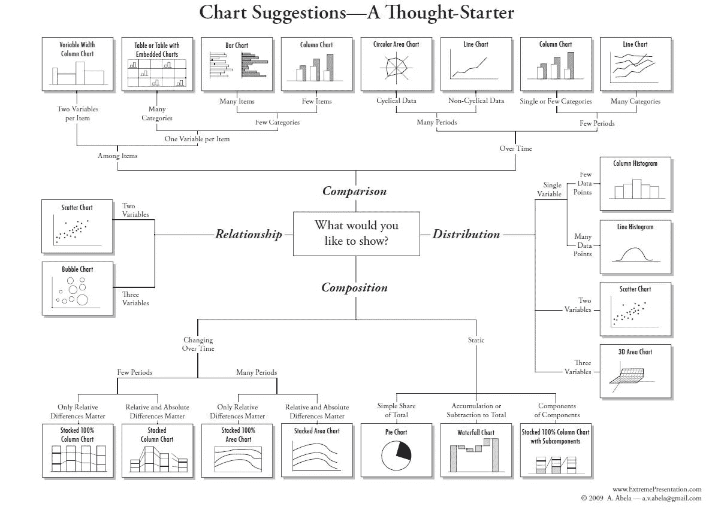
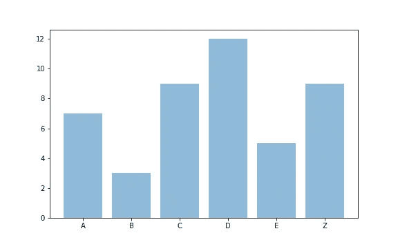
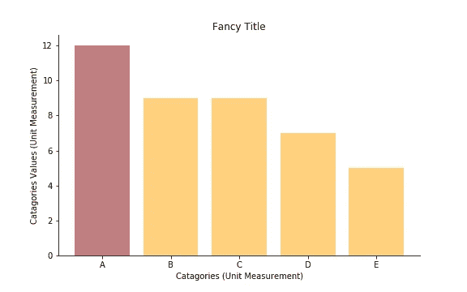
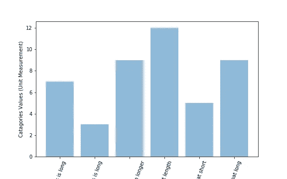
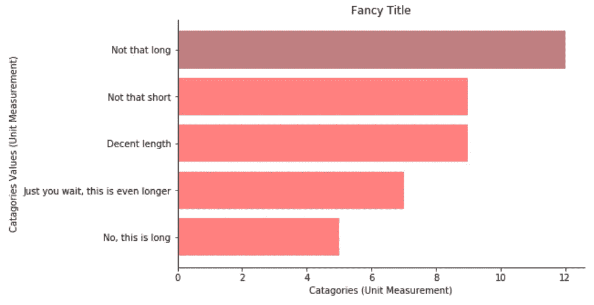

# 初级数据科学家数据可视化指南

> 原文：<https://medium.com/analytics-vidhya/data-visualization-guide-for-junior-data-scientists-a384f78ab023?source=collection_archive---------6----------------------->

作为一名初学数据的科学家，我经常发现自己盯着自己的结果，思考呈现结果的最佳方式。直观展示数据关系的最常用方法是图表和表格。图表的主要目的是呈现太复杂而无法用语言描述的数据。而当您需要比较单个结果或显示精确值时，最好使用表格。图形的四种基本表示类型是“比较”、“合成”、“分布”和“关系”。在这篇文章中，我想教你一点选择正确的可视化工具的直觉，以及如何让你的图表更像样。

基本演示类型图表及其相关图表，由[Andrew Abela 博士](https://extremepresentation.com/)创建

有许多类型的图表，有些比其他的更熟悉。在选择一个图表来显示你的数据之前，你需要知道你显示了多少变量，你想要显示多少数据，你的变量是连续的还是离散的？等等，当你展示你的结果时，你很可能想要使用下面的图表。尽管有许多类型的图表看起来更奇特，但保持简单是很重要的。

## 条形图

条形图最常用于比较几组之间的单个变量值。当使用条形图比较不同类别时，避免显示超过 7 个类别，并按高度对列进行排序。如果时间是一个维度，它应该总是被设置在水平轴上，从左到右。除非变量不超过 2-3 个，否则避免使用条形图显示成分。此外，当标签很长时，可以考虑使用水平条形图。

## 曲线图

折线图用于跟踪一段时间内*连续*数据的变化。他们最擅长可视化超过 30 个数据点的大型数据集。线图通常被设计成因变量在纵轴上，自变量在横轴上。类似于条形图，如果你的一个轴是时间，从左到右显示时间。此外，如果你有丢失的数据，不要跳过它，显示一个片段行。纵横比，也称为宽度和高度之间的比率，在人们如何感知结果方面起着很大的作用。即使对于其他类型的图形来说，使用合理的纵横比也是非常重要的(最常用的纵横比是 45 度)。

## 散点图

散点图用于确定不同变量之间的关系。一个轴用于测量一个事件，另一个轴用于测量另一个事件，以找到变量之间的关系。您还可以使用散点图来显示数据中的分布或聚类趋势。此外，这是发现异常值的一种便捷方式。如果您的数据不显示线性关系，将它转换为任何不同的非线性标度(如对数标度)是一个好的做法。这有助于您在数据集中找到以前无法找到的关系。

## 饼图

当你试图比较整体的不同部分时，饼图是最好的选择。显示静态数据的组成(不随时间变化)。建议不要把馅饼切成 5 块以上。你要确保你添加的数字能够强化你想要传达的信息。

## 面积图

面积图看起来类似于折线图，但它们用于跟踪由多个组组成的数据集随时间的变化。堆积面积图非常适合显示数据集组成随时间的变化。使用面积图时，建议用户自行判断。避免堆叠超过 5 个类别，因为图表会很快变得混乱。

## 直方图

直方图是一种特殊类型的条形图，它通过将连续的变量进行分组来显示每一类中数据的出现频率，从而表示这些变量的测量数据。频率通过柱的面积来测量，这些图形通常用于检查变量是否遵循正态分布。

为了确保您生成的图形可读性和专业性，请始终为您的轴添加标题，并添加单位度量单位。另外，如果你的一个轴是以“百万”为单位的，避免使用“M ”,因为它用罗马数字表示米，避免使用“M”表示千。

如果不需要，避免添加图例。如果需要一个图例，选择一个对颜色缺乏友好的[配色方案](http://colorlab.wickline.org/colorblind/colorlab/)，以确保色盲的人能够理解这个图表。每 12 名男性中有 1 名，每 200 名女性中有 1 名是色盲，据估计世界人口中约有 8.5%是色盲。

总是显示整个画面。类似于纵横比会随着人们对结果的感知而倾斜，在因变量不是从零开始的条形图中也会有类似的结果。

此外，避免混合图表类型，并尝试使用更熟悉的图表，以最大限度地提高可读性。

## 例子

图一。基本 Matplotlib 条形图

**竖列示例**

为了简单起见，我将重点介绍一些使用 python 的 Matplotlib 库的最佳实践示例。Matplotlib 创建了非常基本的图形。这不一定不好，因为简单通常更好(图 1)。

图二。添加了标题的基本条形图

然而，一个阅读这个图表的人不能理解我试图传达的故事，所以我从添加标题和单位度量开始(图 2)。

图 3。已排序的数据，突出显示特定的值，并删除一些边框以使其看起来更整洁。

现在这样更好了，查看图表的人可以理解图表的上下文了！在下一步中，我将通过对 *** 列进行排序并添加一些颜色，使其在其他列旁边弹出，从而引导他们找到我希望他们注意到的结果(图 3)。

图 4。x 轴标签倾斜 70 度的基本条形图

**你可能已经注意到了柱子的尺寸变化。为了简单起见，这些类别没有被赋予特定的值。因此，对值进行排序不会对类别进行排序。*

图 5。排序数据，突出显示特定值，水平条形图

**横栏示例**

即使有可能通过使 x 轴标签稍微倾斜来克服超长标签名称(图 4)。然而，当面对这种情况时，在我们试图比较的类别和值之间切换轴被认为是更好的实践(图 5)。

## 摘要

在这篇文章中，我试图给你一个快速回顾，告诉你如何选择正确的图形，最重要的是一些指导方针，以确保你创建的视觉效果简洁易读。图表是你批判性思维的产物，观众必须能够理解结果。然而，这些指导方针并不是一成不变的，“要自己去绘制”。您正在处理的数据不一定符合上述所有原则。只要信息清晰简洁，信息就会被传递。

## 用于创建示例的一些代码

# 参考

 [## 设计图表:每个设计师都应该知道的原则(第二部分)

### 不久前，我写了一篇名为《设计图表——每个设计师都应该知道的原则——你们很多人都发现了……

uxdesign.cc](https://uxdesign.cc/designing-charts-principles-every-designer-should-know-part-2-ce1e06af56fc)  [## 数据可视化—如何选择正确的图表类型？

### 理解事实、数字和度量是一种艺术——数据可视化的艺术。有大量的…

eazybi.com](https://eazybi.com/blog/data_visualization_and_chart_types/)  [## 我如何选择使用哪种类型的图形？-NCES 儿童区

### 何时使用。。。。。。线形图。折线图用于跟踪短期和长期的变化。当…

nces.ed.gov](https://nces.ed.gov/nceskids/help/user_guide/graph/whentouse.asp)  [## 什么是条形图？—WhatIs.com 的定义

### 条形图是统计数据的图形表示，其中自变量只能达到某一确定值。

whatis.techtarget.com](https://whatis.techtarget.com/definition/bar-graph)  [## 图表的有效使用

### 尽管有无数的计算机程序可以生成图表，作者仍然必须注意一些基本的…

www.ncbi.nlm.nih.gov](https://www.ncbi.nlm.nih.gov/pmc/articles/PMC4078179/)