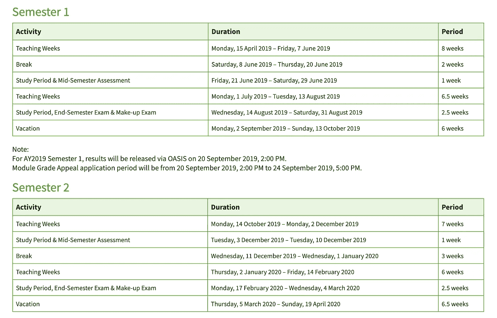
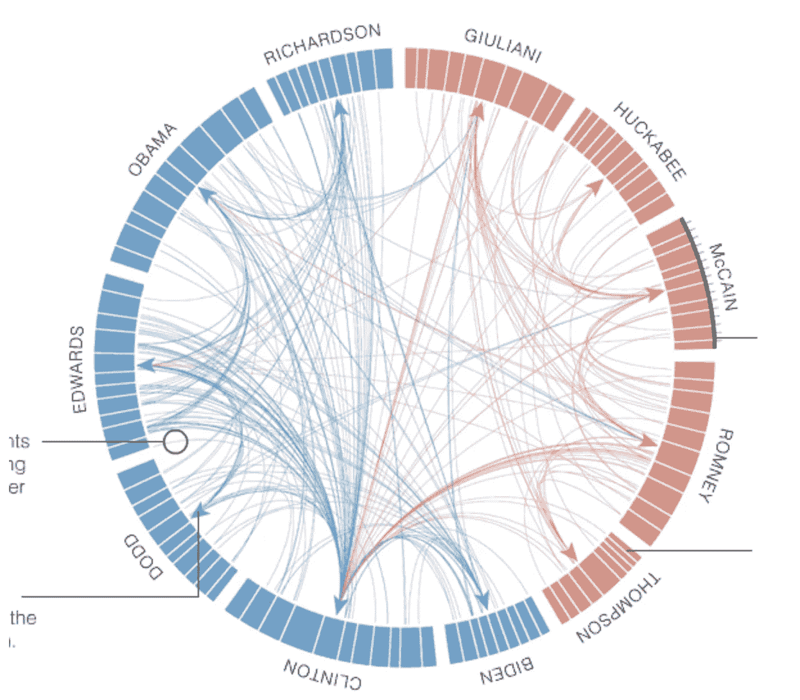
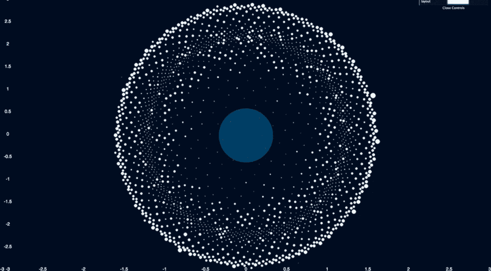
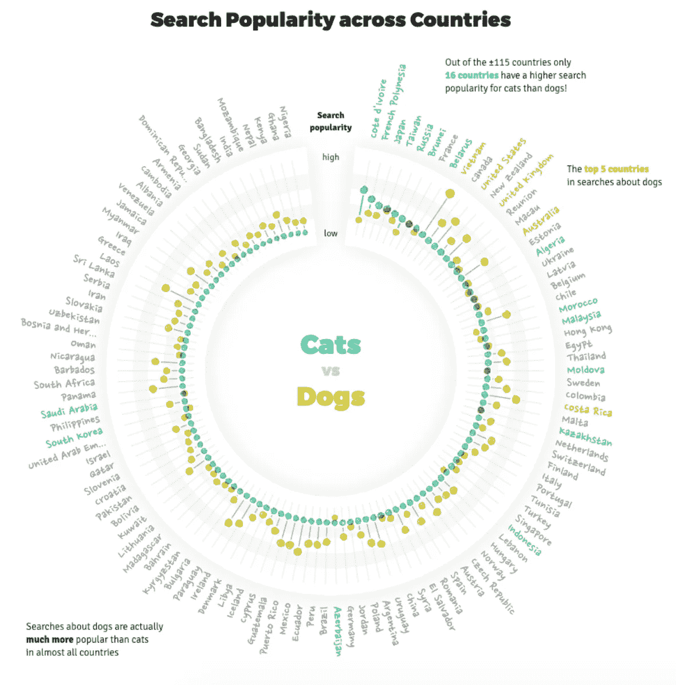
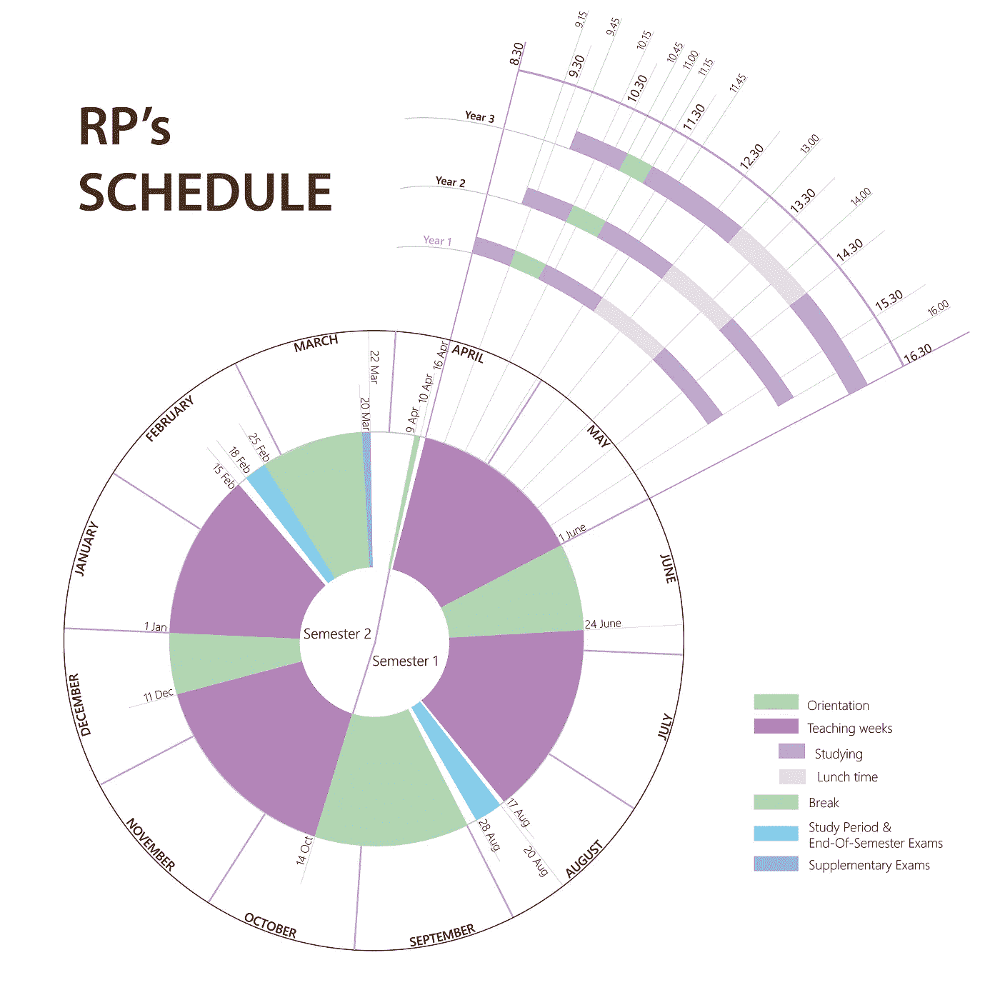

# 数据可视化|传统设计创新指南

> 原文：<https://medium.com/analytics-vidhya/data-visualization-guide-to-make-an-unconventional-design-from-traditional-stuff-5da9c9f40fa1?source=collection_archive---------24----------------------->

威廉·艾文在 [Unsplash](https://unsplash.com?utm_source=medium&utm_medium=referral) 上的照片

如果你对数据可视化感兴趣，并且你是一个有创造力的人，你可能会对这篇文章感兴趣。

因为我现在要和你分享的是一些我们每天在学校经常看到的非传统的东西，至少是时间表。

## 我很兴奋能和你分享我在这个领域最引以为傲的一个设计。

照片由[布鲁斯·马尔斯](https://unsplash.com/@brucemars?utm_source=medium&utm_medium=referral)在 [Unsplash](https://unsplash.com?utm_source=medium&utm_medium=referral) 上拍摄

# 让我们开始吧；)

这是共和理工学院的课程表。设计超级干净易懂。对此我没有什么可抱怨的。

这种传统的时间表使用了很长时间，没有人会费心去改变它。

RP 中的学术日历

## 但是，是时候应用数据可视化了，让我们从数据点、图表垃圾、圆圈甚至颜色中获得乐趣。

我在这里尝试做的主要目的只是以一种有趣的方式将时间表形象化。

Y 我们的任务是**用它来玩**，用一种**与传统**大相径庭的方式来呈现它，并且记得应用数据可视化；)

# 先说内容。

1️⃣把内容分成两大组，第一学期和第二学期。

2️⃣在那之后，**组同样的信息**归入类别。所以我们有学习时间，教学周，休息和假期。

3️⃣分析和理解信息是最关键的一步。如你所见，学校一月开学，十二月结束。四个教学周之后有四次休息。两次考试将在二月和八月举行。

我给大家分享一下每年这个时候的逻辑。特定年份的开始时间从 30 分钟调回到 45 分钟。所以三年级的学生将比一年级和二年级的学生更晚完成学业。

4️⃣:现在我们记住了这个间隔，我们开始**寻找**设计目的背后的逻辑/故事。学校的时间表看起来就像骑自行车从 A 点到 B 点、C 点、D 点、…，然后回到 A 点的动作或者简化，骑行一圈。

**让我们转向设计**

1️⃣我的建议是**谷歌大量**一些与**数据可视化**相关的关键词来寻找思路。你可能会被设计的复杂程度弄得不知所措，但是一旦你花时间去研究，你就会意识到数据点和密度只是其中的一部分。

2️⃣正如我们在研究部分所做的那样，我们把这个过程描述为一个圆圈。所以让他们坚持下去。不要超越想法太远，集中精力寻找同样的方法使想法变得现实。

**以下是我的一些灵感:**

[https://stats . stack exchange . com/questions/3158/this-type-of-circular-link-visualization-called 是什么？noredirect=1 & lq=1](https://stats.stackexchange.com/questions/3158/what-is-this-type-of-circular-link-visualization-called?noredirect=1&lq=1)

[https://venngage.com/blog/data-visualization-tips/](https://venngage.com/blog/data-visualization-tips/)

[https://www . visual cinnamon . com/2019/04/mobile-vs-desktop-dataviz](https://www.visualcinnamon.com/2019/04/mobile-vs-desktop-dataviz)

我最好的建议是**继续探索**和**继续尝试**新的可能性，你会想到新的想法:)此外，**在你开始设计之前，研究也是关键的一步**。

3️⃣试图通过 [**挑战**](/@chinguyenthuy/challenges-in-data-visualization-ed3c2c0eb6c9) ，在几何形状、颜色和线条上积极主动，富有创造性。你可能还想用一些线条让设计看起来更忙碌，并利用图表垃圾的优势。

那么，让我们来看看一个非常规的时间表是什么样的

# 你的设计怎么样？和我还有其他人一起分享吧！😉