# 使用 Matplotlib

> 原文：<https://medium.com/analytics-vidhya/data-visualization-heart-of-project-presentation-part-1-matplotlib-16e4d45fa70d?source=collection_archive---------10----------------------->

## 数据可视化:项目演示的核心

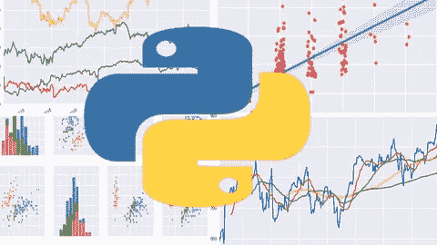

使用 python 实现数据可视化

美丽的情节和图表不需要深入的解释，只要看一看就有力量说出来。这可以在后台代码的支持下完成。

无论后端代码有多棒，客户和非技术人员都无法理解它们。给他们留下深刻印象的唯一方法是你的技术表达技巧。

在 python 中，我们有许多用于数据可视化的库。其中最常用的是 matplotlib、seaborn 和 plotly。在这一部分，我将讨论 matplotlib 的基础知识和它的属性。

## **关于 Matplotlib 的几点**

1.  这是 python 中最流行的绘图库，它被设计成与 [Matlab](https://www.mathworks.com/products/matlab.html) 的图形绘图有相似的感觉。Matlab 也是编程语言之一。
2.  Matplotlib 让你可以控制图形的每个方面，它在 python 中的 numpy 和 pandas 中运行良好。matplotlib 的官方文档可以在这里找到。

## 装置

它可以通过 anaconda 或 python 包管理器(pip)安装

通过 anaconda 作为`conda install matplotlib`

通过画中画作为`pip install matplotlib`

## 什么是 matplotlib.pyplot 和%matplotlib 内联？

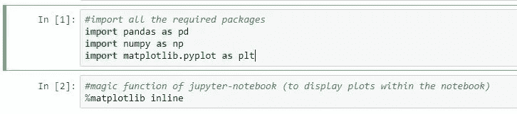

图 1:matplotlib.pyplot 和 matplotlib 内联

*matplotlib.pyplot 是使 matplotlib 像 Matlab* 一样工作的命令风格函数的集合。

在如图所示的**图-1** 中，导入 matplotlib 并且**重命名**为 plt 以便于使用，而不是在我们使用它的任何地方都编写 matplotlib.pyplot。matplotlib 是一个包，pyplot 可以看作是其中的一个模块。

简而言之，包是一种通过使用“带点的模块名”来构建 python 模块名称空间的方法。模块是指包含 python 语句和定义的文件。我们可以导入其中的所有函数和定义。包含 python 代码的文件，例如:pyplot.py 称为模块，其模块名为“pyplot”。

**pyplot** 是 *matplotlib 的绘图框架*，每个 pyplot 函数都对图形进行一些修改。它有助于创建一个图形，在图形中创建一个绘图区域，在绘图区域绘制一些线，并用标签装饰绘图等等。

**%matplotlib inline，**用于在 jupyter notebook 内生成绘图，无需显式调用 **plt.show()** 函数。它只能在 jupyter 或 jupyter-lab 笔记本中使用。如果使用 spyder 或任何 IDE，则应调用 plt.show()来显示绘图。

# matplotlib 图

创建 matplotlib 图有两种方法

(一)***函数法*** —我们借助 pyplot (plt)直接使用函数

(二) ***面向对象方法*** —我们为每个 matplotlib 图形创建对象，并使用对象来修改图形或创建子图形。这是推荐使用的方法。

## Dataframe(将在整个博客中使用)

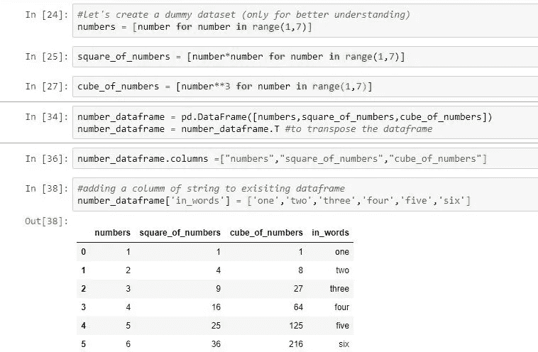

图 2:创建虚拟数据帧

在图 2 中:我们正在创建一个虚拟的数据框架，它将在整个博客中使用。我没有使用任何内置的数据框架，因为很难在公开可用的数据集中找到线性关系。最初，数据中最好有线性关系，以便于理解概念。

## 创建地块

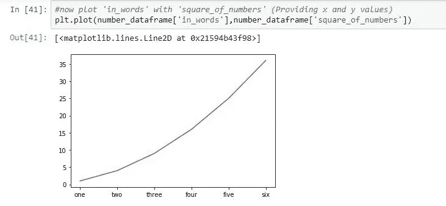

图 3:使用绘图函数(有两个参数 x 和 y)

pyplot 模块内有一个 plot 函数，通常接受 x 轴和 y 轴。两者的输入可以是数据帧的列表或系列或列。在图 3 中，可以清楚地看到，x 轴和 y 轴都被提供用于绘图功能(相对于 x 轴绘制 y 轴)。

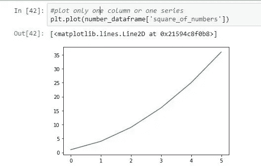

图 4:只提供一列来绘图

如果我们只提供一个列表或系列，那么它会通过将 index 视为 x 轴来将其视为 y 轴。在图 4 中可以看到同样的情况。其中数据帧的索引绘制在 x 轴上。

## 向地块添加标签

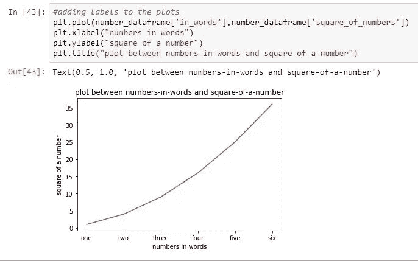

图 5:不带标签的图与带标签的图

在图 5 的左边，不太清楚 x 轴和 y 轴代表什么。但在它的右边，它是非常有益和有意义的。

这同样适用于图 6，该图清楚地描述了标签对图的重要性。

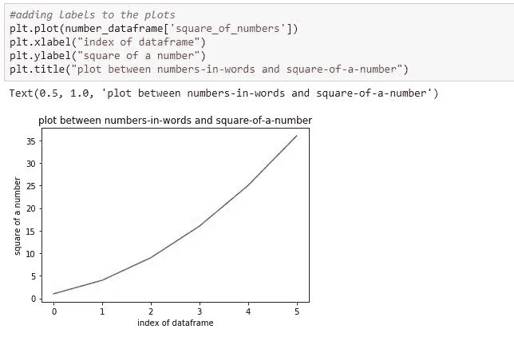

图 6:无标签图与有标签图

## 创建支线剧情

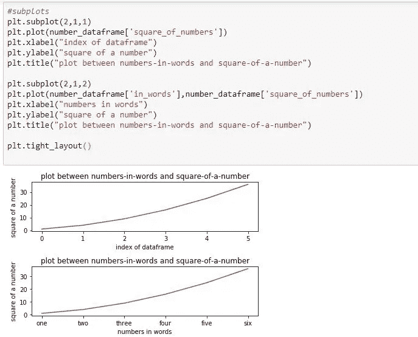

图 7:创建支线剧情

我们使用支线剧情把所有的情节放在同一个画布上。(把画布想象成)一个矩形区域，用于绘画或其他复杂的布局。

**基本语法: *plt.subplot(行编号，列编号，绘图编号)***

所有的支线剧情单独如图 7 所示。

**plt.tight_layout()** —自动调整子情节参数以给出指定的填充，这有助于避免情节之间的重叠。建议在绘图代码的末尾使用此功能。

# 面向对象方法的 matplotlib

最初应该实例化 figure 对象，然后从该对象调用所有方法或属性。这是最有效的方法，并且在使用 matplotlib 时给你更多的控制。

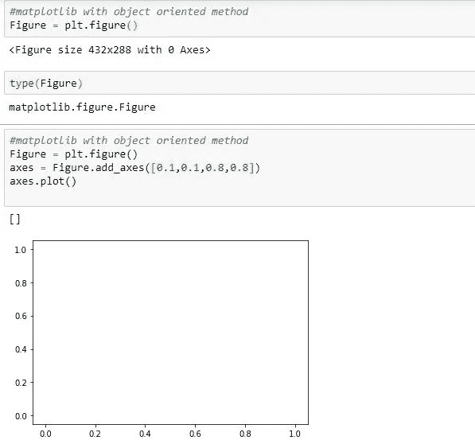

图 8: matplotlib 图形对象和添加轴

在图-8 中，可以看到“人物”对象已经被创建(这个对象可以被认为是一个虚构的空白画布)。为了绘图，应该将某些轴添加到该画布上。 **add_axes()** 方法必须提供新轴的尺寸**【左、下、宽、高】**。所有
数量都是数字宽度和高度的分数，即任何数值都应以百分比给出。比如:add_axes([0.1，0.1，0.8，0.8])的意思是从左边 10% in，从底部向上 10%，它占画布大小和宽度的 80%，画布大小和高度的 80%。由于在 plot()方法中没有提供任何值，因此在图像中会生成空图。

## 添加标签

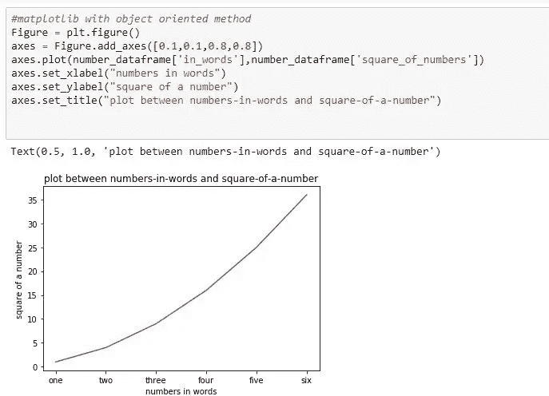

图 9:向绘图添加标签

在这种方法中，可以借助轴来添加标签。如图所示，我们需要为每个轴以及标题设置标签，以生成有意义的图。

## **用支线剧情()代替 add_axes()**

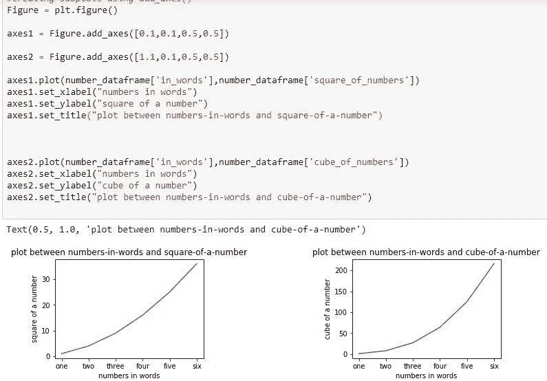

图 10:创建 add_axes()后创建子情节

为了使用 add_axes()创建子情节，我们需要手动定义每个子情节的轴，然后调整轴并创建它，如图 10 所示。下面给出了创建支线剧情的另一种方法。

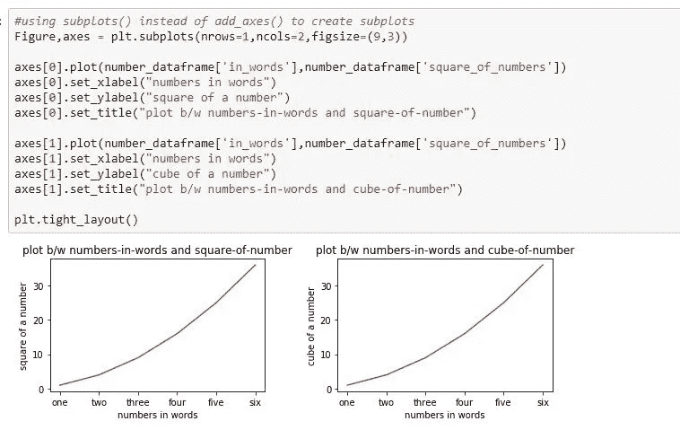

图 11:直接使用 plt.subplots()创建子图，而不定义轴

***plt.subplots()*** 是创建支线剧情最简单的方法，而不是手动定义轴并固定它们 ***。*** 如图-11 所示，我们只需要定义要创建多少个地块(以行数和列数的形式)。这里 ***axes*** 可以认为是 axes 对象的数组(类似列表的东西)，是可迭代的。该轴也可以被分度。 ***figsize()*** 是一个定制参数，帮助你定义图形的大小。

## 少数定制参数

matplotlib 完全控制图形。可以通过定义图形大小、dpi、以所需格式保存图形、创建图例、定义线条样式、为每条线定义颜色等方式对每个图形进行定制。

## figsize()

**figsize()** 是通常在图 11 所示的图形对象创建时提供的参数。它接受一个宽度和高度的元组- **figsize( *width* ， *height* )**

## savefig()和 dpi

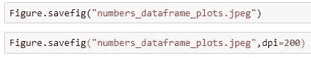

图 12:保存图和 dpi

可使用 **savefig()** 方法将创建的图形保存到工作目录。扩展名如(*)。jpeg，。png，。jpg 等..*)应在保存图时定义。 **dpi(每英寸点数)**，保存图像的分辨率也可在此功能中定义。

## 图例()

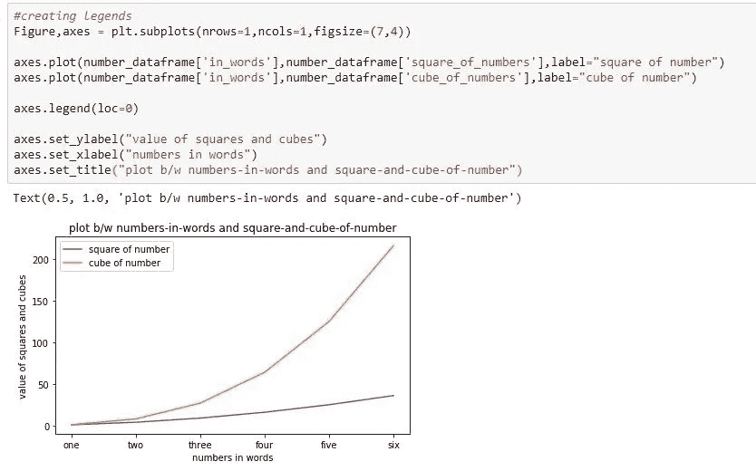

图 13:向绘图添加图例

为了给剧情增加传奇色彩，**。应该使用 legend()** 函数。在 **plot()** 函数内，应该定义标签。如果忘记，**【图例()】**函数**返回警告。**为了避免图中图例重叠，应使用 **loc** 属性，如图 13 所示。 **loc=0** ，指定 matplotlib 在图上放置图例的**最佳位置**。有很多 loc 代码，你可以在[这里](https://matplotlib.org/3.1.1/api/legend_api.html)找到。

## 线条颜色、线条宽度、alpha 和线条样式

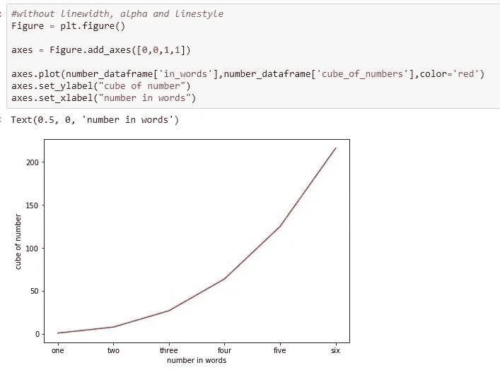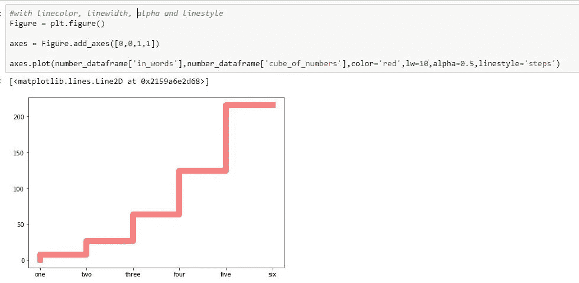

图 14:无 lw，alpha，ls 与有 lw，alpha，ls

如图 14 所示，可以进行绘图的定制，其中左侧只使用了 ***颜色*** 参数，它带有多个参数(如绿色、蓝色、红色等常见颜色字符串..或十六进制代码)。在图 14 的右侧，各种参数，如线宽、alpha 和线型，被添加到现有的绘图中。

***线宽*** —定义关于线条的粗细，线宽=10 表示默认线宽的 10 倍(默认线宽=1)。

***alpha*** —定义线条的透明度(这是两个图之间颜色强度降低的原因)。

***线条样式*** —允许创建不同类型的线条(虚线、虚线和任何自定义类型)。在图 14 的右侧，使用该参数以步骤的形式创建了一条线。

## 标记，标记大小，标记面颜色，标记宽度，标记颜色

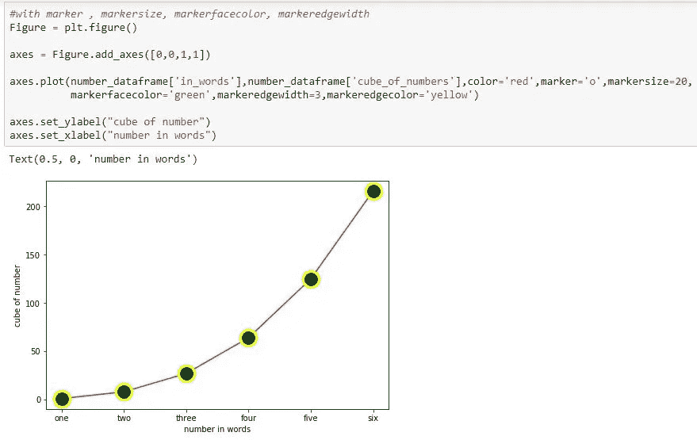

图 15:标记和相关属性。

**标记**将帮助我们确定 x 轴和 y 轴交点的准确位置。**可定义标记**的表示类型(圆形或*或任何自定义类型)。每个标记的大小及其颜色、边缘宽度和边缘颜色也可以如图 15 所示进行定义。

# 结论

关于 matplotlib 库的大部分基础知识已经在这个博客中讨论过了。学习 python 中数据可视化的最初方法是从 matplotlib 开始，因为它被认为是 python 中所有绘图库的基础。它可以创造几乎任何类型的情节。

*感谢您阅读至此。我致力于改进我的风格和表达方式。所以，如果你有什么建议或者有什么想分享的，欢迎随时评论或者通过 linkedin* [*这里*](https://www.linkedin.com/in/chamanth-mvs-9a59a4131/) *联系我。*