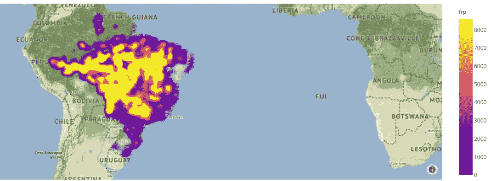

# 数据可视化:美国和巴西的森林火灾情况如何

> 原文：<https://medium.com/analytics-vidhya/data-visualization-how-is-the-situation-on-forest-fires-in-the-us-and-brazil-67c4a97e91d1?source=collection_archive---------23----------------------->

## *美国和巴西森林火灾的数据可视化*

[马特·霍华德](https://unsplash.com/@thematthoward?utm_source=medium&utm_medium=referral)在 [Unsplash](https://unsplash.com?utm_source=medium&utm_medium=referral) 上拍照

## 介绍

2020 年的到来给整个世界带来了巨大的挑战。这个新的十年始于新冠肺炎疫情影响了许多国家的卫生和经济体系，暴露了许多国家反击疫情组织的错误。除此之外，在巴西，亚马逊雨林着火了，森林吸收了大量的二氧化碳，现在却释放到大气中。森林火灾不仅仅是巴西的问题，在过去的几个月里，世界目睹了加利福尼亚州的火灾，这场火灾摧毁了许多房屋，并成为居住在森林附近或远离森林的人们的一个大问题，主要是因为火灾释放的烟雾。

## 数据库ˌ资料库

所有用于分析美国形势的数据来源是由 NASA 支持的资源管理系统火灾信息公司。在这些数据上，我们可以找到关于定位、日期、辐射量和其他属性的信息。关于巴西的数据，它的来源是 INPE 国家空间研究所。

## 预处理数据

## 数据可视化

在上面的地图中，大量的火位于美国西海岸。大火集中在受害者居住的加利福尼亚州。地图上显示的 frp 数量是以 MW(兆瓦)为单位的像素积分火灾辐射功率。

在巴西，大火主要位于亚马逊森林的边缘和国家的中心。这场大火正在杀死许多动物，一些动物开始面临灭绝的危险。

## 结论

森林火灾是当今的一个大问题，危及地球的状况，并可能给下一代带来更大的问题。领导人在对抗全球变暖问题上缺乏组织是很明显的。重要的是要着眼长远，考虑下一代，现在就照顾好地球，以便将来能够利用它，包括植被和许多可能在几年内灭绝的动物物种。

*我们承认使用了美国宇航局地球科学数据和信息系统(ESDIS)运营的 LANCE 公司的数据和图像，资金由美国宇航局总部提供。*