# python 中数据可视化的基础

> 原文：<https://medium.com/analytics-vidhya/data-visualization-in-python-baeff95f8324?source=collection_archive---------9----------------------->

*   数据可视化是用图形或图像来表示数据。允许高级代表查看分析，轻松掌握困难的概念并识别新模式。

例如:k 是指聚类，它更容易理解由数据算法完成的聚类标记。仅仅通过检查原始数据来标记集群是不可能的。

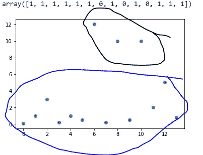

著名的 Anscombe 的四重奏例子解释了数据可视化的重要性。Python 代码很容易获得。

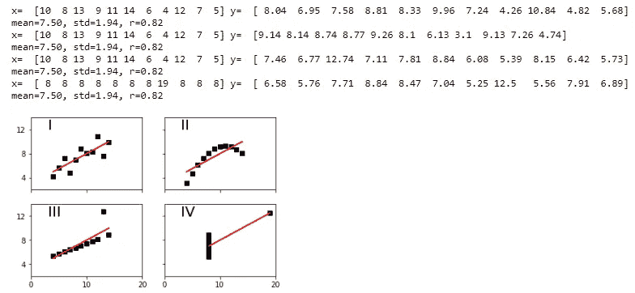

python 中的 Matplotlib

*   用于可视化的开源 python 库
*   使用 python 脚本创建图表和绘图。它允许在本地系统中保存图。提供面向对象的 API

> plt.savefig('散点图. png ')

*   它有一个名为 Pyplot 的模块，具有用于可视化的简单函数。(线条、图像、文本、标签等)
*   支持各种图形

折线图、条形图、散点图、直方图

图像图、方框图、小提琴图、溪流图、颤动图、面积图、彼得图和圆环图

*   容易与熊猫和 Numpy 整合。

## 线形图

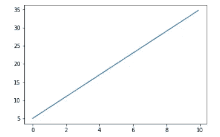

```
import numpy as np
import matplotlib.pyplot as plt
# allows plot to be display below the notebook
%matplotlib inline#defining the dataset
x=np.arange(0,10,0.1)
y=3*x+5#plotting the datapoints
plt.plot(x,y)
plt.show()
```

自定义线形图(与基本线形图比较)

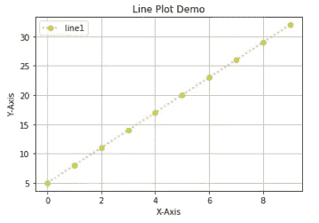

```
import numpy as np
import matplotlib.pyplot as plt
# allows plot to be display below the notebook
%matplotlib inline#defining the dataset
x=np.arange(0,10,1)
y=3*x+5#plotting the datapoints
plt.plot(x,y,linewidth =2.0 , linestyle =":",color ='y',alpha =0.7, marker ='o')
plt.title("Line Plot Demo")
plt.xlabel("X-Axis")
plt.ylabel("Y-Axis")
plt.legend(['line1'], loc='best')
plt.grid(True)
plt.show()
```

图形大小

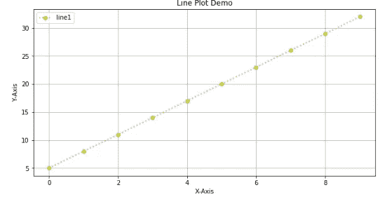

```
...
y=3*x+5
#changing the figure
fig=plt.figure(figsize=(10,5))#plotting the datapoints
...
```

支线剧情

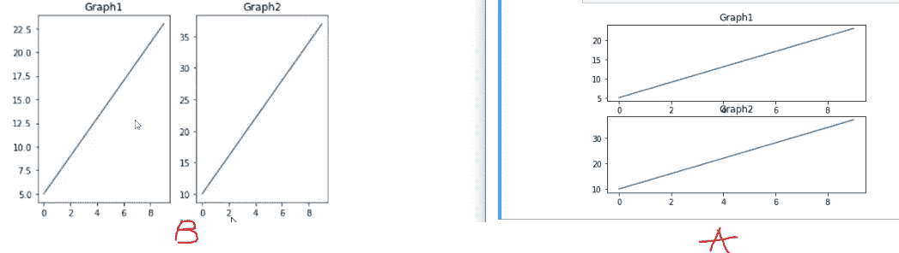

```
import numpy as np
import matplotlib.pyplot as plot
%matplotlib inlinex=np.arange(0,10,1)
y1=2*x+5
y2=3*x+10plt.subplot(2,1,1) #A
# B - plt.subplot(1,2,1) #(height,width,column)
plt.plot(x,y1)
plt.title('Graph1')plt.subplot(2,1,2) #A
# B - plt.subplot(1,2,2)
plt.plot(x,y2)
plt.title('Graph2')
plt.show()
```

## 条形图

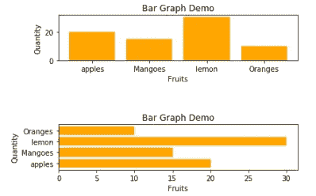

```
import numpy as np
import matplotlib.pyplot as plt
%matplotlib inlinedata = {'apples':20,'Mangoes':15, 'lemon':30,'Oranges':10}
names =list(data.keys())
values =list(data.values())plt.subplot(3,1,1) 
#fig =plt.figure(figsize =(10,5))
plt.bar(names,values,color ="orange")
plt.title("Bar Graph Demo")
plt.xlabel("Fruits")
plt.ylabel("Quantity")plt.subplot(3,1,3)
plt.barh(names,values,color ="orange")
plt.title("Bar Graph Demo")
plt.xlabel("Fruits")
plt.ylabel("Quantity")
plt.show()
```

散点图

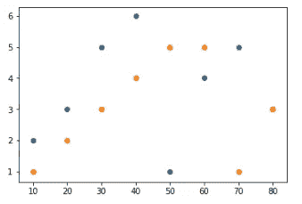

```
import matplotlib.pyplot as plt
%matplotlib inline#dataset Note - a and y1,y2 should be of same size
a=[10,20,30,40,50,60,70,80]
y1=[2,3,5,6,1,4,5,3]
y2=[1,2,3,4,5,5,1,3]plt.scatter(a,y1)
plt.scatter(a,y2)
plt.show()
```

自定义散点图与基本图比较

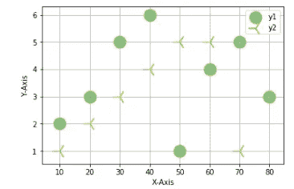

```
import matplotlib.pyplot as plt
%matplotlib inline#dataset Note - a and y1,y2 should be of same size
a=[10,20,30,40,50,60,70,80]
y1=[2,3,5,6,1,4,5,3]
y2=[1,2,3,4,5,5,1,3]plt.scatter(a,y1, c='g',s=300,edgecolors='y',marker='o',alpha=0.5)
plt.scatter(a,y2,  c='y',s=400,edgecolors='b',marker='3',alpha=1)
plt.legend(['y1','y2'],loc='best')
plt.xlabel("X-Axis")
plt.ylabel("Y-Axis")
plt.grid(True)
plt.show()
```

## Histogr.am

*   **直方图**是用不同高度的条来显示数据的图形。在**直方图**中，每个条形分组编号成范围。较高的条形表示更多的数据落在该范围内。一个**直方图**显示连续样本数据的形状和分布。

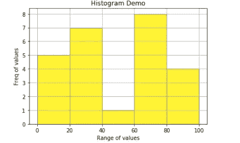

```
import matplotlib.pyplot as plt
%matplotlib inlinenumbers = [10,90,12,16,19,12,20,26,28,30,38,35,34,45,60,68,64,62,70,78,75,79,85,94,95]
plt.hist(numbers,bins=[0,20,40,60,80,100], color='#FFF233',edgecolor='#000000')
plt.title("Histogram Demo")
plt.grid(True)
plt.xlabel("Range of values")
plt.ylabel("Freq of values")
plt.show()
```

盒子情节和小提琴情节

*   箱线图有助于有效地分析数据，并对数据进行外部分析，如异常值、四分位数等
*   小提琴图用于大量数据，其中数据的单独表示是不可能的。

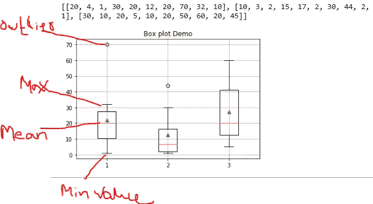

```
import matplotlib.pyplot as plt
%matplotlib inline#data 
total = [20,4,1,30,20,12,20,70,32,10]
order =[10,3,2,15,17,2,30,44,2,1]
discount = [30,10,20,5,10,20,50,60,20,45]
data = list([total, order, discount])
print(data)plt.boxplot(data,showmeans =True)
plt.title("Box plot Demo")
plt.grid(True)
plt.show()
```

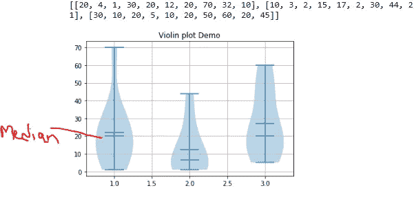

```
import matplotlib.pyplot as plt
%matplotlib inline#data 
total = [20,4,1,30,20,12,20,70,32,10]
order =[10,3,2,15,17,2,30,44,2,1]
discount = [30,10,20,5,10,20,50,60,20,45]
data = list([total, order, discount])
print(data)plt.violinplot(data,showmeans =True, showmedians=True)
plt.title("Violin plot Demo")
plt.grid(True)
plt.show()
```

饼图，圆环图

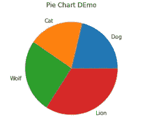

```
import matplotlib.pyplot as plt
%matplotlib inline#prepare the dataset
label=['Dog','Cat','Wolf','Lion']
sizes=[50,45,60,80]plt.pie(sizes,labels =label)
plt.title("Pie Chart DEmo")
plt.show()
```

用户化

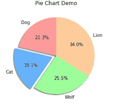

```
import matplotlib.pyplot as plt
%matplotlib inline#prepare the dataset
label=['Dog','Cat','Wolf','Lion']
sizes=[50,45,60,80]#add colors
colors = ['#ff9999','#66b3ff','#99ff99','#ffcc99']plt.pie(sizes,labels =label, colors =colors,autopct='%1.1f%%' ,shadow=True ,startangle = 90, explode=(0,0.1,0,0))
plt.title("Pie Chart Demo")
plt.show()
```

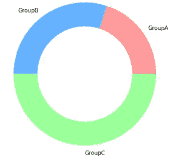

```
#Donut plot
import matplotlib.pyplot as plt
%matplotlib inlinegroup_names = ["GroupA","GroupB","GroupC"]
group_size=[20,30,50]
size_centre = [5]#colors
colors = ['#ff9999','#66b3ff','#99ff99','#ffcc99']pie1 =plt.pie(group_size, labels = group_names,radius =1.5,colors =colors)
pie2 = plt.pie(size_centre,radius =1.0,colors ='w')
plt.show()
```

面积图

*   与线形图类似，只有斜率下的差异区域是彩色的

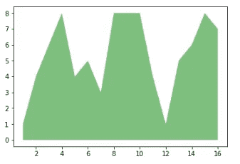

```
import matplotlib.pyplot as plt
%matplotlib inline#dataset
x=range(1,17)
y=[1,4,6,8,4,5,3,8,8,8,4,1,5,6,8,7]plt.stackplot(x,y)
plt.show()
```

少量定制

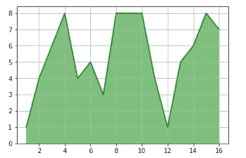

```
import matplotlib.pyplot as plt
%matplotlib inline#dataset
x=range(1,17)
y=[1,4,6,8,4,5,3,8,8,8,4,1,5,6,8,7]plt.stackplot(x,y, colors ='green', alpha =0.5)
plt.plot(x,y, color='g')
plt.grid(True)
plt.show()
```

更多使用熊猫的例子

数据集:[https://www.dropbox.com/s/v3ux6vy7ajvltz0/Customerdata.csv?dl=0](https://www.dropbox.com/s/v3ux6vy7ajvltz0/Customerdata.csv?dl=0)

1.  为数据集构建盒状图。x 轴-合同类型，y 轴-计数

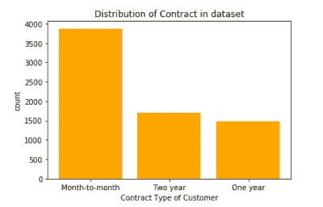

```
import pandas as pd
import matplotlib.pyplot as plt
%matplotlib inlinecustomer= pd.read_csv(r'Customerdata.csv')
grp=customer.Contract.value_counts()
x=grp.keys()
y=grp.valuesprint(type(grp.values))plt.bar(x,y,color ="orange")
plt.title("Distribution of Contract in dataset")
plt.xlabel("Contract Type of Customer")
plt.ylabel("count")
plt.show()
```

2.建立直方图。x 轴:每月发生的费用，y 轴:计数

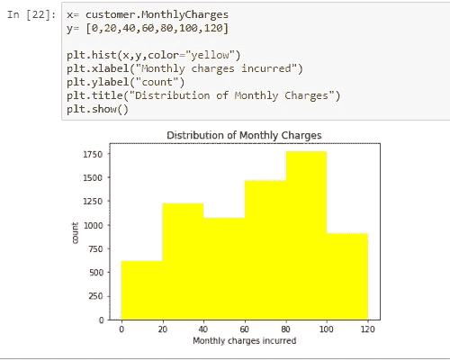

3.建立总电荷(x 轴)与 Tenture(y 轴)之间的散点图。

注意:内核为散点图可视化保持挂起，重启并确保不使用太多数据。

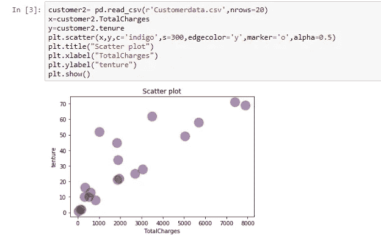

4.构建箱形图。x 轴:客户的付款方式，y 轴:每月产生的费用。有 3 种付款方式:电子支票、邮寄支票和银行转账

自己试试吧:)

提示:

```
a=Customer[Customer['PaymentMethod']=='Electronic Check']
b=Customer[Customer['PaymentMethod']=='Mailed Check']
c=Customer[Customer['PaymentMethod']=='Bank transfer']
```