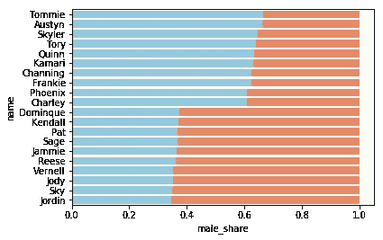
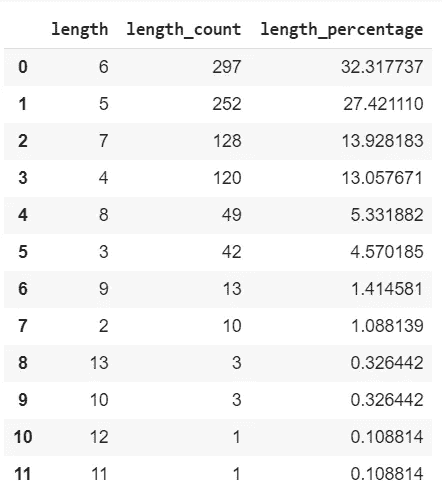
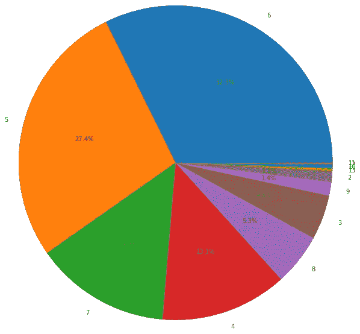
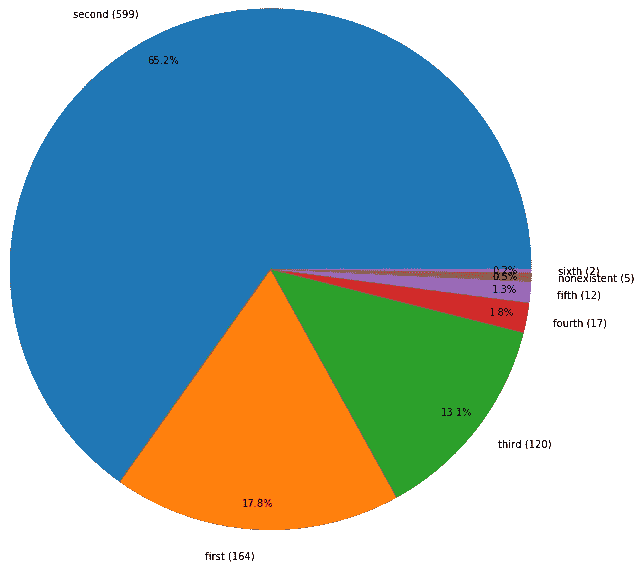
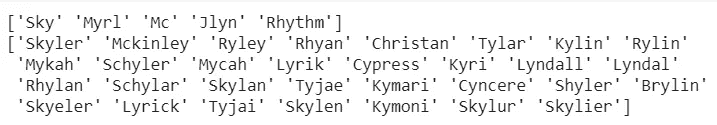
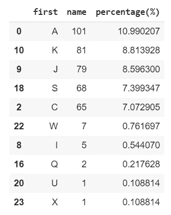
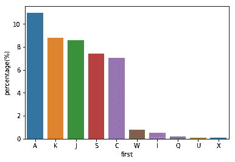
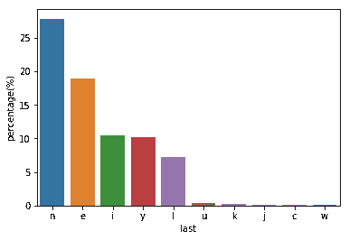
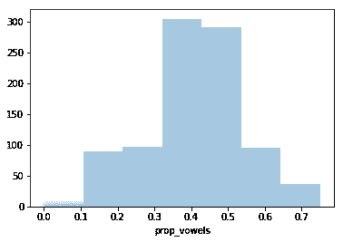
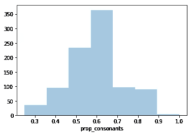

# 美国男女通用名称的数据可视化

> 原文：<https://medium.com/analytics-vidhya/data-visualization-of-american-unisex-names-1b46077014cf?source=collection_archive---------14----------------------->

*你叫什么名字？你见过同名的人吗？他们和你的性别一样吗？*

我一直对数据分析感兴趣，但我不知道在哪里可以找到数据集。然而，最近我听说了 [Kaggle](https://www.kaggle.com/) 、[我们的数据世界](https://ourworldindata.org/)和[fivethirtyeght GitHub 库](https://github.com/fivethirtyeight/data)。在查看 [FiveThirtyEight GitHub 资源库](https://github.com/fivethirtyeight/data)时，我发现了一个[有趣的数据集](https://github.com/fivethirtyeight/data/tree/master/unisex-names)，我决定用`pandas`对其进行分析，并用`seaborn`和`matplotlib`对其进行可视化。

# 使用的工具

*   [Google Colab](https://colab.research.google.com) 编写代码，一次只执行一部分代码
*   Python [Pandas](https://pandas.pydata.org/) 库操纵数据
*   Python [seaborn](https://seaborn.pydata.org/) 库来可视化结果(以及 [Matplotlib](https://matplotlib.org/) 因为 seaborn 太高级了)

# 关于数据集

*   关于这个数据集的[fivethirtyeeight 文章的作者](https://fivethirtyeight.com/features/there-are-922-unisex-names-in-america-is-yours-one-of-them/)在文章中写道:

> 我使用了社会安全管理局 100 多年的数据来创建这个最中性的名字列表。(SSA 有关于至少给五个人起名字的数据，但我把最低门槛定在 100 人，以确保一个名字足够流行，以确定它实际上是否是中性的。)使用同样来自 SSA 的精算表，我对姓名数据进行了调整，以逼近目前以每个姓名生活的人数。

*   [数据集](https://github.com/fivethirtyeight/data/tree/master/unisex-names)包含一个男女通用的名字的表格，在美国至少有三分之一的时间和最少 100 人使用这些名字。它有五列(`name`、`total`、`male_share`、`female_share`和`gap`)和来自 2，887，002 人的 919 个名字。我还喜欢这个数据集一点也不技术性，所以它的平易近人是我选择它的另一个原因。

# 清理数据集

数据集已经很整洁了。除了第一个字符，每个名字都是小写的，并且至少有两个字符长。它有很好的列名，所以不需要重命名列。没有丢失数据，所以我可以使用所有 919 行。问题是数据集是其他人基于老化曲线的估计，所以`total`列都是`float`的。因此，我开始将整个`total`列转换为`int`。

我不需要 gap 列，所以我添加了 DataFrame 的子集。

# 视觉化 1:男女通用但偏？

首先，我从一个显而易见的问题开始。即使他们是男女通用的名字，性别比例也不会是一半对一半。*哪些名字男生用的多，哪些名字女生用的多？*我只考虑了使用次数超过 5000 次的名字。

是的，我喜欢静态类型提示，即使这会使代码更长。



当然 Tommie 更有可能是男生，Sky 更有可能是女生。

# 可视化 2:名称长度的分布

我想知道的另一件事是长度的分布。韩国人的名字绝大多数都是三个字母长，但是美国人的名字呢？此外，长度是名称的少数几个数字属性之一，这使得它更容易操作。

我在这里使用了方便的 Series.value_counts()方法。

如果在 Google Colab 上打印结果，您会得到以下输出。



表格形式的名称长度分布

正如你所看到的，85%的男女通用的名字有 4 到 7 个字母长。(不知道这和男性化/女性化的名字有没有统计学上的区别。)不到 1%的名字是 10 个字符或更长。

我喜欢表格，但是表格并不是可视化的最佳形式。这是同样数据的饼状图。我将百分比四舍五入，如果百分比小于 1，则排除百分比。

不幸的是，seaborn 没有任何饼图，所以我使用了 matplotlib。



# 视觉化 3:第一个元音在哪里？

我的第三个问题是“第一个元音在哪里？”我的假设是大多数名字的前两个字母都有一个元音，但我想用数字来验证一下。首先，我创建了一个函数来确定第一个元音的位置。因为有些名字可能根本没有元音，所以我使用了基于 1 的索引，因为如果根本没有元音，我需要指定 0。

如你所见，我不认为“y”是元音。

如果打印出最后一行，它返回 6。这意味着元音总是出现在前六个字符中，如果有的话。然后我写了一个返回英文序数的函数，使其可读性更好。

是的，我喜欢用逗号结尾。

现在我们再做一个饼状图。你认为结果会是什么？

看看那些百分号…



这是你所期望的吗？

大约三分之二的男女通用的名字以一个辅音开头，后面跟着一个元音。等等，96%的男女通用名字前三个字里面都有一个元音，有道理，但是剩下的 4%到底是什么呢？

。to_numpy()将数据帧或序列转换为 numpy 数组。



现在你们一群' *y* 的，你们看*为什么*。不过，我没有想到像天空这样的名字。你预料到了吗？

# 可视化 4:第一个/最后一个字母

我的名字以“j”开头，其他许多名字也是如此。在美国男女通用的名字中也是如此吗？让我们看看哪五个字母最常用/最少用做男女通用名字的第一个字符。



是的，` j '是用作名字第一个字母的前几个字母之一。

并且`seaborn`可以在一行代码中可视化这一点！

```
import seaborn as snssns.barplot(x='first', y='percentage(%)', data=fld2)
```



最常用/最不常用作名字首字母的字母

我们可以对最后一封信做同样的事情。这次让我跳过桌子。



超过四分之一的中性名字以“n”结尾，这还不包括像“Divine”(以/n/音素结尾，但不以字母“n”结尾)这样的名字！

# 可视化 5:元音/辅音的比例

我也很好奇一个名字有多少是由元音组成的。



中性名中元音比例直方图

对于辅音的比例，你可能会期待另一个关于`proportion=0.5`完全对称的直方图，但那不是真的！[半开区间让事情变复杂](https://github.com/numpy/numpy/blob/v1.17.0/numpy/lib/histograms.py#L740)。如果将`[0, 1]`的范围分成 10 个面元，则区间`[0.5, 0.6)`中的所有`prop_vowels`将被表示为第六个面元。同样，`prop_consonants == 1 — prop_vowels`和`(0.4, 0.5)`中的所有数字都如预期的那样被表示为第五个二进制数。但是，0.5(等于`1 — 0.5`)包含在下一个容器的*中，使得直方图不对称。*



# 警告和进一步研究

*   如前所述，最初的作者调整了数据，使其接近目前使用每个名字生活在的*人的数量。尽管这是基于来自 SSA 的实际数据，但并不完全来自 SSA。*
*   数据集只包含美国的男女通用的名字。如果有其他国家的名字就更全面了。然后，我就可以比较不同国家之间的异同。例如，领先的“j”在不同国家是否普遍存在？
*   数据集只包含美国的男女通用的名字。如果我有完整的美国名字，我就可以比较这两个名字，看看男女通用的名字有什么特别之处。
*   数据集只包含每个名字的*拼写*。如果它也包含音素，我可以做一些语音分析。比如很多名字都是以‘e’结尾的，但这并不意味着最后的音是/e/。如果发*正义*的话，以 a /s/音结尾。这样我就可以把不同的名字当作同一个名字来对待。此外，发音比拼写更能描述名字。有时你甚至不能仅仅通过拼写来读一个人的名字。