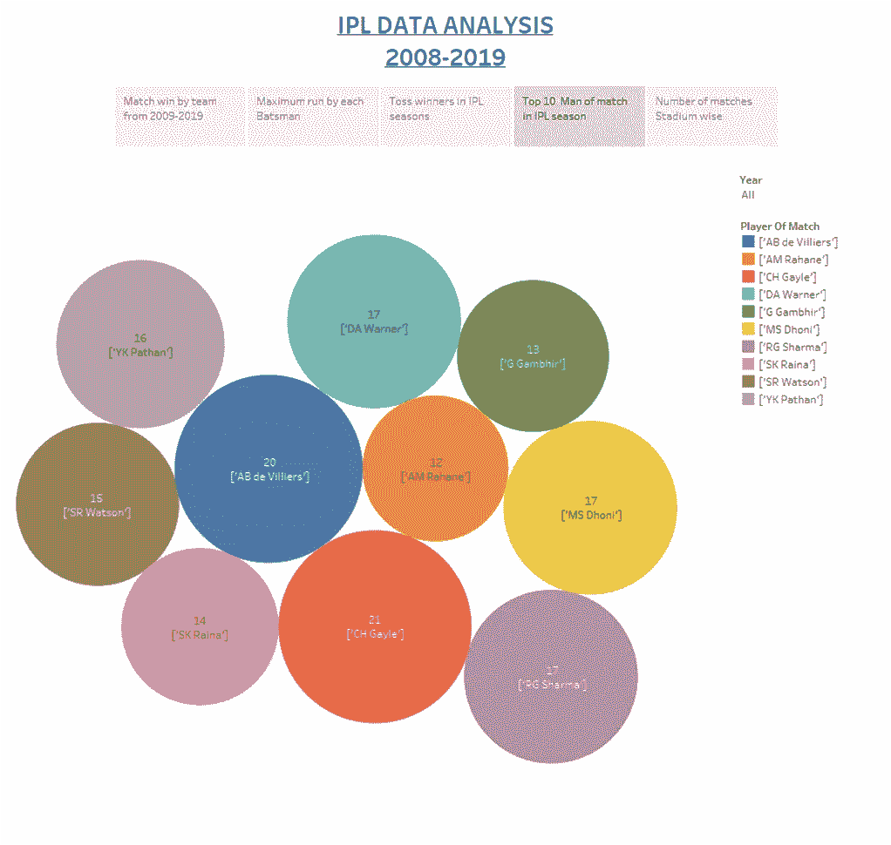

# 使用 Tableau 实现 IPL 数据的可视化

> 原文：<https://medium.com/analytics-vidhya/data-visualization-of-ipl-data-using-tableau-5c7c7bbe5b18?source=collection_archive---------7----------------------->

数据分析是一个对数据进行检查、清理、转换和建模的过程，目的是发现有用的信息、提供结论和支持决策。数据分析有多个方面和方法，包括各种名称下的不同技术，用于不同的商业、科学和社会科学领域。在当今的商业世界中，数据分析在使决策更科学和帮助企业更有效地运营方面发挥着作用。

所以在数据分析中有一个数据可视化的过程，这个过程可以通过很多方法来实现。

但是 Tableau 提供了许多可视化和许多其他有用的功能。

所以我们都知道 IPL20 要来了。因此，我想出了从第 1 季到第 12 季，即 2008 年至 2019 年的简单数据分析。

公共场景——[https://public.tableau.com/profile/vaishnav.srivastava#!/viz home/IPL data analysis/story 1](https://public.tableau.com/profile/vaishnav.srivastava#!/vizhome/IPLdataanalysis/Story1)

我使用的数据来源于 [kaggle](https://www.kaggle.com/ravijee/ipl-2008-to-2019) 。

# **2008–2019 年各队比赛胜利**

我们可以清楚地看到，从第 1 季到第 12 季，米赢得了最多的比赛。因为我们使用梯度，所以更容易解释。

# 每个击球手的最大跑垒次数

Virat kohli 在所有年份中得分最高，为 5412。我们可以看到任何一年任何一个击球手的表现。

# 在 IPL 中投掷获胜者

气泡图不是最好的决定，但在可视化中看起来不错。密歇根州投掷次数最多，为 97 次，其次是 KKR，为 91 次。由此我们可以预测许多因素，如胜负关系。

# 十佳“最佳球员”获得者

这张气泡图清楚地显示了前 10 名“最佳球员”。正如我们可以清楚地看到，克里斯·盖尔赢得了最高数量的奖杯，他在整个 ipl 赛季中赢得了 21 次奖杯，直到 2019 年。

# 比赛数量最多的场馆

上面的条形图显示了在体育场进行的一些比赛。在加尔各答、德里和孟买举行的比赛数量最多。此外，2009 和 2014 赛季发生在南非和阿联酋

> 结论

本[工作簿](https://public.tableau.com/profile/vaishnav.srivastava#!/vizhome/IPLdataanalysis/Story1)显示了 IPL 数据集的探索性数据分析。当深入探究哪个体育场赢得了最多的比赛，哪个城市赢得了最多的比赛等等时，这个数据集中有更多的东西可以探索。敬请期待！

领英-[www.linkedin.com/in/vaishnav-srivastava-88a030119](http://www.linkedin.com/in/vaishnav-srivastava-88a030119)

谢谢你。