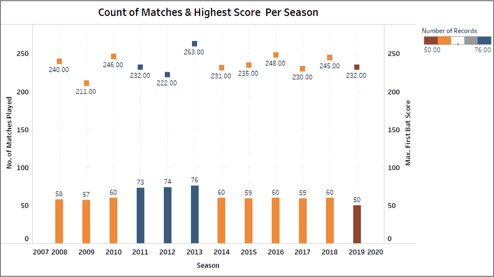

# 用 Tableau 实现 IPL 数据的可视化

> 原文：<https://medium.com/analytics-vidhya/data-visualization-of-ipl-data-with-tableau-7c04464b28d5?source=collection_archive---------5----------------------->

世界上有很多可用的数据，但挑战在于以一种易于访问的格式理解和解释这些数据。如果数据驱动的见解不能以最简单的方式传达给利益相关者，那么它们就毫无价值，这样他们就可以相应地做出业务决策。

Tableau 就是这样一个数据可视化工具。使用 Tableau 可以非常快速地完成数据分析，并以仪表板和工作表的形式创建可视化效果。

Tableau 连接并提取存储在各个地方的数据。它可以从任何可以想象的平台提取数据。从 excel、pdf 等简单数据库到 Oracle 等复杂数据库，再到 Amazon webs services、Microsoft Azure SQL database、Google Cloud SQL 等云端数据库以及其他各种数据源，都可以通过 Tableau 提取。

当我想到写这些博客时，我想从我真正喜欢的东西和所有人都容易理解的东西开始。板球是印度的心脏，IPL(印度超级联赛)是全世界最受关注的比赛之一。我想不出比用 IPL 数据展示一些 Tableau 可视化效果更好的方法了！希望你觉得这很有见地。

这些可视化中使用的 IPL 数据集来自 [Kaggle](https://www.kaggle.com/divjain/ipl_data_till_2019) 。

# 每个赛季打几场比赛？

从上面的条形图我们可以看到，从 2008 年到现在，每个赛季大约有 50-60 场比赛。请记住，在 2011-2013 年，有 9-10 个团队参加。因此，在这三年中，总匹配数很高。

还有，纵观每个赛季的最高分，脱颖而出的是 2013 年皇家挑战者班加罗尔的得分。班加罗尔在对阵浦那勇士队印度队的比赛中取得了惊人的 263/5 的成绩。克里斯·盖尔 175 分的不朽记录还没有被打破！它很可能在未来许多年都保持不败。

# 到目前为止，IPL 中最成功的球队是哪一支？

好吧，你会大吃一惊的。(如果你是 CSK 的粉丝！)IPL 中最成功的团队是获胜次数最多的团队。孟买的印度人以 104 场比赛领先，紧随其后的是 CSK 和 KKR，分别为 99 场和 91 场。你知道吗，CSK 被禁赛几年，这可能让他们失去了最成功的车队标签！

# 最佳“最佳球员”获得者

啊！这个泡泡图太酷了！如上图所示，克里斯·盖尔获得了最多的“最佳球员”称号，其次是 AB de Villiers。Dhoni 女士和 Rohit Sharma 分别以 17 个头衔高居印度榜首。难怪海外玩家和印度玩家一样喜欢 IPL。

# 每个体育场进行的比赛？

不出所料，经常参赛的 8 支球队的主场名列榜首。难怪，“印度板球的麦加”伊甸园是前三名之一。

# 每队赢得的掷球次数&掷球决定？

孟买的印度人赢得了最多的投掷(87 次)，并在 53 次中决定首先上场。也可以看出，大多数球队更喜欢追逐而不是先击球。然而，CSK 是个例外，他们喜欢在 47 个场合设定目标，而不是追逐目标。(40 次)

以上的可视化只是初步的。然而，可以实现许多其他可视化。敬请期待！