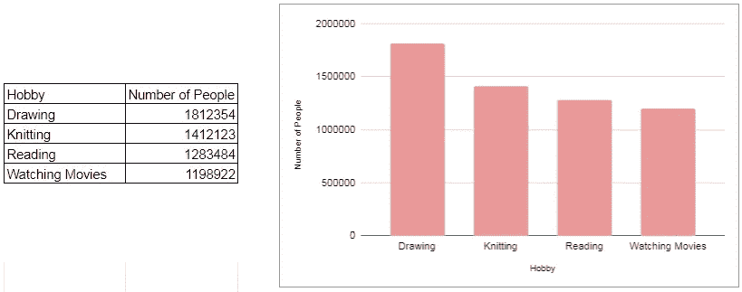
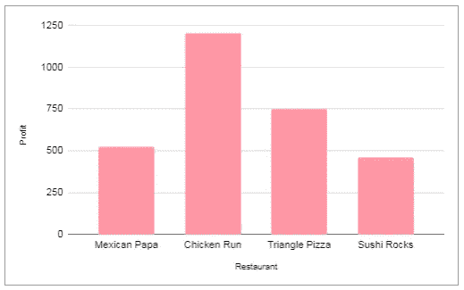
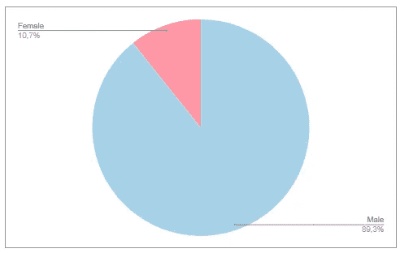
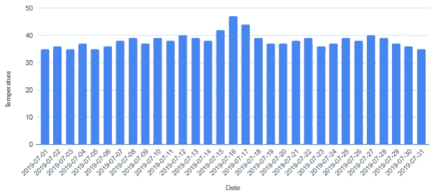
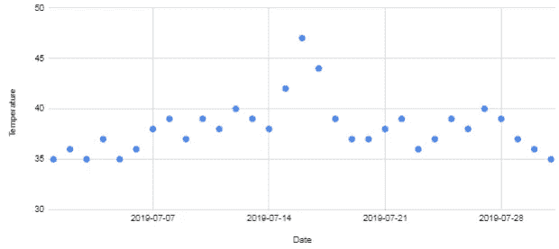
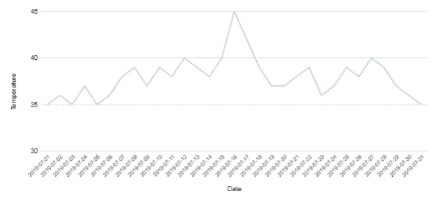

# 数据可视化:讲述故事一览

> 原文：<https://medium.com/analytics-vidhya/data-visualization-telling-stories-in-a-glance-b9ca206aa14d?source=collection_archive---------13----------------------->

几千年前，人类在岩石上、洞穴里、花瓶上画人物。几个世纪过去了，那些数字被简化了，字母表被发现并取代了那些复杂的图片，现在我们使用文字作为一种更简单、最常见的非语言交流方式。知道了这一点，我们能说理解图片或形状实际上是人类的一种基本本能吗？

所以如果我们能用图片交流，正确有效，应该比用文字好吧？因为文本实际上更难理解，因为要理解它，我们必须识别字母的形状，识别组成单词的形状的组合，识别单词之间的关系，并最终理解单词串的实际含义。

这里有一个关于人们爱好的数据:

哪一个更容易、更快地获得关于最流行的爱好的信息？使用图表查找信息不是更容易吗？如果没有，那么你可能想完全停止阅读，因为我没能说服你使用可视化。

我认为数据可视化最重要的事情是尽可能用最短的方式传达故事。最好的可视化是当人们只需扫一眼就能获得至少一条信息。

# ***但如何？***

因为视觉化实际上是一种交流方式，有一种叫做视觉语法的东西。了解这种语法或可视化语言，可以真正帮助您决定如何呈现或可视化您的数据。

最基本的视觉语言元素是颜色、形状、大小和位置。

不同的颜色意味着不同的群体。

不同的形状也意味着不同的群体。

不同的大小意味着不同的值，其中越大=越多

不同的立场意味着不同的群体。

不同的职位也可能意味着不同的等级或…职位。

我认为，只要在我们的头脑中积极考虑这些因素，我们就可以实现良好的数据可视化。

因此，我们可能希望用数据可视化来交流一些事情，我将尝试解释如何基于可视化语法来进行可视化交流。

# 多少…？

-或量值，即实体之间的不同值。当我们想讲述关于量级的故事(也只有量级)时，我们使用视觉语言:大小。使用尺寸语言最简单的方法是使用条形图。

例如，交流这四家餐馆的利润是多少:

有了这张图表，你可以看到每家餐馆的利润有多少，你可以很容易地比较哪家餐馆利润最多和最少。

# …的百分比是多少？

或者知道一个群体是如何分裂成各个部分的。由于百分比也是一个值，我们也将使用可视化语言:size。但是每个元素都是一个整体的一部分，所以我们需要表明它是同一个整体的一部分，但也是不同的元素。为了表明每个元素都是同一个组的一部分，我们将使用 shape(相同的形状)，为了表明每个元素是不同的元素，我们将使用 colors(不同的颜色)。

虽然这听起来很复杂，但其中一个可以同时代表三种视觉语言的图表是非常普通和简单的:饼状图。例如，要传达公司中女性的百分比:

一瞥之内，我们可以看到每个性别的百分比。影响比只看数字更大。你实际上可以看到每个性别的比例。

您可能会注意到，圆形显示它是一个单独的组:雇员。不同的颜色表明这是不同的元素:男性和女性。并且每种颜色的大小显示了百分比的值。简单，*嗯*？

# 趋势如何…？

或者一段时间内的价值。所以现在你可能已经知道该怎么做了。视觉语言来表现价值？尺寸。为了表示时间，我们将使用位置。例如，我们想显示整个七月每天的平均温度趋势。

还不错！我们可以看到，7 月 16 日气温略有上升。但仅仅是轻微吗？7 月 3 日的最低温度为 35 摄氏度，7 月 16 日的最高温度为 47–48 摄氏度。差别一点都不轻微！即使是空调通常也只有 10 度的范围。*但是如何使用图表进行交流呢？*

现在，假设 7 月份的正常温度高于 33 摄氏度，那么我们实际上可以忽略 33 度的部分。但是条形代表一个相对大小，我们不能把它降低到 33 度以下，因为它会打乱相对大小。既然尺寸在这里不起作用，让我们用视觉语言**位置**来代替尺寸。

虽然这张新图表显示温度在 7 月 16 日达到峰值，但它看起来没有意义，因为每个点看起来都像一个不同的实体。那么如何让它们看起来代表同一个东西(温度)？我们将把这些点连接起来，表明这是一个相同的实体，只是在不同的时期处于不同的位置。

好多了！现在我们可以清楚地看到(一目了然！)气温在七月中旬会超高，然后回落到七月下旬。

事实证明，实现数据可视化并不那么简单。它有多种方式，一切都取决于你想向你的观众传达什么。

下一次，更多关于为你的数据可视化选择图表。直到那时，再见。