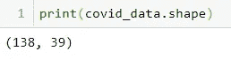
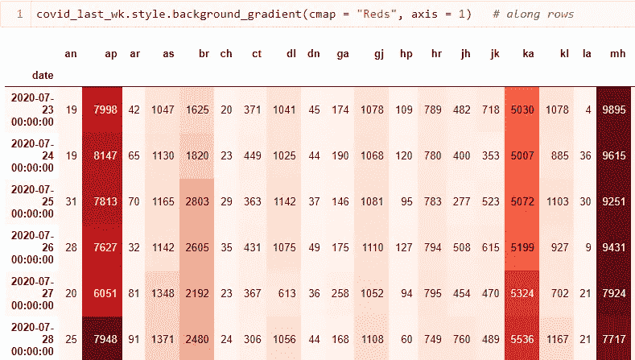

# 通过印度新冠肺炎每日病例数制表实现数据可视化

> 原文：<https://medium.com/analytics-vidhya/data-visualization-through-tabulation-on-indias-covid-19-daily-case-count-573c37e3d5e3?source=collection_archive---------23----------------------->


可视化改变世界的疫情的最新趋势。永远。

数据科学是以下步骤的融合:**收集数据**，**存储数据**，**处理数据**，**描述数据**和**建模数据**。**数据可视化**处理**描述数据**。

获取整个数据集，并缩小我们的关注范围，只关注我们想要处理的那部分数据，这就是描述数据的内容。有两种**方法**来处理它:**计算统计数据**(均值、中值、众数和标准差等)和**绘制图表**来获得对数据的直观洞察。

压缩数据并使用有意义的符号进行交流的能力不仅是对人类智能的一种衡量，也是对人工智能代理的一种衡量。

> 数据可视化的目标

减少感知错误:视觉编码信息

**发现真知灼见**:关键信息通常是从图表中提取出来的，否则即使从统计推断中也是隐藏的

**传达见解**:通过图形和图表的帮助，将发现的见解有效地传达给天真的用户

> 数据可视化包

**matplotlib** :灵感来自 MATLAB 的绘图工具

seaborn :构建在 matplotlib 之上的 Python 数据可视化库

pandas 集成了上述绘图库，从而使**计算**和**绘图**能够齐头并进。

让我们导入必要的包:


适当导入和重命名的包

> 收集数据

为了能够可视化并获得洞察力，我们首先需要获得[数据](https://api.covid19india.org/states_daily.json)。从最初的检查中，我们发现每个州的每日案例数被存储在一个 JSON 文件中，该文件被组织成一个字典，只有一个键“ **states_daily** ”。从 2020 年 3 月 14 日开始的**每日报告存储为三个字典的集合，以州/联邦领地名称的缩写作为关键字，以感染、康复和死亡患者的数量作为值。获取这些数据的过程从定义包含该文件的网页的 URL 开始:**


将 URL 存储为字符串对象

接下来，我们需要合并来自 **urllib** 库的**请求**包:


帮助检索 web 数据

使用下面的代码行，我们不仅能够获取所需的数据，还能够将其存储在一个文件中以供将来可视化:


从在字符串 **url** 中找到链接的网页中获取所有数据，并存储在 **data.json** 中

上面显示的语句末尾的分号隐藏了不需要的警告语句。

> 存储数据

我们现在可以使用下面的一行程序来读取 JSON 文件:


read_json()来自熊猫图书馆

为了确保数据已被成功读取，并且我们对其结构的所有观察都是正确的，明智的做法是打印内容:


事实上，如前所述，这是一本字典集

> 预处理数据

如上所示的数据格式很难掌握和使用。我们提出了一种替代方法，使用 **json** 库来加载获取的数据:

```
import json
```

首先，我们需要以读取模式打开 JSON 文件:

```
fh = open("data.json", mode = "r")    # fh is the file handler
```

接下来，我们链接文件处理程序以从文件中加载数据:

```
data = json.load(fh)
```

已加载数据的快照如下所示:


快照:嵌套字典

可以引用“**States _ daily”**键属性，以便将内容提取为单级字典:


快照:单级字典

如上所示，使用字典数据很麻烦。一个可行的替代方法是将 JSON 字典转换成 pandas DataFrame:


通过展平存储在**数据**中的 JSON 文件创建的 DataFrame 对象 **covid_data**

> 检查数据

理解数据的途径可以从找到行数和列数开始。对于每个日期，我们有 3 个条目，分别对应于**确诊**、**死亡**和**康复**患者:


**shape** 属性返回 **414 行**和 **41 列**

414 个条目相当于 138 天的数据(414 / 3 = 138)。对于印度的每个邦和中央直辖区，都有一个缩写的列名。为了拓宽我们对数据本质的认识，我们来看看以下几栏:


**列**属性返回列名列表

通过少量的研究，我们可以建立一个表，将地区缩写映射到相应的名称:


印度各邦和中央直辖区

上表包含 37 个地区的名称。其余四列是:
**状态** —定义一行的标签(已确认、已死亡、已康复)


分类变量**状态**及其唯一的一组 3 个值

**日期** —表示特定报告日期的字符串


138 天数据

**tt** —确诊/死亡/康复患者总数


分类数据，以后会转换为数字数据

**un** —似乎包含异常数据点，需要删除:


案例数不能为负！

由于列 **un** 包含虚假值，我们将它完全删除:


drop 方法删除了 **un** 列(轴= 1 ),这一变化反映在 **covid_data** 中，因为 inplace 设置为 True

为了更加确定这种变化，我们查询了 **covid_data** 的形状:


我们现在只剩下 40 列了！

将**日期**属性从字符串转换为时间戳有助于更好地处理数据:


**to_datetime( )** 有助于此过程

我们希望**只关注被感染患者的集合**。因此，我们在**状态**属性为“**已确认**”的条件下对整个数据帧进行子集化:


缩小我们的焦点是什么构成了**描述数据**

让我们确保上述操作正确执行:


仅包含 138 行的原始数据集的三分之一

因为我们已经设法提取了仅与受感染患者相关的信息，所以我们没有使用**状态**列。所有 138 行都具有相同的状态值:


上述声明通过**状态**重新声明，仅返回一个唯一值:**确认**

我们现在可以放弃了:


已尝试使用分号隐藏警告(粉红色)

证实我们的主张总是好的:



去掉**状态**属性后剩下 39 列

通过检查前五行获得手头数据的概述:


默认情况下， **head( )** 返回前五行

很明显，我们正在处理**日常数据**。因此，明智的做法是**基于日期列**对行进行索引:


**日期**列作为 **covid_data** 的索引

从表面上看，事例计数是正整数。然而，每一列的数据类型都与我们的预期相反:


由 **info( )** 生成的输出快照

为了能够应用可视化工具，我们的数据值必须是数字:


将 **to_numeric( )** 方法传递给 **apply( )** 方法，从而将每个属性的数据类型更改为 int

对于门外汉来说，最好从小规模层面开始可视化数据。我们将**焦点**缩小到最近一周的**数据(7 月 23 日至 7 月 29 日)**:


**tail(7)** 方法返回最近 7 天的数据

在继续进行**样式列表**之前，让我们删除总案例栏:


表示总数的 tt 被废除了

> 样式列表

我们编写了一个函数，将计数为 **0 的单元格着色为绿色**，将计数为**的单元格着色为红色**:


请注意是**色**和**色**

**style.applymap( )** 帮助将上述函数应用于每个单元格，并相应地对它们进行颜色编码:


快照显示**达曼和迪乌(dd)** 和**拉克沙德威** **(ld)** 上周报告零病例

我们可以继续删除这些列:


截至 7 月 29 日，已知 37 个地区中有 35 个报告了新病例

如果我们能够对**最大病例数**进行颜色编码，我们就可以了解最近**报告较低病例数**并因此处于**恢复过程中**的州的情况。还发现了关于最近报告**较高计数**并需要**特别关注**的州的洞察:


highlight_max()为我们完成了这个任务


快照:最大值以红色显示

安得拉邦( **an** )、阿鲁纳恰尔邦( **ap** )、中央邦( **mp** )和其他一些邦最近报告了更高的计数，而查谟和克什米尔( **jk** )、奥里萨邦(**或**)、那加兰邦( **nl** )和其他一些邦似乎处于**恢复模式**

**最小箱数**也可以高亮显示:


快照:晚报告最小值是一个好迹象

我们可以同时突出显示最小**和最大**值:


快照:绿色表示最小值，红色表示最大值

以粗体显示**最大值的功能**:


**对于列中的最大值，font-weight** 属性设置为粗体，对于其他值，保持不变

让我们用红色粗体突出显示最大值，用绿色突出显示最小值:


快照:**最大值**为**粗体**和**红色**，而**最小值**为**绿色**

了解哪个地区每天报告的病例数最高变得非常重要:


马哈拉施特拉邦(mh)的情况似乎令人担忧——每天报告的病例数最高

我们可以根据数据给背景涂上渐变颜色，而不是两种颜色编码——阴影越深，数值越高，情况越危险:


快照:根据区域的阴影分布

沿着**行(按日期)**也可以有不同的颜色:



快照:马哈拉施特拉邦(mh)、安得拉邦(ap)和泰米尔纳德邦(TN)[如下所示]每天都有大量病例报告


泰米尔纳德邦也不甘落后

由于 **mh** 、 **ap** 和 **tn** 似乎是 covid 热点，我们使用**柱状图**关注这三个地区，其中**柱状图的长度与病例数量的大小成比例**:


条形越长，当天记录的病例数就越高

如果我们使用三种不同的颜色——每种颜色代表一种状态，视觉效果会更好:


区分三个受影响最严重地区的清晰图片

我希望这篇文章对你有所帮助。请随时留下您的评论、反馈、批评、想法和其他一切。回头见！