# 使用 Matplotlib 和 Seaborn 实现数据可视化

> 原文：<https://medium.com/analytics-vidhya/data-visualization-using-matplotlib-and-seaborn-bf81065e6c5?source=collection_archive---------9----------------------->


**什么是数据可视化？**

当今世界大量数据无处不在。数据每天都在增加。我们可以从手机上实时看到。利用社交媒体、邮件，银行交易日益增多。是否可以用形式化的表示方式来查看海量数据？是的，我们可以通过数据可视化来实现。数据可视化是数据的图形化表示。在大数据世界中，有几种数据可视化工具能够分析用于决策的海量数据。


今天，我们将使用来自 [UCI](https://archive.ics.uci.edu/ml/datasets.php) 的数据集实现数据可视化。

让我们开始…

从下面的链接下载数据集。

[银行营销](https://archive.ics.uci.edu/ml/machine-learning-databases/00222/)

**加载数据帧中的数据**

```
df = pd.read_csv(r'\Dataset\bank-full.csv', sep=';')
df
```

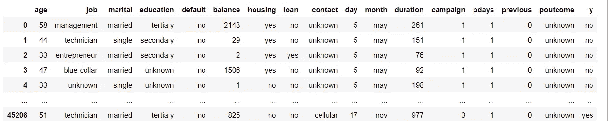

银行营销数据集

**Matplotlib**

**直方图**

一个**直方图**是一个**图表**，它将数字数据分组到多个条块中，将这些条块显示为分段的列。它们用于描述数据集的分布:值落入范围的频率。

使用直方图，我们可以看到大约 39000 人持有余额为 0。其中 5000 人拥有大约 15000 人。

```
**df**['balance'].plot(kind='hist')
```

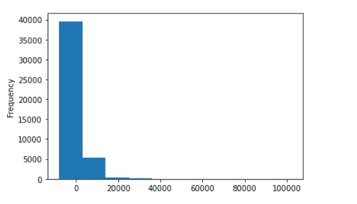

跨定价参数的直方图

**饼状图**

来决定哪份工作工资高。

需要创建的数据集基本上在工作分组和平衡如下

```
df_group = df.groupby(['job'])['balance'].sum()
```

使用饼图绘制数据

```
**df_group**.plot.pie(figsize=(10,20), autopct="%.2f")
```

管理人员收入高，其次是蓝领工作。

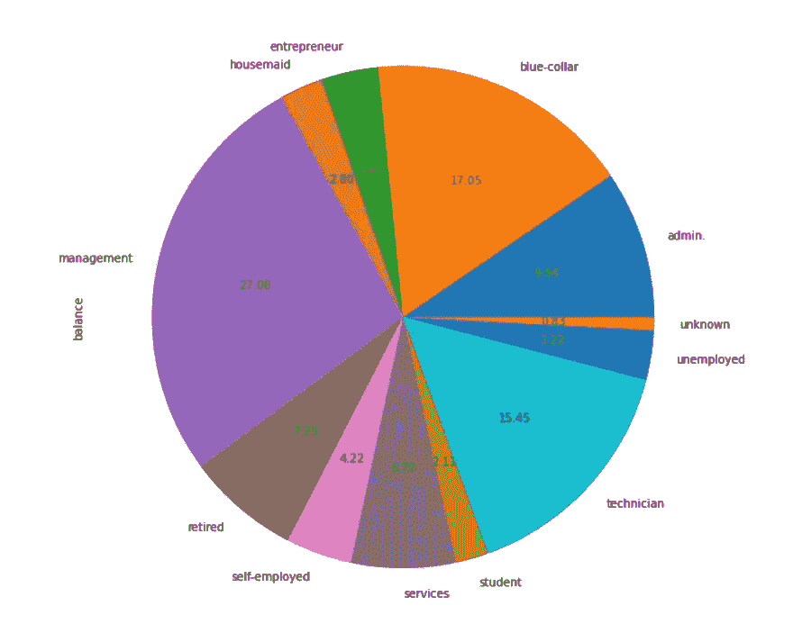

馅饼

另一个有趣的问题是，确定贷款人数

```
**df**['loan'].value_counts(normalize=True).plot(kind='pie', autopct="%.1f")
```

大约 16%的人接受了银行贷款。

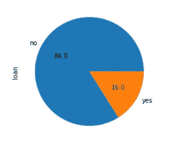

馅饼

**计数**

```
**plt**.figure(figsize=(20,10))
**plt**.xticks(rotation=90)
**df**.job.value_counts().plot(kind='barh')
```

谁承担了大部分工作或需求工作？很明显，蓝领工作占了大部分。

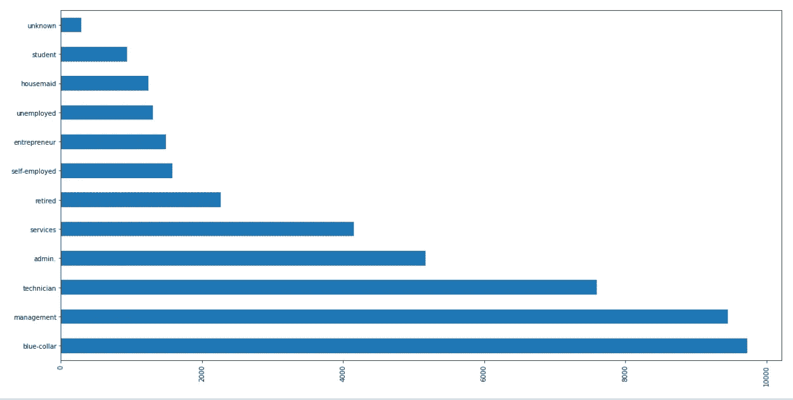

数数

**条形图**

确定哪种教育支付更好的平衡。

```
df_loan = df.groupby(['education'])['balance'].sum().reset_index()df_loan.plot.bar(x='education', y='balance')
```

从剧情来看，二次元和三次元玩的比较平衡

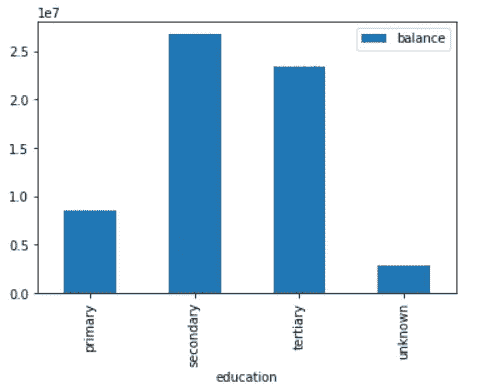

条形图

**Seaborn**

**猫图**

此函数提供对几个轴级函数的访问，这些函数使用几个可视化表示中的一个来显示数字和一个或多个分类变量之间的关系。

从数据集中，首先将余额大于 100 的人分组

```
**greater_100_balance** = df[df['balance'] > 100]
greater_100_balance
```

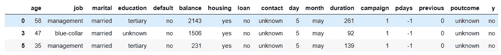

余额大于 100 英镑

按如下方式将余额分配给每个婚姻状态的月份。

```
sns.catplot(x='month', y='balance', col='marital', **data**=greater_100_balance, kind='bar')
```

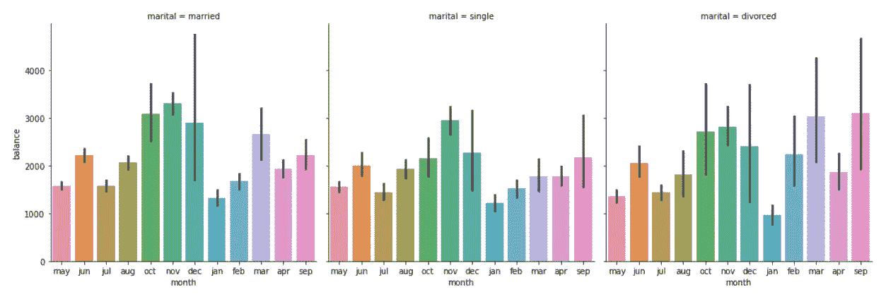

猫图

**配对图**

在数据集中绘制成对关系。

默认情况下，该函数将创建一个轴网格，这样数据中的每个数值变量将在单行的 y 轴上共享，在单列的 x 轴上共享。对角图的处理方式不同:绘制一个单变量分布图来显示每一列中数据的边际分布。

也可以显示变量的子集，或者在行和列上绘制不同的变量。

```
**sns**.pairplot(**df**)
```

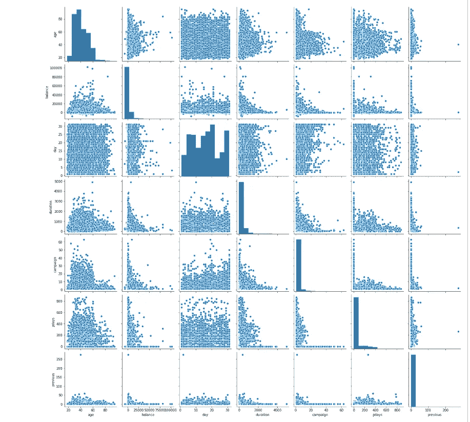

配对图

**计数图**

使用条形图显示每个分类箱中的观察计数。

```
sns.countplot(x='housing', **data**=df)
```

确定拥有住房的人数。

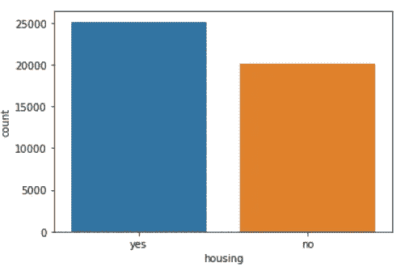

计数图

**散点图**

使用`hue`、`size`和`style`参数，可以显示不同数据子集的`x`和`y`之间的关系。这些参数控制使用什么视觉语义来识别不同的子集。通过使用所有三种语义类型，可以独立地显示多达三个维度，但是这种类型的情节可能很难解释，并且通常是无效的。使用冗余语义(即同一个变量的`hue`和`style`)有助于使图形更易访问。

```
sns.scatterplot(x='age', y='balance', **data**=df)
```

50 岁的人有更高的平衡感。50-60 岁之间可以看到平衡的顶峰。

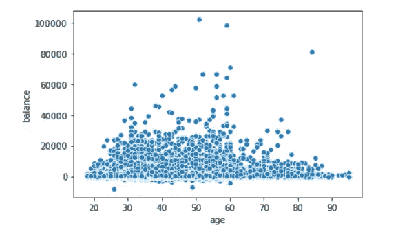

散点图

**重新绘制**

使用色调、大小和样式参数，可以为不同的数据子集显示 x 和 y 之间的关系。这些参数控制使用什么视觉语义来识别不同的子集。通过使用所有三种语义类型，可以独立地显示多达三个维度，但是这种类型的情节可能很难解释，并且通常是无效的。使用冗余语义(即同一变量的色调和样式)有助于使图形更容易理解。

```
sns.relplot(x='day', y='balance', **data**=df, hue='month')
```

6 月 3 日的存款余额高于 11 月。

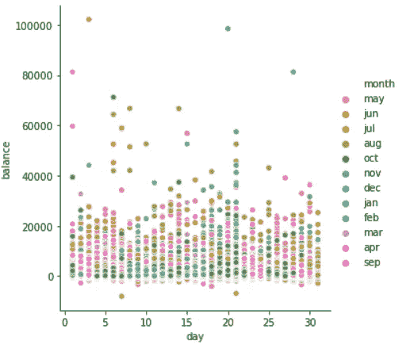

重新绘图

**接头图**

用二元图和一元图画一个二元图。

```
**sns**.jointplot(x=df['day'], y=df['balance'])
```

上面的错误是使用 joinyplot 实现的。

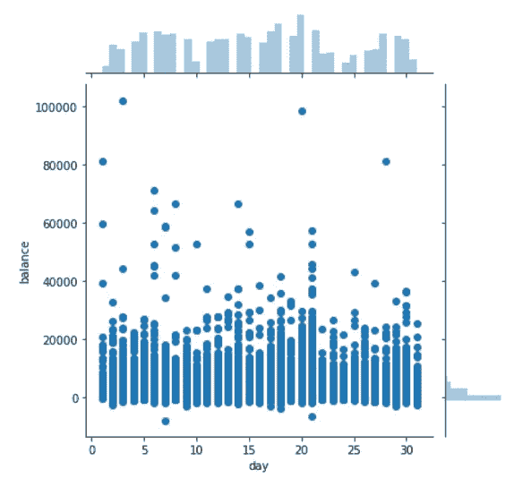

接合图

参考资料:

[Seaborn](https://seaborn.pydata.org/index.html)

[Matplotlib](https://matplotlib.org/)