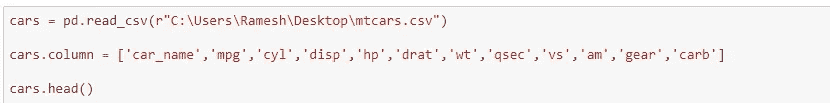
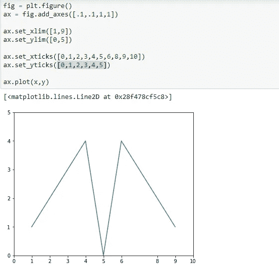

# 使用 python 的数据可视化第 1 部分

> 原文：<https://medium.com/analytics-vidhya/data-visualization-using-python-part-1-cb92314888ef?source=collection_archive---------22----------------------->

# **嗨，**

我们都生活在一个数据的世界里。当数据被很好地可视化后，每个人都会更容易理解它。我们的眼睛总是被颜色和图案所吸引。数据可视化实际上是一种吸引我们眼球的艺术，我们从中获得了洞察力。

***我将用简单的例子向你展示如何使用 python(编程语言)可视化数据。***

本文末尾的 github 链接中会有所有演示的代码。

我将在 jupyter 笔记本上做所有的 python 编码，因为它易于使用和交互。

行..我们走吧！！！

# **1。创建标准数据图形。**

首先，我们将导入库 **numpy** (添加对大型多维数组和矩阵的支持)、 **pandas** (用于数据操作和分析)，以及**matplotlib**(Python 编程语言的绘图库)

好了，现在我们已经导入了所有的库，

**让我们从列表中创建一个折线图。**

首先，我将创建一个范围为(1，10)的列表“x”，这意味着它将显示从 1 到 9 以及列表“y”，即[1，2，3，4，0，4，3，2，1]。为了绘制折线图，我使用了 python 中的“plt”函数，即 plt.plot(x，y)

x 与 y 的折线图

现在让我们用熊猫来绘制一张图表

在这里，我上传了一个 csv 文件，其中包含许多汽车的名字和技术规格。

我在 read_csv 命令中给出了文件的地址，cars.column 用于选择所需的列，最后当我执行 head 函数时，我得到了显示在 jupyter 笔记本中的数据。

这是 cars.head()的输出。整个数据将被最小化为 5，如果我们想，我们可以看到整个数据

现在，我将选择不同汽车的“mpg”并对其进行绘图，为此我给出“mpg= cars['mpg']”，然后我将使用绘图函数对其进行绘图，“mpg.plot()”。您还可以使用“plt”函数，如“plt.plot(mpg)”，因为我们在这里定义 mpg，所以让我们使用“mpg.plot()”。

***好的，就像这样，我们可以为每个汽车规格栏绘制图表，如汽缸、马力、排量、重量、质量安全等。如果我以圆柱体为例。***

***把两列或三列组合起来做一个对比图怎么样？***

让我们开始吧！！！我要考' cyl '，' wt '和' mpg '。首先我将创建一个变量来赋值。我将它赋给“df”(您可以使用任何名称，我只是在数据帧的意义上使用 df)

**df =cars[['cyl '，' wt '，' mpg']]** 并使用 **df.plot()** 绘制此 df。让我们看看进展如何。

对比汽车汽缸重量和 mpg 的折线图。

现在让我们看看如何创建条形图。在绘制折线图时，我们已经给出了 x 和 y 的值。可以使用 **plt.bar** 简单地创建条形图

比较 x 和 y 的条形图

现在，我将从我的熊猫文件(汽车)中创建一个条形图&我采用“mpg”列， **mpg.plot(kind =bar)**

对比汽车 mpg 的条形图

如果你想要一个横条，就用“barh”h 代表横条

汽车“mpg”的水平条形图

# **饼状图**

我只是在创建一个列表， **x=[1，2，3，4，0，5]** 。要创建该列表的饼图，使用 **plt.pie (x)** 并使用 **plt.show()** 显示该图表

列表 x 的饼图

使用 **plt.savefig("合适的名称. png")** 保存饼图，并查看其保存位置使用 **%pwd** (pwd 代表当前工作目录)。

# 2.定义地块的元素

首先，我正在导入库和 matplotlib 内联(绘图命令的输出在前端显示**内联**，就像 Jupyter notebook 一样，直接在产生它的代码单元下面。)rcParams 是运行命令的参数，我们在其中输入绘图的图形尺寸。

***如果你想要一个允许你缩放、保存等的交互式绘图，你可以使用%matplotlib 笔记本。***

我像之前一样绘制了一个折线图，这里我也使用 **fig.add_axes(rect)** 设置了图的轴，其中 rect =[x0，y0，width，height]。

这里我设置 fig = plt.figure()。使用 ax =fig.add_axes([])设置 fig 的轴，然后使用 ax.plot()绘制 ax。

让我们来看看如何为同一个图设置 xlimits，ylimits，xticks & yticks。这里我将 xlim 设置为[1，9]，ylim 设置为[0，5]。xticks 是 x 轴上的标记，我将它设置为[ 0，1，2，3，4，5，6，8，9，10]，请注意这里有十个数字，我特意删除了“7”，以便您了解这些标记。设 yticks 为[0，1，2，3，4，5]。

这是使用 xlimits、ylimits、xticks 和 yticks 绘制的 x 与 y 的关系图。

## 添加网格—

*如果您想在绘图中添加网格，只需在****ax . plot()****之前添加****ax . grid()****，结果将类似于下图。*

添加网格元素后 x 与 y 的关系图

## 使用支线剧情在一个图形中生成多个剧情

假设我们需要一个数据中的两个图。我将制作两个剧情，一个是 **x 剧情** (ax1)，另一个是 **x vs y 剧情** (ax2)，使用**支线剧情**功能**。**在 fig = plt.figure()之后，我为 fig by fig 分配两个轴，(ax1，ax2)= PLT . subplot(1，2)，然后使用 ax1.plot(x)绘制 ax1，使用 ax2.plot(x，y)绘制 ax2。

使用支线剧情在一个图形中生成两个情节

# 3.绘图格式

我们可以根据需要格式化图形。我们可以改变颜色，宽度，线条样式等，使我们的情节更加美观。

## 定义绘图颜色

让我们改变简单的 x 和 y 图的颜色和宽度。这里我设置宽度为“wide = [0.5，0.5，0.5，.. 9，.. 9，.. 5，.. 5]”，颜色为“color =['green']”。

改变宽度并将颜色设置为绿色后的 x 与 y 的关系图

## 改变熊猫对象的颜色主题

现在，我将打开我的汽车 csv 数据集，并更改“气缸”、“mpg”和“wt”对比图的颜色。

好的，让我们像以前一样上传数据集，并使用 cars.head()显示它

这里，首先我将像以前一样使用默认颜色进行绘制，方法是选择 cyl、mpg 和 wt 列，并将其分配给 df，然后使用 df.plot()进行绘制

在下一个图中，我创建了一个 color_theme，并将颜色设置为 color_theme = ['darkgray '，' lightsalmon '，' powderblue']，每种颜色对应于每一列，就像 cyl 一样，它是深灰色。对于 mpg 来说是 lightsalmon，对于 wt 来说是粉蓝色。

左侧图是具有默认颜色的图，右侧图是特别给出颜色的图

让我们做同样的饼图

## 更改饼图的颜色

首先，我像之前一样绘制饼图，设置 z=[1，2，3，4，0.5]，使用 plot.pie(z)绘制，使用 plt.show()显示

其次，我将 color_theme 设置为 color_theme= ['#A9A9A9 '，' #FFA07A '，' #B0E0E6 '，' #FFE4C4 '，' #BDB76B']，在 color_theme 中是用于某些颜色的代码，每个代码对应于每个 Z 值的颜色。您可以使用颜色代码或颜色名称。

左侧图是具有默认颜色的图，右侧图是特别给出颜色的图

## 自定义线条样式

让我们看看如何定制线条。首先，我为 **x1 和 y1** 赋值为 x1 =range(1，10)和 y1 =[9，8，7，6，5，4，3，2，1]，并用 **x 对 y** 进行绘图(x = range(1，10)，y = [1，2，3，4，0.5，4，3，2，1])

包含“x 对 y”和“x1 对 y1”的图

现在我要改变**绘图风格、线条风格和线条宽度**

对于 x 对 y，plt.plot(x，y，ds='steps '，lw =5)。我将**的绘制样式设置为步长**，将**的线宽设置为 5。**

对于 x1 对 y1，plt.plot(x1，y1，ls = ' —'，lw =10)。我正在设置**线条样式为虚线**，l **线条宽度为 10** 。

让我们试试别的。我将使用**图标记**并在该图中设置**标记宽度(mew)**

对于 x 对 y，plt.plot(x，y，marker ='1 '，mew =20)。我设置标记样式为 1，标记宽度为 20

对于 x1 对 y1，plt.plot(x1，y1，marker='+'，mew=15)。我设置标记样式为“+”，标记宽度为 15。

***好了，这就是第 1 部分——使用 python 的数据可视化。***

***敬请期待 part2。***

## 这里是我上面使用的所有代码的 github 链接。

 [## iamrahullamesh/数据可视化

### 使用 python 的数据可视化展示了基本的简单例子

github.com](https://github.com/iamrahulramesh/Data-Visualization.git) 

***感谢阅读，快乐学习！！！:)***